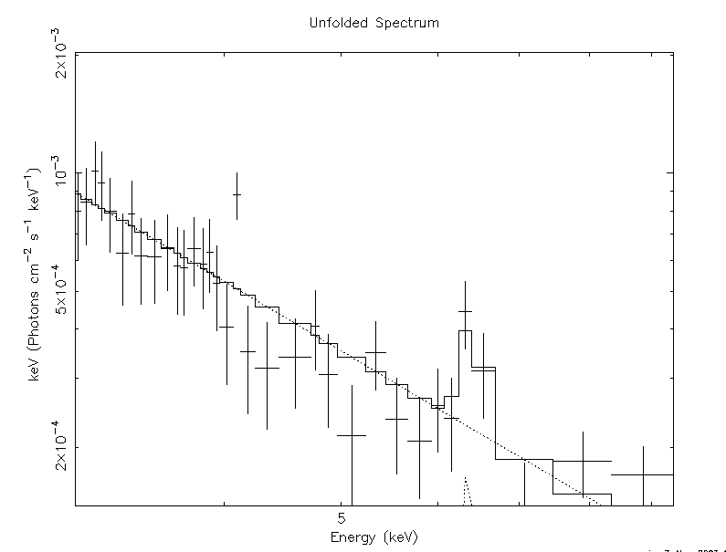
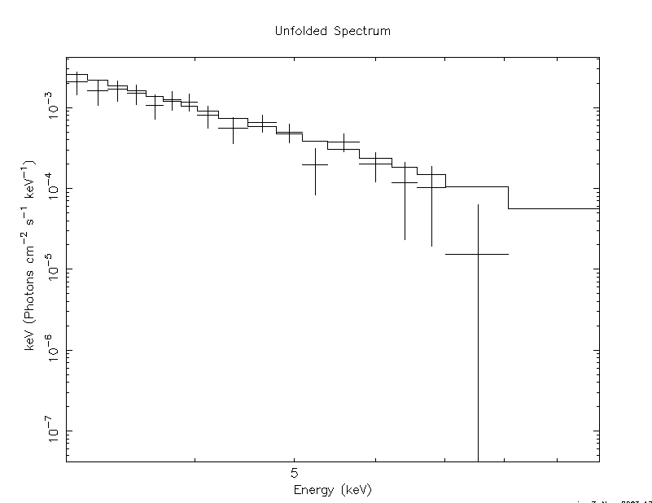
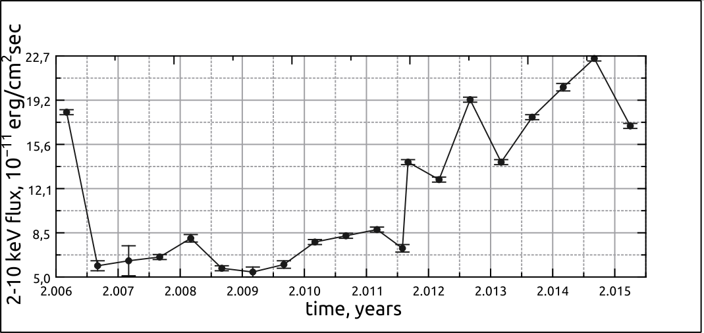
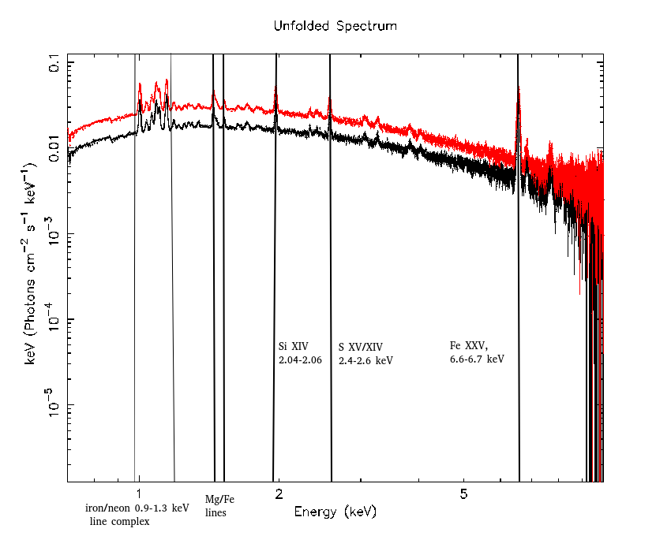

$\newcommand{\ensuremath}{}$
$\newcommand{\xspace}{}$
$\newcommand{\object}[1]{\texttt{#1}}$
$\newcommand{\farcs}{{.}''}$
$\newcommand{\farcm}{{.}'}$
$\newcommand{\arcsec}{''}$
$\newcommand{\arcmin}{'}$
$\newcommand{\ion}[2]{#1#2}$
$\newcommand{\textsc}[1]{\textrm{#1}}$
$\newcommand{\hl}[1]{\textrm{#1}}$
$\newcommand{\footnote}[1]{}$

# Separating the spectral counterparts in NGC 1275/Perseus cluster in X-rays

<mark>Appeared on: 2023-12-05</mark> -  _18 pages, 6 pages, 8 tables_

E. Fedorova, et al. -- incl., <mark>N. Pulatova</mark>

**Abstract:** We develop the recipe to separate the spectral counterparts of the AGN NGC 1275 from the emission of the Perseus cluster surrounding it in the spectra observed by Suzaku/XIS cameras with no usage of the spectral fitting models. The Perseus cluster emission reaches higher energies than is typical for the most AGN-situated dense surroundings (i.e. up to 9-10 keV). That is why the separation between the AGN and cluster spectra is especially important in this case. To avoid the degeneracy due to the huge quantity of the spectral fitting parameters such as abundances of elements the cluster consists of, thermal and Compton emission of the nucleus itself, and the jet SSC/IC emission spectral parameters as well we prefer to avoid the spectral fitting usage to perform this task. Instead, we use the spatial resolution of the components and double background subtracting. For this purpose we choose the following regions to collect all the photons from them: (1) circular or square-shaped region around the source (AGN); (2) ring-shaped (or non-overlapped square) region surrounding the AGN (for cluster); (3) remote empty circular region for the background. Having collected the photons from those regions we subtract the background (i.e. photons from the third region) from the source and cluster spectra. Next, we subtract the re-normalized cluster counts from the AGN spectrum; using the relation between the emission line amplitudes in the AGN and cluster spectra as the renormalization coefficient.We have performed this procedure on the whole set of the Suzaku/XIS observational data for NGC 1275 to obtain the cleaned spectra and light curve of the AGN emission in this system.

**Figure 4. -** The 1-10 keV range unfolded spectra of NGC 1275 by Suzaku/XIS for the observation performed on August 2006 (left) and August 2007 (right) with the models. (*unfspecs*)

**Figure 5. -** The 2-10 keV Suzaku/XIS light curve of NGC 1275. (*lcurve*)

**Figure 1. -** The example of the 0.5-10.0 keV spectra of the surroundings (cluster) and NGC 1275 (uncleaned AGN + cluster) extracted in the standard way for the observational window 101012010. The uncleaned AGN + cluster spectrum extracted from the circular central region around the AGN is shown in red, and the surrounding cluster spectrum extracted from the ring-shaped region is shown in black. (*spectrum*)

