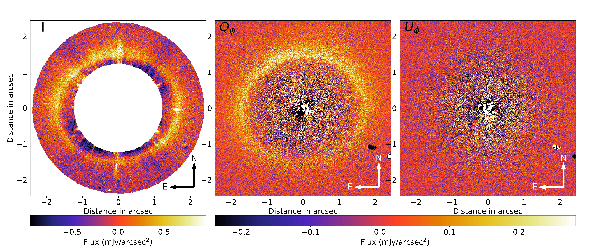
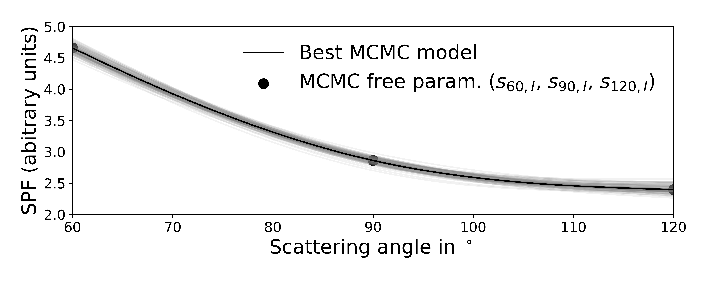

$\newcommand{\ensuremath}{}$
$\newcommand{\xspace}{}$
$\newcommand{\object}[1]{\texttt{#1}}$
$\newcommand{\farcs}{{.}''}$
$\newcommand{\farcm}{{.}'}$
$\newcommand{\arcsec}{''}$
$\newcommand{\arcmin}{'}$
$\newcommand{\ion}[2]{#1#2}$
$\newcommand{\textsc}[1]{\textrm{#1}}$
$\newcommand{\hl}[1]{\textrm{#1}}$
$\newcommand{\footnote}[1]{}$
$\newcommand{\tabularnewline}{\\}$
$\newcommand{\Mearth}{M_{\oplus}}$
$\newcommand{\Mjup}{M_{\text{Jup}}}$
$\newcommand{\Msun}{M_{\odot}}$
$\newcommand{\bPic}{\beta Pictoris}$
$\newcommand$
$\newcommand$
$\newcommand$
$\newcommand{\micron}{\unit{\micro\meter}}$
$\newcommand{\HD}{HD 181327}$
$\newcommand{\JM}[1]{\textcolor{magenta}{ [\textbf{JM: } #1]}}$
$\newcommand{\pt}[2]{\textcolor{red}{\textbf{PT:} #1}}$
$\newcommand{\footnoterule}$
$\newcommand{\footnoterule}$

# The polarisation properties of the $\HD$  debris ring

<mark>Appeared on: 2023-12-05</mark> -  _21 pages, 22 figures, accepted in Astronomy & Astrophysics_

J. Milli, et al. -- incl., <mark>J. Olofsson</mark>, <mark>C. Desgrange</mark>

**Abstract:** Polarisation is a powerful remote-sensing tool to study the nature of particles scattering the starlight. It is widely used to characterise interplanetary dust particles in the Solar System and increasingly employed to investigate extrasolar dust in debris discs' systems. We aim to measure the scattering properties of the dust from the debris ring around $\HD$ at near-infrared wavelengths. We obtained high-contrast polarimetric images of $\HD$ in the H band with the SPHERE / IRDIS instrument on the Very Large Telescope (ESO). We complemented them with archival data from HST / NICMOS in the F110W filter reprocessed in the context of the Archival Legacy Investigations of Circumstellar Environments (ALICE) project. We developed a combined forward-modelling framework to simultaneously retrieve the scattering phase function in polarisation and intensity. We detected the debris disc around $\HD$ in polarised light and total intensity. We measured the scattering phase function and the degree of linear polarisation of the dust at 1.6 $\micron$ in the birth ring. The maximum polarisation is $23.6\% \pm 2.6\%$ and occurs between a scattering angle of $70^\circ$ and $82^\circ$ . We show that compact spherical particles made of a highly refractive and relatively absorbing material in a differential power-law size distribution of exponent $-3.5$ can simultaneously reproduce the polarimetric and total intensity scattering properties of the dust. This type of material cannot be obtained with a mixture of silicates, amorphous carbon, water ice, and porosity, and requires a more refracting component such as iron-bearing minerals. We reveal a striking analogy between the near-infrared polarisation of comets and that of $\HD$ . The methodology developed here combining VLT/SPHERE and HST/NICMOS may be applicable in the future to combine the polarimetric capabilities of SPHERE with the sensitivity of JWST.

**Figure 13. -** Final images of the intensity (Stokes I, left image), azimuthal Stokes $Q_\phi$(middle) and $U_\phi$(right), calibrated in mJy/arcsec$^2$(linear colour scale). North is up and east to the left. The features in the south-west at $\sim2$\arcsec  separation are a cluster of bad pixels on the IRDIS detector. A numerical mask of inner radius 1.25$\arcsec$  and outer radius and 2.39$\arcsec$  was applied on the intensity image. (*fig_Qphi_Uphi*)

**Figure 3. -** Deprojected normalised optical depth of the disk at mm wavelengths \cite[orange line extracted from data published in][]{Pawellek2021}, in the optical with STIS \cite[green line][assuming a 2\% uncertainty]{Stark2014}, and in the near-infrared with IRDIS (blue line). The top panel shows the data (plain lines) with the $1  \sigma$ uncertainty (shade) and the double-power law fit (dotted line limited to the range of separation where the fit was performed). The bottom panel is a zoom in the region where the optical depth peaks, highlighting with vertical dotted line the location of the maxima. (*fig_tau*)

**Figure 5. -** SPF in intensity parametrising the dust scattered light measured by NICMOS the best. The 3 degrees of freedom of the SPF are shown as black dots, and the model performs a cubic interpolation (black curve).  (*fig_NICMOS_SPF*)

