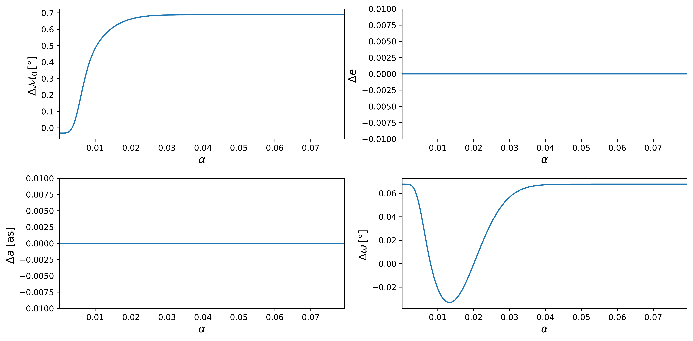
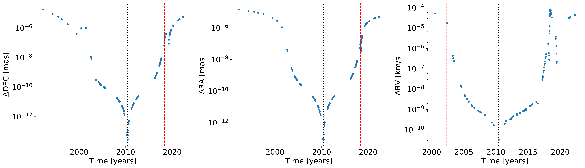
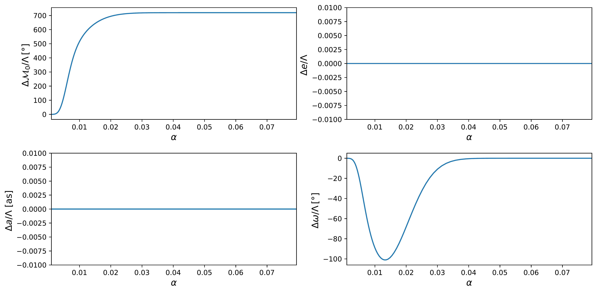

$\newcommand{\ensuremath}{}$
$\newcommand{\xspace}{}$
$\newcommand{\object}[1]{\texttt{#1}}$
$\newcommand{\farcs}{{.}''}$
$\newcommand{\farcm}{{.}'}$
$\newcommand{\arcsec}{''}$
$\newcommand{\arcmin}{'}$
$\newcommand{\ion}[2]{#1#2}$
$\newcommand{\textsc}[1]{\textrm{#1}}$
$\newcommand{\hl}[1]{\textrm{#1}}$
$\newcommand{\footnote}[1]{}$
$\newcommand{\af}[1]{{\textcolor{red}{\sf{[Arianna: #1]}} }}$
$\newcommand{\pg}[1]{{\textcolor{magenta}{#1}}}$
$\newcommand{\sg}[1]{{\textcolor{cyan}{\sf{[Stefan: #1]}} }}$
$\newcommand{\thebibliography}{\DeclareRobustCommand{\VAN}[3]{##3}\VANthebibliography}$
$\newcommand{\beq}{\begin{equation}}$
$\newcommand{\eeq}{\end{equation}}$
$\newcommand{\af}[1]{{\textcolor{red}{\sf{[Arianna: #1]}} }}$
$\newcommand{\pg}[1]{{\textcolor{magenta}{#1}}}$
$\newcommand{\sg}[1]{{\textcolor{cyan}{\sf{[Stefan: #1]}} }}$
$\usepackage{graphicx}$
$\usepackage{amsmath}$
$\title[Vector clouds around SgrA^*]{Using the motion of S2 to constrain vector clouds around SgrA^*}$
$\author[GRAVITY Collaboration]{GRAVITY Collaboration \thanks{GRAVITY is developed in collaboration by$
$MPE,$
$LESIA of Paris Observatory / CNRS / Sorbonne Université / Univ. Paris Diderot$
$and IPAG of Université Grenoble Alpes / CNRS,$
$MPIA,$
$Univ. of  Cologne,$
$CENTRA - Centro de Astrofísica e Gravita\c cão, and ESO. Corresponding authors: A.~Foschi$
$(arianna.foschi@tecnico.ulisboa.pt) \& P.J.V.~Garcia (pgarcia@fe.up.pt)$
$}:$
$A.~Foschi^{1, 2},$
$R.~Abuter^{3},$
$K. Abd El Dayem^{4},$
$N.~Aimar^{4}, \newauthor$
$P.~Amaro Seoane^{6, 5, 7, 21},$
$A.~Amorim^{1, 8},$
$J.P.~Berger^{9},$
$H.~Bonnet^{3},$
$G.~Bourdarot^{5},$
$W.~Brandner^{10}, \newauthor$
$R.~Davies^{5},$
$P.T.~de~Zeeuw^{11},$
$D.~Defrère^{19},$
$J.~Dexter^{12},$
$A.~Drescher^{5},$
$A.~Eckart^{16, 18},$
$F.~Eisenhauer^{5}, \newauthor$
$N.M.~Förster~Schreiber^{5},$
$P.J.V.~Garcia^{1, 2},$
$R.~Genzel^{5, 13},$
$S.~Gillessen^{5},$
$T.~Gomes^{1, 2},$
$X.~Haubois^{14},\newauthor$
$G.~Hei{\ss}el^{4, 15},$
$Th.~Henning^{10},$
$L.~Jochum^{14},$
$L.~Jocou^{10},$
$A.~Kaufer^{14},$
$L.~Kreidberg^{10},$
$S.~Lacour^{4}, \newauthor$
$V.~Lapeyrère^{4},$
$J.-B.~Le~Bouquin^{9},$
$P.~Léna^{4},$
$D.~Lutz^{5},$
$F.~Mang^{5},$
$F.~Millour^{20},$
$T.~Ott^{5},$
$T.~Paumard^{4}, \newauthor$
$K.~Perraut^{9},$
$G.~Perrin^{4},$
$O.~Pfuhl^{3, 5},$
$S.~Rabien^{5},$
$D.C.~Ribeiro^{5},$
$M.~Sadun Bordoni^{5},$
$S.~Scheithauer^{10},  \newauthor$
$J.~Shangguan^{5},$
$T.~Shimizu^{5},$
$J.~Stadler^{5, 17},$
$C.~Straubmeier^{16},$
$E.~Sturm^{5},$
$M.~Subroweit^{16},$
$L.J.~Tacconi^{5},  \newauthor$
$F.~Vincent^{4},$
$S.~von~Fellenberg^{5, 18}$
$and J.~Woillez^{3}$
$\^{1}CENTRA - Centro de Astrofísica e$
$Gravita\c cão, IST, Universidade de Lisboa, 1049-001 Lisboa,$
$Portugal\^2Faculdade de Engenharia, Universidade do Porto, rua Dr. Roberto$
$Frias, 4200-465 Porto, Portugal\^3European Southern Observatory, Karl-Schwarzschild-Stra{\ss}e 2, 85748$
$Garching, Germany\^4LESIA, Observatoire de Paris, Université PSL, CNRS, Sorbonne Université, Université de Paris, 5 place Jules Janssen, 92195 Meudon, France\^5Max Planck Institute for extraterrestrial Physics,$
$Giessenbachstra{\ss}e~1, 85748 Garching, Germany\^{6}Universitat Politècnica de València, València, Spain \^{7} Kavli Institute for Astronomy and Astrophysics, Beijing, China \^{8}Universidade de Lisboa - Faculdade de Ci\^encias, Campo Grande,$
$1749-016 Lisboa, Portugal\^{9}Univ. Grenoble Alpes, CNRS, IPAG, 38000 Grenoble, France\^{10}Max Planck Institute for Astronomy, Königstuhl 17,$
$69117 Heidelberg, Germany\^{11}Leiden University, 2311EZ Leiden, The Netherlands\^{12}Department of Astrophysical \& Planetary Sciences, JILA, Duane Physics Bldg., 2000 Colorado Ave, University of Colorado, Boulder, CO 80309, USA\^{13}Departments of Physics and Astronomy, Le Conte Hall, University$
$of California, Berkeley, CA 94720, USA\^{14}European Southern Observatory, Casilla 19001, Santiago 19, Chile\^{15}Advanced Concepts Team, European Space Agency, TEC-SF, ESTEC, Keplerlaan 1, 2201, AZ Noordwijk, The Netherlands \^{16} 1^{\rm st} Institute of Physics, University of Cologne,$
$Zülpicher Stra{\ss}e 77, 50937 Cologne, Germany\^{17}Max Planck Institute for Astrophysics, Karl-Schwarzschild-Stra{\ss}e 1, D-85748$
$Garching, Germany\^{18}Max Planck Institute for Radio Astronomy, auf dem Hügel 69, D-53121 Bonn, Germany \^{19}Institute of Astronomy, KU Leuven, Celestijnenlaan 200D, 3001 Leuven, Belgium \^{20}Université C\^{o}te d'Azur, Observatoire de la  C\^{o}te d'Azur, CNRS, Lagrange, France \^{21} Higgs Centre for Theoretical Physics, Edinburgh, UK}$
$\date{Accepted XXX. Received YYY; in original form ZZZ}$
$\pubyear{2023}$
$\begin{document}$
$\label{firstpage}$
$\pagerange{\pageref{firstpage}--\pageref{lastpage}}$
$\maketitle$
$\begin{abstract}$
$The dark compact object at the centre of the Milky Way is well established to be a supermassive black hole with mass M_{\bullet} \sim 4.3 \cdot 10^6   M_{\odot}, but the nature of its environment is still under debate. In this work, we used astrometric and spectroscopic measurements of the motion of the star S2, one of the closest stars to the massive black hole, to determine an upper limit on an extended mass composed of a massive vector field around Sagittarius A*. For a vector with effective mass 10^{-19}   \rm eV \lesssim m_s \lesssim 10^{-18}   \rm eV, our Markov Chain Monte Carlo analysis shows no evidence for such a cloud, placing an upper bound M_{\rm cloud} \lesssim 0.1\% M_{\bullet} at 3\sigma confidence level.$
$We show that dynamical friction exerted by the medium on S2 motion plays no role in the analysis performed in this and previous works, and can be neglected thus.$
$\end{abstract}$
$\begin{keywords}$
$black holes physics -- dark matter -- gravitation -- celestial mechanics -- Galaxy: centre$
$\end{keywords}$
$\n\end{document}\end{equation}}$
$\newcommand{\eeq}{\end{equation}}$

# Using the motion of S2 to constrain vector clouds around SgrA$^*$

<mark>Appeared on: 2023-12-06</mark> -  _9 pages, 5 figures, submitted to MNRAS_

G. Collaboration, et al. -- incl., <mark>L. Kreidberg</mark>, <mark>S. Scheithauer</mark>

**Abstract:** The dark compact object at the centre of the Milky Way is well established to be a supermassive black hole with mass $M_{\bullet} \sim 4.3 \cdot 10^6   M_{\odot}$ , but the nature of its environment is still under debate. In this work, we used astrometric and spectroscopic measurements of the motion of the star S2, one of the closest stars to the massive black hole, to determine an upper limit on an extended mass composed of a massive vector field around Sagittarius A*. For a vector with effective mass $10^{-19}   \rm eV \lesssim m_s \lesssim 10^{-18}   \rm eV$ , our Markov Chain Monte Carlo analysis shows no evidence for such a cloud, placing an upper bound $M_{\rm cloud} \lesssim 0.1\% M_{\bullet}$ at $3\sigma$ confidence level.We show that dynamical friction exerted by the medium on S2 motion plays no role in the analysis performed in this and previous works, and can be neglected thus.

**Figure 2. -** Variation of the orbital elements $\Delta \mu^{a}$ over an entire orbit for different values of the coupling constant $\alpha$ when one includes the Schwarzschild precession in the equation for the osculating elements. Here $\Lambda = 10^{-3}$. The maximum variation is still found in $0.003 \lesssim \alpha \lesssim 0.03$. (*fig:var_elements_cloud_1PN*)

**Figure 5. -** Absolute difference in DEC, R.A. and radial velocity between the case where dynamical friction is implemented in the supersonic case with $c_s = 10^{-3}$ and the case where no dynamical friction is present. In both cases $\Lambda = 10^{-3}$ and $\alpha = 0.015$. The difference is maximum around the periastron passages (red dashed lines) and minimum at the apoastron (black dotted line). Overall, they remain far below the current instrument threshold. (*fig:dynamical_friction*)

**Figure 1. -** Variation of the orbital elements $\Delta \mu^{a}/\Lambda$ over an entire orbit for different values of the coupling constant $\alpha$ when only the vector cloud is present. The maximum variation in $\Delta \omega/\Lambda$ is roughly found in the range $0.003 \lesssim \alpha \lesssim 0.03$. (*fig:var_elements_cloud*)

