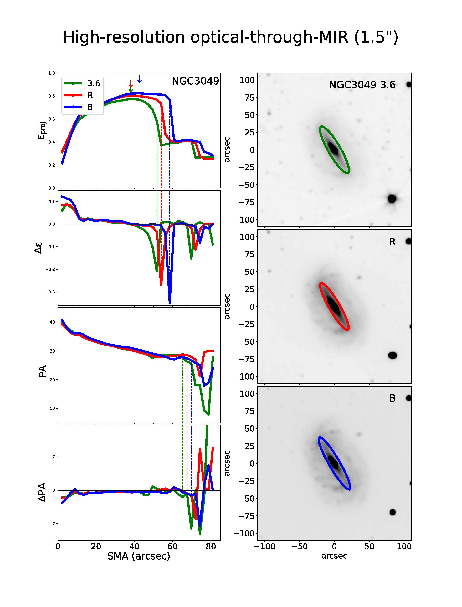
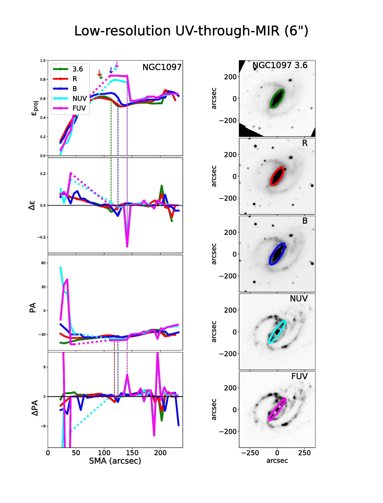
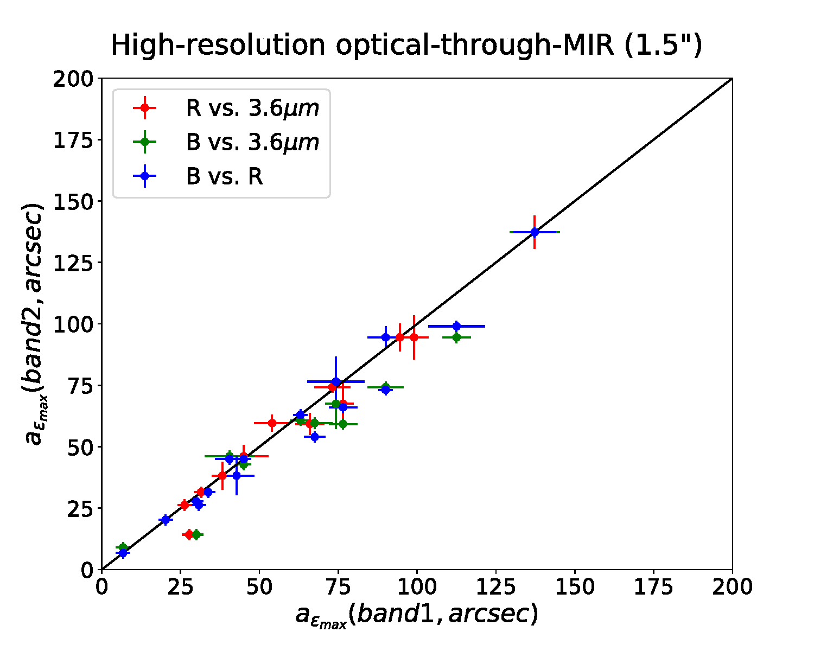
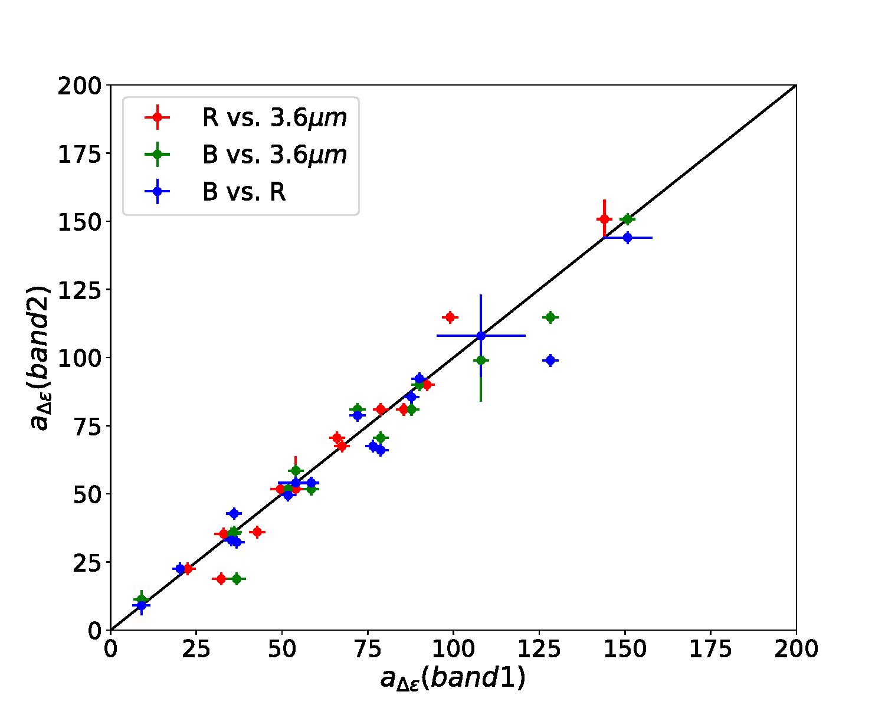
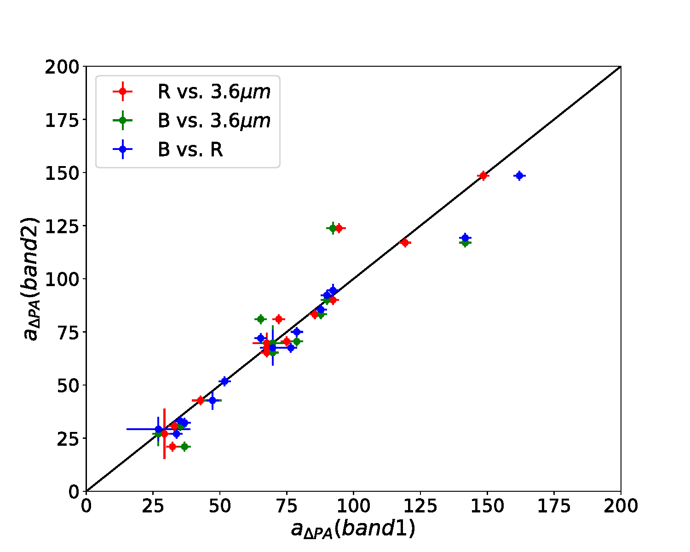
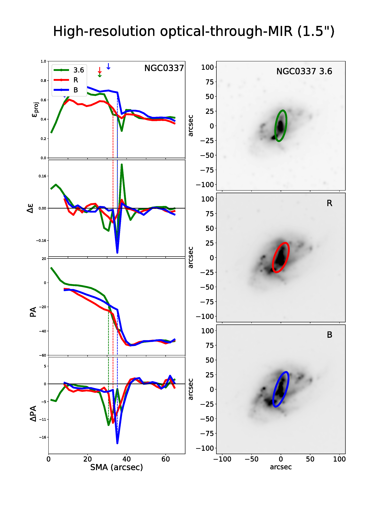
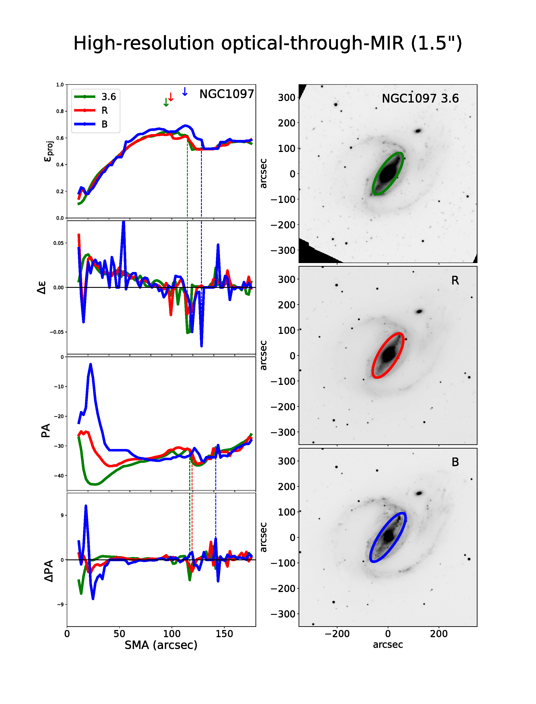
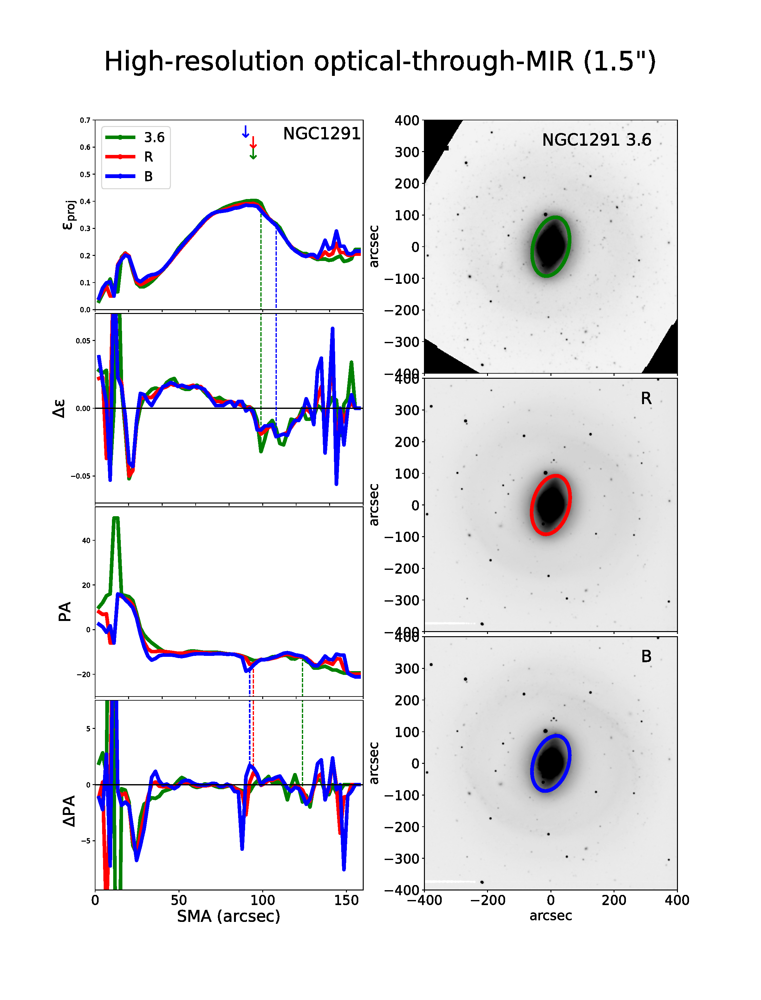
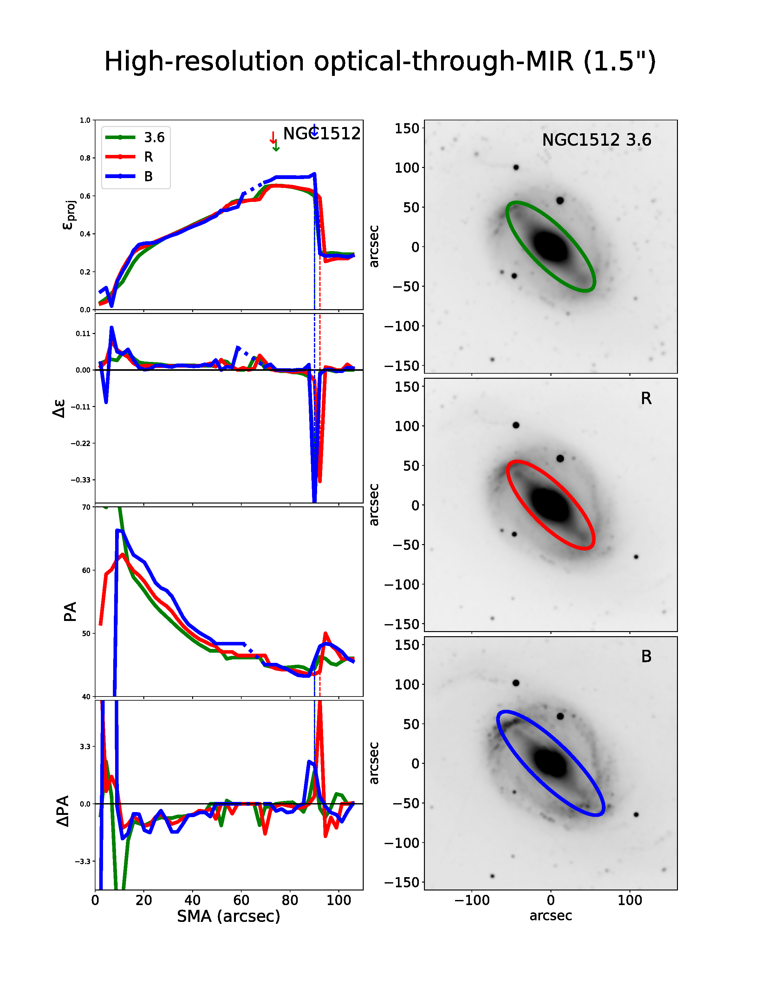

$\newcommand{\ensuremath}{}$
$\newcommand{\xspace}{}$
$\newcommand{\object}[1]{\texttt{#1}}$
$\newcommand{\farcs}{{.}''}$
$\newcommand{\farcm}{{.}'}$
$\newcommand{\arcsec}{''}$
$\newcommand{\arcmin}{'}$
$\newcommand{\ion}[2]{#1#2}$
$\newcommand{\textsc}[1]{\textrm{#1}}$
$\newcommand{\hl}[1]{\textrm{#1}}$
$\newcommand{\footnote}[1]{}$
$\newcommand{\thebibliography}{\DeclareRobustCommand{\VAN}[3]{##3}\VANthebibliography}$

# Bar Properties as a Function of Wavelength: A Local Baseline with S$^4$G for High-Redshift Studies

<mark>Appeared on: 2023-12-08</mark> -  _Accepted to MNRAS_

K. Menéndez-Delmestre, et al. -- incl., <mark>E. Schinnerer</mark>

**Abstract:** The redshift evolution of bars is an important signpost of the dynamic maturity of disk galaxies. To characterize the intrinsic evolution safe from band-shifting effects, it is necessary to gauge how bar properties vary locally as a function of wavelength. We investigate bar properties in 16 nearby galaxies from the Spitzer Survey of Stellar Structure in Galaxies (S $^4$ G) at ultraviolet, optical and mid-infrared wavebands. Based on the ellipticity and position angle profiles from fitting elliptical isophotes to the two-dimensional light distribution, we find that both bar length and ellipticity -- the latter often used as a proxy for bar strength -- increase at bluer wavebands. Bars are 9 \% longer in the B-band than at 3.6 $\mu$ m. Their ellipticity increases typically by 8 \% in the B-band, with a significant fraction ( $>$ 40 \% ) displaying an increase up to 35 \% . We attribute the increase in bar length to the presence of star forming knots at the end of bars: these regions are brighter in bluer bands, stretching the bar signature further out. The increase in bar ellipticity could be driven by the apparent bulge size: the bulge is less prominent at bluer bands, allowing for thinner ellipses within the bar region. Alternatively, it could be due to younger stellar populations associated to the bar. The resulting effect is that bars appear longer and thinner at bluer wavebands. This indicates that band-shifting effects are significant and need to be corrected for high-redshift studies to reliably gauge any intrinsic evolution of the bar properties with redshift.

**Figure 3. -** Ellipticity and position angle radial profiles for NGC 3049 (left) and NGC 1097 (right), the former exemplifying our methodology for the _ higher-resolution optical-through-MIR_ study (including B-, R-, and 3.6$\mu$m bands) and the latter for the _ low-resolution UV-through-MIR_ study (including FUV-, NUV-, B-, R-, and 3.6$\mu$m bands). In both cases we show radial profiles for ellipticity and position angle, as well as their respective variations at each isophotal fit. The vertical down-pointing arrows indicate the semi-major axis (SMA) of maximum ellipticity, i.e., a$_{\epsilon max}$ for each band.  The vertical dashed lines indicate the radial location of the maximum variation in ellipticity (top two panels) and PA (bottom two panels). The dashed portions of the radial profiles indicate regions where the FUV/NUV emission deviates significantly from a smooth light distribution, consequently impacting our isophotal ellipse-fitting approach (see Section \ref{processing}). From top to bottom, postage stamp images in the 3.6$\mu$m, R- and B-bands for NGC 3049 and in the 3.6$\mu$m, R-, B-, NUV- and FUV-bands for NGC 1097 are shown with an overlaid ellipse showing the isophote of maximum ellipticity. Similar figures for all of our sample are shown as part of Appendix \ref{appendixA_profiles_hires} for the _ higher-resolution optical-through-MIR_ study and Appendix \ref{appendixB_profiles_lores} for the _ low-resolution UV-through-MIR_ study.
 (*profiles*)

**Figure 1. -** Measured bar sizes as a function of wavelength for the galaxies in our sample; each panel corresponds to one of the three bar size definitions adopted for the analysis (see Section \ref{processing} for details). Each galaxy is represented by 3 data points, where the value on the x-axis corresponds to that measured in the bluer band of the waveband pair being considered. We note that the bulk of individual bar size measurements in the B-, R- and 3.6$\mu$m-bands is offset downwards from the identity line (solid line), indicating that bar sizes measured in bluer bands are larger. On average, the bar is measured to be $\sim$9\% longer in the B-band compared to that in the 3.6 $\mu$m. (*length*)

**Figure 8. -** Ellipticity and PA profiles for all galaxies in our sample as part of the _ higher-resolution opt-through-MIR_ study, following the format of Fig. \ref{profiles}. (*appendixA_profiles_hires_fig*)

