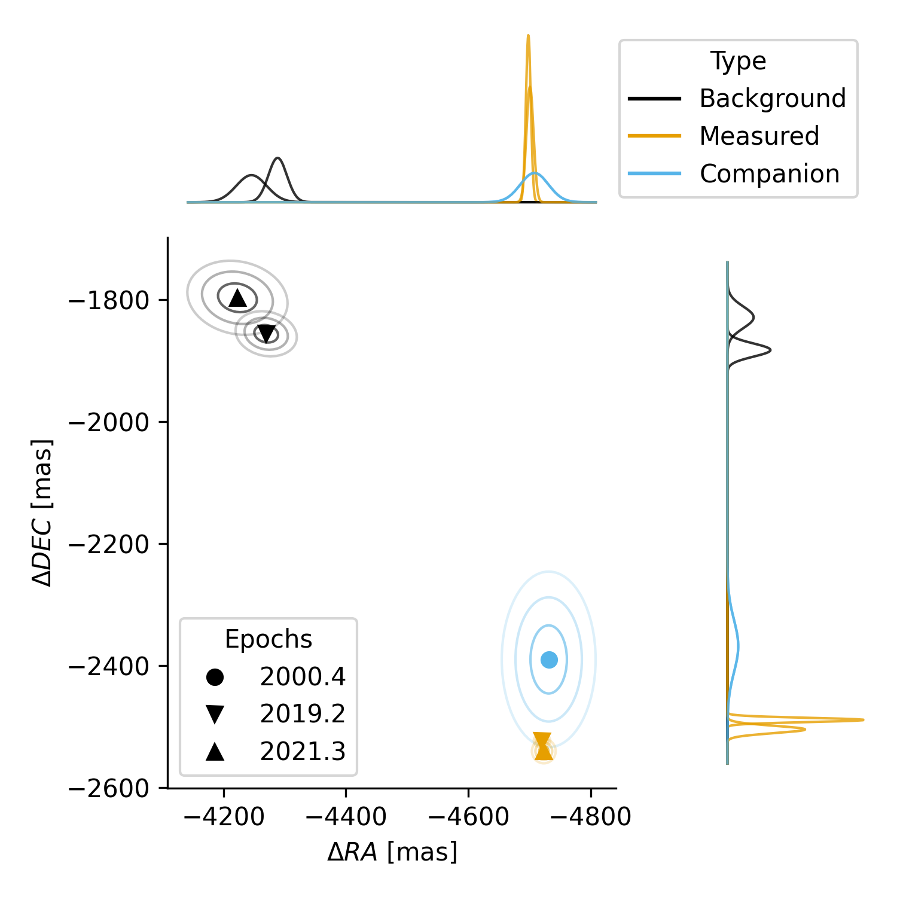
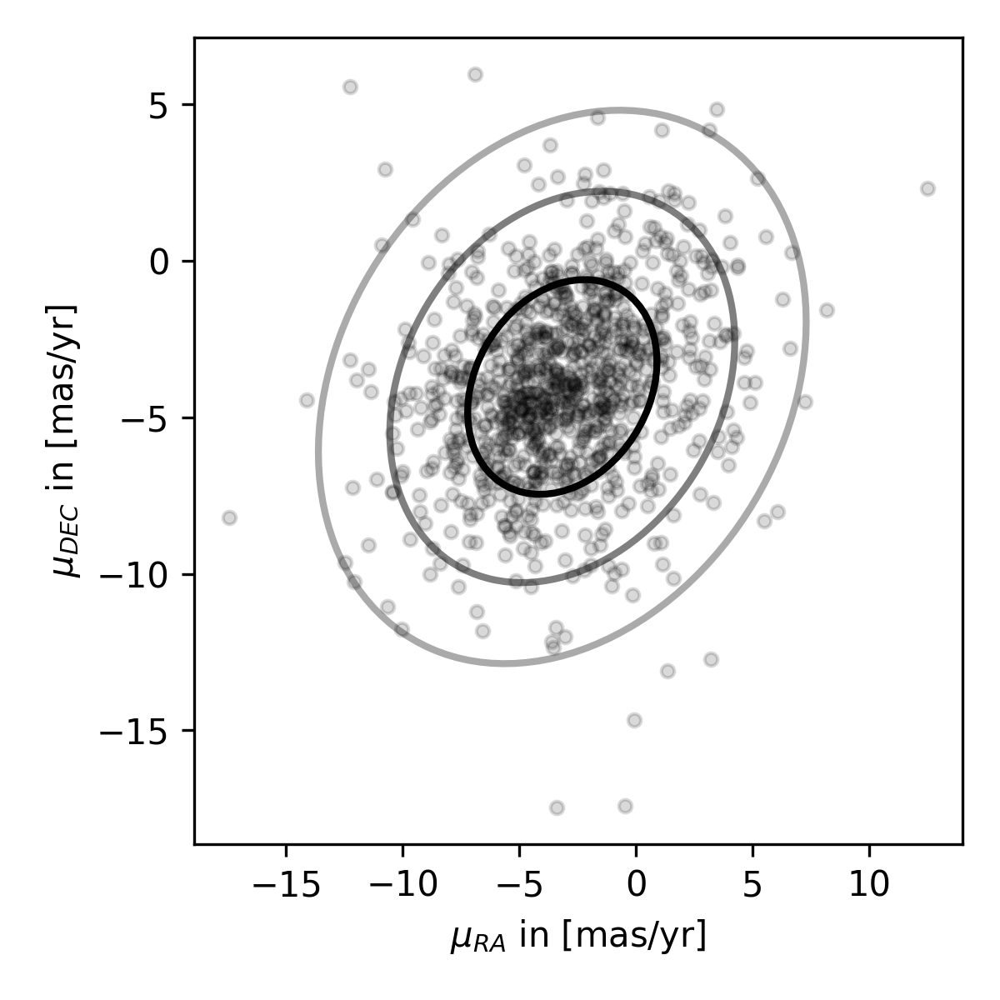
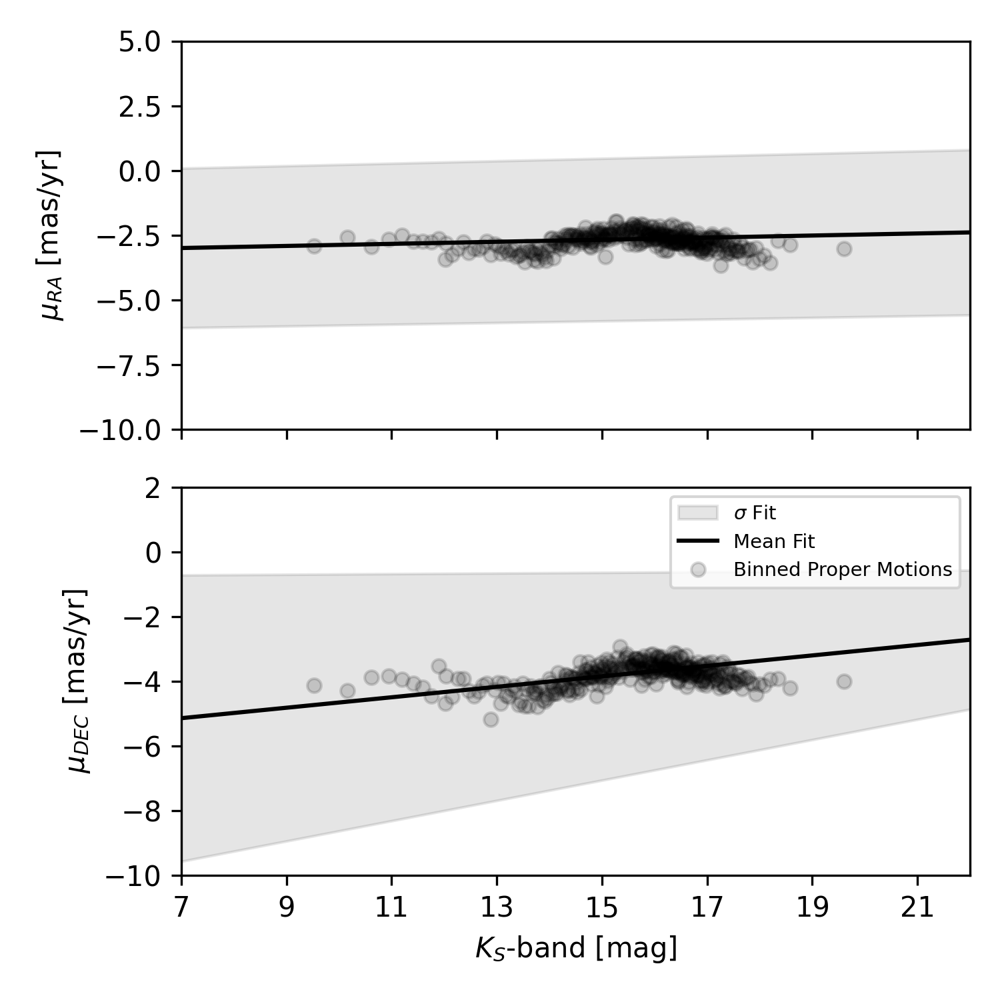

$\newcommand{\ensuremath}{}$
$\newcommand{\xspace}{}$
$\newcommand{\object}[1]{\texttt{#1}}$
$\newcommand{\farcs}{{.}''}$
$\newcommand{\farcm}{{.}'}$
$\newcommand{\arcsec}{''}$
$\newcommand{\arcmin}{'}$
$\newcommand{\ion}[2]{#1#2}$
$\newcommand{\textsc}[1]{\textrm{#1}}$
$\newcommand{\hl}[1]{\textrm{#1}}$
$\newcommand{\footnote}[1]{}$
$\newcommand{\red}{\textcolor{red}}$

# Distinguishing exoplanet companions from field stars in direct imaging using Gaia astrometry

<mark>Appeared on: 2023-12-11</mark> -  _Accepted to A&A_

<mark>P. Herz</mark>, <mark>M. Samland</mark>, C. A. Bailer-Jones

**Abstract:** Direct imaging searches for exoplanets around stars detect many spurious candidates that are in fact background field stars.To help distinguish these from genuine companions, multi-epoch astrometry can be used to identify a common proper motion with the host star. Although this is frequently done, many approaches lack an appropriate model for the motions of the background population, or do not use a statistical framework to properly quantify the results.Here we use Gaia astrometry combined with 2MASS photometry to model the parallax and proper motion distributions of field stars around exoplanet host stars as a function of candidate magnitude. We develop a likelihood-based method that compares the positions of a candidate at multiple epochs with the positions expected under both this field star model and a co-moving companion model. Our method propagates the covariances in the Gaia astrometry and the candidate positions. True companions are assumed to have long periods compared to the observational baseline, so we currently neglect orbital motion.We apply our method to a sample of 23 host stars with 263 candidates identified in the B-Star Exoplanet Abundance Study (BEAST) survey on VLT/SPHERE.We identify seven candidates in which the odds ratio favours the co-moving companion model by a factor of 100 or more.Most of these detections are based on only two or three epochs separated by less than three years, so further epochs should be obtained to reassess the companion probabilities.Our method is publicly available as an open-source python package from $\href{https://github.com/herzphi/compass}{GitHub}$ to use with any data. $\vspace*{1em}$

**Figure 6. -** Visualization of the predicted positions of the candidate companion b
    of the star HIP 71865 (b Cen) under the proper motion and parallax model.  A co-moving companion would remain at the position of the first epoch (blue circle) because orbital motion is not included. A field star with the modelled proper motion and parallax of nearby (mostly background) stars would be measured at the two later epochs at the two positions shown by the black triangles.
    The actual measured change in positions of the candidate are shown as orange triangles. The fact that these are much nearer to the blue distribution means this is likely to be a true companion, something that is properly quantified by our method.
    The contour lines show $50\%$, $90\%$, and $99\%$ of the enclosed probability, reflecting the propagated uncertainty in the parallaxes, proper motions, and BEAST position measurements. The marginal likelihoods are shown on both axes.
    This visualization does not show the covariances between the measurements at different epochs, which are nonetheless taken into account by our method (see Eq. \ref{eq:Lambda_prime}).
     (*fig:bCen_pm_plx_model*)

**Figure 11. -** Proper motion distribution of stellar objects with $K_S$-magnitude between $18$ and $19$ in a $0.3^\circ$ sky area around HIP 82545 ($\mu^2$ Sco). The elliptical contours are the boundaries that encompass $50\%$, $90\%$ and $99\%$ of the stellar objects. (*fig:MAGBIN*)

**Figure 12. -** The variation of the mean of the proper motion distribution in field stars as function on stellar magnitude. Each bin includes 200 stellar objects in a $0.3^\circ$ sky area around HIP 82545 ($\mu^2$ Sco). Each point is the mean value of the 2D Gaussian fit in each magnitude bin. Only those points lying within the 10th--90th percentile range of magnitudes are used for the linear fit. (*fig:meandist_fit*)

