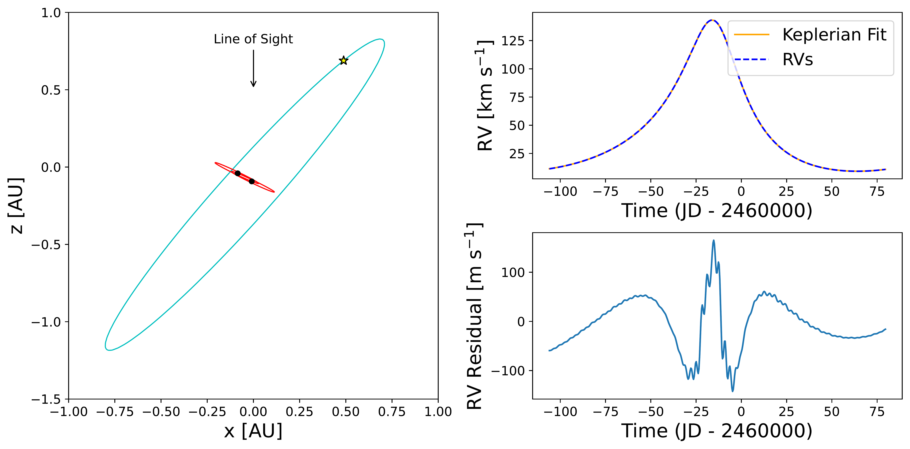

$\newcommand{\ensuremath}{}$
$\newcommand{\xspace}{}$
$\newcommand{\object}[1]{\texttt{#1}}$
$\newcommand{\farcs}{{.}''}$
$\newcommand{\farcm}{{.}'}$
$\newcommand{\arcsec}{''}$
$\newcommand{\arcmin}{'}$
$\newcommand{\ion}[2]{#1#2}$
$\newcommand{\textsc}[1]{\textrm{#1}}$
$\newcommand{\hl}[1]{\textrm{#1}}$
$\newcommand{\footnote}[1]{}$
$\newcommand{\vdag}{(v)^\dagger}$
$\newcommand$
$\newcommand$

# ESPRESSO observations of Gaia BH1: high-precision orbital constraints and no evidence for an inner binary

<mark>Appeared on: 2023-12-12</mark> -  _26 pages, 14 figures, Submitted to PASP. Github repository at this https URL_

P. Nagarajan, et al. -- incl., <mark>K. El-Badry</mark>, <mark>H.-W. Rix</mark>

**Abstract:** We present high-precision radial velocity (RV) observations of Gaia BH1, the nearest known black hole (BH). The system contains a solar-type G star orbiting a massive dark companion, which could be either a single BH or an inner BH + BH binary. A BH + BH binary is expected in some models where Gaia BH1 formed as a hierarchical triple, which are attractive because they avoid many of the difficulties associated with forming the system through isolated binary evolution. Our observations test the inner binary scenario. We have measured 115 precise RVs of the G star, including 40 from ESPRESSO with a precision of $3$ -- $5$ m s $^{-1}$ , and 75 from other instruments with a typical precision of $30$ -- $100$ m s $^{-1}$ . Our observations span $2.33$ orbits of the G star and are concentrated near a periastron passage, when perturbations due to an inner binary would be largest. The RVs are well-fit by a Keplerian two-body orbit and show no convincing evidence of an inner binary. Using \texttt{REBOUND} simulations of hierarchical triples with a range of inner periods, mass ratios, eccentricities, and orientations, we show that plausible inner binaries with periods $P_{\text{inner}} \gtrsim 1.5$ days would have produced larger deviations from a Keplerian orbit than observed. Binaries with $P_{\text{inner}} \lesssim 1.5$ days are consistent with the data, but these would merge within a Hubble time and would thus imply fine-tuning. We present updated parameters of Gaia BH1's orbit. The RVs yield a spectroscopic mass function $f\left(M_{\text{BH}}\right)=3.9358 \pm 0.0002 M_{\odot}$ --- about $7000\sigma$ above the $\sim2.5 M_{\odot}$ maximum neutron star mass. Including the inclination constraint from $_ Gaia_$ astrometry, this implies a BH mass of $M_{\text{BH}} = 9.27 \pm 0.10   M_{\odot}$ .

**Figure 1. -** Orbital configuration (left) and predicted RVs (right) of the hierarchical triple scenario we seek to test. RVs are measured for a Sun-like star orbiting an inner BH + BH binary. In the general case, the inner and outer orbits are both eccentric and non-coplanar. The parameters of the outer orbit are fixed to those inferred for Gaia BH1 by \citetalias{Gaia_BH1}. Here we assume an equal-mass inner binary with period $P_{\text{inner}} = 6$ days and eccentricity $e_{\text{inner}} = 0.1$. While the RVs of the Sun-like star are nearly consistent with a Keplerian orbit (upper right), subtraction of the best-fit Keplerian orbit reveals significant residuals (lower right).  At $P_{\text{inner}} = 6$ days, the amplitude of the RV residuals is $\sim$250 m s$^{-1}$ near periastron. (*fig:intro_fig*)

**Figure 8. -** Best-fit RV curve for Gaia BH1 based on _Gaia_ DR3 astrometry and our updated spectroscopic measurements, assuming a two-body Keplerian orbit. The top panel shows the observed data points over 50 RV curves randomly sampled from the posterior. The bottom panels show the residuals relative to the MAP solution plotted at three levels of precision, with the last panel focusing on the latest ESPRESSO measurements. At all levels of precision, the RVs are generally consistent with the best-fit model at the $1$--$2\sigma$ level. (*fig:updated_astro_fig*)

**Figure 10. -** Reduced $\chi^2$ value of the best-fit Keplerian model as a function of $P_{\text{inner}}$ for simulated data assuming the exact observing cadence and uncertainties of our measured RVs. Different panels show different orientations of the inner binary, and lines within each panel show different inner binary eccentricities. The reduced $\chi^2$ value generally increases with increasing $e_{\text{inner}}$. At very high $e_{\text{inner}}$, the non-uniform sampling of our RVs gives rise to oscillations in the reduced $\chi^2$ value. Based on our best-fit model's reduced $\chi^2$ value of $1.69$, we can rule out most inner binaries with $P_{\text{inner}} \gtrsim 1.5$ days. Fine-tuned orientations exist that could hide inner binaries with orbital periods up to $\sim 3$ days (e.g. lower right); we explore these in more detail in Figure \ref{fig:heatmap}. (*fig:detect_bbh*)

