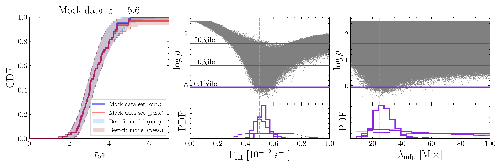
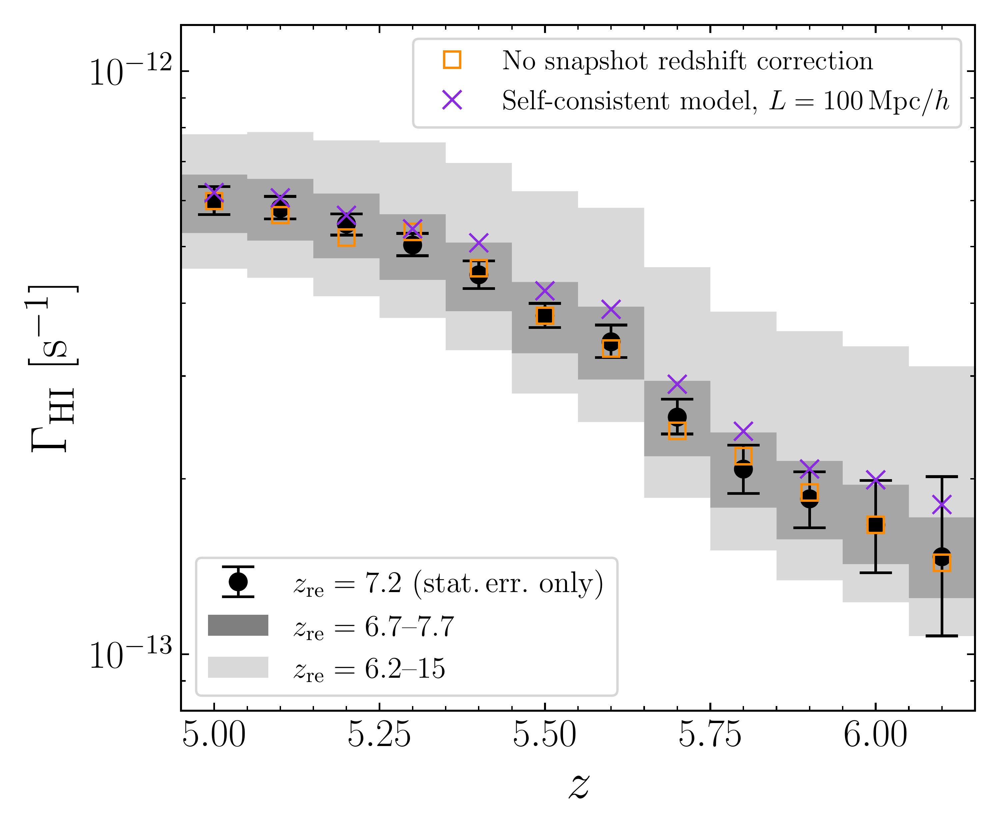
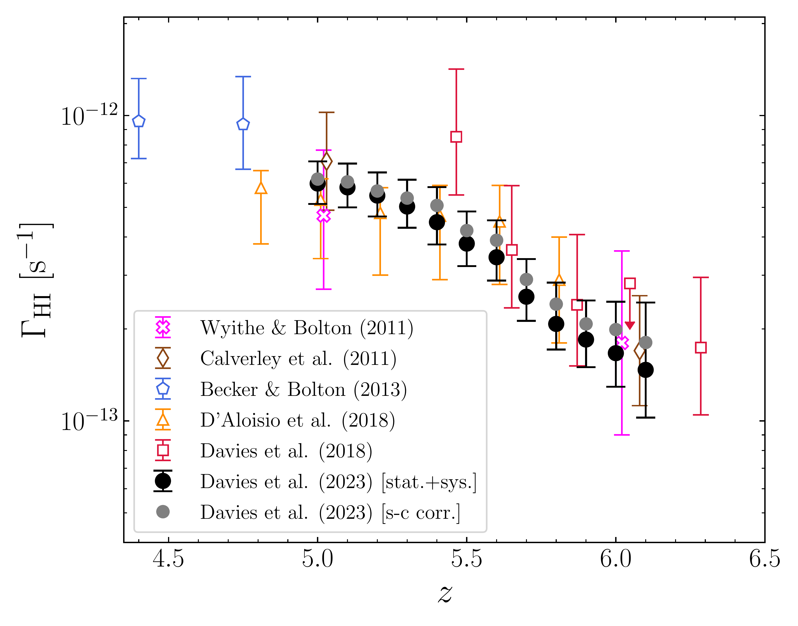
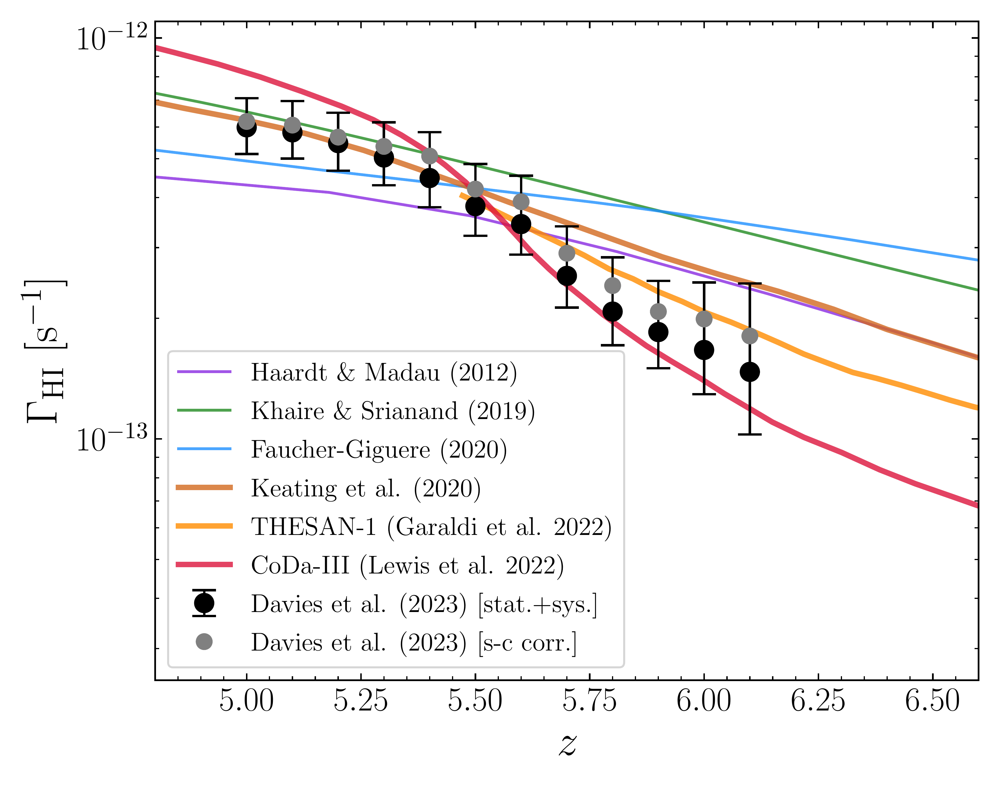

$\newcommand{\ensuremath}{}$
$\newcommand{\xspace}{}$
$\newcommand{\object}[1]{\texttt{#1}}$
$\newcommand{\farcs}{{.}''}$
$\newcommand{\farcm}{{.}'}$
$\newcommand{\arcsec}{''}$
$\newcommand{\arcmin}{'}$
$\newcommand{\ion}[2]{#1#2}$
$\newcommand{\textsc}[1]{\textrm{#1}}$
$\newcommand{\hl}[1]{\textrm{#1}}$
$\newcommand{\footnote}[1]{}$
$\newcommand{\url}[1]{\href{#1}{#1}}$
$\newcommand{\dodoi}[1]{doi:~\href{http://doi.org/#1}{\nolinkurl{#1}}}$
$\newcommand{\doeprint}[1]{\href{http://ascl.net/#1}{\nolinkurl{http://ascl.net/#1}}}$
$\newcommand{\doarXiv}[1]{\href{https://arxiv.org/abs/#1}{\nolinkurl{https://arxiv.org/abs/#1}}}$
$\newcommand{\HI}{\mathrm{H I}}$
$\newcommand{\HII}{\mathrm{H II}}$
$\newcommand{\HeI}{\mathrm{He I}}$
$\newcommand{\HeII}{\mathrm{He II}}$
$\newcommand{\HeIII}{\mathrm{He III}}$
$\newcommand{\GHI}{\Gamma_{\HI}}$
$\newcommand{\GHeII}{\Gamma_{\HeII}}$
$\newcommand{\etath}{\eta_{\mathrm{thin}}}$
$\newcommand{\mfp}{\lambda_{\mathrm{mfp}}}$
$\newcommand{\LLS}{\mathrm{LLS}}$
$\newcommand{\lya}{Ly\alpha }$
$\newcommand{\lyb}{Ly\beta }$
$\newcommand{\lyam}{{\mathrm{Ly}\alpha}}$
$\newcommand{\lybm}{{\mathrm{Ly}\beta}}$
$\newcommand{\lyab}{Ly\alpha+\beta}$
$\newcommand{\lyabm}{{\mathrm{Ly}\alpha+\beta}}$
$\newcommand{\teff}{\tau_\mathrm{eff}}$
$\newcommand{\chimp}{Mpc/h}$
$\newcommand{\xhi}{\langle x_{\rm HI}\rangle}$
$\newcommand{\noop}[1]$
$\newcommand{\}{natexlab}$

# $\bf$ $\large$ Constraints on the Evolution of the Ionizing Background and Ionizing Photon Mean Free Path at the End of Reionization

<mark>Appeared on: 2023-12-15</mark> -  _23 pages, 13 figures, resubmitted to ApJ after referee's comments_

F. B. Davies, et al. -- incl., <mark>P. Gaikwad</mark>, <mark>F. Nasir</mark>

**Abstract:** The variations in Ly $\alpha$ forest opacity observed at $z>5.3$ between lines of sight to different background quasars are too strong to be caused by fluctuations in the density field alone. The leading hypothesis for the cause of this excess variance is a late, ongoing reionization process at redshifts below six. Another model proposes strong ionizing background fluctuations coupled to a short, spatially varying mean free path of ionizing photons, without explicitly invoking incomplete reionization. With recent observations suggesting a short mean free path at $z\sim6$ , and a dramatic improvement in $z>5$ Ly $\alpha$ forest data quality, we revisit this latter possibility. Here we apply the likelihood-free inference technique of approximate Bayesian computation to jointly constrain the hydrogen photoionization rate $\Gamma_{\rm HI}$ and the mean free path of ionizing photons $\lambda_{\rm mfp}$ from the effective optical depth distributions at $z=5.0$ -- $6.1$ from XQR-30. We find that the observations are well-described by fluctuating mean free path models with average mean free paths that are consistent with the steep trend implied by independent measurements at $z\sim5$ -- $6$ , with a concomitant rapid evolution of the photoionization rate.

**Figure 7. -** Demonstration of ABC on a mock data set. The blue and red curves in the left panel correspond to the cumulative distribution functions of Ly$\alpha$ forest effective optical depth from a mock XQR-30 data set, with non-detections treated as optimistic ($F=2\times\sigma_F$) or pessimistic ($F=0$), respectively, following \citet{Bosman18,Bosman22}. The shaded regions correspond to the central 95\% of the scatter of additional mock data sets with $\Gamma_{\rm HI}$ and $\lambda_{\rm mfp}$ set to their mean posterior estimates. The grey points in the upper halves of the middle and right panels show the distance metric $\rho$(equation \ref{eqn:abcdist}) computed from 1,000,000 mock data sets. The horizontal lines show three different $\rho$ thresholds below which lie 50\%, 10\%, and 0.1\% of the mock data samples from top to bottom. The corresponding posterior PDFs on $\Gamma_{\rm HI}$ and $\lambda_{\rm mfp}$ are shown in the lower panels, with the true values indicated by the vertical dashed lines. (*fig:abcexample*)

**Figure 2. -** Posterior medians (black circles) and central 68\% credible intervals (black thin error bars) on $\Gamma_{\rm HI}$ from the XQR-30 data set assuming $z_{\rm re}=7.2$. The dark grey shaded region shows the deviation of the posterior medians for $z_{\rm re}=6.7$ and $z_{\rm re}=7.7$, while the light grey shaded region shows the range from more extreme thermal models with $z_{\rm re}=6.2$ and $z_{\rm re}\sim15$. The open orange points show the constraints without the correction for the coarse redshift snapshot sampling (see Appendix \ref{sec:appendix_snaps}). The purple crosses show the posterior medians from the self-consistent model in the $L=100$ Mpc$/h$ hydrodynamical simulation volume, see \S \ref{sec:selfcon}. (*fig:abcghi*)

**Figure 9. -** Left: Comparison of our $\Gamma_{\rm HI}$ constraints (black points with error bars, including statistical and systematic uncertainty) to previous measurements from the literature: \citet{Calverley11}(brown diamonds; quasar proximity zone profiles); \citet{WB11}, \citet{BB13}, and \citet{D'Aloisio18}(pink crosses, blue pentagons, and orange triangles; mean Ly$\alpha$ forest transmission); \citet{Davies17}(red squares; Ly$\alpha$ and Ly$\beta$ transmission spikes). No corrections have been made for differences in cosmology or assumptions of the IGM thermal state between these works. The grey points show our constraints with an approximate correction for a bias due to the lack of self-consistency. Right: Comparison to theoretical models of the ionizing background (curves), computed from 1D cosmological radiative transfer calculations by \citet{HM12}(purple), \citet{KS19}(green), \citet{FG20}(blue) and 3D radiation-hydrodynamic cosmological simulations by \citet{Keating19}(brown), \citet{Garaldi22}(orange; THESAN), and \citet{Lewis22}(red; CoDa-III). (*fig:abcghi2*)

