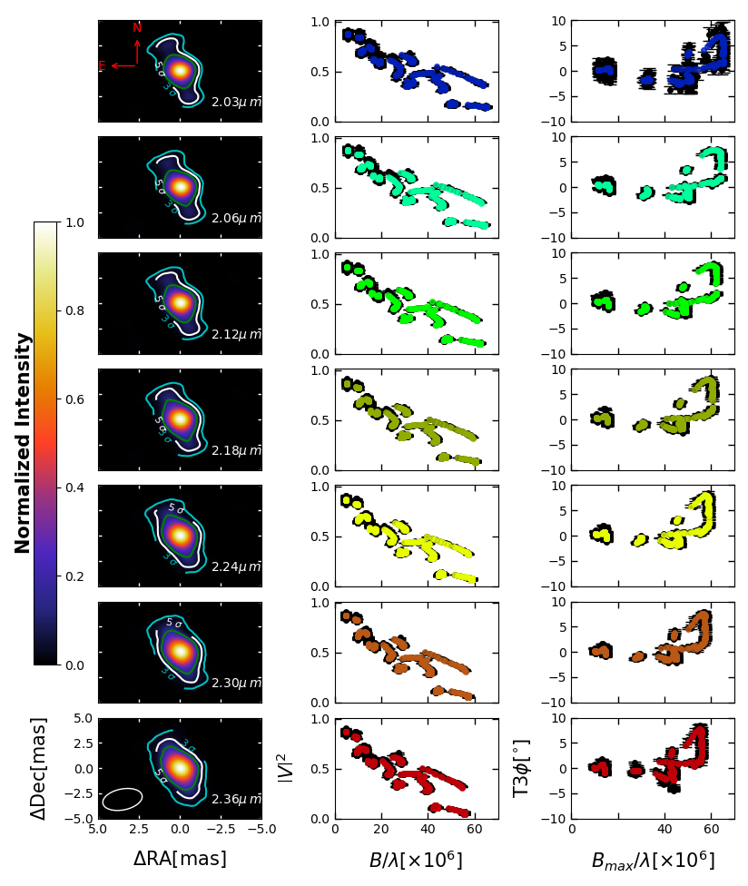
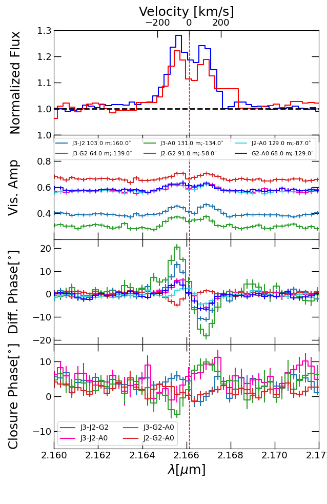
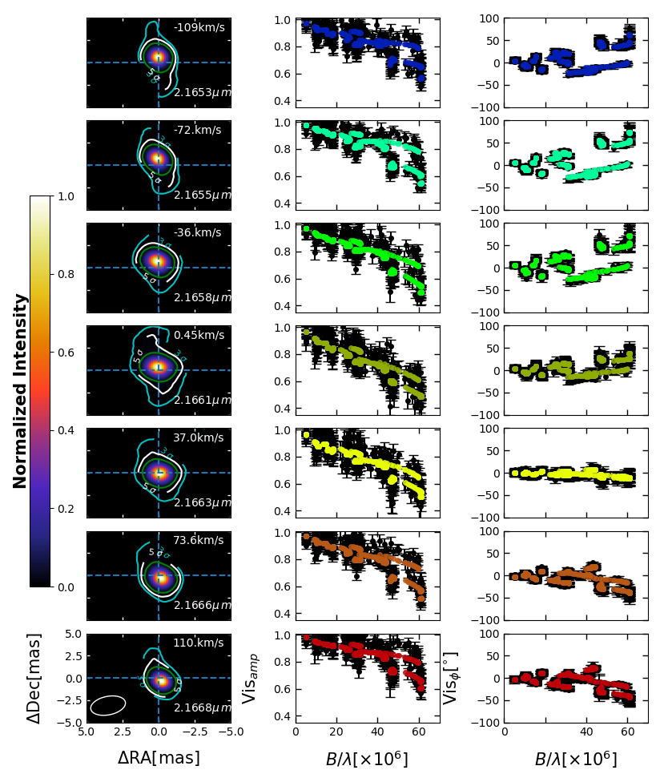

$\newcommand{\ensuremath}{}$
$\newcommand{\xspace}{}$
$\newcommand{\object}[1]{\texttt{#1}}$
$\newcommand{\farcs}{{.}''}$
$\newcommand{\farcm}{{.}'}$
$\newcommand{\arcsec}{''}$
$\newcommand{\arcmin}{'}$
$\newcommand{\ion}[2]{#1#2}$
$\newcommand{\textsc}[1]{\textrm{#1}}$
$\newcommand{\hl}[1]{\textrm{#1}}$
$\newcommand{\footnote}[1]{}$
$\newcommand{\HI}{\ion{H}{i}}$
$\newcommand{\HeI}{\ion{He}{i}}$
$\newcommand{\um}{\mum}$
$\newcommand{\brg}{Br\gamma}$
$\newcommand{\kms}{km s^{-1}}$
$\newcommand{\rstar}{R_*}$
$\newcommand{\macc}{\dot{M}_{acc}}$
$\newcommand{\msunyr}{{M}_{\odot}yr^{-1}}$
$\newcommand{\lsun}{L_\odot}$

# The GRAVITY  young stellar object survey 

<mark>Appeared on: 2023-12-15</mark> -  _accepted in A&A on 20/11/2023_

Y.-I. Bouarour, et al. -- incl., <mark>M. Flock</mark>, <mark>H. Linz</mark>

**Abstract:** We aim to investigate the origin of the HI Br$\gamma$ emission in young stars by using GRAVITY to image the innermost region of circumstellar disks, where important physical processes such as accretion and winds occur. With high spectral and angular resolution, we focus on studying the continuum and the HI Br$\gamma$-emitting area of the Herbig star HD58647. Using VLTI-GRAVITY, we conducted observations of HD58647 with both high spectral and high angular resolution. Thanks to the extensive $uv$ coverage, we were able to obtain detailed images of the circumstellar environment at a sub-au scale, specifically capturing the continuum and the Br$\gamma$-emitting region. Through the analysis of velocity-dispersed images and photocentre shifts, we were able to investigate the kinematics of the HI Br$\gamma$-emitting region. The recovered continuum images show extended emission where the disk major axis is oriented along a position angle of 14\degr. The size of the continuum emission at 5-sigma levels is $\sim$ 1.5 times more extended than the sizes reported from geometrical fitting (3.69 mas $\pm$ 0.02 mas). This result supports the existence of dust particles close to the stellar surface, screened from the stellar radiation by an optically thick gaseous disk. Moreover, for the first time with GRAVITY, the hot gas component of HD58647 traced by the Br$\gamma$ ,has been imaged. This allowed us to constrain the size of the Br$\gamma$-emitting region and study the kinematics of the hot gas; we find its velocity field to be roughly consistent with gas that obeys Keplerian motion. The velocity-dispersed images show that the size of the hot gas emission is from a more compact region than the continuum (2.3 mas $\pm$ 0.2 mas). Finally, the line phases show that the emission is not entirely consistent with Keplerian rotation, hinting at a more complex structure in the hot gaseous disk. 

**Figure 6. -** Results of the image reconstruction. ** Left:** K-band continuum reconstructed images of HD 58647 at different wavelengths (reported in the labels). North is up, and east is to the left. The white hollow ellipse at the lower-left corner of the bottom panel represents the size of the clean beam. Contours represent 3, 5, and 10 $\sigma$ pixel significance levels. ** Middle and right:** Squared visibilities ($\left|V\right|^2$; middle panel) and closure phases (T3$_{\phi}$; right panel)  as a function of the spatial frequency. The observed data with their corresponding error bars are represented as black dots, while the synthetic observables extracted from the reconstructed images are shown in colour. (*contIM*)

**Figure 2. -** Example of HR GRAVITY interferometric observations of HD 58647 around the $\HI$\brg line position taken in January 2020 using the (J3-J2-G2-A0) configuration. From top to bottom: HR spectrum (red) and photospheric-corrected spectrum (blue); spectrally dispersed visibility amplitudes; differential phases; and closure phases. Different colours represent different projected baselines and baseline orientations (PAs; visibilities and differential phase panels) or triplets (closure phase panel), as indicated in the middle-top and bottom panel, respectively. (*diffobs*)

**Figure 7. -** Results of the image reconstruction. ** Left:**$\HI$\brg line reconstructed images of HD 58647. North is up, and east is to the left. Contours represent 3, 5, and 10 $\sigma$. ** Middle and right:** Comparison of the observed  continuum-subtracted visibility amplitudes and absolute  phases (black circles with error bars) with the synthetic observables extracted from the reconstructed image. (*velomaps*)

