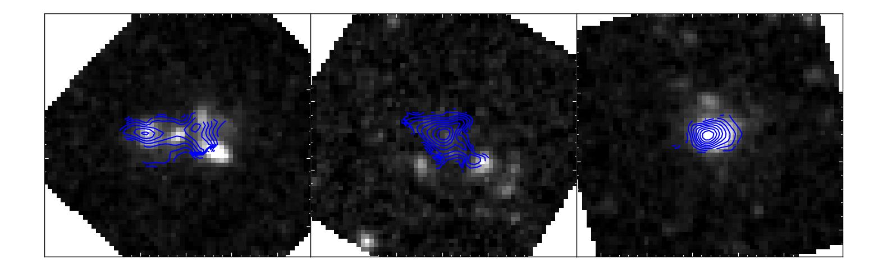
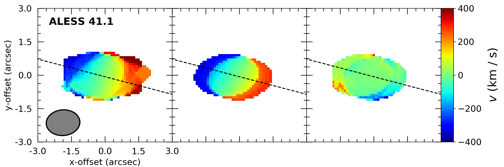
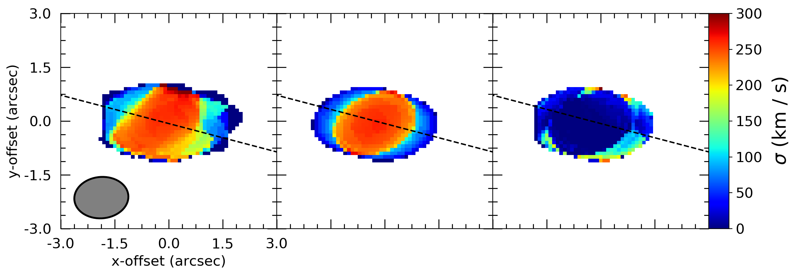
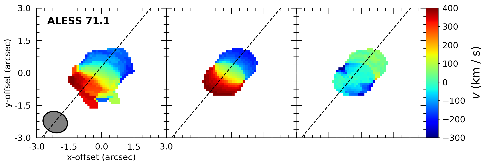
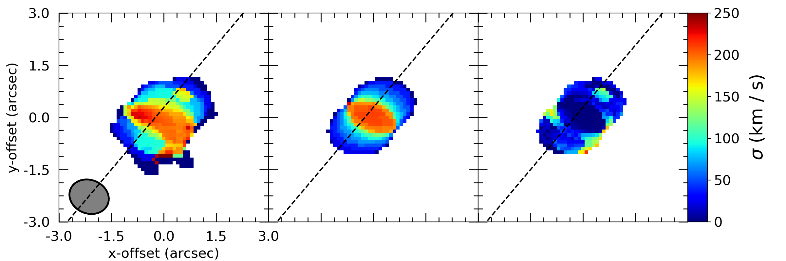
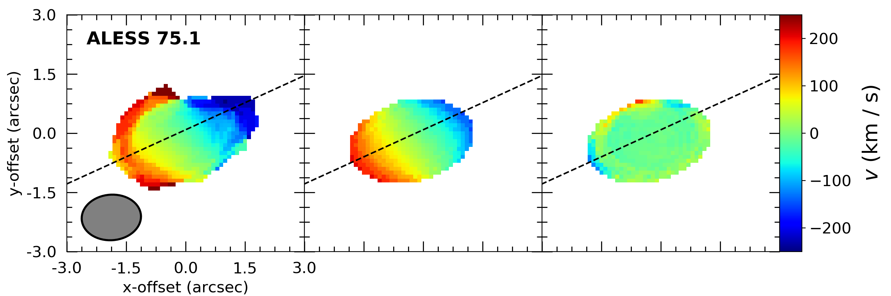
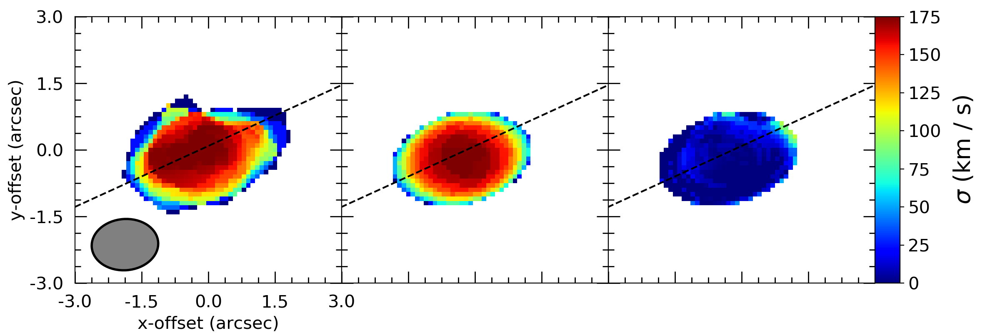
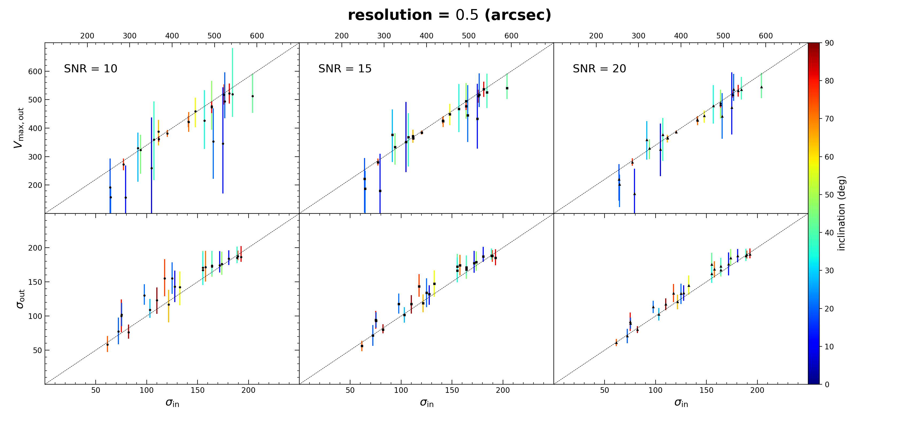
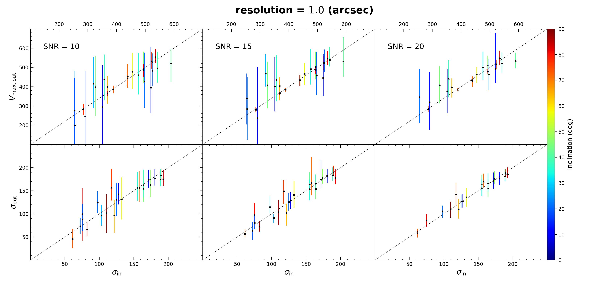

$\newcommand{\ensuremath}{}$
$\newcommand{\xspace}{}$
$\newcommand{\object}[1]{\texttt{#1}}$
$\newcommand{\farcs}{{.}''}$
$\newcommand{\farcm}{{.}'}$
$\newcommand{\arcsec}{''}$
$\newcommand{\arcmin}{'}$
$\newcommand{\ion}[2]{#1#2}$
$\newcommand{\textsc}[1]{\textrm{#1}}$
$\newcommand{\hl}[1]{\textrm{#1}}$
$\newcommand{\footnote}[1]{}$
$\newcommand{\cmark}{\ding{51}}$
$\newcommand{\xmark}{\ding{55}}$
$\newcommand{\gs}{\mathrel{\raise0.35ex\hbox{\scriptstyle >}$
$\lower0.40ex\hbox{{\scriptstyle \sim}}}}$
$\newcommand{\ls}{\mathrel{\raise0.35ex\hbox{\scriptstyle <}$
$\lower0.40ex\hbox{{\scriptstyle \sim}}}}$

# The  kinematics of massive high-redshift dusty star-forming galaxies

<mark>Appeared on: 2023-12-15</mark> - 

A. Amvrosiadis, et al. -- incl., <mark>F. Walter</mark>

**Abstract:** We present a new method for modelling the kinematics of galaxies from interferometric observations by performing the optimization of the kinematic model parameters directly in visibility-space instead of the conventional approach of fitting velocity fields produced with the ${\sc clean}$ algorithm in  real-space. We demonstrate our method on ALMA observations of $^{12}$ CO (2 $-$ 1), (3 $-$ 2) or (4 $-$ 3) emission lines from an initial sample of 30 massive 850 $\mu$ m-selected dusty star-forming galaxies with far-infrared luminosities $\gtrsim 10^{12} $ L $_{\odot}$ in the redshift range $z \sim$ 1.2--4.7. Using the results from our modelling analysis for the 12 sources with the highest signal-to-noise emission lines and disk-like kinematics, we conclude the following: (i) Our sample prefers a CO-to- $H_2$ conversion factor,  of $\alpha_{\rm CO} = 0.92 \pm 0.36$ ; (ii) These far-infrared luminous galaxies follow a similar Tully--Fisher relation between the circularized velocity, $V_{\rm circ}$ , and baryonic mass, $M_{\rm b}$ , as more typical star-forming samples at high redshift, but extend this relation to much higher masses -- showing that these are some of the most massive disk-like galaxies in the Universe; (iii) Finally, we demonstrate support for an evolutionary link between massive high-redshift dusty star-forming galaxies and the formation of local early-type galaxies using the both the distributions of the  baryonic and kinematic masses of these two populations on the $M_{\rm b}$ -- $\sigma$ plane and their relative space densities.

**Figure 2. -** HST images (greyscale) of three of the Class \Romannum{2} sources in our sample (ALESS 088.1, 101.1, 112.1). The blue contours show the distribution of the CO emission, while the HST imaging suggests potentially complex morphologies for these sources. (*fig:figure_1_for_Appendix_A*)

**Figure 1. -** 
  Moment 1 (velocity; left column) and 2 (dispersion; right column) maps for three example sources in our sample (the name of each source is indicated at the top left corner). From left to right in each row we show the observed data, the maximum likelihood model and residual dirty moment maps (the moment maps were computed after masking any emission below $3\sigma$). In these example sources (as well as for the other sources regarded as well described by our rotating disk model; see Section \ref{sec:model_observations}) the model does a good job at reproducing the observed data. The black dotted line in each panel corresponds to the best-fit position angle, $\theta$, of the major axis. The black ellipse in the bottom left corner represents the beam.  (*fig:figure_2*)

**Figure 3. -** Output versus input values for the two main parameters of interest, the maximum rotation velocity ($V_{\rm max}$) and the velocity dispersion ($\sigma$), color-coded by the true inclination. The different columns corresponds to datasets with different SNR, indicated at the top left corner of each panel. The top and bottom figures correspond to datasets with different resolution, 0.5 arcsec and 1.0 arcsec, respectively. (*fig:sims*)

