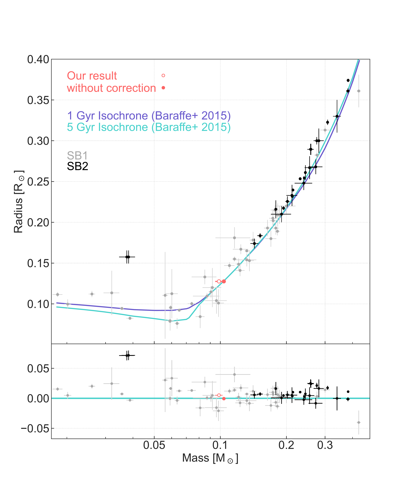
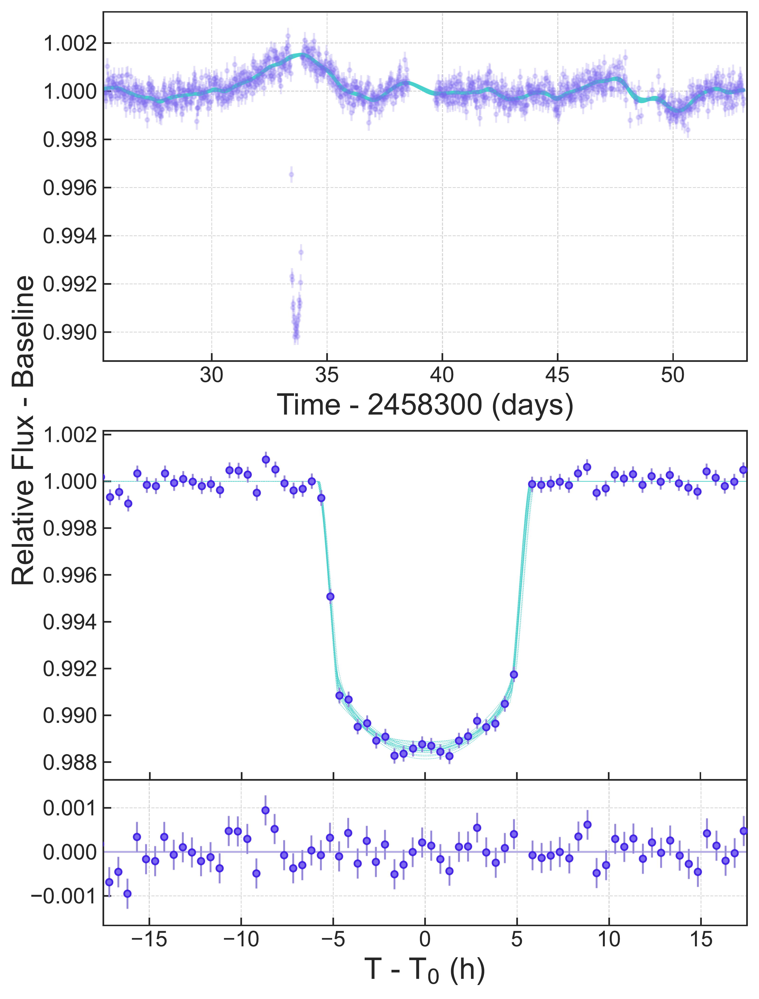
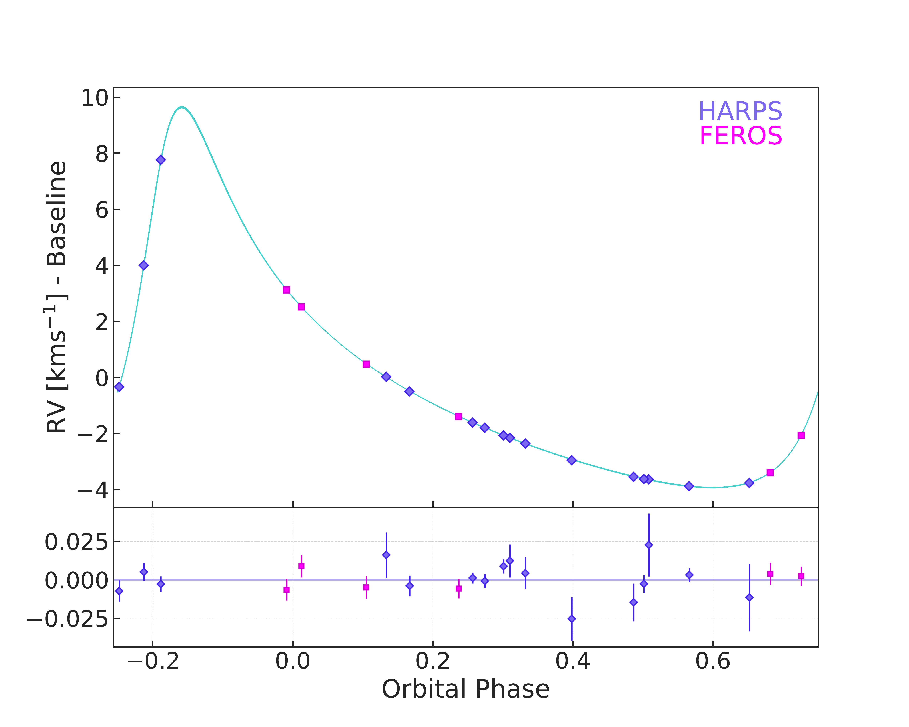

$\newcommand{\ensuremath}{}$
$\newcommand{\xspace}{}$
$\newcommand{\object}[1]{\texttt{#1}}$
$\newcommand{\farcs}{{.}''}$
$\newcommand{\farcm}{{.}'}$
$\newcommand{\arcsec}{''}$
$\newcommand{\arcmin}{'}$
$\newcommand{\ion}[2]{#1#2}$
$\newcommand{\textsc}[1]{\textrm{#1}}$
$\newcommand{\hl}[1]{\textrm{#1}}$
$\newcommand{\footnote}[1]{}$
$\newcommand{\mass}{M_2~=~0.0986~\pm 0.0038~ \mathrm{M_{\sun}}}$
$\newcommand{\radius}{R_2 =~0.1275~\pm0.0020~ \mathrm{R_{\sun}}}$
$\newcommand{\period}{P =~44.92471~\pm0.00025~ \rm{ day}}$
$\newcommand{\loggsec}{\log g_2 = 5.222 \pm 0.0135}$
$\newcommand{\massfunction}{f_m = 0.0008127\pm0.0000028~ \mathrm{M_{\sun}}}$
$\newcommand{\eccentricity}{e = 0.56767 \pm 0.00045}$
$\newcommand{\massratio}{q = 0.0999 \pm 0.0022 }$
$\newcommand{\arraystretch}{1.3}$
$\newcommand{\arraystretch}{1.3}$
$\newcommand{\thebibliography}{\DeclareRobustCommand{\VAN}[3]{##3}\VANthebibliography}$

# The EBLM Project XII.  An eccentric, long-period eclipsing binary with a companion near the hydrogen-burning limit

<mark>Appeared on: 2023-12-15</mark> -  _Resubmitted to MNRAS after positive review_

Y. T. Davis, et al. -- incl., <mark>T. Trifonov</mark>

**Abstract:** In the hunt for Earth-like exoplanets it is crucial to have reliable host star parameters, as they have a direct impact on the accuracy and precision of the inferred parameters for any discovered exoplanet. For stars with masses between 0.35 and 0.5 ${\rm M_{\sun}}$ an unexplained radius inflation is observed relative to typical stellar models. However, for fully convective objects with a mass below 0.35 ${\rm M_{\sun}}$ it is not known whether this radius inflation is present as there are fewer objects with accurate measurements in this regime. Low-mass eclipsing binaries present a unique opportunity to determine empirical masses and radii for these low-mass stars. Here we report on such a star, EBLM J2114-39 B. We have used HARPS and FEROS radial-velocities and _TESS_ photometry to perform a joint fit of the data, and produce one of the most precise estimates of a very low mass star's parameters. Using a precise and accurate radius for the primary star using $_ Gaia_$ DR3 data, we determine J2114-39 to be a $M_1 = 0.987 \pm 0.059$  ${\rm M_{\sun}}$ primary star hosting a fully convective secondary with mass $\mass$ , which lies in a poorly populated region of parameter space. With a radius $\radius$ , similar to TRAPPIST-1, we see no significant evidence of radius inflation in this system when compared to stellar evolution models. We speculate that stellar models in the regime where radius inflation is observed might be affected by how convective overshooting is treated.

**Figure 3. -** 
    Mass-radius diagram with logarithmic mass axis, showing published single-lined systems (SB1) in grey, double-lined binaries (SB2) in black and EBLM J2114-39 in coral colour. The $1 \rm Gyr$ and $5 \rm Gyr$ isochrones are shown in purple and teal respectively. The lower panel highlights differences between the objects and the $5 \rm Gyr$ isochrone. Black and grey data points from compendium (and cited papers) in [ and Triaud (2020)](https://ui.adsabs.harvard.edu/abs/2020NatAs...4..650T), with additional points from [ and Morales (2009)](https://ui.adsabs.harvard.edu/abs/2009ApJ...691.1400M).
     (*fig:mass_radius_plot*)

**Figure 1. -** 
    Top panel: Raw _ TESS_ data in purple with 20 random samples of the GP from the MCMC modelling the additional noise in blue. Middle panel: The phase-shifted eclipse of EBLM J2114-39, data shown in purple after the signal modelled by the GP has been removed. Twenty random samples from the MCMC run are displayed in teal colour. Bottom panel: The residuals to the best fit model. (*fig:phased_light_curve*)

**Figure 2. -** 
    Phased radial-velocity measurements for EBLM J2114-39 from the HARPS (in purple) and FEROS (in pink) spectrographs. A sample of 20 random models from the MCMC are shown in teal colour. The residuals to best fit model are shown in the lower panel. (*fig:phased_rv*)

