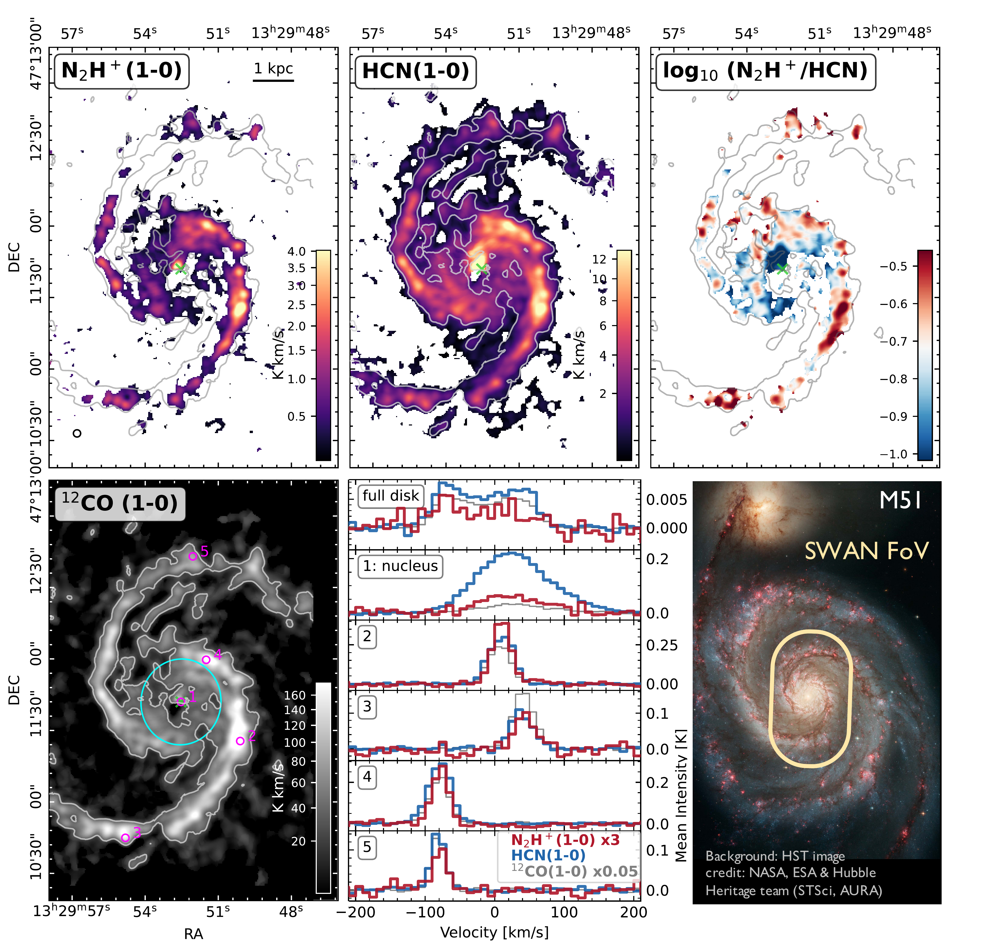
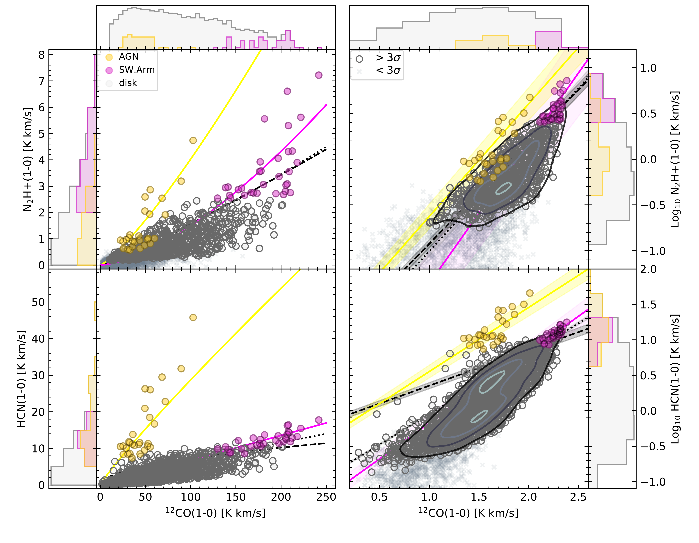

 is shown as a green dotted line.
     (*fig:Spikes*)

**Figure 3. -** Integrated intensity maps of $\nnhp$(top left) and $\hcn$(top center), as well as their ratio (top right) at 3$\arcsec$($\sim$ 125 pc) resolution of the central $5$ kpc$ \times 7$ kpc in M 51a.
    The ratio map shows emission above $3\sigma$ for both lines.
    The beam of $\sim3$\arcsec$$ is shown in the bottom left corner of the $\nnhp$ map for reference; the location of the galactic center is marked (green $\times$).
    We further display $\CO$ emission at 3$\arcsec$ resolution from the PAWS survey \citep[bottom left; ][]{schinnerer_pdbi_2013} for comparison and show the 30 K km/s contour of $\CO$ for reference in all maps. The central 1.5 kpc (in diameter) is indicated by a cyan circle in the $\CO$ map.
    Average spectra of five beam-sized regions in the disk (see the $\CO$ map) are shown for $\nnhp$, $\hcn$ and $\CO$(bottom center). We scale the spectra by a factor of 3 ($\nnhp$) and 0.05 ($\CO$) for easier comparison.  The full-disk spectra contain all pixels in the FoV, shown on top of a HST image (bottom right).
     (*fig:Gallery*)

**Figure 5. -** Pixel-by-pixel distribution of integrated $\nnhp$(top panels) and $\hcn$(bottom panels) as function of $\CO$ emission, similar to Fig. \ref{fig:Spikes}(a) in linear (left panels) and logarithmic (right panels) scaling. Subsets of pixels isolated in Fig. \ref{fig:Spikes} are marked accordingly (pink: subset (c) SW.Arm, yellow: Subset (b) AGN). Power-law fits to the full data (black dashed), the data without the central points (black dotted) and the subsets are added (colors respectively). Fit uncertainties are only shown in log space to ease visibility. (*fig:Additionalspikes*)

