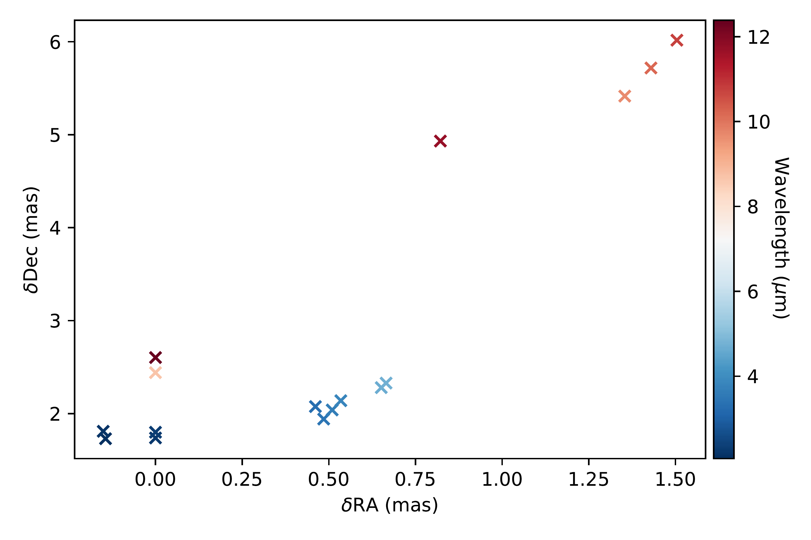
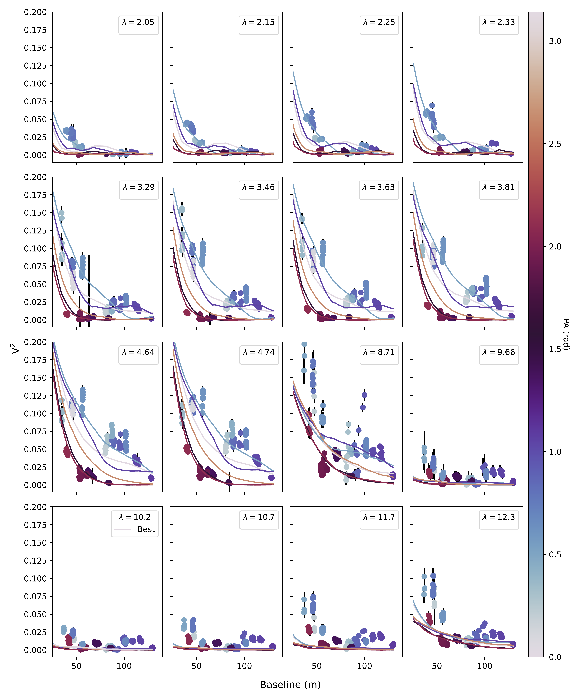

 and the image reconstructions from these works (bottom row). All images are colour scaled by a power of 0.6 to highlight faint structure. (*fig:polyimcomp*)

**Figure 1. -** The location of the brightest spot from the polychromatic model with wavelength, (0,0) is the model centre. (*fig:photocentre*)

**Figure 2. -** The V$^2$ of the polychromatic model. The line is the best polychromatic model by maximum likelihood evaluated at different PA. (*fig:polyv2*)

