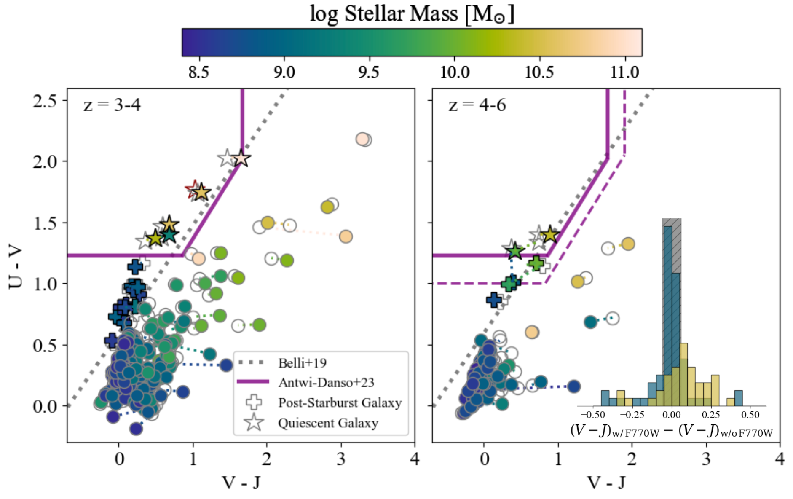

 as a function of redshift.  Red stars (orange pluses) are our QG (PSB) candidates. The red open star is the close companion source to JADES 172799 (172799b; Section \ref{sec:rose}). Solid plus signs indicate our primary PSB sample, while open symbols are the secondary sample.  Only one PSB is a contaminant on the MS. White circles are galaxies in our parent sample not selected as QG or PSB. Purple x's are galaxies selected by the [ and Antwi-Danso (2023)]() NIRCam color selection (Section \ref{sec:ncselection}) that are not in our sample.  (*fig:ms*)

**Figure 7. -** The rest-frame UVJ colors of log $\logM\geq8.5$ galaxies in the JADES MIRI parallel footprint at $z=3-4$(left) and $z=4-6$(right).  Closed symbols colored by stellar mass are colors derived from SED modeling including the F770W datapoint.  Open gray symbols are colors derived from fits excluding F770W. The connecting lines show where sources move in UVJ space when MIRI is added. The red open star is the close companion source to JADES 172799 (172799b; Section \ref{sec:rose}). The purple solid (dashed) shows the main (expanded) UVJ selection region for QGs from [ and Antwi-Danso (2023)](). The gray dotted line is the selection from B19, which extends past the standard $U-V$ boundary. The inset histogram shows that the color shifts are consistent within the measurement uncertainties (gray hatched region) for log $\logM=8.5-9.5$(blue), but show a small systematic shift redward at higher masses (orange). (*fig:uvj*)

