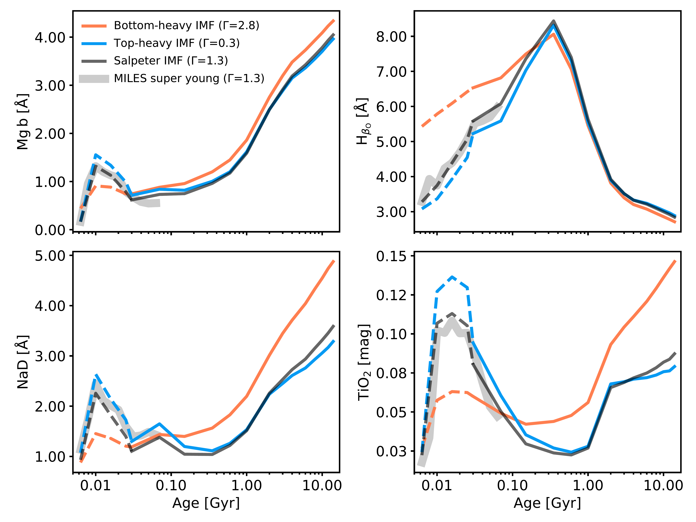
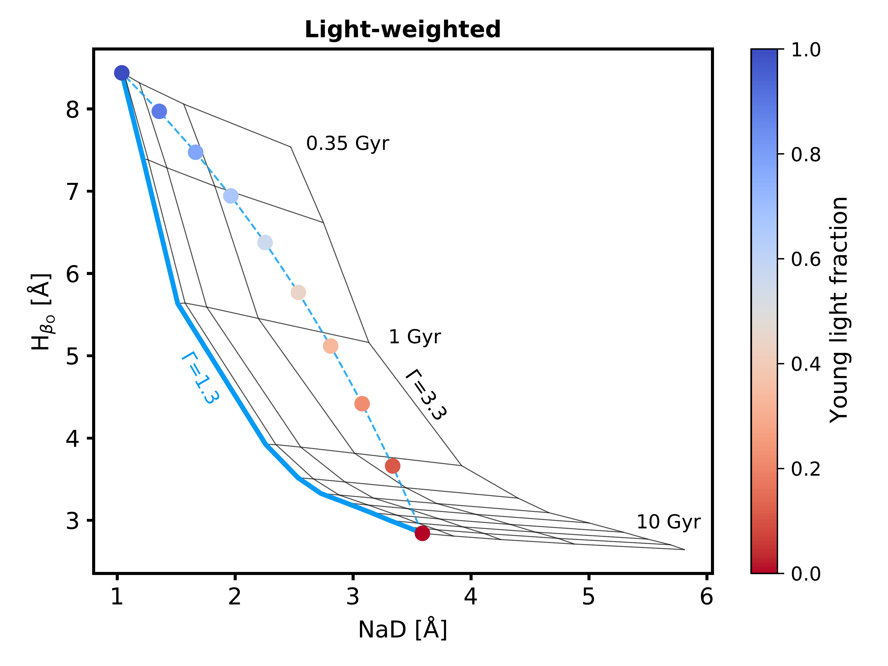
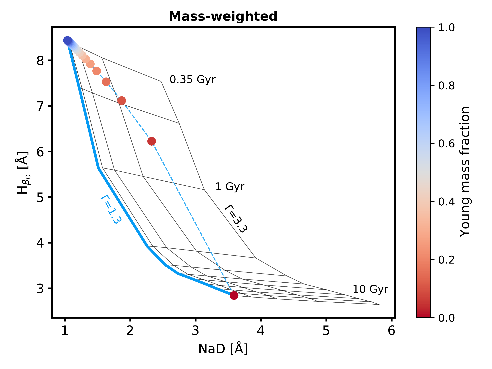
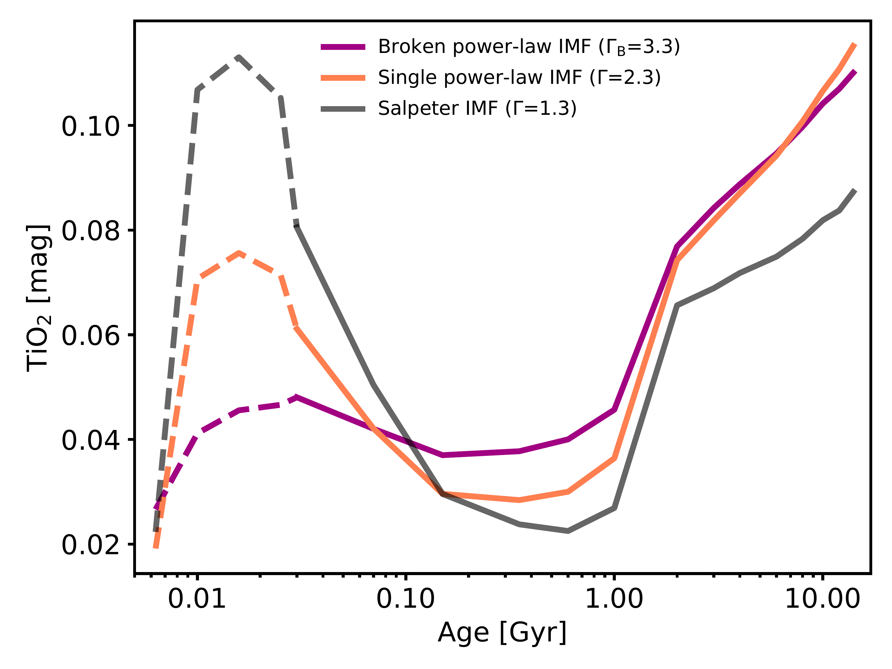

$\newcommand{\ensuremath}{}$
$\newcommand{\xspace}{}$
$\newcommand{\object}[1]{\texttt{#1}}$
$\newcommand{\farcs}{{.}''}$
$\newcommand{\farcm}{{.}'}$
$\newcommand{\arcsec}{''}$
$\newcommand{\arcmin}{'}$
$\newcommand{\ion}[2]{#1#2}$
$\newcommand{\textsc}[1]{\textrm{#1}}$
$\newcommand{\hl}[1]{\textrm{#1}}$
$\newcommand{\footnote}[1]{}$
$\newcommand{\msun}{\hbox{M_{\odot}}}$
$\newcommand{\kms}{\hbox{km s^{-1}}}$
$\newcommand{\}{natexlab}$

# The universal variability of the stellar initial mass function probed by the TIMER survey

<mark>Appeared on: 2023-12-22</mark> -  _16 pages, 11 figures. Accepted for publication in Astronomy and Astrophysics_

I. Martín-Navarro, et al. -- incl., <mark>J. Neumann</mark>

**Abstract:** The debate about the universality of the stellar initial mass function (IMF) revolves around two competing lines of evidence. While measurements in the Milky Way, an archetypal spiral galaxy, seem to support an invariant IMF, the observed properties of massive early-type galaxies (ETGs) favor an IMF somehow sensitive to the local star formation conditions. The fundamental methodological and physical differences between both approaches have hampered, however, a comprehensive understanding of IMF variations. We describe here an improved modelling scheme that allows for the first time consistent IMF measurements across stellar populations with different ages and complex star formation histories. Making use of the exquisite MUSE optical data from the TIMER survey and powered by the MILES stellar population models, we show the age, metallicity, [ Mg/Fe ] , and IMF slope maps of the inner regions of NGC 3351, a spiral galaxy with a mass similar to that of the Milky Way. The measured IMF values in NGC 3351 follow the expectations from a Milky Way-like IMF, although they simultaneously show systematic and spatially coherent variations, particularly for low-mass stars. In addition, our stellar population analysis reveals the presence of metal-poor and Mg-enhanced star-forming regions that appear to be predominantly enriched by the stellar ejecta of core-collapse supernovae. Our findings showcase therefore the potential of detailed studies of young stellar populations to better understand the early stages of galaxy evolution and,  in particular, the origin of the observed IMF variations beyond and within the Milky Way.

**Figure 10. -** Line strength age and IMF sensitivity. From left to right and top to bottom we show the age dependence of the Mgb, H$_{\beta_O}$, Nad, and $TiO_2$ spectral features, respectively. Solid lines correspond to the MILES $\alpha$-variable models and dashed ones indicate their (adapted) super-young extension. The gray shaded area in the background shows the unmodified super-young model predictions for a Milky Way-like IMF (see main text for more details). Orange lines are predictions for a bottom-heavy IMF (i.e. steeper than the Milky Way standard), blue lines for a top-heavy (i.e. flatter) IMF, and black lines for the reference Salpeter IMF. The rapid increase in the equivalent width of the indices (but H$_{\beta_O}$) at ages around $\sim 10$ Myr is caused by the sudden appearance of red supergiant stars. Predictions are shown at the native resolution of the MILES models (2.51 Å). (*fig:indices*)

**Figure 11. -** H$_{\beta_o}$ vs NaD index-index diagram. Gray grids show the MILES predictions at the native resolution of the models (2.51 Å) and solar metallicity for different ages and IMF slopes, as indicated by the labels. Blue solid lines highlight the age variation for a Salpeter IMF. Dashed blue lines and filled circles track the range of expected values for a composite stellar population of two SSP models (14 Gyr and 0.35 Gyr), both of them with a Milky Way-like IMF. Symbols are color-coded by the light (left panel) and mass (right panel) fraction associated to the young SSP model. This simplified yet realistic example shows how the best-fitting SSP solution fails to recover the true value of $\Gamma=1.3$ when applied to composite stellar populations, which could result in unrealistically high IMF slope values ($\Gamma\sim 3.3$). (*fig:offgrid*)

**Figure 2. -** Optical sensitivity to the shape of the IMF. Black, orange, and purple lines indicate the age sensitivity of the $TiO_2$ absorption feature for a Salpeter IMF, a bottom-heavy single power law IMF, and a bottom-heavy broken power law IMF, respectively. For old stellar populations, as those harbored by massive quiescent galaxies, both single power law and broken power law IMF parametrizations are indistinguishable since the stellar mass range probed along the IMF is rather narrow. For young stellar populations however, different model assumptions on the IMF shape lead to dramatically different model predictions, highlighting the potential use of line-strength indices to actually constrain the shape of the IMF. Predictions are shown at the native resolution of the MILES models (2.51 Å). (*fig:shape*)

