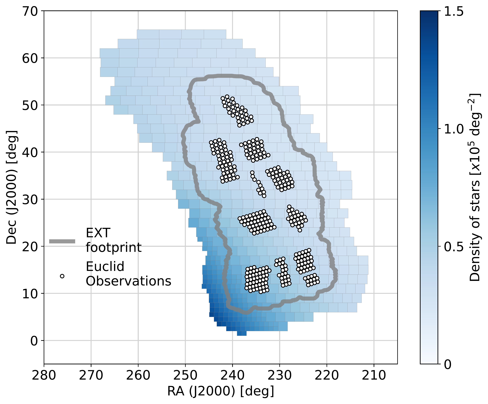

$\newcommand{\ensuremath}{}$
$\newcommand{\xspace}{}$
$\newcommand{\object}[1]{\texttt{#1}}$
$\newcommand{\farcs}{{.}''}$
$\newcommand{\farcm}{{.}'}$
$\newcommand{\arcsec}{''}$
$\newcommand{\arcmin}{'}$
$\newcommand{\ion}[2]{#1#2}$
$\newcommand{\textsc}[1]{\textrm{#1}}$
$\newcommand{\hl}[1]{\textrm{#1}}$
$\newcommand{\footnote}[1]{}$
$\newcommand{\dotdeg}{\rlap{.}^\circ}$
$\newcommand{\orcid}[1]$
$\newcommand{\}{natexlab}$

# Euclid preparation

<mark>Appeared on: 2024-01-04</mark> -  _38 pages, 25 figures, A&A submitted_

E. Collaboration, et al. -- incl., <mark>M. Schirmer</mark>

**Abstract:** The European Space Agency's _Euclid mission_ is one of the upcoming generation of large-scale cosmology surveys, which will map the large-scale structure in the Universe with unprecedented precision. The mission will collect vast amount of data that will be processed and analysed by $\Euclid$ 's Science Ground Segment (SGS). The development and validation of the SGS pipeline requires state-of-the-art simulations with a high level of complexity and accuracy that include subtle instrumental features not accounted for previously as well as faster algorithms for the large-scale production of the expected $\Euclid$ data products. In this paper, we present the $\Euclid$ SGS simulation framework as applied in a large-scale end-to-end simulation exercise named Science Challenge 8. Our simulation pipeline enables the swift production of detailed image simulations for the construction and validation of the $\Euclid$ mission during its qualification phase and will serve as a reference throughout operations. Our end-to-end simulation framework starts with the production of a large cosmological N-body simulation which we use to construct a realistic galaxy mock catalogue. We perform a selection of galaxies down to $\IE$ =26 and 28 mag, respectively, for a Euclid Wide Survey spanning $165 {\rm deg}^2$ and a $1 {\rm deg}^2$ Euclid Deep Survey. We build realistic stellar density catalogues containing Milky Way-like stars down to $H<26$ produced from a combination of a stellar population synthesis model of the Galaxy and real bright stars. Using the latest instrumental models for both the $\Euclid$ instruments and spacecraft as well as $\Euclid$ -like observing sequences, we emulate with high fidelity $\Euclid$ satellite imaging throughout the mission's lifetime. We present the SC8 data set consisting of overlapping visible and near-infrared Euclid Wide Survey and Euclid Deep Survey imaging and low-resolution spectroscopy along with ground-based data in five optical bands.  This extensive data set enables end-to-end testing of the entire ground segment data reduction and science analysis pipeline as well as the $\Euclid$ mission infrastructure, paving the way to future scientific and technical developments and enhancements.

**Figure 13. -** Density of objects (number of stars per ${\rm deg}^2$) in each standard star catalogues file covering SC8 Main Production area, superimposed with the \Euclid observations and simulated EXT survey area. (*fig:star_catalogues_sc8*)

**Figure 1. -** The total transmission of the VIS (\IE) and NISP photometric  (\YE, \JE, \HE), and the NISP Spectroscopic ($BG_E$, $RG_E$) bands. (*fig:euclid_transmissions*)

**Figure 4. -** The reference template spectral energy distributions, used in combination with extra extinction and emission line prescriptions in order to reconstruct complete spectra. (*fig:cosmos_seds_dust*)

