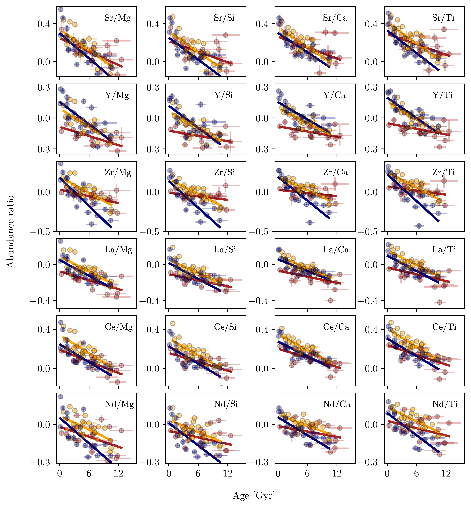
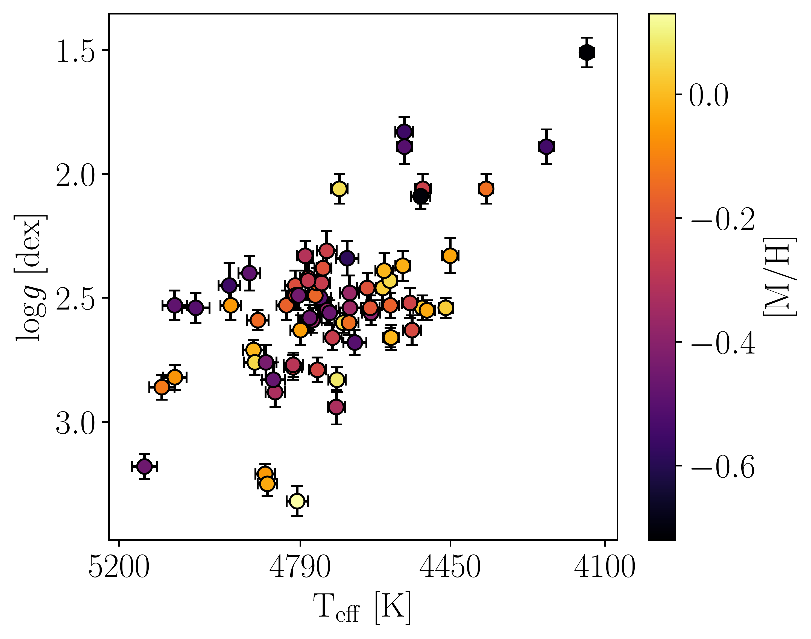

$\newcommand{\ensuremath}{}$
$\newcommand{\xspace}{}$
$\newcommand{\object}[1]{\texttt{#1}}$
$\newcommand{\farcs}{{.}''}$
$\newcommand{\farcm}{{.}'}$
$\newcommand{\arcsec}{''}$
$\newcommand{\arcmin}{'}$
$\newcommand{\ion}[2]{#1#2}$
$\newcommand{\textsc}[1]{\textrm{#1}}$
$\newcommand{\hl}[1]{\textrm{#1}}$
$\newcommand{\footnote}[1]{}$
$\newcommand{\feh}{[Fe/H]}$
$\newcommand{\magenta}[1]{{\color{magenta}#1}}$
$\newcommand{\orange}[1]{{\color{orange}#1}}$
$\newcommand{\}{PJ}$

# Exploring the dependence of chemical traits on metallicity

<mark>Appeared on: 2024-01-05</mark> -  _19 pages, 14 figures + Appendix (2 tables)_

S. Vitali, et al. -- incl., <mark>H. Korhonen</mark>

**Abstract:** Given the massive spectroscopic surveys and the _Gaia_ mission, the Milky Way has turned into a unique laboratory to be explored using abundance ratios that show a strong dependency with time. Within this framework, the data provided through asteroseismology serve as a valuable complement. Yet, it has been demonstrated that chemical traits can not be used as universal relations across the Galaxy. To complete this picture, it is important to investigate the dependence on metallicity of the chemical ratios employed for inferring stellar ages. We aim to explore different combinations of neutron-capture, odd-Z and $\alpha$ elements as a function of age, particularly focusing on their metallicity dependence for a sample of 74 giant field stars. Using UVES observations, we derive  atmospheric parameters and high-precision line-by-line chemical abundances (<0.04 dex) for the entire set of spectra, which covers a wide spread in age (up to 14 Gyr) and metallicity ( $-0.7< \mathrm{[Fe/H]}< +0.1$ ). Stellar ages are inferred from astereoseismic information. By fitting chemical-age trends for three different metallicity groups, we estimated their dependence on metallicity. Simultaneously, we identified those exhibiting stronger correlations with time. We found that the stronger chemical-age relations ( [ Zr/ $\alpha$ ] ) are not necessarily the ratios with the smaller dependence on metallicity ( [ Ce/ $\alpha$ ] and [ Ce/Eu ] ). We confirm the [ n-capture/ $\alpha$ ] -age trends for evolved stars, wherein the most significant correlation is evident in stars with solar-metallicity, gradually diminishing in stars with lower iron content. The lack of homogeneity within the metallicity range highlights the intricate nature of our Galaxy's star formation history and yield production. The dependence on metallicity of the yields involving s-process elements and the influence of radial stellar migration pose challenges to relying solely on chemical abundances for dating stars. These findings contest the feasibility of establishing universally applicable chemical clocks valid across the entire Galaxy and across various metallicity ranges.

**Figure 13. -** Chemical traits as a function of age for the 3 metallicity groups with linear regression fits. Blue represents the {\tt solar}, yellow the {\tt mix} and red the {\tt poor} groups (see Tab. \ref{tab:groups}). The solid lines are the linear fits to the respective metallicity groups. The stellar sample represented do not contain stars older than 14 Gyr and J16081431-2130041, J03573726+242533. (*fig:nalpha*)

**Figure 11. -** Ratios of slow (s)/rapid (r) n-capture elements, and s-elements over vanadium and over aluminium as a function of ages. The color scheme for the stars and the regression lines is the same as for Fig.\ref{fig:nalpha}.  (*fig:s_r_al*)

**Figure 4. -** **Top**: Kiel diagram of the entire spectroscopic sample. The parameters and their errors are derived with spectral synthesis. All spectra are colour-coded by their global metallicity. **Bottom**: Relative uncertainties on $T_{\mathrm{eff}}$ and $\log g$ as a function of temperature and coloured by the SNR of the targets. (*fig:kiel_delta*)

