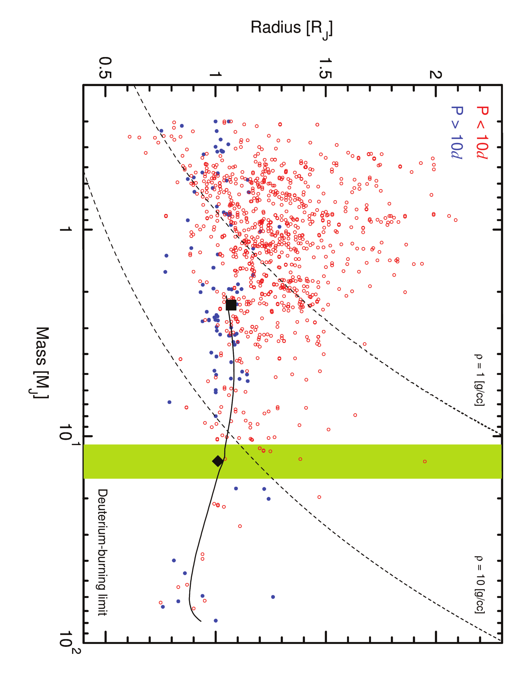
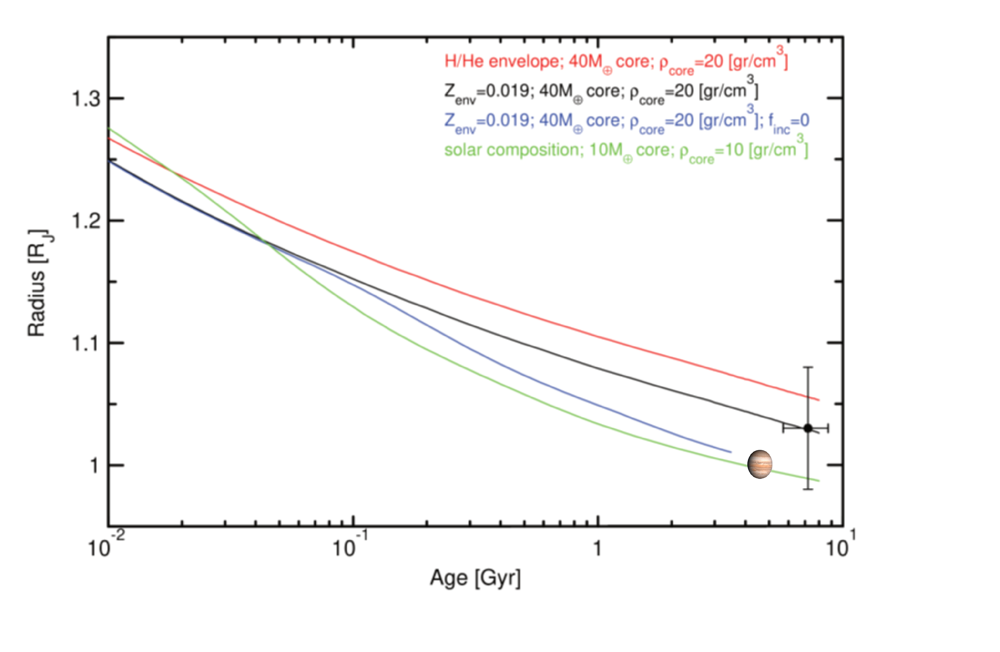

$\newcommand{\ensuremath}{}$
$\newcommand{\xspace}{}$
$\newcommand{\object}[1]{\texttt{#1}}$
$\newcommand{\farcs}{{.}''}$
$\newcommand{\farcm}{{.}'}$
$\newcommand{\arcsec}{''}$
$\newcommand{\arcmin}{'}$
$\newcommand{\ion}[2]{#1#2}$
$\newcommand{\textsc}[1]{\textrm{#1}}$
$\newcommand{\hl}[1]{\textrm{#1}}$
$\newcommand{\footnote}[1]{}$
$\newcommand{\cir}{\mathrm{C^{12}/C^{13}} }$
$\newcommand{\FeI}{Fe {\sc i} }$
$\newcommand{\FeII}{Fe {\sc ii} }$
$\newcommand{\feh}{[Fe/H] }$
$\newcommand{\vt}{\xi_t }$
$\newcommand{\teff}{\ensuremath{T_{\rm eff}}}$
$\newcommand{\teq}{\ensuremath{T_{\rm eq}}}$
$\newcommand{\logg}{\ensuremath{\log{g}}}$
$\newcommand{\angstrom}{\text{\normalfontÅ}}$
$\newcommand{\kms}{km s^{-1} }$
$\newcommand{\msun}{M_\odot }$
$\newcommand{\mstar}{M_\star }$
$\newcommand{\rstar}{R_\star }$
$\newcommand{\lstar}{L_\star }$
$\newcommand{\rsun}{R_\odot }$
$\newcommand{\lsun}{L_\odot }$
$\newcommand{\loggiso}{\logg_{\text{iso}} }$
$\newcommand{\loggtri}{\logg_{\text{tri}} }$
$\newcommand{\ms}{m s^{-1} }$
$\newcommand{\mjup}{M_{\rm J} }$
$\newcommand{\rjup}{R_{\rm J} }$
$\newcommand{\vsini}{\varv sin i }$
$\newcommand{\mearth}{M_\oplus }$
$\newcommand{\zaspe}{\texttt{ZASPE} }$
$\newcommand{\SPECIES}{\texttt{SPECIES} }$
$\newcommand{\ceres}{\texttt{CERES} }$
$\newcommand{\parsec}{\texttt{PARSEC} }$
$\newcommand{\tess}{TESS }$
$\newcommand{\celerite}{\texttt{celerite}}$
$\newcommand{\mesa}{\texttt{MESA} }$
$\newcommand{\juliet}{\texttt{juliet} }$
$\newcommand{\radvel}{\texttt{radvel} }$
$\newcommand{\batman}{\texttt{batman} }$
$\newcommand{\dynesty}{\texttt{dynesty} }$
$\newcommand{\gaia}{\texttt{GAIA} }$
$\newcommand{\perone}{69.0480\substack{+0.0004 \-0.0005} }$
$\newcommand{\massone}{12.74\substack{+1.01 \-1.01} }$
$\newcommand{\radone}{1.026\substack{+0.065 \-0.067} }$
$\newcommand{\eccone}{0.018\substack{+0.004 \-0.004} }$
$\newcommand{\pertwo}{64.5949\substack{+0.0003 \-0.0003} }$
$\newcommand{\masstwo}{2.340\substack{+0.197 \-0.195} }$
$\newcommand{\radtwo}{1.030\substack{+0.050 \-0.050} }$
$\newcommand{\ecctwo}{0.021\substack{+0.024 \-0.015} }$

# A long-period transiting substellar companion in the super-Jupiters to brown dwarfs mass regime and a prototypical warm-Jupiter detected by $\tess$.$\thanks{ Based on observations collected at La Silla - Paranal Observatory under programs IDs 105.20GX.001, 106.212H.001, 106.21ER.001 and 108.22A8.001 and through the Chilean Telescope Time under programs IDs CN2020B-21, CN2021A-14, CN2021B-23, CN2022A-33 and CN2022B-33}$

<mark>Appeared on: 2024-01-19</mark> -  _Accepted in A&A_

M. I. Jones, et al. -- incl., <mark>J. Eberhardt</mark>, <mark>T. Trifonov</mark>

**Abstract:** We report on the confirmation and follow-up characterization of two long-period transiting substellar companions on low-eccentricity orbits around TIC 4672985 and TOI-2529, whose transit events were detected by the $\tess$ space mission.Ground-based photometric and spectroscopic follow-up from different facilities,confirmed the substellar nature of TIC 4672985 $b$ , a massive gas giant, in the transition between the super-Jupiters and brown-dwarfs mass regime.From the joint analysis we derived the following orbital parameters: $P$ = $\perone$ d, $M_p$ = $\massone$ $\mjup$ , $R_p$ = $\radone$ $\rjup$ and $e$ = $\eccone$ . In addition, the RV time series revealed a significant trend at the $\sim$ 350 $\ms$ yr $^{-1}$ level, which is indicative of the presence of a massive outer companion in the system.TIC 4672985 $b$ is a unique example of a transiting substellar companion with a mass above the deuterium-burning limit, located beyond 0.1 AU and in a nearly circular orbit. These planetary properties are difficult to reproduce from canonical planet formation and evolution models.For TOI-2529 $b$ , we obtained the following orbital parameters: $P$ = $\pertwo$ d, $M_p$ = $\masstwo$ $\mjup$ , $R_p$ = $\radtwo$ $\rjup$ and $e$ = $\ecctwo$ , making this object a new example of a growing population of transiting warm giant planets.

**Figure 12. -** Mass-radius distribution of known transiting giant planets as of June 30, 2023. The open red circles and blue dots correspond to orbital periods shorter and longer than 10 $d$, respectively. The positions of TIC 4672985 $b$(black diamond) and TOI-2529 $b$(black square) are also shown. The shaded area represents the theoretical deuterium-burning limit. The solid line corresponds to a 1 Gyr old and solar metallicity ATMO2020 isochrone. Two isodensity curves for 1 and 10 [gr cm$^{-3}$] are also plotted (dashed left and right lines, respectively).   (*fig:mass_rad*)

**Figure 4. -** Normalized photometric observations of TIC 4672985 during the transit. The data were obtained in $\tess$ sector 4 (upper panel) and from ground-based telescopes (CALLISTO and OM-ES; middle and lower panels, respectively). The solid lines correspond to the transit models.  (*fig:LC_model_TIC4672985*)

**Figure 15. -** Position of TOI-2529 $b$ in the age-radius diagram (black dot). Planet evolutionary models with different envelope composition and insolation level over-plotted. For comparison, a simple model of Jupiter is also shown.
 (*fig:age_rad_TOI2529*)

