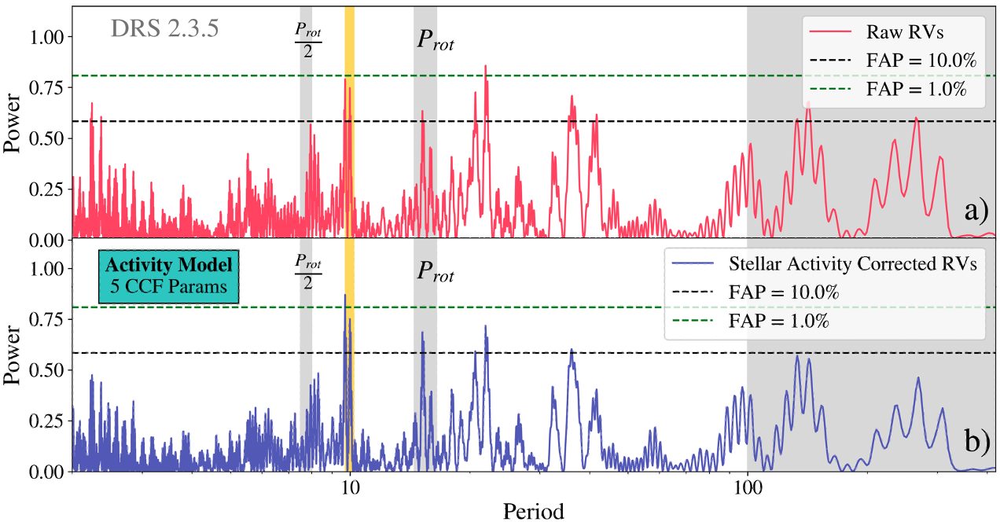

$\newcommand{\ensuremath}{}$
$\newcommand{\xspace}{}$
$\newcommand{\object}[1]{\texttt{#1}}$
$\newcommand{\farcs}{{.}''}$
$\newcommand{\farcm}{{.}'}$
$\newcommand{\arcsec}{''}$
$\newcommand{\arcmin}{'}$
$\newcommand{\ion}[2]{#1#2}$
$\newcommand{\textsc}[1]{\textrm{#1}}$
$\newcommand{\hl}[1]{\textrm{#1}}$
$\newcommand{\footnote}[1]{}$
$\newcommand{\bjdtdb}{\ensuremath{\rm{BJD_{TDB}}}}$
$\newcommand{\feh}{\ensuremath{\left[{\rm Fe}/{\rm H}\right]}}$
$\newcommand{\teff}{\ensuremath{T_{\rm eff}}}$
$\newcommand{\teq}{\ensuremath{T_{\rm eq}}}$
$\newcommand{\ecosw}{\ensuremath{e\cos{\omega_*}}}$
$\newcommand{\esinw}{\ensuremath{e\sin{\omega_*}}}$
$\newcommand{\msun}{\ensuremath{ M_\Sun}}$
$\newcommand{\rsun}{\ensuremath{ R_\Sun}}$
$\newcommand{\lsun}{\ensuremath{ L_\Sun}}$
$\newcommand{\mj}{\ensuremath{ M_{\rm J}}}$
$\newcommand{\mp}{\ensuremath{M_{p}}}$
$\newcommand{\rj}{\ensuremath{ R_{\rm J}}}$
$\newcommand{\me}{\ensuremath{ M_{\oplus}}}$
$\newcommand{\re}{\ensuremath{ R_{\oplus}}}$
$\newcommand{\fave}{\langle F \rangle}$
$\newcommand{\fluxcgs}{10^9 erg s^{-1} cm^{-2}}$
$\newcommand{\thisstar}{K2-167}$
$\newcommand{\thisplanet}{K2-167 b}$
$\newcommand{\olddrsrmsRAW}{\ensuremath{4.02}}$
$\newcommand{\olddrssigmaRAW}{\ensuremath{3.95}}$
$\newcommand{\olddrssigmaAC}{\ensuremath{2.75}}$
$\newcommand{\olddrssigmaUS}{\ensuremath{2.04}}$
$\newcommand{\newdrsrmsRAW}{\ensuremath{3.01}}$
$\newcommand{\newdrssigmaRAW}{\ensuremath{3.01}}$
$\newcommand{\newdrssigmaAC}{\ensuremath{2.78}}$
$\newcommand{\newdrssigmaUS}{\ensuremath{2.41}}$
$\newcommand{\litperiod}{\ensuremath{9.978543}}$
$\newcommand{\bonomomass}{\ensuremath{6.5_{-1.5}^{+1.6}}}$
$\newcommand{\erikamass}{\ensuremath{7.0^{+1.7}_{-1.7}}}$
$\newcommand{\calmmass}{\ensuremath{6.3_{-1.4}^{+1.4}}}$
$\newcommand{\erikaradius}{\ensuremath{2.33^{+0.17}_{-0.15}}}$
$\newcommand{\bonomoK}{\ensuremath{1.97_{-0.55}^{+1.1}}}$
$\newcommand{\erikaK}{\ensuremath{1.88^{+0.49}_{-0.48}}}$
$\newcommand{\calmK}{\ensuremath{1.94^{+0.44}_{-0.44}}}$
$\newcommand{\GenevaObservatory}{Observatoire de Genève, Université de Genève, 51 chemin des Maillettes, 1290 Versoix, Switzerland}$
$\newcommand{\kms}{\ensuremath{\rm km s^{-1}}}$
$\newcommand{\cms}{\ensuremath{\rm cm s^{-1}}}$
$\newcommand{\ms}{\ensuremath{\rm m s^{-1}}}$
$\newcommand{\TESS}{\emph{TESS}}$
$\newcommand{\Ktwo}{\emph{K2}}$
$\newcommand{\calm}{\emph{CALM}}$
$\newcommand$
$\newcommand$
$\newcommand$
$\newcommand$
$\newcommand$
$\newcommand$
$\newcommand{\thefigure}{A.\arabic{figure}}$
$\newcommand{\thetable}{A.\arabic{table}}$
$\newcommand{\thebibliography}{\DeclareRobustCommand{\VAN}[3]{##3}\VANthebibliography}$

# Characterization of $\thisplanet$ and $\rredit{CALM,}$ a new stellar activity mitigation method

<mark>Appeared on: 2024-01-24</mark> -  _20 pages, 16 figures, accepted for publication in MNRAS_

Z. L. d. Beurs, et al. -- incl., <mark>S. Zieba</mark>, <mark>L. Kreidberg</mark>

**Abstract:** We report precise radial velocity (RV) observations of HD 212657 (= $\thisstar$ ), a star shown by $\Ktwo$ to host a transiting sub-Neptune-sized planet in a 10 day orbit. Using Transiting Exoplanet Survey Satellite ( $\TESS$ ) $\redit{photometry}$ , we refined $\redit{the}$ planet parameters, especially the orbital period. We collected 74 precise RVs with the HARPS-N spectrograph between August 2015 and October 2016. Although this planet was first found $\redit{to transit}$ in 2015 and validated in 2018, excess RV scatter originally limited $\redit{mass measurements. Here,}$ we $\redit{measure}$ a mass $\redit{by}$ taking advantage of reductions in scatter from updates to the HARPS-N Data Reduction System (2.3.5) and $\redit{our}$ new activity mitigation method called CCF Activity Linear Model ( $\calm$ ) $\redit{, which}$ uses activity-induced line shape changes in the spectra without requiring timing information. Using the $\calm$ framework, we performed a joint fit with RVs and transits using EXOFASTv2 and find $M_p = $ $\calmmass$ $\me$ and $R_p = $ $\erikaradius$ $\re$ , which places $\thisplanet$ at the upper edge of the radius valley. We also find hints of a secondary companion at a $\sim$ 22 day period, but $\redit{confirmation requires additional RVs. Although characterizing lower-mass planets like \thisplanet is often impeded by stellar variability, these systems}$ especially help probe the $\redit{formation}$ physics (i.e. photoevaporation, core-powered mass loss) of the radius valley. In the future, $\redit{\calm}$ or similar techniques could be widely applied to FGK-type stars, $\redit{help}$ characterize a population of exoplanets $\redit{surrounding}$ the radius valley, and $\redit{further our understanding}$ of their formation.

**Figure 9. -** Overfitting diagnostics for stellar activity RV analysis using the new DRS (2.3.5) \bedit{HARPS-N $\Delta$CCFs}. $\re$dit{The three columns in this Figure show the $\Delta$CCFs, the weight parameters corresponding to the $\Delta$CCFs, and the $\re$dit{phase-folded} RVs for three scenarios respectively. For each of the Figures in the third column \rredit{(c, f, i)}, we provide a legend which includes the scatter of the radial velocities from the HARPS-N pipeline (raw rvs, std) in $\ms$, the scatter of the activity corrected radial velocities (corr rvs, std) in $\ms$, and the predicted semi-amplitude of the planet (planet preds, K) in $\ms$. The first two rows corresponds to two different overfitting concerns and the last row demonstrates a case where both of these concerns are addressed.}  In the first row \rredit{(a, b, c)}, we plot the $\Delta$CCFs that have not been shifted to be centered at the median velocity. Without centering the $\Delta$CCFs, the algorithm will be able to access translational shift \bedit{(i.e. \beditr{D}oppler shifts)} information and attribute potential planet signals to stellar activity signals\beditrr{, significantly attenuating their amplitude}.
    In the second row\rredit{(d, e, f)}, we show a case where the $\Delta$CCFs are shifted but the number of indexes is too large\beditrr{. T}his results in overfitting as seen in the weights plot for the second row. In the third row\rredit{(g, h, i)}, we have only fed in the $\Delta$CCF $\re$dit{indexes} that are considered significant (as described in Section $\re$f{sign_indexes}) and use the \bedit{properly} shifted $\Delta$CCFs.  (*fig:overfitting diagnostics*)

**Figure 11. -** Old DRS (3.7) Periodograms as a function of number of CCF $\re$dit{indexes} used in the stellar activity correction model. HARPS-N Raw (a) and Corrected (b) RVs in Fourier space for 5 CCF $\re$dit{indexes}. \rredit{In each panel, the 1.0\% and 10.0\% false alarm probabilities (FAP) computed using the bootstrap method are indicated with green and black dotted lines, respectively.} The long-term activity signals in panel (a) decrease in magnitude after applying the activity correction in panel (b). The suspected rotation period and half the rotation period are indicated in grey. The planet period is indicated in yellow. As we increase the number of included CCF $\re$dit{indexes} to N=15 (c) and N=25 (d), the peak corresponding to the star's rotation period ($P_{\rm rot}$) decreases significantly in magnitude after applying the stellar activity corrections and a planet signal emerges at $\litperiod$ days. (*fig:old_drs_correctedperiodogram*)

**Figure 12. -** New DRS (2.3.5) Periodograms for 5 CCF $\re$dit{indexes}. HARPS-N Raw (a) and Corrected (b) RVs in Fourier space for 5 CCF $\re$dit{indexes}. \rredit{The 1.0\% and 10.0\% false alarm probabilities (FAP) computed using the bootstrap method are indicated with green and black dotted lines, respectively.} The long-term activity signals in panel (a) decrease in magnitude after applying the activity correction in panel (b). The suspected rotation period and half the rotation period are indicated in grey. The planet period is indicated in yellow. From (a) to (b), the peak corresponding to a planet signal at $\litperiod$ days increases slightly in magnitude. (*fig:new_drs_correctedperiodogram*)

