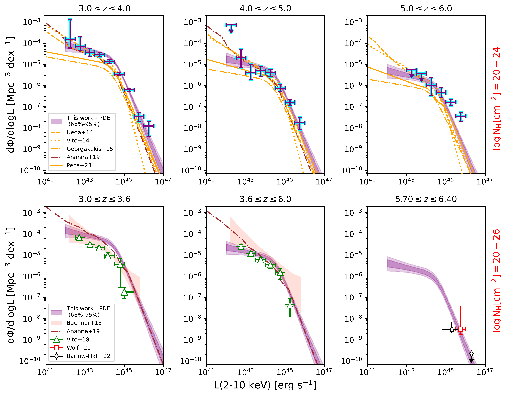
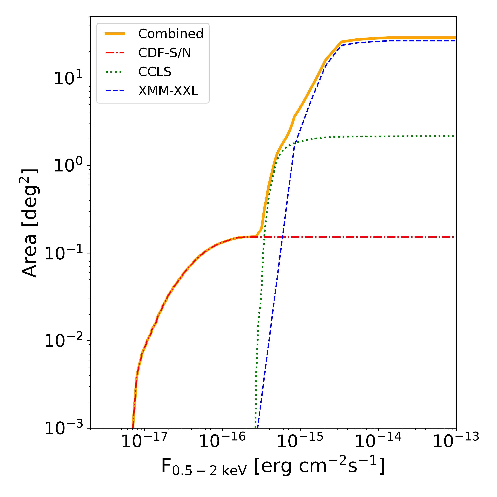

$\newcommand{\ensuremath}{}$
$\newcommand{\xspace}{}$
$\newcommand{\object}[1]{\texttt{#1}}$
$\newcommand{\farcs}{{.}''}$
$\newcommand{\farcm}{{.}'}$
$\newcommand{\arcsec}{''}$
$\newcommand{\arcmin}{'}$
$\newcommand{\ion}[2]{#1#2}$
$\newcommand{\textsc}[1]{\textrm{#1}}$
$\newcommand{\hl}[1]{\textrm{#1}}$
$\newcommand{\footnote}[1]{}$
$\newcommand{\XMM}{\textit{XMM-Newton}}$
$\newcommand{\Chandra}{\textit{Chandra}}$
$\newcommand{\La}{\mathcal{L}}$
$\newcommand{\LX}{L_\mathrm{X}}$
$\newcommand{\mnh}{N_\mathrm{H}}$
$\newcommand{\nh}{N_\mathrm{H}}$
$\newcommand{\dlog}{\mathrm{dlog}}$
$\newcommand{\pden}{{p_\mathrm{den}}}$
$\newcommand{\fabs}{f_\mathrm{abs}}$
$\newcommand{\fctk}{f_{\mathrm{CTK},r}}$
$\newcommand{\Lbol}{L_\mathrm{bol}}$

# AGN X-ray luminosity function and absorption function in the Early Universe ($3\leq z \leq 6$)

<mark>Appeared on: 2024-01-25</mark> -  _Accepted for publication in A&A. 25 pages, 15 figures (+4 in Appendix), 2 tables (+1 in Appendix)_

E. Pouliasis, et al. -- incl., <mark>M. Habouzit</mark>

**Abstract:** The X-ray luminosity function (XLF) of active galactic nuclei (AGN) offers a robust tool to study the evolution and the growth of the super-massive black-hole population over cosmic time. Owing to the limited area probed by X-ray surveys, optical surveys are routinely used to probe the accretion in the high redshift Universe $z\geq 3$ . However, optical surveys may be incomplete because they are strongly affected by dust redenning.   In this work, we derive the XLF and its evolution at high redshifts ( $z\geq 3$ ) using a large sample of AGNs selected in different fields with various areas and depths covering a wide range of luminosities. Additionally, we put the tightest yet constraints on the absorption function in this redshift regime.   In particular, we use more than 600 soft X-ray selected ( $0.5-2$ keV) high-z sources in the Chandra Deep fields, the Chandra COSMOS Legacy survey and the XMM-XXL northern field. We derive the X-ray spectral properties for all sources via spectral fitting, using a consistent technique and model. For modeling the parametric form of the XLF and the absorption function, we use a Bayesian methodology allowing us to correctly propagate the uncertainties for the observed X-ray properties of our sources and also the absorption effects.   The evolution of XLF is in agreement with a pure density evolution model similar to what is witnessed at optical wavelengths, although a luminosity dependent density evolution model cannot be securely ruled out. A large fraction ( $\sim 60 \%)$ of our sources are absorbed by column densities of $\rm N_H \geq 10^{23} cm^{-2} $ , while $\sim 17$ \% of the sources are Compton-thick. Our results favor a scenario where both the interstellar medium of the host and the AGN torus contribute to the obscuration. The derived black hole accretion rate density is roughly in agreement with the large-scale cosmological hydro-dynamical simulations, if one takes into account the results that the X-ray AGN are hosted by massive galaxies, while it differs from the one derived using JWST data. The latter could be due to the differences in the AGN and host-galaxy properties.

**Figure 14. -** The best-fitting PDE model in several redshift bins computed by integrating the XLF over redshift and column density. The purple shaded regions represent the 68\% and 95\% confidence intervals of the model, while the purple data points indicate the binned luminosity function. We compare our results with the parametric forms of the XLF derived by previous X-ray studies \citep{Ueda2014,Vito2014,Georgakakis2015,Peca2023} in the column density interval of $\log N_{\rm H} = 20-24$(upper panels). Furthermore, we present our XLF integrating over $\log N_{\rm H} = 20-26$(lower panels) to the results of \citep{Buchner2015,Vito2018,Wolf2021,BarlowHall2023}. The XLF of \citet{Buchner2015} in the first two panels are derived in the redshift range $3.2 \leq z \leq 4.0$ and $4.0 \leq z \leq 7.0$, respectively. Our PDE model at the last panel is extrapolated at z=6.05. The brown dashed-dotted lines show the predicted XLF derived by \citet{Ananna2019}. (*xlf_full*)

**Figure 17. -** Redshift evolution of the black hole accretion rate density. The shaded regions represent the 68\% and 99\% confidence intervals of the BHAD using the best-fitting PDE model. From left to right, we compare our results with previous X-ray studies \citep{Georgakakis2015,Ueda2014,Vito2018,Wolf2021,Peca2023}, with simulations \citep{Volonteri2016,Ni2022,Sijacki2015} and with the star-formation rate density scaled down by a factor of 3000 \citep{Madau2014, Harikane2022}. The black regions in the first two panels indicate the 99\% confidence interval of the BHAD adopting the bolometric correction by \citet{Lusso2012} so we can compare directly to the results of \citet{Vito2018}. The black points in the middle panel correspond to the _JWST_ results by \citet{Yang2023}. The brown dashed-dotted line shows the predicted XLF derived by \citet{Ananna2019}. (*bhad*)

**Figure 1. -** X-ray sensitivity curves presented individually for the CDF-S/N, CCLS and XMM-XXL-N fields. The total area curve is shown with the orange solid line. (*area_curves*)

