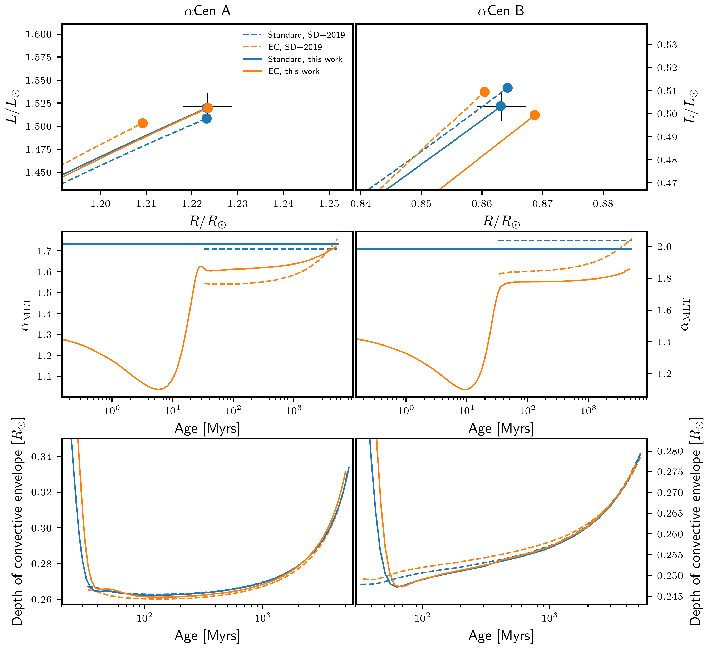

$\newcommand{\ensuremath}{}$
$\newcommand{\xspace}{}$
$\newcommand{\object}[1]{\texttt{#1}}$
$\newcommand{\farcs}{{.}''}$
$\newcommand{\farcm}{{.}'}$
$\newcommand{\arcsec}{''}$
$\newcommand{\arcmin}{'}$
$\newcommand{\ion}[2]{#1#2}$
$\newcommand{\textsc}[1]{\textrm{#1}}$
$\newcommand{\hl}[1]{\textrm{#1}}$
$\newcommand{\footnote}[1]{}$
$\newcommand{\corr}[1]{#1}$
$\newcommand$
$\newcommand$
$\newcommand$
$\newcommand$
$\newcommand{\clouis}[1]{{\bf\color{louis}#1}}$
$\newcommand{\cfederico}[1]{{\bf\color{federico}#1}}$
$\newcommand{\cmorgan}[1]{{\bf\color{morgan}#1}}$
$\newcommand{\cmjo}[1]{{\bf\color{mjo}#1}}$
$\newcommand{\caldo}[1]{{\bf\color{aldo}#1}}$
$\newcommand{\caldotwo}[1]{{\bf\color{aldotwo}#1}}$
$\newcommand{\cyveline}[1]{{\bf\color{yveline}#1}}$
$\newcommand{\chans}[1]{{\bf\color{hans}#1}}$
$\newcommand{\cjosefina}[1]{{\bf\color{josefina}#1}}$
$\newcommand{\claurent}[1]{{\bf\color{laurent}#1}}$
$\newcommand{\}{eos}$
$\newcommand{\}{amlt}$
$\newcommand{\}{afst}$
$\newcommand{\}{cesampp}$
$\newcommand{\}{stagger}$
$\newcommand{\}{cobold}$
$\newcommand{\}{acen}$
$\newcommand{\}{feh}$
$\newcommand{\}{sad}$
$\newcommand{\}{spresc}$
$\newcommand{\}{sbot}$
$\newcommand{\}{srhd}$
$\newcommand{\}{presc}$
$\newcommand{\}{ds}$
$\newcommand{\}{teff}$
$\newcommand{\}{logteff}$
$\newcommand{\}{logg}$
$\newcommand{\}{erg}$
$\newcommand{\}{K}$
$\newcommand{\}{sunit}$
$\newcommand{\}{punit}$
$\newcommand{\}{lunit}$
$\newcommand{\}{rhounit}$
$\newcommand{\}{gunit}$
$\newcommand{\}{Tunit}$
$\newcommand{\}{ttau}$

# Entropy-calibrated stellar modeling: Testing and improving the use of prescriptions for entropy of adiabatic convection

<mark>Appeared on: 2024-01-30</mark> -  _18 pages, 11 figures. Submitted to Astronomy and Astrophysics, recommended for publication with minor revisions_

L. Manchon, et al. -- incl., <mark>J. Klevas</mark>

**Abstract:** The modeling of convection is a long standing problem in stellar physics. Up-to-now, all _ad hoc_ models rely on a free parameter $\alpha$ (among others) which has no real physical justification and is therefore poorly constrained. However, a link exists between this free parameter and the entropy of the stellar adiabat. Prescriptions, derived from 3D stellar atmospheric models, are available that provide entropy as a function of stellar atmospheric parameters (effective temperature, surface gravity, chemical composition). This can provide constraints on $\alpha$ through the development of entropy-calibrated models. Several questions arise as these models are increasingly used.    Which prescription should be used? Should they be used in there original form? How do uncertainties impact entropy-calibrated models? We aim to study in detail the three existing prescriptions and determine which one should be used, and how. We implemented the entropy-calibration method into the stellar evolution code ( $\cesampp$ ) and performed comparisons with the Sun and the $\acen$ system. ${In addition, we used data from the CIFIST grid of 3D atmosphere models to evaluate the accuracy of the prescriptions.}$ Of three entropy prescriptions available, we determine which has the best functional form for reproducing the entropies of the 3D models.  However, the coefficients involved in this formulation must not be taken from the original paper, because they were calibrated against an improper set of entropies. We also demonstrate that the entropy obtained from this prescription should be corrected for the evolving chemical composition and for an entropy offset different between various EoS tables, following a precise procedure, otherwise classical parameters obtained from the models will be strongly biased. Finally, we also provide table with entropy of the adiabat of the CIFIST grid, as well as fits of these entropies. We performed a precise examination of entropy-calibrated modelling, and we gave recommendations on which adiabatic entropy prescription to use, how to correct it and how to implement the method into a stellar evolution code.

**Figure 8. -** Specific entropy differences in the adiabat $\Delta s^\presc \equiv s_{\rm RHD} - s_{\rm presc}$ between values provided by the CIFIST grid  ([Ludwig, Caffau and Steffen 2009]()) , and values predicted by the M13 prescription, Eq. \eqref{eq:s_mag}. Left column: orignal coefficients from  ([Magic, Collet and Asplund 2013]())  are used. Here, entropy from the CIFIST grid has been corrected by an offset of $0.04794\cdot\sunit$ corresponding to the entropy difference between the solar atmosphere models in the CIFIST and \stagger grids. Right columns: Same as left column but the coefficients involved in the M13 mathematical form have been re-calibrated with the CIFIST entropies. Rows: Each row displays models with a given metallicity: $\feh = +0.0$(1\st row), $-1.0$(2\nd row) and $-2.0$(3\rd row). (*fig:error_magic*)

**Figure 10. -** Top left panel: Comparison of luminosity (solid lines) and effective temperature (dashed lines), for four models computed with different choices of $T(\tau)$ relation. The displayed quantity is the relative difference of $L$ or $\teff$, with respect to model computed with the Eddington $T(\tau)$ relation: $\delta X \equiv (X_{T(\tau)} - X_{\rm Edding.}) / X_{\rm Edding.}$. Top right panel: same as top left panel but, in the case where $X \equiv \sad$, we display the absolute difference. Indeed, $\sad$ being defined up to a constant, the relative difference would have no meaning. $\Delta s^\presc$ is in the units: $\sunit$. Bottom left panel: Evolution of $\amlt$ for different $T(\tau)$ relations: Eddington (blue), [Vernazza, Avrett and Loeser (1981)]()(green) and [ and Ball (2021)]()(red). Bottom right panel: Temperature as a function of the pressure for the same four final models, at solar age. (*fig:ttau*)

**Figure 11. -** First row: Evolutionary tracks for \acen A (left panel) and \acen B (right panel) on the $R - L$ plane. Tracks computed in the present work are represented as solid lines, while the one from [ and Spada (2019)]() are drawn as dashed lines. Standard models are in blue and EC models in orange. Second row: Evolution of $\amlt$ as a function of age for the same models. Third row: Evolution of the convective envelope depth along evolution. (*fig:rl_alpha_dcz*)

