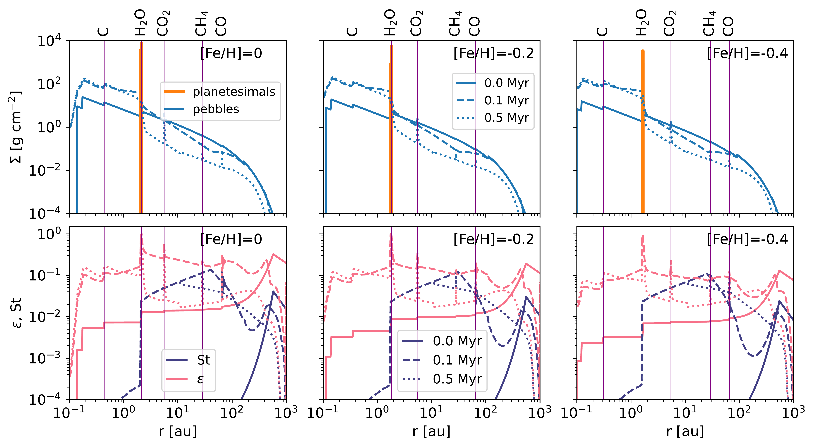

$\newcommand{\ensuremath}{}$
$\newcommand{\xspace}{}$
$\newcommand{\object}[1]{\texttt{#1}}$
$\newcommand{\farcs}{{.}''}$
$\newcommand{\farcm}{{.}'}$
$\newcommand{\arcsec}{''}$
$\newcommand{\arcmin}{'}$
$\newcommand{\ion}[2]{#1#2}$
$\newcommand{\textsc}[1]{\textrm{#1}}$
$\newcommand{\hl}[1]{\textrm{#1}}$
$\newcommand{\footnote}[1]{}$

# What stars can form planets: planetesimal formation at low metallicity

<mark>Appeared on: 2024-01-30</mark> -  _Accepted for publication in A&A_

G. Andama, <mark>J. Mah</mark>, B. Bitsch

**Abstract:** The exoplanet diversity has been linked to the disc environment in which they form, where the host star metallicity and the formation pathways play a crucial role. In the context of the core accretion paradigm, the initial stages of planet formation require the growth of dust material from micrometre size to planetesimal size bodies before core accretion can kick in. Although numerous studies have been conducted on planetesimal formation, it is still poorly understood how this process takes place in low metallicity stellar environments. In this work, we explore how planetesimals are formed in stellar environments primarily with low metallicity. We performed global 1D viscous disc evolution simulations including growth of dust particles,  evaporation and condensation of chemical species at ice lines. We followed the formation of planetesimals during  disc evolution and tested different metallicities, disc sizes and turbulent viscosity strengths.  We find that at solar and sub-solar metallicities, there is a significant enhancement in the midplane dust-to-gas mass ratios at the ice lines but this leads to planetesimal formation only at the water ice line. In our simulations, [ Fe/H ] $= -0.6$ is the lowest limit of metallicity for planetesimal formation where a few Earth masses of planetesimals could form. Our results further show that for such extreme disc environments, large discs are more conducive than small discs for forming large amounts of planetesimals at a fixed metallicity, because the pebble flux can be maintained for a longer time resulting in a longer and more efficient planetesimal formation phase. At lower metallicities, planetesimal formation  is less supported in quiescent discs compared to turbulent discs which produce relatively larger amounts of planetesimals, because the pebble flux can be maintained for a longer time. The amount of planetesimals formed at sub-solar metallicities in our simulations places a limit on core sizes that could possibly only result in the formation of super-Earths.

**Figure 6. -** _Top_: Evolution of pebble and planetesimal surface densities for a nominal $\alpha_{\rm t}=10^{-4}$ and disc size of $r_{\rm c}=100$ au and different values of disc metallicity. _Bottom_: The evolution of the Stokes numbers and the corresponding midplane dust-to-gas ratios. (*fig:fig1*)

**Figure 7. -** _Top_: Evolution of pebble and planetesimal surface densities for a nominal $\alpha_{\rm t}=10^{-3}$ and disc size of $r_{\rm c}=100$ au and different values of disc metallicity. _Bottom_: The evolution of the Stokes numbers and the corresponding midplane dust-to-gas ratios. (*fig:fig2*)

**Figure 4. -** Disc size dependency of planetesimal formation at the water ice line. The vertical dotted lines have the same meaning as in Figure \ref{fig:fig4}. (*fig:fig5*)

