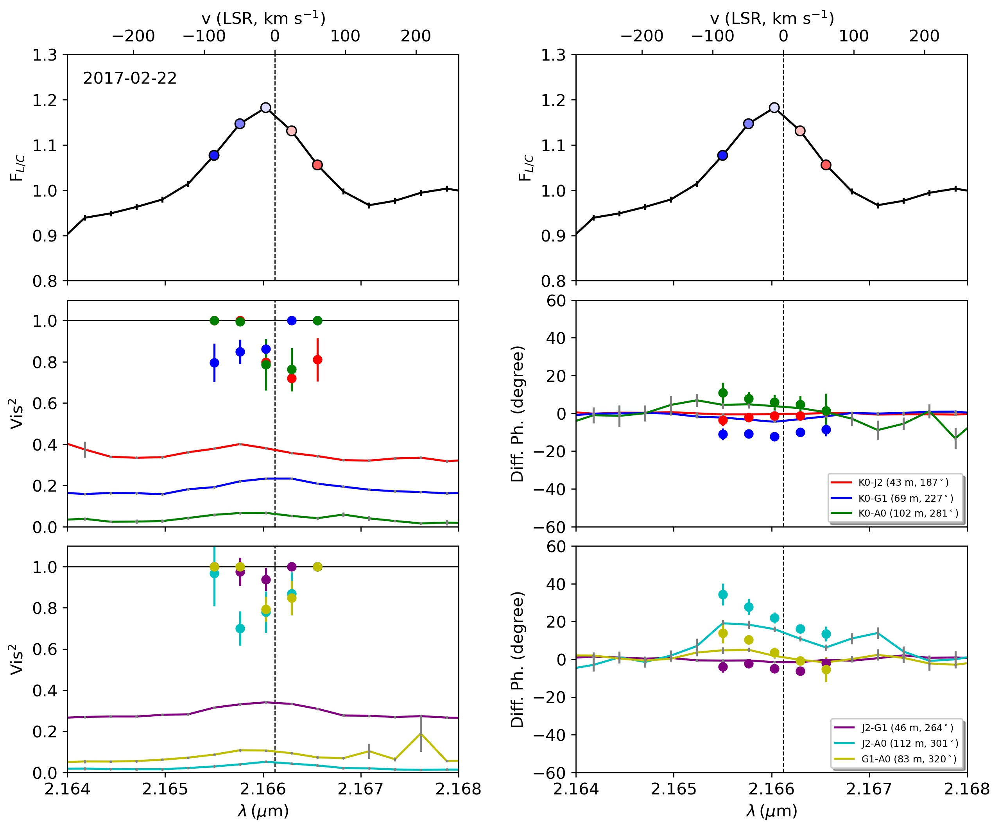
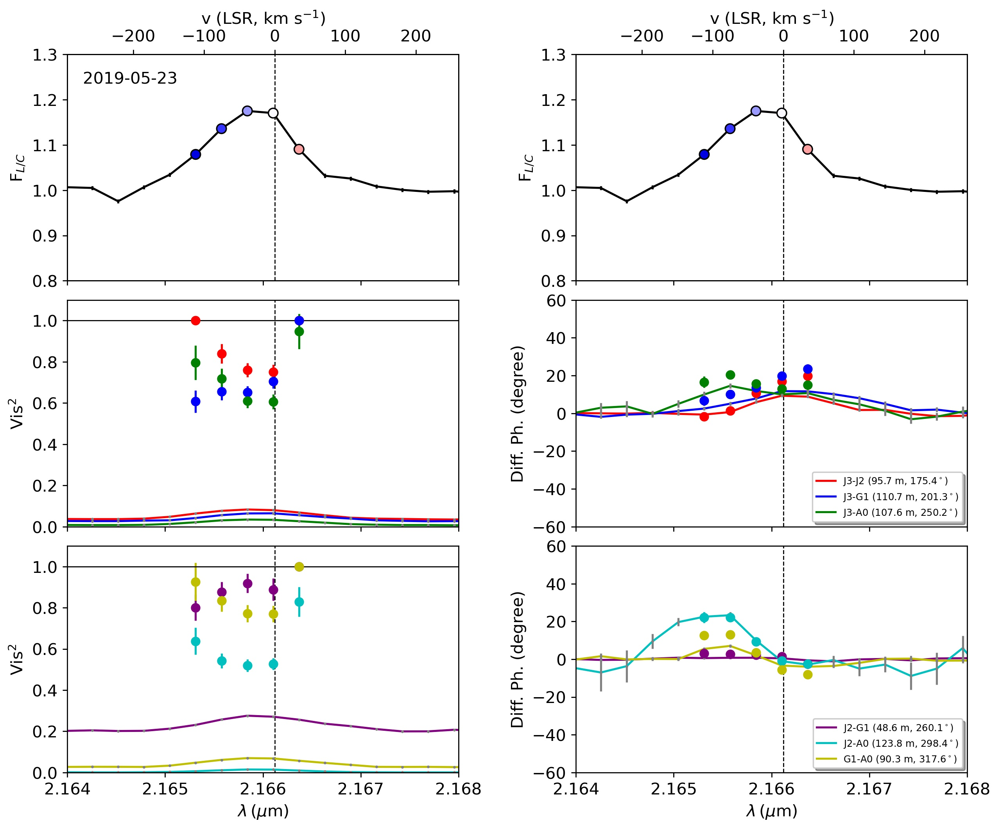

$\newcommand{\ensuremath}{}$
$\newcommand{\xspace}{}$
$\newcommand{\object}[1]{\texttt{#1}}$
$\newcommand{\farcs}{{.}''}$
$\newcommand{\farcm}{{.}'}$
$\newcommand{\arcsec}{''}$
$\newcommand{\arcmin}{'}$
$\newcommand{\ion}[2]{#1#2}$
$\newcommand{\textsc}[1]{\textrm{#1}}$
$\newcommand{\hl}[1]{\textrm{#1}}$
$\newcommand{\footnote}[1]{}$
$\newcommand{\kp}[1]{\textcolor{orange}{\textbf{Karine: } #1}}$

# The GRAVITY young stellar object survey

<mark>Appeared on: 2024-02-01</mark> -  _45 pages, 20 figures, accepted by and to be published in Astronomy & Astrophysics (A&A)_

G. Collaboration, et al. -- incl., <mark>S. Scheithauer</mark>

**Abstract:** Temporal variability in the photometric and spectroscopic properties of protoplanetary disks is common in young stellar objects. However, evidence pointing toward changes in their morphology over shorttimescales has only been found for a few sources, mainly due to a lack of high-cadence observations at high angular resolution. Understanding this type of variation could be important for our understanding of phenomena related to disk evolution. We study the morphological variability of the innermost   circumstellar environment of $\object{HD 98922}$ , focusing on its dust and gas content. Multi-epoch observations of $\object{HD 98922}$ at milliarcsecond resolution with VLTI/GRAVITY in the K-band at low (R=20) and high (R=4000) spectral resolution are combined with VLTI/PIONIER archival data covering a total time span of 11 years. We interpret the interferometric visibilities and spectral energy distribution with geometrical models and through radiative transfer techniques using the code MCMax. We investigated high-spectral-resolution quantities (visibilities and differential phases)  to obtain information on the properties of the HI Brackett- $\gamma$ (Br $\gamma$ )-line-emitting region. Comparing observations taken with similar _(u,$\varv$)_ plane coverage, we find that the squared visibilities do not vary significantly, whereas we find strong variability in the closure phases, suggesting temporal variations in the asymmetric brightness distribution associated to the disk.   Our observations are best fitted by a model of a crescent-like asymmetric dust feature located at $\sim$ 1 au and accounting for $\sim$ 70 \% of the near-infrared (NIR) emission. The feature has an almost constant magnitude and orbits the central star with a possible sub-Keplerian period of $\sim$ 12 months, although a 9 month period is another, albeit less probable, solution. The radiative transfer models show that the emission originates from a small amount of carbon-rich ( $25\%$ ) silicates, or quantum-heated particles located in a low-density region. Among different possible scenarios, we favor hydrodynamical instabilities in the inner disk that can create a large vortex.   The high spectral resolution differential phases in the Br $\gamma$ line show that the hot-gas compact component is offset from the star and in some cases is located between the star and the crescent feature. The scale of the emission does not favor magnetospheric accretion as a driving mechanism. The scenario of an asymmetric disk wind or a massive accreting substellar or planetary companion is discussed. With this unique observational data set for $\object{HD 98922}$ , we reveal morphological variability in the innermost 2 au of its disk region. This property is possibly common to many other protoplanetary disks, but is not commonly observed due to a lack of high-cadence observation. It is therefore important to pursue this approach with other sources for which an extended dataset with PIONIER, GRAVITY, and possibly MATISSE is available.

**Figure 16. -** $\object${HD 98922} GRAVITY SC data for the different epochs. For each epoch, top plots show the wavelength-calibrated and continuum-normalized spectrum, left plots show the total squared visibilities, and right plots show the total differential phases. Circles represent the pure-line quantities. Colors refer to the different baselines. (*fig:GRAVITY-SC-Data*)

**Figure 6. -** Peak-normalized GRAVITY (top row) and PIONIER (bottom row) continuum model images. The dashed white lines represent the $\pm$3$\sigma$ uncertainty on the PA of the azimuthal modulation.
The central object is not displayed but is marked with a star to enhance the circumstellar emission. North is up, east is to the left.
See Appendix \ref{sec:visualisation} for the full data set. (*fig:Continuum-imgs*)

**Figure 8. -** Radiative transfer modeling corresponding to Table \ref{tab:RT-BestModel}. The top left panel shows the SED for Model CS, with the blue dashed line representing the stellar black-body function and the red line showing the modeled total emission. The black bars represent the photometric data. The top right panel shows the derived dust surface density profile as a function of the distance from the star. The bottom left plot shows the dust density structure, where the black dashed line represents the $\tau$$=$ 1 surface at 2.2 $\mu$m, and the red lines represent, from left to right and for both components, the density contours at $10^{-15}$, $10^{-16}$, $10^{-17}$, and $10^{-18}$ g cm$^{-3}$, respectively. The bottom right plot shows the dust temperature structure, where the black lines represent, from left to right, the isothermal contours at 2300, 2000, 1700, 1500, and 1300 K, respectively.
     (*fig:RT-BestModel*)

