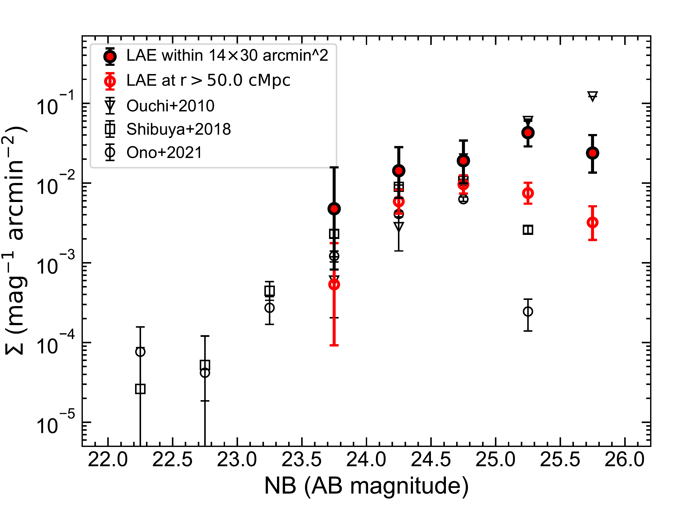
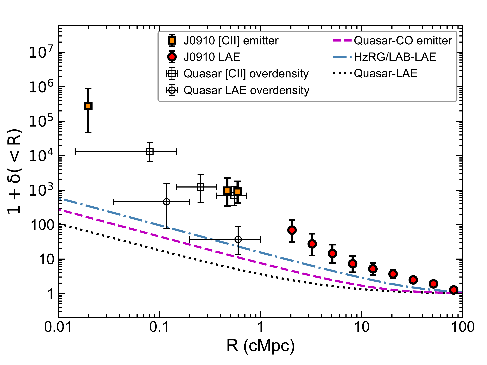

$\newcommand{\ensuremath}{}$
$\newcommand{\xspace}{}$
$\newcommand{\object}[1]{\texttt{#1}}$
$\newcommand{\farcs}{{.}''}$
$\newcommand{\farcm}{{.}'}$
$\newcommand{\arcsec}{''}$
$\newcommand{\arcmin}{'}$
$\newcommand{\ion}[2]{#1#2}$
$\newcommand{\textsc}[1]{\textrm{#1}}$
$\newcommand{\hl}[1]{\textrm{#1}}$
$\newcommand{\footnote}[1]{}$
$\newcommand{\url}[1]{\href{#1}{#1}}$
$\newcommand{\dodoi}[1]{doi:~\href{http://doi.org/#1}{\nolinkurl{#1}}}$
$\newcommand{\doeprint}[1]{\href{http://ascl.net/#1}{\nolinkurl{http://ascl.net/#1}}}$
$\newcommand{\doarXiv}[1]{\href{https://arxiv.org/abs/#1}{\nolinkurl{https://arxiv.org/abs/#1}}}$
$\newcommand{\}{natexlab}$

# A Massive Protocluster Anchored by a Luminous Quasar at $z=6.63$

<mark>Appeared on: 2024-02-06</mark> -  _Accepted for publication in ApJL_

F. Wang, et al. -- incl., <mark>E. Bañados</mark>, <mark>S. Bosman</mark>, <mark>F. Walter</mark>

**Abstract:** Protoclusters, the progenitors of galaxy clusters, trace large scale structures in the early Universe and are important to our understanding of structure formation and galaxy evolution. To date, only a handful of protoclusters have been identified in the Epoch of Reionization (EoR). As one of the rarest populations in the early Universe, distant quasars that host active supermassive black holes are thought to reside in the most massive dark matter halos at that cosmic epoch, and could thus potentially pinpoint some of the earliest protoclusters. In this letter, we report the discovery of a massive protocluster around a luminous quasar at $z=6.63$ . This protocluster is anchored by the quasar, and includes three [ $\ion{C}{2}$ ] emitters at $z\sim6.63$ , 12 spectroscopically confirmed Ly $\alpha$ emitters (LAEs) at $6.54<z\le6.64$ , and a large number of narrow-band imaging selected LAE candidates at the same redshift. This structure has an overall overdensity of $\delta=3.3^{+1.1}_{-0.9}$ within $\sim35\times74$ cMpc $^2$ on the skyand an extreme overdensity of $\delta>30$ in its central region (i.e., $R\lesssim2$ cMpc). We estimate that this protocluster will collapse into a galaxy cluster with a mass of $6.9^{+1.2}_{-1.4}\times10^{15} M_\odot$ at the current epoch, more massive than the most massive clusters known in the local Universe such as Coma. In the quasar vicinity, we discover a double-peaked LAE which implies that the quasar has a UV lifetime greater than 0.8 Myrs and has already ionized its surrounding intergalactic medium.

**Figure 2. -** \small** a,** Large scale overdensity of LAEs around quasar J0910--0414.
The background image is HSC $z$-band image.
The red dot denotes the position of the quasar.
The blue dots represent LAE candidates identified from deep Subaru imaging,
the green dots represent spectroscopically confirmed LAEs at $z>6.5$,
and the orange point represents a spectroscopically confirmed low-$z$ galaxy.
The overdensity of LAEs within the yellow box (14$\times$30 arcmin$^2$, or $\sim35\times74$ cMpc$^2$) is $\delta=4.3^{+1.1}_{-0.9}$.
The colored contours are overdensity isolines of LAEs which were estimated using a quartic kernel and a grid size of 1 arcmin. The blue, light blue, pink, and red lines denote
overdensity $\delta=3, 4, 5,$ and $6$, respectively.
The black dashed and solid lines represent $r=50$ cMpc (at $z=6.63$) and $r=40'$($\sim 99$ cMpc at $z=6.63$), respectively. The average LAE surface density was estimated using galaxies located between these two lines.
** b,** Small scale overdensity of [$\ion${C}{2}] emitting galaxies identified from ALMA observations.
** c,**
The zoom-in [$\ion${C}{2}] flux integrated map of the quasar host galaxy and a satellite galaxy (C) with [$\ion${C}{2}] emission.
 (*fig:map*)

**Figure 4. -** \small**Left,**
 Surface density of LAE candidates as a function of narrow band magnitude.
 The density of LAE in the central $\sim14\times30$ arcmin$^2$ region (solid red points) is $4.3^{+1.1}_{-0.9}$ times higher than that measured in the outskirt ($r>50  {\rm cMpc}$) of our HSC field and that measured in other LAE surveys \citep{Ouchi10, Shibuya18, Ono21}.
**Right,**
Cumulative overdensity profile of galaxies in quasar fields. The orange squares and red dots denote the overdensity profiles measured in J0910--0414 field for [$\ion${C}{2}] emitters and LAEs, respectively. The black open squares and open circles denote the overdensity profiles of [$\ion${C}{2}] emitters and LAEs measured from three quasar fields with [$\ion${C}{2}] companion galaxies.
The black dotted line represents the expected overdensity profile of LAEs in quasar fields \citep{Shen07,Ouchi18,Garcia19}. The magenta dashed line denotes the exptected overdensity profile of CO emitters in quasar fields \citep{Garcia22}. The blue dot-dashed line shows the expected overdensity profile of LAEs in average protocluster fields \citep{Hennawi15}.
 (*fig:density*)

**Figure 1. -** **A double peaked LAE identified in the highly ionized quasar vicinity.**
The red asterisk indicates the position of the quasar while the black circle highlight the relative position of the LAE-11 to the quasar.
The black line shows the spectrum of the LAE and the gray line denotes the error vector.
LAE-11 shows a widely separated double-peaked $\rm Ly\alpha$ line. The detection of the blue peak of the double peaked Ly$\alpha$ line in this galaxy indicates that the strong quasar radiation has ionized its vicinity.
 (*fig:escape*)

