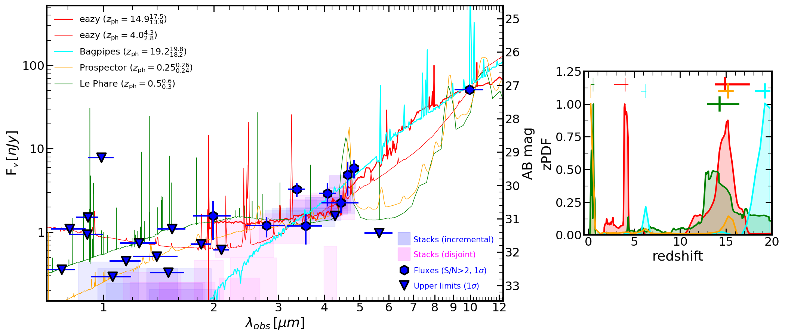

$\newcommand{\ensuremath}{}$
$\newcommand{\xspace}{}$
$\newcommand{\object}[1]{\texttt{#1}}$
$\newcommand{\farcs}{{.}''}$
$\newcommand{\farcm}{{.}'}$
$\newcommand{\arcsec}{''}$
$\newcommand{\arcmin}{'}$
$\newcommand{\ion}[2]{#1#2}$
$\newcommand{\textsc}[1]{\textrm{#1}}$
$\newcommand{\hl}[1]{\textrm{#1}}$
$\newcommand{\footnote}[1]{}$
$\newcommand{\vdag}{(v)^\dagger}$
$\newcommand$
$\newcommand$

# A NIRCam-dark galaxy detected with the MIRI/F1000W filter in the MIDIS/JADES Hubble Ultra Deep Field

<mark>Appeared on: 2024-02-28</mark> -  _Submitted to ApJL, comments welcome_

P. G. Pérez-González, et al. -- incl., <mark>L. Boogaard</mark>, <mark>F. Walter</mark>

**Abstract:** We report the discovery of $_ Cerberus_$ , an extremely red object detected with the MIRI Deep Imaging Survey (MIDIS) observations in the F1000W filter of the Hubble Ultra Deep Field. The object is detected at $S/N\sim6$ , with $\mathrm{F1000W}\sim27$ mag, and it is extremely faint in both the NIRCam data gathered by the JWST Advanced Deep Extragalactic Survey, JADES, with $\sim$ 30.5 mag $5\sigma$ upper limits in individual bands, as well as in the MIDIS F560W ultra deep data ( $\sim$ 29 mag, $5\sigma$ ). Analyzing the spectral energy distribution built with individual (low $S/N$ ) optical-to-mid-infrared filters and ( $S/N\sim5$ ) stacks, we discuss the possible nature of this red NIRCam-dark source using a battery of codes. We discard the possibility of $_ Cerberus_$ being a Solar System body based on the $<0\farcs016$ proper motion in the 1-year apart JADES and MIDIS observations. A sub-stellar Galactic nature is deemed unlikely, given that the $_ Cerberus'_$ relatively flat NIRCam-to-NIRCam and very red NIRCam-to-MIRI flux ratios are not consistent with any brown dwarf model. The extragalactic nature of $_ Cerberus_$ offers 3 possibilities: (1) A $z\sim0.4$ galaxy with strong emission from polycyclic aromatic hydrocarbons; the very low inferred stellar mass, $\mathrm{M}_\star=10^{5-6}$ M $_\odot$ , makes this possibility highly improbable. (2) A dusty galaxy at $z\sim4$ with an inferred stellar mass $\mathrm{M}_\star\sim10^{8}$ M $_\odot$ . (3) A galaxy with observational properties similar to those of the reddest little red dots discovered around $z\sim7$ , but $_ Cerberus_$ lying at $z\sim15$ , presenting a spectral energy distribution in the rest-frame optical dominated by emission from a dusty torus or a dusty starburst.

**Figure 3. -** In the top row, we show postage stamps of _ Cerberus_ in all NIRCam bands from the JADES DR2  ([Eisenstein, Johnson and Robertson 2023]()) . The second row shows the same stamps but convolved with a 2-pixel radius tophat filter. The third row shows incremental stacks of NIRCam filters, starting from the reddest two bands (F480M and F460M) and adding one band at a time, down to F210M. The fourth row shows similar stacks, but avoiding F460M, which presents an artifact (see main text for details). The fifth row shows stacks starting from the bluest bands (blue\_stack01 including F090W and F115W) and adding the next filter in subsequent images. All postage stamps are 1$\arcsec$$\times$1$\arcsec$, with the source marked with a circle of radius 0$\farcs$2. Green circles show the PSF FWHM (including the tophat filter). (*fig:stamps*)

**Figure 6. -** Detailed analysis of the spectral energy distribution of _ Cerberus_ for the main redshift solutions. The symbols are the same as described in Figure \ref{fig:photoz}. We provide best-fitting models provided by different codes that include both stellar and AGN emission.
The top-left panel shows the best-fitting brown dwarf template from the ATMO2020++ models, for a Y-type dwarf with an effective temperature of $\sim 300$K at a distance of $\sim 300$ pc.
The rest of the panels show results for $z=0.4$(top-right), $z=3.5$(bottom-left), and $z=15$(bottom-right). Main physical properties inferred with the modeling of the spectral energy distributions assuming an extragalactic origin are provided in Table \ref{tab:sed_properties}. (*fig:sps*)

**Figure 5. -** _ Left:_ Spectral energy distribution of _ Cerberus_. Dots show flux measurements with $S/N>2$ for individual NIRCam and MIRI bands (filter widths shown as horizontal bars), triangles depict 1$\sigma$ upper limits. Shaded regions stand for flux measurements and filter widths for NIRCam stacks in the LW (actual $S/N>5$ measurements in most stacks) and SW (upper limits in all of them) channels. Two sets of NIRCam stacks are considered: two incremental stacks starting from the red and blue ends, respectively, and stopping at $\sim$2 $\mu$m; and 4 disjoint stacks, combining filters in groups of 2, 3, 4, and 5, with no filter in common between each set. The spectral energy distribution has been fitted with a battery of codes to estimate a photometric redshift. Most probable values and uncertainties are provided in the figure (for {\sc eazy} we provide 2 solutions since their peak probabilities are very similar), with low-z solutions plotted as thin lines, and high-z models as thick lines. _ Right:_ Photometric redshift probability distribution function for the modeling shown in the left panel. All distributions are normalized to unity at the peak. We show the main solutions, including all values provided in the spectral energy distribution plot and also secondary solutions at $z<10$ and $z>10$. (*fig:photoz*)

