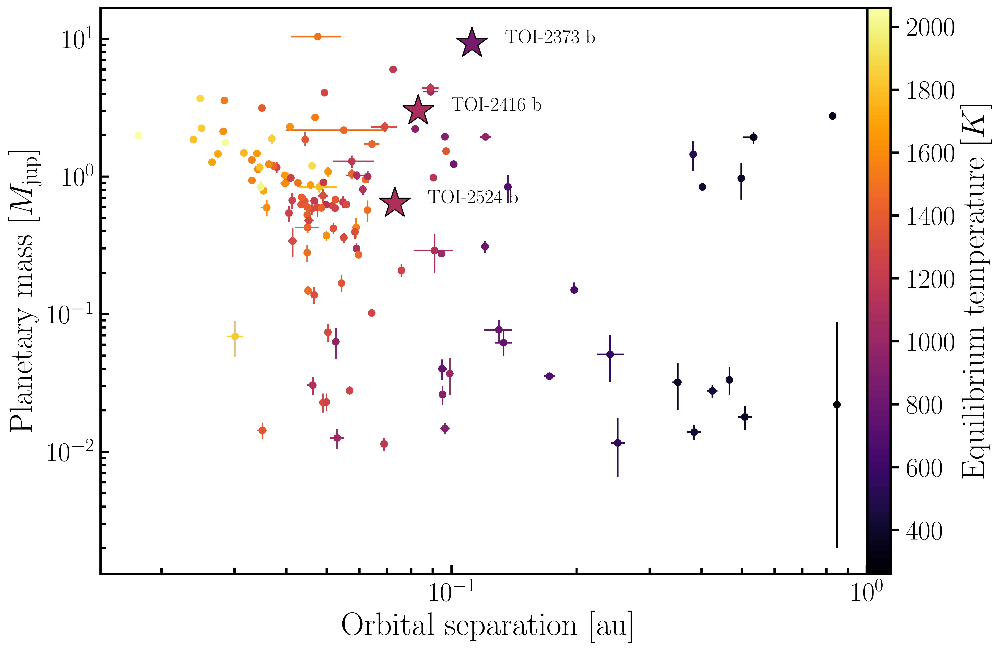

 marks the moving standard deviation of the their synthetic planets. (*fig:mass-radius*)

**Figure 1. -** Mass-separation diagram for planets around solar-analog stars (definition according to [Lehmann, et. al (2022)](), see \ref{sec:Introduction}). The new planets TOI-2373 b, TOI-2416 b, and TOI-2524 b are shown as big stars. (*fig:mass-sep*)

