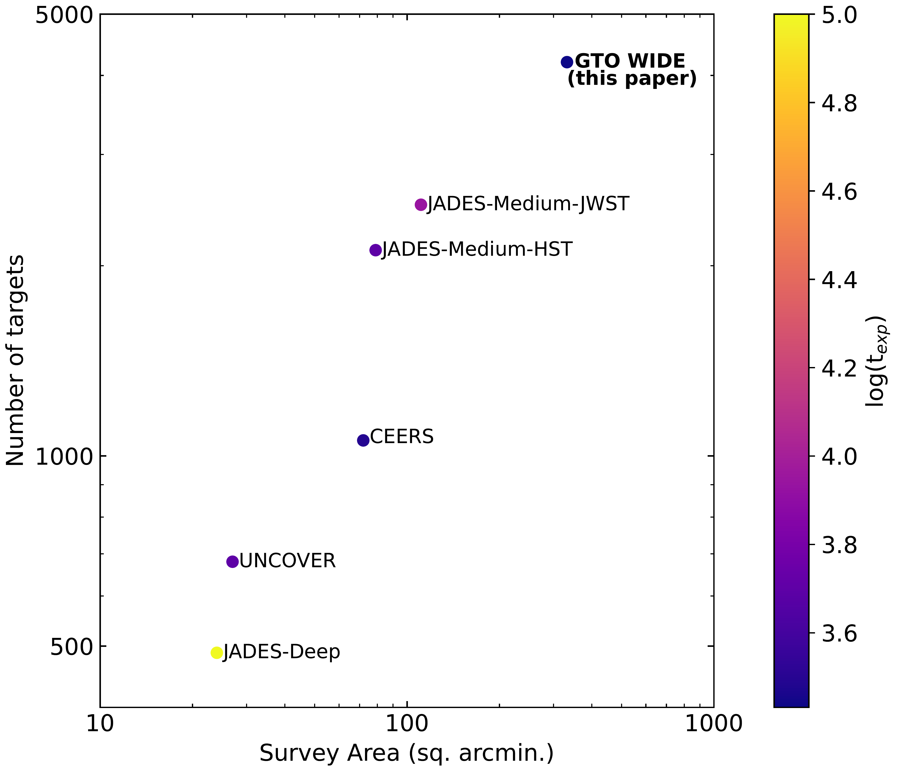
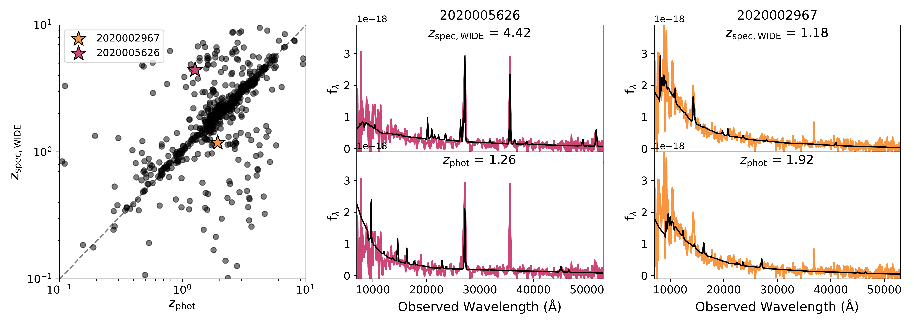

$\newcommand{\ensuremath}{}$
$\newcommand{\xspace}{}$
$\newcommand{\object}[1]{\texttt{#1}}$
$\newcommand{\farcs}{{.}''}$
$\newcommand{\farcm}{{.}'}$
$\newcommand{\arcsec}{''}$
$\newcommand{\arcmin}{'}$
$\newcommand{\ion}[2]{#1#2}$
$\newcommand{\textsc}[1]{\textrm{#1}}$
$\newcommand{\hl}[1]{\textrm{#1}}$
$\newcommand{\footnote}[1]{}$
$\newcommand{\kms}{\rm km s^{-1}}$
$\newcommand{\ha}{H\alpha}$
$\newcommand{\hb}{H\beta}$
$\newcommand{\oiii}{[O III]}$
$\newcommand{\nii}{[N II]}$
$\newcommand{\oii}{[O II]}$
$\newcommand{\micron}{\rm \mu m}$

# The NIRSpec Wide GTO Survey

<mark>Appeared on: 2024-03-11</mark> -  _14 pages, 11 figures; Submitted to A&A_

M. V. Maseda, et al. -- incl., <mark>A. d. Graaff</mark>, <mark>H.-W. Rix</mark>, <mark>U. Dudzeviciute</mark>

**Abstract:** The Near-infrared Spectrograph (NIRSpec) on the James Webb Space Telescope is uniquely suited to studying galaxies in the distant Universe with its combination of multi-object capabilities and sensitivity over a large range in wavelength ( $0.6-5.3 \micron$ ). Here we present the NIRSpec Wide survey, part of the NIRSpec Instrument Science Team's Guaranteed Time Observations, using NIRSpec's microshutter array to obtain spectra of more than 3200 galaxies at $z>1$ at both low- and high-resolution ( $R\approx100$ and 2700) for a total of 105 hours.  With 31 pointings covering $\approx$ 320 arcmin $^2$ across the five CANDELS fields with exquisite ancillary photometry from the Hubble Space Telescope, the NIRSpec Wide survey represents a fast and efficient way of probing galaxies in the early Universe.  Pointing centers are determined to maximize the observability of the rarest, high-value sources. Subsequently, the microshutter configurations are optimized to observe the maximum number of "census" galaxies with a selection function based primarily on HST/F160W magnitude, photometric/slitless grism redshift, and predicted $\ha$ flux tracing the bulk of the galaxy population at cosmic noon ( $z_{\rm med}=2.0$ ).  We present details on the survey strategy, the target selection, an outline of the motivating science cases, and discuss upcoming public data releases to the community.

**Figure 1. -** Area covered by the NIRSpec MSA versus total number of targets observed in the survey for various Cycle 1 programs (limited to PRISM observations).  While amongst the shallowest in terms of (PRISM) exposure time, the NIRSpec "Wide" GTO survey covers the largest area and targets the most individual galaxies.  In addition, the Wide survey is spread over five non-contiguous fields in order to maximize the chances of observing cosmologically-rare targets. (*fig:survey*)

**Figure 2. -** Empirically-derived emission line (top) and continuum (bottom) sensitivities for the Wide survey as a function of disperser and observed wavelength.  The solid lines are the 5-$\sigma$ sensitivities for a centered point source, while the dashed lines are the 5-$\sigma$ sensitivities for an "extended" source, namely a centered object with a Sersic index $n=1$ and a half-light radius of 0$\farcs$3 \cite[a typical star-forming galaxy at $z\approx$1.5;][]{Wel:2014}. (*fig:sens*)

**Figure 7. -** (Left) Photometric redshifts (from \texttt{EAzY}) versus Wide spectroscopic redshifts for targets in the AEGIS field.  While many of the objects had accurate photo-$z$ estimates (70\% have $\Delta$z/(1+$z$) values below 0.25), there is a significant benefit to obtaining precise redshifts from spectroscopy for many of our primary science cases.  (Center and Right) Example PRISM spectra of objects with a discrepancy between $z_{\mathrm{phot}}$ and $z_{\mathrm{spec}}$.
 The black line shows the best-fitting \texttt{EAzY} template at each of the redshifts, where the Wide-based spectroscopic redshifts are unequivocally correct. (*fig:zphotzspec*)

