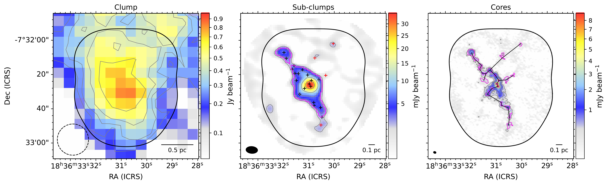
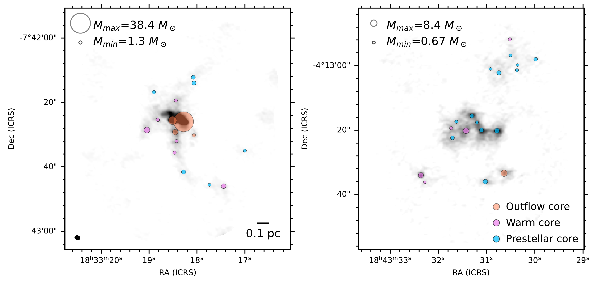

$\newcommand{\ensuremath}{}$
$\newcommand{\xspace}{}$
$\newcommand{\object}[1]{\texttt{#1}}$
$\newcommand{\farcs}{{.}''}$
$\newcommand{\farcm}{{.}'}$
$\newcommand{\arcsec}{''}$
$\newcommand{\arcmin}{'}$
$\newcommand{\ion}[2]{#1#2}$
$\newcommand{\textsc}[1]{\textrm{#1}}$
$\newcommand{\hl}[1]{\textrm{#1}}$
$\newcommand{\footnote}[1]{}$
$\newcommand{\xmark}{\ding{55}}$
$\newcommand{\red}[1]{\textcolor{red}{#1}}$
$\newcommand{\kms}{\mbox{km s^{-1}}}$
$\newcommand{\x}{\mbox{\times}}$
$\newcommand{\Msun}{\mbox{M_{\odot}}}$
$\newcommand{\Lsun}{\mbox{L_{\odot}}}$

# The ALMA Survey of 70 $\mu$m Dark High-mass Clumps in Early Stages (ASHES). XI. \\Statistical Study of Early Fragmentation

<mark>Appeared on: 2024-03-13</mark> -  _Accepted for Publication in ApJ. 19 pages, 7 figures, 4 tables_

K. Morii, et al. -- incl., <mark>S. Li</mark>, <mark>H. Beuther</mark>

**Abstract:** Fragmentation during the early stages of high-mass star formation is crucial for understanding the formation of high-mass clusters.We investigated fragmentation within thirty-nine high-mass star-forming clumps as part of the Atacama Large Millimeter/submillimeter Array (ALMA) Survey of 70 $\mu$ m Dark High-mass Clumps in Early Stages (ASHES).Considering projection effects, we have estimated core separations for 839 cores identified from the continuum emission and found mean values between 0.08 and 0.32 pc within each clump.We find compatibility of the observed core separations and masses with the thermal Jeans length and mass, respectively.We also present sub-clump structures revealed by the 7 m-array continuum emission.Comparison of the Jeans parameters using clump and sub-clump densities with the separation and masses of gravitationally bound cores suggests that they can be explained by clump fragmentation, implying the simultaneous formation of sub-clumps and cores within rather than a step-by-step hierarchical fragmentation.The number of cores in each clump positively correlates with the clump surface density and the number expected from the thermal Jeans fragmentation.We also find that the higher the fraction of protostellar cores, the larger the dynamic range of the core mass, implying that the cores are growing in mass as the clump evolves.The ASHES sample exhibits various fragmentation patterns: aligned, scattered, clustered, and sub-clustered.Using the $\mathcal{Q}$ -parameter, which can help to distinguish between centrally condensed and subclustered spatial core distributions, we finally find that in the early evolutionary stages of high-mass star formation, cores tend to follow a subclustered distribution.

**Figure 1. -** Continuum images for G024.524-00.139 obtained by (left) a single-dish telescope  ([Schuller, Menten and Contreras 2009]()) , and the gray circles correspond to sub-clumps.
    The three different colors of the crosses indicate the gravitational states of cores; bound cores (red), unbound cores (blue), and cores without detections of dense gas tracers such as $N_2$D$^+$ and DCO$^+$(gray).
    The blue line shows thermal Jeans fragmentation with $T$ = 15 K and $n(\mathrm{H_2})$ = [10$^2$, 10$^6$] cm$^{-3}$, and the blue shaded region corresponds to the same density range but with T = [10, 30] K.
    The five squares correspond to $n(\mathrm{H_2})$ of 10$^2$, 10$^3$, 10$^4$, 10$^5$, and 10$^6$ cm$^{-3}$ from right to left.
    The green-shaded region shows turbulent Jeans fragmentation to the same density and temperature range but $\sigma$ = [0.8, 2.7] km s$^{-1}$. (*fig:M-nns*)

**Figure 6. -** ALMA 1.3 mm continuum image of (left) G024.010+00.489  and (right) G028.273--00.167. The circle size represents the core mass, and the position is centered at the continuum peak of each core. The three different colors have meanings the same as Figure \ref{fig:M-nns}.  (*fig:cont_massdyn*)

