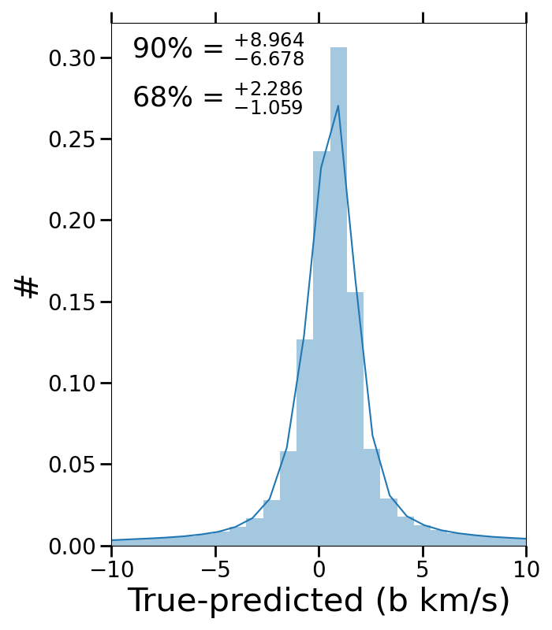

$\newcommand{\ensuremath}{}$
$\newcommand{\xspace}{}$
$\newcommand{\object}[1]{\texttt{#1}}$
$\newcommand{\farcs}{{.}''}$
$\newcommand{\farcm}{{.}'}$
$\newcommand{\arcsec}{''}$
$\newcommand{\arcmin}{'}$
$\newcommand{\ion}[2]{#1#2}$
$\newcommand{\textsc}[1]{\textrm{#1}}$
$\newcommand{\hl}[1]{\textrm{#1}}$
$\newcommand{\footnote}[1]{}$
$\newcommand{\lya}{Ly\alpha }$
$\newcommand{\lyb}{Ly\beta }$
$\newcommand{\h2}{H_2}$
$\newcommand{\hi}{H{\sc i}}$
$\newcommand{\ovi}{O~{\sc vi}~ }$
$\newcommand{\ovii}{O~{\sc vii}~ }$
$\newcommand{\oviii}{O~{\sc viii}~ }$
$\newcommand{\nv}{N~{\sc v}~}$
$\newcommand{\niii}{N~{\sc iii}\lambda989~ }$
$\newcommand{\ovia}{O~{\sc vi}\lambda1031~ }$
$\newcommand{\ovib}{O~{\sc vi}\lambda1037~ }$
$\newcommand{\oviab}{O~{\sc vi}\lambda\lambda1031,1037~ }$
$\newcommand{\cii}{C~{\sc ii}~}$
$\newcommand{\ciis}{C~{\sc ii*}~}$
$\newcommand{\mgii}{Mg~{\sc ii}~}$
$\newcommand{\civ}{C~{\sc iv}~}$
$\newcommand{\civa}{C~{\sc iv}\lambda1548~}$
$\newcommand{\tcr}{\textcolor{red}}$
$\newcommand{\tcg}{\textcolor{brown}}$
$\newcommand{\kms}{km s^{-1}~}$
$\newcommand{\cms}{cm^2~}$

# FLAME: Fitting $\lya$ Absorption lines using Machine learning

<mark>Appeared on: 2024-03-13</mark> -  _Submitted to A&A_

P. Jalan, V. Khaire, M. Vivek, <mark>P. Gaikwad</mark>

**Abstract:** We introduce FLAME, a machine learning algorithm designed to fit Voigt profiles to H ${\sc i}$ Lyman-alpha ( $\lya$ ) absorption lines using deep convolutional neural networks. FLAME integrates two algorithms: the first determines the number of components required to fit $\lya$ absorption lines, and the second calculates the Doppler parameter $b$ , the H ${\sc i}$ column density N $_{\rm HI}$ , and the velocity separation of individual components. For the current version of FLAME, we trained it on low-redshift $\lya$ forests observed with the Far Ultraviolet gratings of the Cosmic Origin Spectrograph (COS) aboard the Hubble Space Telescope (HST). Drawing on this data, we trained FLAME on $\sim$ $10^6$ simulated Voigt profiles, forward-modeled to mimic $\lya$ absorption lines observed with HST-COS, to classify lines as either single or double components and then determine Voigt profile fitting parameters.FLAME shows impressive accuracy on the simulated data by identifying more than 98 \% (90 \% ) of single (double) component lines. It determines $b$ values within $\approx \pm{8} (15)$ km s $^{-1}$ and log $N_{\rm HI}/ {\rm cm}^2$ values within $\approx \pm 0.3 (0.8)$ for 90 \% of the single (double) component lines. However, when applied to real data, FLAME's component classification accuracy drops by $\sim$ 10 \% . Despite this, there is a reasonable agreement between the $b$ and N $_{\rm HI}$ distributions obtained from traditional Voigt profile fitting methods and FLAME's predictions. Our mock HST-COS data analysis, designed to emulate real data parameters, demonstrated that FLAME could achieve consistent accuracy comparable to its performance with simulated data. This finding suggests that the drop in FLAME's accuracy when used on real data primarily arises from the difficulty of replicating the full complexity of real data in the training sample. Nevertheless, FLAME's performance validates the use of machine learning for Voigt profile fitting, underscoring the significant potential of machine learning for detailed analysis of absorption lines.

**Figure 4. -** The upper panel compares the actual and predicted values for the two parameters, $b$ and N. The lower panel exhibits the distribution of the differences between the predicted and true values, with markers for the 90\% and 68\% percentiles. (*fig-result2*)

**Figure 15. -** The histograms show the distribution of $b$ and log N for a single absorption line estimated by the CNN model in this work (green) overplotted with distributions from \citepalias{Danforth2016}(purple) and  \citetalias{Prakash2017}(red). The distributions for the corresponding mocks are shown in dotted lines. (*fig-result2_real1*)

**Figure 2. -** Confusion matrix for the predictions for the number of absorption lines using the CNN (as shown in Fig. \ref{fig-classify_network}). The CNN was trained on 1.6 million lines and tested on 400K samples, with an equal number of single and double lines. We find the Sensitivity=97.47\%, Specificity=89.92\%, Precision=89.64\% and Negative Predictive Value=97.55\%. (*fig-confusion_matrix*)

