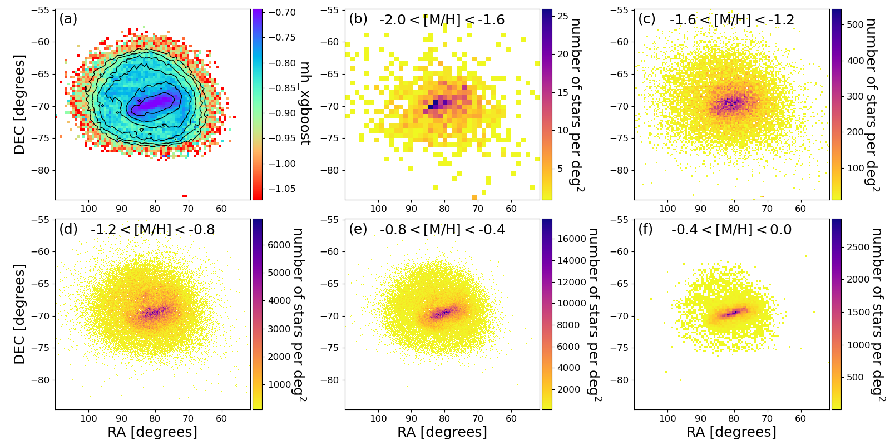
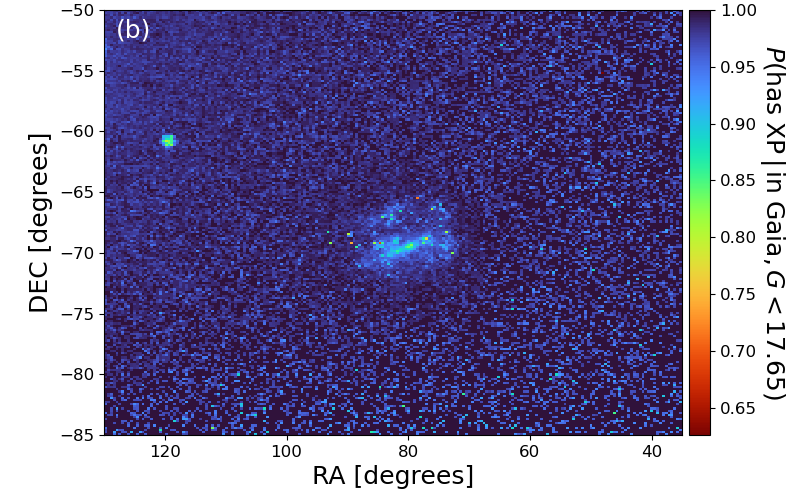
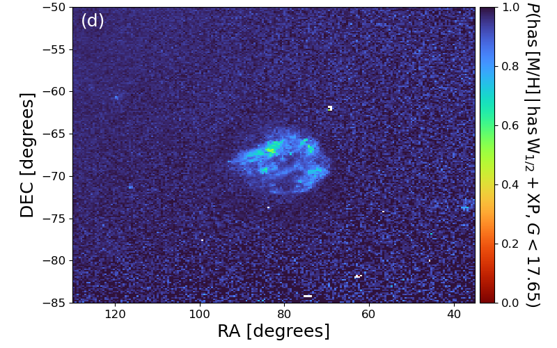
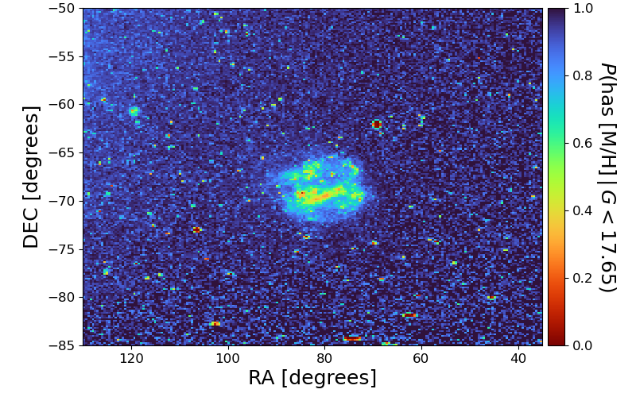

$\newcommand{\ensuremath}{}$
$\newcommand{\xspace}{}$
$\newcommand{\object}[1]{\texttt{#1}}$
$\newcommand{\farcs}{{.}''}$
$\newcommand{\farcm}{{.}'}$
$\newcommand{\arcsec}{''}$
$\newcommand{\arcmin}{'}$
$\newcommand{\ion}[2]{#1#2}$
$\newcommand{\textsc}[1]{\textrm{#1}}$
$\newcommand{\hl}[1]{\textrm{#1}}$
$\newcommand{\footnote}[1]{}$
$\newcommand{\rbar}{\ensuremath{R_\mathrm{b}}}$
$\newcommand{\ra}{\ensuremath{\alpha}}$
$\newcommand{\dec}{\ensuremath{\delta}}$
$\newcommand{\pmra}{\ensuremath{{\mu_\alpha}\cos{\delta}}}$
$\newcommand{\pmdec}{\ensuremath{{\mu_\delta}}}$
$\newcommand{\bprp}{\ensuremath{\mathrm{BP-RP}}}$
$\newcommand{\br}{\ensuremath{\mathrm{BP-RP}}}$
$\newcommand$
$\newcommand$
$\newcommand{\todo}[1]{\textcolor{red}{TODO: #1}}$
$\newcommand{\Comment}[2]{ [{\color{red}\sc #1 :} {{\color{orange} \it #2}}]}$
$\newcommand{\com}[1]{ {\textcolor{cyan}{ #1}}}$
$\newcommand{\update}[1]{ {\textbf{\textcolor{mybluedark}{ #1}}}}$
$\newcommand{\updateap}[1]{ {\textbf{\textcolor{cyan}{ #1}}}}$
$\newcommand{\updatescott}[1]{ {\textbf{\textcolor{magenta}{ #1}}}}$
$\newcommand{\apn}[1]{ {\textcolor{magenta}{ #1}}}$

# What Does the Large Magellanic Cloud Look Like? It Depends on [M/H] and Age

<mark>Appeared on: 2024-03-14</mark> -  _Submitted to ApJ; constructive comments would be appreciated_

N. Frankel, et al. -- incl., <mark>R. Andrae</mark>, <mark>H.-W. Rix</mark>

**Abstract:** We offer a new way to look at the Large Magellanic Cloud through stellar mono-abundance and mono-age-mono-abundance maps. These maps are based on $\gtrsim 500 000$ member stars with photo-spectroscopic [ M/H ] and age estimates from Gaia DR3 data, and they are the first area-complete, metallicity- and age-differentiated stellar maps of any disk galaxy. Azimuthally averaged, these maps reveal a surprisingly simple picture of the Milky Way's largest satellite galaxy. For any [ M/H ] below -0.1 dex, the LMC's radial profile is well described by a simple exponential, but with a scale length that steadily shrinks towards higher metallicities, from nearly 2.3 kpc at [ M/H ] $=-1.8$ to only 0.75 kpc at [ M/H ] $=-0.25$ . The prominence of the bar decreases dramatically with [ M/H ] , making it barely discernible at [ M/H ] $\lesssim -1.5$ . Yet, even for metal-rich populations, the bar has little impact on the azimuthally averaged profile of the mono-abundance components. Including ages, we find that the scale length is a greater function of age than of metallicity, with younger populations far more centrally concentrated. At old ages, the scale length decreases with increasing metallicity; at young ages, the scale-length is independent of metallicity. These findings provide quantitative support for a scenario where the LMC built its stellar structure effectively outside in.

**Figure 5. -** Metallicity maps of the LMC. Panel (a) shows the global map of the mean metallicity (color coded), with total number density contours that are spaced by factors of two. Panels (b)-(f) show the completeness-corrected maps of various mono-abundance populations with \MH ranging from $-2$ to 0. All panels mask noise-dominated pixels that contain fewer than 5 stars. (*LMC-mono-abundance-maps*)

**Figure 9. -** Completeness of the LMC according to the four factors in Eq. \ref{eq:completeness-factorised}. Panel (a) represents the last term, i.e. the probability that a star with $G < 17.5$ is in Gaia; panel (b) represents the second to last term, i.e. the probability to have an XP spectra conditioned on (a); panel (c) the second term, i.e. whether Catwise has $W_1$ and $W_2$ entries conditoinned on (a-b); and panel (d) the first term, i.e. whether a metallicity could be estimated conditioned on (a-b-c). Note the drastically different colour-bar ranges. The resulting selection function is the multiplication of those four panels and is displayed in Fig. \ref{fig:LMC-completeness}. (*fig:completeness-step-by-step*)

**Figure 1. -** Probability to have \MH estimates from XGBoost for a star with apparent magnitude $G<17.65$ in the LMC footprint. This completeness map is derived in Appendix \ref{appendix:completeness} and following Eq. \ref{eq:completeness-factorised}, it is the product of the four separate maps shown in Fig. \ref{fig:completeness-step-by-step}. (*fig:LMC-completeness*)

