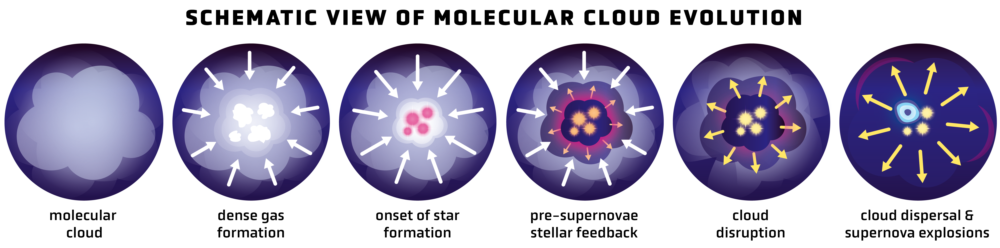

$\newcommand{\ensuremath}{}$
$\newcommand{\xspace}{}$
$\newcommand{\object}[1]{\texttt{#1}}$
$\newcommand{\farcs}{{.}''}$
$\newcommand{\farcm}{{.}'}$
$\newcommand{\arcsec}{''}$
$\newcommand{\arcmin}{'}$
$\newcommand{\ion}[2]{#1#2}$
$\newcommand{\textsc}[1]{\textrm{#1}}$
$\newcommand{\hl}[1]{\textrm{#1}}$
$\newcommand{\footnote}[1]{}$
$\newcommand{\hii}{\textsc{Hii}}$
$\newcommand{\ha}{\rm H{\alpha}}$
$\newcommand{\hbeta}{\rm H{\beta}}$
$\newcommand{\paa}{\rm Pa{\alpha}}$
$\newcommand{\pab}{\rm Pa{\beta}}$
$\newcommand{\bra}{\rm Br{\alpha}}$
$\newcommand{\brg}{\rm Br{\gamma}}$
$\newcommand{\htwo}{\rm H_2}$
$\newcommand{\arcsec}{^{\prime\prime}}$
$\newcommand{\msun}{M_{\odot}}$
$\newcommand{\mstar}{M_{\star}}$
$\newcommand{\Sstar}{\Sigma_{\star}}$
$\newcommand{\Ssfr}{\Sigma_{SFR}}$
$\newcommand{\Smol}{\Sigma_{mol}}$
$\newcommand{\alphavir}{\rm \alpha_{vir}}$
$\newcommand{\alphaCO}{\rm \alpha_{CO}}$
$\newcommand{\acounits}{\textup{M\ensuremath{_\odot}~pc\ensuremath{^{-2}} (K~km~s\ensuremath{^{-1}})\ensuremath{^{-1}}}}$
$\newcommand{\sigsfrunits}{\textup{M\ensuremath{_\odot}~yr\ensuremath{^{-1}}~kpc\ensuremath{^{-2}}}}$
$\newcommand{\xcounits}{\textup{cm\ensuremath{^{-2}} (K~km~s\ensuremath{^{-1}})\ensuremath{^{-1}}}}$
$\newcommand{\xco}{\mbox{X_{\rm CO}}}$
$\newcommand{\aco}{\mbox{\alpha_{\rm CO}}}$
$\newcommand{\msunperpcsq}{\mbox{M_\odot pc^{-2}}}$
$\newcommand{\pasa}{Pub.~Astron.~Soc.~of Australia}$
$\newcommand{\aj}{AJ}$
$\newcommand{\araa}{ARA\&A}$
$\newcommand{\apj}{ApJ}$
$\newcommand{\apjl}{ApJ}$
$\newcommand{\apjs}{ApJS}$
$\newcommand{\ao}{Appl.~Opt.}$
$\newcommand{\apss}{Ap\&SS}$
$\newcommand{\aap}{A\&A}$
$\newcommand{\aapr}{A\&A~Rev.}$
$\newcommand{\aaps}{A\&AS}$
$\newcommand{\azh}{AZh}$
$\newcommand{\baas}{BAAS}$
$\newcommand{\jrasc}{JRASC}$
$\newcommand{\memras}{MmRAS}$
$\newcommand{\mnras}{MNRAS}$
$\newcommand{\pra}{Phys.~Rev.~A}$
$\newcommand{\prb}{Phys.~Rev.~B}$
$\newcommand{\prc}{Phys.~Rev.~C}$
$\newcommand{\prd}{Phys.~Rev.~D}$
$\newcommand{\pre}{Phys.~Rev.~E}$
$\newcommand{\prl}{Phys.~Rev.~Lett.}$
$\newcommand{\pasp}{PASP}$
$\newcommand{\pasj}{PASJ}$
$\newcommand{\qjras}{QJRAS}$
$\newcommand{\skytel}{S\&T}$
$\newcommand{\solphys}{Sol.~Phys.}$
$\newcommand{\sovast}{Soviet~Ast.}$
$\newcommand{\ssr}{Space~Sci.~Rev.}$
$\newcommand{\zap}{ZAp}$
$\newcommand{\nat}{Nature}$
$\newcommand{\iaucirc}{IAU~Circ.}$
$\newcommand{\aplett}{Astrophys.~Lett.}$
$\newcommand{\apspr}{Astrophys.~Space~Phys.~Res.}$
$\newcommand{\bain}{Bull.~Astron.~Inst.~Netherlands}$
$\newcommand{\fcp}{Fund.~Cosmic~Phys.}$
$\newcommand{\gca}{Geochim.~Cosmochim.~Acta}$
$\newcommand{\grl}{Geophys.~Res.~Lett.}$
$\newcommand{\jcp}{J.~Chem.~Phys.}$
$\newcommand{\jgr}{J.~Geophys.~Res.}$
$\newcommand{\jqsrt}{J.~Quant.~Spec.~Radiat.~Transf.}$
$\newcommand{\memsai}{Mem.~Soc.~Astron.~Italiana}$
$\newcommand{\nphysa}{Nucl.~Phys.~A}$
$\newcommand{\physrep}{Phys.~Rep.}$
$\newcommand{\physscr}{Phys.~Scr}$
$\newcommand{\planss}{Planet.~Space~Sci.}$
$\newcommand{\procspie}{Proc.~SPIE}$
$\newcommand{\nar}{NewAR}$
$\newcommand{\rmxaa}{{Rev. Mexicana Astron. Astrofis. }}$

# Molecular Gas and the Star Formation Process on Cloud Scales in Nearby Galaxies

<mark>Appeared on: 2024-04-01</mark> -  _70 pages, 15 figures, 9 tables. Authors' version of an article to appear in Annual Reviews of Astronomy and Astrophysics 2024, Vol 62_

<mark>E. Schinnerer</mark>, A. K. Leroy

**Abstract:** * The role of stellar feedback is now measured using multiple observational approaches. The net yield is constrained by the requirement to support the vertical weight of the galaxy disk. Meanwhile the short gas clearing timescales suggest a large role for pre-supernova feedback in cloud disruption. This leaves the supernovae free to exert a large influence on the larger galaxy, including stirring turbulence, launching galactic-scale winds, and carving superbubbles.\end{itemize}\end{minipage}$

**Figure 6. -** Dense gas tracers and gas density. _Left:_ Illustration of how the density-dependent emissivity of a transition, here HCN (1-0) in blue, convolves with the physical gas density distribution, in red, to produce emission from a range of densities, in purple \citep[following][]{LEROY17DENSE}. Because HCN and similar lines often sample a steeply falling part of the density distribution, a sizeable fraction of  HCN emission often arises from gas below the critical density (black vertical line). A bulk gas tracer like CO would be sensitive to almost the full range of physical densities here. _Middle_: Correlation between HCN (1-0)/CO (1-0) and $N_2$H$^+$ (1-0)/CO (1-0) for regions within galaxies. The blue points from \citet{JIMENEZ23DENSE} show regions in NGC 6946 and a literature compilation. The red points show the binned trend from mapping of M51 by \citet{STUBER23DENSE}, with gray dots showing individual M51 sight lines and red contours indicating data density. $N_2$H$^+$ emerges primarily from cold, dense regions where CO freezes out, but is too faint to be surveyed in a wide range of extragalactic systems. The good correspondence shows that the brightest, most accessible extragalactic dense gas tracer, HCN, yields consistent results with $N_2$H$^+$. _Right_: Correlation between HCN/CO, a spectroscopic tracer of gas density, and the mean molecular gas surface density at 150 pc scales inferred from high resolution CO imaging \citep[from][]{NEUMANN23DENSE}. The excellent correspondence between these two extragalactic tracers of density supports the interpretation of HCN/CO as a density-sensitive line ratio and demonstrates a close link between cloud-scale mean density and physical density.
 (*fig:densetracing*)

**Figure 3. -** 
Cloud-scale surface density and line width across the local galaxy population, from \citet{SUN20GMCS}. _Left:_ Cloud-scale line width, $\sigma_{\rm mol, 150pc}$, as a function of CO (2-1) intensity. _Right:_$\sigma_{\rm mol, 150pc}$ as a function of cloud-scale $\Sigma_{\rm mol, 150pc}$. Both panels show $\sim 100,000$ independent cloud-scale sight lines across $66$ star-forming disk galaxies with measurements at fixed $150$ pc scale. Orange lines in the left panel indicate the sensitivity limits of the observations. Dashed and dashed-dotted lines show the _Heyer-Keto relation_ expected for clouds with fixed dynamical state (Eq. \ref{eq:heyerketo} with $\alpha_{\rm vir}=1$ and $2$). Dotted lines from top left to bottom right show isobars, indicating fixed internal pressure $P_{\rm int}$ at $P_{\rm int} / k_B = 10^3$, $10^4$, ..., $10^8$ cm$^{-3}$ K following Eq. \ref{eq:isobar}. Both panels illustrate a wide range of $\Sigma_{\rm mol}$, $\sigma_{\rm mol}$, and $P_{\rm int}$ with a narrower range of dynamical state, and the coloration by galactocentric radius illustrates that these are systematic variations.
 (*fig:heyerketo*)

**Figure 1. -** _Top:_ Visible separation of tracers of recent star formation (gold; VLT/MUSE H$\alpha$) and cold gas (blue; ALMA CO (2-1)) at "cloud-scale" resolution, here in NGC 628 from \citet{KRECKEL18SFR}.
_Bottom:_ Schematic view of the evolution of a molecular cloud from formation to star cluster. The cloud begins as an over-density of cold, predominantly molecular gas. A subset of the gas achieves high column and volume densities. Stars form from this dense material. Newly formed massive stars rapidly impact their surrounding birth material via radiation and winds, reshaping or even disrupting the cloud. Over time, the continued energy and momentum input from these young massive stars disperses the gas cloud. As a result, many core-collapse supernovae explode in relatively low density, pre-cleared surroundings. In the sketch, gas density increases from blue to white, attenuation of stellar light decreases from red to yellow, light red colors indicate gas ionized by massive stars, and the cyan object in the right panel represents a supernova. (*fig:sketch_cloud*)

