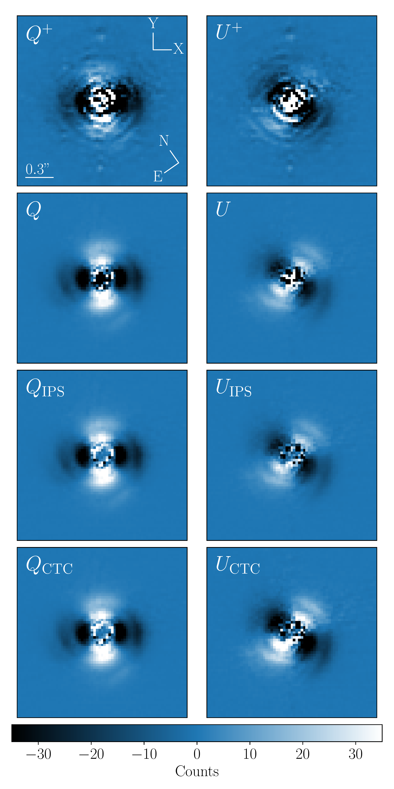

$\newcommand{\ensuremath}{}$
$\newcommand{\xspace}{}$
$\newcommand{\object}[1]{\texttt{#1}}$
$\newcommand{\farcs}{{.}''}$
$\newcommand{\farcm}{{.}'}$
$\newcommand{\arcsec}{''}$
$\newcommand{\arcmin}{'}$
$\newcommand{\ion}[2]{#1#2}$
$\newcommand{\textsc}[1]{\textrm{#1}}$
$\newcommand{\hl}[1]{\textrm{#1}}$
$\newcommand{\footnote}[1]{}$
$\newcommand{\arraystretch}{1.05}$

# Polarimetric differential imaging with VLT/NACO

<mark>Appeared on: 2024-04-04</mark> -  _Accepted for publication in A&A. For more information on PIPPIN, see: this https URL . The reduced images are available on Zenodo: this https URL_

S. d. Regt, et al.

**Abstract:** The observed diversity of exoplanets can possibly be traced back to the planet formation processes. Planet--disk interactions induce sub-structures in the circumstellar disk that can be revealed via scattered light observations. However, a high-contrast imaging technique such as polarimetric differential imaging (PDI) must first be applied to suppress the stellar diffraction halo. In this work we present the PDI PiPelIne for NACO data (PIPPIN), which reduces the archival polarimetric observations made with the NACO instrument at the Very Large Telescope. Prior to this work, such a comprehensive pipeline to reduce polarimetric NACO data did not exist. We identify a total of 243 datasets of 57 potentially young stellar objects observed before NACO's decommissioning. The PIPPIN pipeline applies various levels of instrumental polarisation correction and is capable of reducing multiple observing setups, including half-wave plate or de-rotator usage and wire-grid observations. A novel template-matching method is applied to assess the detection significance of polarised signals in the reduced data. In 22 of the 57 observed targets, we detect polarised light resulting from a scattering of circumstellar dust. The detections exhibit a collection of known sub-structures, including rings, gaps, spirals, shadows, and in- or outflows of material. Since NACO was equipped with a near-infrared wavefront sensor, it made unique polarimetric observations of a number of embedded protostars. This is the first time detections of the Class I objects Elia 2-21 and YLW 16A  have been published. Alongside the outlined PIPPIN pipeline, we publish an archive of the reduced data products, thereby improving the accessibility of these data for future studies.

**Figure 6. -** Gallery of young systems detected with NACO and reduced with PIPPIN. Each panel shows the polarised light on a logarithmic scale ranging between different values to highlight sub-structures. The highest degree of $IP$ correction is used where possible. Scale bars in the lower-left corners of each panel indicate $100 \mathrm{AU}$ at each object's distance. HD 169142, R CrA, and Parsamian 21 are shown in the H band, MP Mus is shown in the IB\_2.06 filter, and the other panels use Ks-band observations. Mon R2 IRS 3 shows the median $I_Q$ image because the Stokes $U$ component was not observed. The images of YLW 16A and Elia 2-21 present the first polarised light detections in the NACO observations. (*fig:gallery*)

**Figure 2. -** Median Stokes $Q$ and $U$ images with different levels of $IP$ corrections for HD 135344B Ks-band observations. _From top to bottom_: $Q^+$ and $U^+$ components after equalising the ordinary and extra-ordinary fluxes, $Q$ and $U$ resulting from the double-difference method, $Q_\mathrm{IPS}$ and $U_\mathrm{IPS}$ after subtracting the median $IP$ within an annulus, and the crosstalk-corrected $Q_\mathrm{CTC}$ and $U_\mathrm{CTC}$ components where the reduced Stokes $U$ efficiency is accounted for. The characteristic butterfly pattern is visible in each panel, and the compasses show the orientation of the detector and the sky. (*fig:QU*)

**Figure 7. -** Polarised-to-stellar light contrast, $\delta_\mathrm{pol}$, plotted against the apparent J-band magnitude. The _right panel_ shows a zoomed-in view of the bright $m_\mathrm{J}$. The object names are listed along the top axes. The marker colours and symbols specify the observing filter and object type, respectively. Upper limits are shown when the stellar PSF was determined to be saturated. The error bars show the $3\sigma$ uncertainties. The grey shaded region shows the approximate magnitudes ($m_\mathrm{J}\gtrsim10$) inaccessible by the SPHERE AO system. (*fig:disk_contrast_vs_m_J*)

