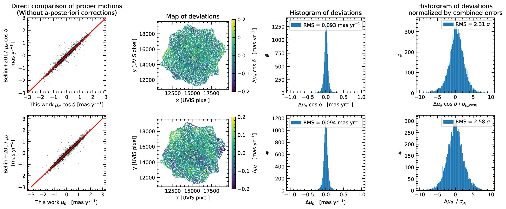
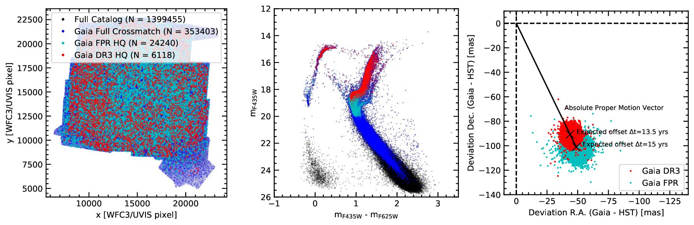

$\newcommand{\ensuremath}{}$
$\newcommand{\xspace}{}$
$\newcommand{\object}[1]{\texttt{#1}}$
$\newcommand{\farcs}{{.}''}$
$\newcommand{\farcm}{{.}'}$
$\newcommand{\arcsec}{''}$
$\newcommand{\arcmin}{'}$
$\newcommand{\ion}[2]{#1#2}$
$\newcommand{\textsc}[1]{\textrm{#1}}$
$\newcommand{\hl}[1]{\textrm{#1}}$
$\newcommand{\footnote}[1]{}$
$\newcommand{\vdag}{(v)^\dagger}$
$\newcommand$
$\newcommand$
$\newcommand$

# oMEGACat II - Photometry and proper motions for 1.4 million stars in Omega Centauri and its rotation in the plane of the sky

<mark>Appeared on: 2024-04-08</mark> -  _38 pages, 24 figures, 8 tables, Submitted to ApJ, The full catalog will be made public along with the publication by the journal_

<mark>M. Häberle</mark>, et al. -- incl., <mark>N. Neumayer</mark>, <mark>C. Clontz</mark>

**Abstract:** Omega Centauri ( $\omc$ ) is the most massive globular cluster of the Milky Way. It is thought to be the nucleus of an accreted dwarf galaxy because of its high mass and its complex stellar populations. To decipher its formation history and study its dynamics, we created the most comprehensive kinematic catalog for its inner region, by analyzing both archival and new _Hubble Space Telescope (HST)_ data. Our catalog contains 1 395 781 proper-motion measurements out to the half-light radius of the cluster ( $\sim5.0\arcmin$ ) and down to $m_{\rm F625W}\approx25$ . The typical baseline for our proper-motion measurements is 20 years, leading to a median 1D proper motion precision of $\sim$ 11 µas yr $^{-1}$ for stars with $m_{\rm F625W}\approx 18$ mag, with even better precision ( $\sim$ 6.6 µas yr $^{-1}$ ) achieved in the extensively observed centermost ( $r<1.5\arcmin$ ) region.  In addition to our astrometric measurements, we also obtained precise _HST_ photometry in seven filters spanning from the ultraviolet to the near-infrared. This allows detailed color-magnitude-diagram studies and to separate the multiple stellar populations of the cluster. In this work, we describe the data reduction used to obtain both the photometric and the proper-motion measurements. We also illustrate the creation and the content of our catalog, which is made publicly available. Finally, we present measurements of the plane-of-sky rotation of $\omc$ in the previously unprobed inner few arcminutes and a precise measurement of the inclination $i=(43.6\pm1.5)^\circ$ .

**Figure 20. -** Comparison of uncorrected proper motions with [Bellini, Anderson and Bedin (2017)]() for the right-ascension (upper row) and the declination proper-motion component (lower row). The panels first-from-the-left show a direct comparison of the proper-motion components. The red line is the plane-bisector and not a fit to the data. The second-from-the-left panels show how the proper motion difference between the two datasets varies over the field. Some mild systematic trends are visible, as expected for the uncorrected, amplifier-based, proper motions. The third-from-the-left panels show a histogram of the differences between the measurements, the fourth-from-the-left panels show the same differences but divided by the combined proper-motion error. (*fig:bellini_uncorrected*)

**Figure 7. -** **Left panel: ** A vector-point diagram of the relative proper motions for a subset of around 700 000 well-measured stars in our catalog. Most stars are distributed around the origin, as expected for \omc's member stars and follow a normal distribution in both velocity components (see marginalized histograms at the edge of the plot). A small fraction of stars has a relative proper motion incompatible with the cluster's motion. Those stars lie outside of the 3.0 mas yr$^{-1}$ radius indicated with a dashed circle (corresponding to a 4.5$\sigma$ deviation from the velocity distribution of the cluster stars) and are marked with turquoise crosses. The non-member stars show substructures that can be attributed to background galaxies (marked with a solid circle) and Galactic foreground/background stars. **Right panel:** A color-magnitude diagram of the same sample. One can see that the stars with a high relative proper motion do not follow the CMD sequences of \omc. Our proper motions cover almost the entire CMD, however the brightest stars, indicated with red dots, do not have a proper motion measurement, as they are saturated even in the shortest _HST_ exposures. (*fig:vpd*)

**Figure 13. -** **Left panel:** Footprint of our proper-motion catalog and all _Gaia_ stars that could be crossmatched (blue). High-quality stars from _Gaia FPR_ are marked in cyan, and high-quality stars from _Gaia DR3_ are marked in red. **Middle panel:** The same sample of stars, but plotted as a color-magnitude diagram. One can see that all HQ _Gaia DR3_ measurements are limited to stars brighter than the main-sequence turn-off, while the _Gaia FPR_ sample reaches slightly deeper. **Right panel:** Absolute deviation between the positions from our _HST_ catalog and the two HQ _Gaia_ subsamples. The shift of the centroid can be explained by the absolute proper motion of \omc , while the spread of the distribution is caused by the displacement due to the velocity dispersion. (*fig:gaia_footprint*)

