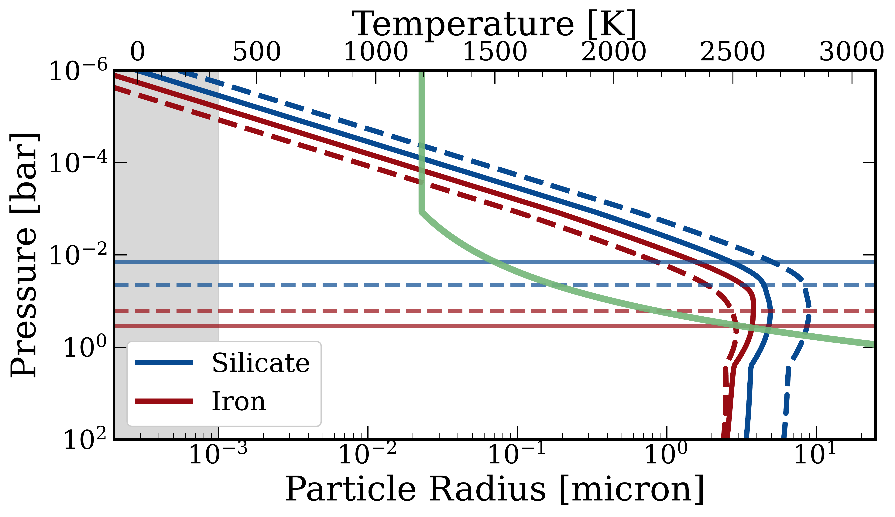

$\newcommand{\ensuremath}{}$
$\newcommand{\xspace}{}$
$\newcommand{\object}[1]{\texttt{#1}}$
$\newcommand{\farcs}{{.}''}$
$\newcommand{\farcm}{{.}'}$
$\newcommand{\arcsec}{''}$
$\newcommand{\arcmin}{'}$
$\newcommand{\ion}[2]{#1#2}$
$\newcommand{\textsc}[1]{\textrm{#1}}$
$\newcommand{\hl}[1]{\textrm{#1}}$
$\newcommand{\footnote}[1]{}$
$\newcommand$
$\newcommand$
$\newcommand{\klip}{{\tt KLIP}\xspace}$
$\newcommand{\pyn}{{\tt PynPoint}\xspace}$
$\newcommand{\kgold}{K_{\rm Gold}}$
$\newcommand{\kliss}{K_{\rm Liss}}$
$\newcommand{\bliss}{B_{\rm Liss}}$
$\newcommand{\rcapt}{R_{\rm capt}}$
$\newcommand{\mz}{M_{\rm Z}}$
$\newcommand{\mxy}{M_{\rm XY}}$
$\newcommand{\lext}{L_{\rm ext}}$
$\newcommand{\lsun}{L_{\odot}}$
$\newcommand{\fpgsun}{f_{\rm D/G,\odot}}$
$\newcommand{\mdisc}{M_{\rm disc}}$
$\newcommand{\tdisc}{t_{\rm disc}}$
$\newcommand{\mdotz}{\dot{M}_{\rm Z}}$
$\newcommand{\mdotxy}{\dot{M}_{\rm XY}}$
$\newcommand{\cadia}{C_{\rm adia }}$
$\newcommand{\cloc}{C_{\rm loc }}$
$\newcommand{\fvisc}{f_{\rm visc }}$
$\newcommand{\fsigma}{f_{\rm \Sigma}}$
$\newcommand{\xs}{x_{\rm s}}$
$\newcommand{\rp}{r_{\rm p}}$
$\newcommand{\omegap}{\Omega_{\rm p}}$
$\newcommand{\sigmap}{\Sigma_{\rm p}}$
$\newcommand{\tauuturn}{\tau_{\rm U-turn}}$
$\newcommand{\taucool}{\tau_{\rm cool}}$
$\newcommand{\taulib}{\tau_{\rm lib}}$
$\newcommand{\tauvisc}{\tau_{\rm visc}}$
$\newcommand{\msat}{M_{\rm sat}}$
$\newcommand{\mgap}{M_{\rm gap}}$
$\newcommand{\rroche}{r_{\rm Roche}}$
$\newcommand{\betat}{\beta_{\rm T}}$
$\newcommand{\betas}{\beta_{\rm \Sigma}}$
$\newcommand{\dotrp}{\dot{r}_{\rm p}}$
$\newcommand{\rch}[1]{{{\color{orange}#1}}}$
$\newcommand{\rea}[1]{{{\color{red}Reading: #1}}}$
$\newcommand{\cstart}$
$\newcommand{\cend}$
$\newcommand{\checkmark}{\tikz\fill[scale=0.4](0,.35) -- (.25,0) -- (1,.7) -- (.25,.15) -- cycle;}$
$\newcommand{\ptrad}{{\tt petitRADTRANS}\xspace}$
$\newcommand{\ptdoc}{\url{https://petitradtrans.readthedocs.io}}$
$\newcommand{\mearth}{{\rm M}_\oplus}$
$\newcommand{\rearth}{{\rm R}_\oplus}$
$\newcommand{\ed}{{\sc{EddySed}}\xspace}$
$\newcommand{\msun}{{\rm M}_\odot}$
$\newcommand{\rsun}{{\rm R}_\odot}$
$\newcommand{\rhill}{R_{\rm H}}$
$\newcommand{\mcore}{M_{\rm core}}$
$\newcommand{\mheavy}{M_{\rm heavy}}$
$\newcommand{\astart}{a_{\rm start}}$
$\newcommand{\fpg}{f_{\rm D/G}}$
$\newcommand{\fri}{f_{\rm R/I}}$
$\newcommand{\f1}{f_{\rm I}}$
$\newcommand{\mj}{{M}_{\textrm{\tiny Jup}}\xspace}$
$\newcommand{\rj}{{R}_{\textrm{\tiny Jup}}\xspace}$
$\newcommand{\teff}{T_{\rm eff}}$
$\newcommand{\Tint}{\ensuremath{T_{\rm int}}\xspace}$
$\newcommand{\Tbot}{\ensuremath{T_{\rm bot}}\xspace}$
$\newcommand{\kzz}{\ensuremath{K_{\rm zz}}\xspace}$
$\newcommand{\fsed}{\ensuremath{f_{\rm sed}}\xspace}$
$\newcommand{\h2o}{H_{2}O\xspace}$
$\newcommand{\ch4}{CH_{4}\xspace}$
$\newcommand{\nh3}{NH_{3}\xspace}$
$\newcommand{\co2}{CO_{2}\xspace}$
$\newcommand{\ph3}{PH_{3}\xspace}$
$\newcommand{\Zpl}{\ensuremath{Z_{\rm pl}}\xspace}$
$\newcommand{\Zstar}{\ensuremath{Z_{\star}}\xspace}$
$\newcommand{\mstar}{M_*}$
$\newcommand{\mdisk}{M_{\rm disk}}$
$\newcommand{\astart}{a_{\rm start}}$
$\newcommand{\tstart}{t_{\rm start}}$
$\newcommand{\membstart}{M_{\rm emb,0}}$
$\newcommand{\memb}{M_{\rm emb}}$
$\newcommand{\anorm}{a_0}$
$\newcommand{\rcore}{R_{\rm core}}$
$\newcommand{\mdotcore}{\dot{M}_{\rm core}}$
$\newcommand{\mwind}{\dot{M}_{\rm w}}$
$\newcommand{\menv}{M_{\rm env}}$
$\newcommand{\miso}{M_{\rm iso}}$
$\newcommand{\mpla}{m_{\rm pla}}$
$\newcommand{\arock}{a_{\rm rock}}$
$\newcommand{\aice}{a_{\rm ice}}$
$\newcommand{\beq}{\begin{equation}}$
$\newcommand{\eeq}{\end{equation}}$
$\newcommand{\mplanet}{M_{\rm planet}}$
$\newcommand{\aplanet}{a_{\rm planet}}$
$\newcommand{\sigmad}{\Sigma_{\rm D}}$
$\newcommand{\atouch}{a_{\rm touch}}$
$\newcommand{\sigmanorm}{\Sigma_{0}}$
$\newcommand{\tmc}{\tau_{\rm RV,MC}}$
$\newcommand{\epsilonmc}{\epsilon_{\rm RV,MC}}$
$\newcommand{\nref}{N_{\rm ref}}$
$\newcommand{\nobsref}{N_{\rm obsref}}$
$\newcommand{\nhot}{N_{\rm hot}}$
$\newcommand{\nlate}{N_{\rm late}}$
$\newcommand{\nobs}{N_{\rm obs}}$
$\newcommand{\nsamp}{N_{\rm samp}}$
$\newcommand{\dks}{d_{\rm KS}}$
$\newcommand{\sam}{S_{\rm a-M}}$
$\newcommand{\sm}{S_{\rm M}}$
$\newcommand{\sa}{S_{\rm a}}$
$\newcommand{\sfeh}{S_{\rm[Fe/H]}}$
$\newcommand{\nobsreffv}{N_{\rm obsrefFV}}$
$\newcommand{\nobsrefhotfv}{N_{\rm obsrefhotFV}}$
$\newcommand{\msini}{M\sin i}$
$\newcommand{\amax}{a_{\rm max}}$
$\newcommand{\amin}{a_{\rm min}}$
$\newcommand{\aphys}{a_{\rm phys}}$
$\newcommand{\pwhot}{P_{\rm whot}}$
$\newcommand{\pfv}{P_{\rm FV}}$
$\newcommand{\pfvwhot}{P_{\rm FV,whot}}$
$\newcommand{\ffv}{F_{\rm FV}}$
$\newcommand{\fwemb}{F_{\rm wemb}}$
$\newcommand{\mmax}{M_{\rm max}}$
$\newcommand{\fopa}{f_{\rm opa}}$
$\newcommand{\t2}{\tau_{\rm II}}$
$\newcommand{\ltot}{L_{\rm tot}}$
$\newcommand{\lcore}{L_{\rm core}}$
$\newcommand{\mtot}{M_{\rm tot}}$
$\newcommand{\sigmas0}{\Sigma_{\rm s,0}}$
$\newcommand{\LJ}{L_{{\rm \jupiter}}}$
$\newcommand{\RJ}{R_{{\rm \jupiter}}}$
$\newcommand{\petit}{\emph{petitCODE} }$
$\newcommand{\kgold}{K_{\rm Gold}}$
$\newcommand{\kliss}{K_{\rm Liss}}$
$\newcommand{\bliss}{B_{\rm Liss}}$
$\newcommand{\rcapt}{R_{\rm capt}}$
$\newcommand{\mz}{M_{\rm Z}}$
$\newcommand{\mxy}{M_{\rm XY}}$
$\newcommand{\lext}{L_{\rm ext}}$
$\newcommand{\lsun}{L_{\odot}}$
$\newcommand{\fpgsun}{f_{\rm D/G,\odot}}$
$\newcommand{\mdisc}{M_{\rm disc}}$
$\newcommand{\tdisc}{t_{\rm disc}}$
$\newcommand{\mdotz}{\dot{M}_{\rm Z}}$
$\newcommand{\mdotxy}{\dot{M}_{\rm XY}}$
$\newcommand{\cadia}{C_{\rm adia }}$
$\newcommand{\cloc}{C_{\rm loc }}$
$\newcommand{\fvisc}{f_{\rm visc }}$
$\newcommand{\fsigma}{f_{\rm \Sigma}}$
$\newcommand{\xs}{x_{\rm s}}$
$\newcommand{\rp}{r_{\rm p}}$
$\newcommand{\omegap}{\Omega_{\rm p}}$
$\newcommand{\sigmap}{\Sigma_{\rm p}}$
$\newcommand{\tauuturn}{\tau_{\rm U-turn}}$
$\newcommand{\taucool}{\tau_{\rm cool}}$
$\newcommand{\taulib}{\tau_{\rm lib}}$
$\newcommand{\tauvisc}{\tau_{\rm visc}}$
$\newcommand{\msat}{M_{\rm sat}}$
$\newcommand{\mgap}{M_{\rm gap}}$
$\newcommand{\rroche}{r_{\rm Roche}}$
$\newcommand{\betat}{\beta_{\rm T}}$
$\newcommand{\betas}{\beta_{\rm \Sigma}}$
$\newcommand{\dotrp}{\dot{r}_{\rm p}}$
$\newcommand\vol{#1}{ #1}$
$\newcommand{\(}{\left(}$
$\newcommand{\)}{\right)}$
$\newcommand{\<}{\left<}$
$\newcommand{\>}{\right>}$
$\newcommand{\bacon}{\emph{BACON}~}$
$\newcommand{\tr}{\mathcal{T}}$
$\newcommand{\rch}[1]{{{\color{orange}#1}}}$
$\newcommand{\rea}[1]{{{\color{red}Reading: #1}}}$
$\newcommand{\cstart} $
$\newcommand{\cend} $
$\newcommandcitealias{ackerman_precipitating_2001}{AM01}$
$\newcommandcitealias{molliere_retrieving_2020}{M20}$
$\newcommandcitealias{zhang_elemental_2023}{Z23}$
$\newcommandcitealias{guillot_radiative_2010}{G10}$
$\begin{document}$
$   \title{Four-of-a-kind? Comprehensive atmospheric characterisation of the HR~8799 planets with VLTI/GRAVITY}$
$    \titlerunning{HR8799 Atmospheres}$
$    \authorrunning{Nasedkin et al.}$
$   \subtitle $
$   \author{E.~Nasedkin\inst{\ref{mpia}}\fnmsep\thanks{Corresponding Author, \href{mailto:nasedkin@mpia.de}{nasedkin@mpia.de}}$
$   \and P.~Mollière\inst{\ref{mpia}}$
$ \and S.~Lacour\inst{\ref{lesia},\ref{esog}}$
$ \and M.~Nowak\inst{\ref{cam}}$
$ \and L.~Kreidberg\inst{\ref{mpia}}$
$ \and T.~Stolker\inst{\ref{leiden}}$
$ \and J.~J.~Wang\inst{\ref{northwestern}}$
$ \and W.~O.~Balmer\inst{\ref{jhupa},\ref{stsci}}$
$ \and J.~Kammerer\inst{\ref{esog}}$
$ \and J.~Shangguan\inst{\ref{mpe}}$
$ \and R.~Abuter\inst{\ref{esog}}$
$ \and A.~Amorim\inst{\ref{lisboa},\ref{centra}}$
$ \and R.~Asensio-Torres\inst{\ref{mpia}}$
$ \and M.~Benisty\inst{\ref{ipag}}$
$ \and J.-P.~Berger\inst{\ref{ipag}}$
$ \and H.~Beust\inst{\ref{ipag}}$
$ \and S.~Blunt\inst{\ref{northwestern}}$
$ \and A.~Boccaletti\inst{\ref{lesia}}$
$ \and M.~Bonnefoy\inst{\ref{ipag}}$
$ \and H.~Bonnet\inst{\ref{esog}}$
$ \and M.~S.~Bordoni\inst{\ref{mpe}}$
$ \and G.~Bourdarot\inst{\ref{mpe}}$
$ \and W.~Brandner\inst{\ref{mpia}}$
$ \and F.~Cantalloube\inst{\ref{lam}}$
$ \and P.~Caselli \inst{\ref{mpe}}$
$ \and B.~Charnay\inst{\ref{lesia}}$
$ \and G.~Chauvin\inst{\ref{cotedazur}}$
$ \and A.~Chavez\inst{\ref{northwestern}}$
$ \and E.~Choquet\inst{\ref{lam}}$
$ \and V.~Christiaens\inst{\ref{liege}}$
$ \and Y.~Clénet\inst{\ref{lesia}}$
$ \and V.~Coudé~du~Foresto\inst{\ref{lesia}}$
$ \and A.~Cridland\inst{\ref{leiden}}$
$ \and R.~Davies\inst{\ref{mpe}}$
$ \and R.~Dembet\inst{\ref{lesia}}$
$ \and J.~Dexter\inst{\ref{boulder}}$
$ \and A.~Drescher\inst{\ref{mpe}}$
$ \and G.~Duvert\inst{\ref{ipag}}$
$ \and A.~Eckart\inst{\ref{cologne},\ref{bonn}}$
$ \and F.~Eisenhauer\inst{\ref{mpe}}$
$ \and N.~M.~Förster Schreiber\inst{\ref{mpe}}$
$ \and P.~Garcia\inst{\ref{centra},\ref{porto}}$
$ \and R.~Garcia~Lopez\inst{\ref{dublin},\ref{mpia}}$
$ \and E.~Gendron\inst{\ref{lesia}}$
$ \and R.~Genzel\inst{\ref{mpe},\ref{ucb}}$
$ \and S.~Gillessen\inst{\ref{mpe}}$
$ \and J.~H.~Girard\inst{\ref{stsci}}$
$ \and S.~Grant\inst{\ref{mpe}}$
$ \and X.~Haubois\inst{\ref{esoc}}$
$ \and G.~Hei\ss el\inst{\ref{actesa},\ref{lesia}}$
$ \and Th.~Henning\inst{\ref{mpia}}$
$ \and S.~Hinkley\inst{\ref{exeter}}$
$ \and S.~Hippler\inst{\ref{mpia}}$
$ \and M.~Houllé\inst{\ref{cotedazur}}$
$ \and Z.~Hubert\inst{\ref{ipag}}$
$ \and L.~Jocou\inst{\ref{ipag}}$
$ \and M.~Keppler\inst{\ref{arizona}}$
$ \and P.~Kervella\inst{\ref{lesia}}$
$ \and N.~T.~Kurtovic\inst{\ref{mpe}}$
$ \and A.-M.~Lagrange\inst{\ref{ipag},\ref{lesia}}$
$ \and V.~Lapeyrère\inst{\ref{lesia}}$
$ \and J.-B.~Le~Bouquin\inst{\ref{ipag}}$
$ \and D.~Lutz\inst{\ref{mpe}}$
$ \and A.-L.~Maire\inst{\ref{ipag}}$
$ \and F.~Mang\inst{\ref{mpe}}$
$ \and G.-D.~Marleau\inst{\ref{duisburg},\ref{tuebingen},\ref{bern},\ref{mpia}}$
$ \and A.~Mérand\inst{\ref{esog}}$
$ \and J.~D.~Monnier\inst{\ref{umich}}$
$ \and C.~Mordasini\inst{\ref{bern}}$
$ \and T.~Ott\inst{\ref{mpe}}$
$ \and G.~P.~P.~L.~Otten\inst{\ref{sinica}}$
$ \and C.~Paladini\inst{\ref{esoc}}$
$ \and T.~Paumard\inst{\ref{lesia}}$
$ \and K.~Perraut\inst{\ref{ipag}}$
$ \and G.~Perrin\inst{\ref{lesia}}$
$ \and O.~Pfuhl\inst{\ref{esog}}$
$ \and N.~Pourré\inst{\ref{ipag}}$
$ \and L.~Pueyo\inst{\ref{stsci}}$
$ \and D.~C.~Ribeiro\inst{\ref{mpe}}$
$ \and E.~Rickman\inst{\ref{esa}}$
$ \and J.B.~Ruffio\inst{\ref{sandiego}}$
$ \and Z.~Rustamkulov\inst{\ref{jhueps}}$
$ \and T.~Shimizu \inst{\ref{mpe}}$
$ \and D.~Sing\inst{\ref{jhupa},\ref{jhueps}}$
$ \and J.~Stadler\inst{\ref{mpa},\ref{origins}}$
$ \and O.~Straub\inst{\ref{origins}}$
$ \and C.~Straubmeier\inst{\ref{cologne}}$
$ \and E.~Sturm\inst{\ref{mpe}}$
$ \and L.~J.~Tacconi\inst{\ref{mpe}}$
$ \and E.~F.~van~Dishoeck\inst{\ref{leiden},\ref{mpe}}$
$ \and A.~Vigan\inst{\ref{lam}}$
$ \and F.~Vincent\inst{\ref{lesia}}$
$ \and S.~D.~von~Fellenberg\inst{\ref{bonn}}$
$ \and F.~Widmann\inst{\ref{mpe}}$
$ \and T.~O.~Winterhalder\inst{\ref{esog}}$
$ \and J.~Woillez\inst{\ref{esog}}$
$ \and \c{S}.~Yaz\i c\i \inst{\ref{mpe}}$
$ \and  the~GRAVITY~Collaboration}$
$\institute{$
$   Max-Planck-Institut für Astronomie, Königstuhl 17, 69117 Heidelberg, Germany$
$\label{mpia}      \and$
$   LESIA, Observatoire de Paris, PSL, CNRS, Sorbonne Université, Université de Paris, 5 place Janssen, 92195 Meudon, France$
$\label{lesia}      \and$
$   European Southern Observatory, Karl-Schwarzschild-Stra\ss e 2, 85748 Garching, Germany$
$\label{esog}      \and$
$   Institute of Astronomy, University of Cambridge, Madingley Road, Cambridge CB3 0HA, United Kingdom$
$\label{cam}      \and$
$   Leiden Observatory, Leiden University, P.O. Box 9513, 2300 RA Leiden, The Netherlands$
$\label{leiden}      \and$
$   Center for Interdisciplinary Exploration and Research in Astrophysics (CIERA) and Department of Physics and Astronomy, Northwestern University, Evanston, IL 60208, USA$
$\label{northwestern}      \and$
$   Department of Physics \& Astronomy, Johns Hopkins University, 3400 N. Charles Street, Baltimore, MD 21218, USA$
$\label{jhupa}      \and$
$   Space Telescope Science Institute, 3700 San Martin Drive, Baltimore, MD 21218, USA$
$ \label{stsci}  \and$
$   Max-Planck-Institut für Extraterrestrische Physik, Giessenbachstra\ss e~1, 85748 Garching, Germany$
$\label{mpe}      \and$
$   Universidade de Lisboa - Faculdade de Ci\^encias, Campo Grande, 1749-016 Lisboa, Portugal$
$\label{lisboa}      \and$
$   CENTRA - Centro de Astrofísica e Gravitação, IST, Universidade de Lisboa, 1049-001 Lisboa, Portugal$
$\label{centra}      \and$
$   Univ. Grenoble Alpes, CNRS, IPAG, 38000 Grenoble, France$
$\label{ipag}      \and$
$   Aix Marseille Univ, CNRS, CNES, LAM, Marseille, France$
$\label{lam}      \and$
$   Université C\^{o}te d'Azur, Observatoire de la C\^{o}te d'Azur, CNRS, Laboratoire Lagrange, France$
$\label{cotedazur}      \and$
$  STAR Institute, Université de Liège, Allée du Six Ao\^ut 19c, 4000 Liège, Belgium$
$\label{liege}      \and$
$   Department of Astrophysical \& Planetary Sciences, JILA, Duane Physics Bldg., 2000 Colorado Ave, University of Colorado, Boulder, CO 80309, USA$
$\label{boulder}      \and$
$   1. Institute of Physics, University of Cologne, Zülpicher Stra\ss e 77, 50937 Cologne, Germany$
$\label{cologne}      \and$
$   Max-Planck-Institut für Radioastronomie, Auf dem Hügel 69, 53121 Bonn, Germany$
$\label{bonn}      \and$
$   Universidade do Porto, Faculdade de Engenharia, Rua Dr.~Roberto Frias, 4200-465 Porto, Portugal$
$\label{porto}      \and$
$   School of Physics, University College Dublin, Belfield, Dublin 4, Ireland$
$\label{dublin}      \and$
$   Astrophysics Group, Department of Physics \& Astronomy, University of Exeter, Stocker Road, Exeter, EX4 4QL, United Kingdom$
$\label{exeterAstro}      \and$
$   Departments of Physics and Astronomy, Le Conte Hall, University of California, Berkeley, CA 94720, USA$
$\label{ucb}      \and$
$   European Southern Observatory, Casilla 19001, Santiago 19, Chile$
$\label{esoc}      \and$
$   Advanced Concepts Team, European Space Agency, TEC-SF, ESTEC, Keplerlaan 1, NL-2201, AZ Noordwijk, The Netherlands$
$\label{actesa}      \and$
$Department of Astronomy and Steward Observatory, University of Arizona, Tucson, AZ, USA$
$\label{arizona}     \and$
$   University of Exeter, Physics Building, Stocker Road, Exeter EX4 4QL, United Kingdom$
$\label{exeter}      \and$
$   Fakultät für Physik, Universität Duisburg--Essen, Lotharstra\ss e 1, 47057 Duisburg, Germany$
$\label{duisburg}      \and$
$   Institüt für Astronomie und Astrophysik, Universität Tübingen, Auf der Morgenstelle 10, 72076 Tübingen, Germany$
$\label{tuebingen}      \and$
$   Physikalisches Institut, Universität Bern, Gesellschaftsstr.~6, 3012 Bern, Switzerland$
$\label{bern}      \and$
$   Astronomy Department, University of Michigan, Ann Arbor, MI 48109 USA$
$\label{umich}      \and$
$   Academia Sinica, Institute of Astronomy and Astrophysics, 11F Astronomy-Mathematics Building, NTU/AS campus, No. 1, Section 4, Roosevelt Rd., Taipei 10617, Taiwan$
$\label{sinica}      \and$
$   European Space Agency,$
$   ESA Office, Space Telescope Science Institute, 3700 San Martin Drive, Baltimore, MD 21218, USA$
$\label{esa}   \and$
$    Department of Astronomy \& Astrophysics,  University of California, San Diego, La Jolla, CA 92093, USA$
$ \label{sandiego}   \and$
$   Department of Earth \& Planetary Sciences, Johns Hopkins University, Baltimore, MD 21218, USA$
$\label{jhueps}      \and$
$   Max-Planck-Institut für Astrophysik, Karl-Schwarzschild-Str. 1, 85741 Garching, Germany$
$\label{mpa}      \and$
$   Excellence Cluster ORIGINS, Boltzmannstra\ss e 2, 85748 Garching bei München, Germany$
$\label{origins}      \and$
$   Institutionen för astronomi, AlbaNova universitetscentrum, Stockholms universitet, 10691 Stockholm, Sweden$
$\label{stockholm}$
$}$
$   \date{Received 2024-01-24}$
$  \abstract{$
$  With four companions at separations from 16 to 71 au, HR 8799 is a unique target for direct imaging, presenting an opportunity for the comparative study of exoplanets with a shared formation history.$
$  Combining new VLTI/GRAVITY observations obtained within the ExoGRAVITY program with archival data, we perform a systematic atmospheric characterisation across all four planets.$
$  We explore different levels of model flexibility to understand the temperature structure, chemistry and clouds of each planet using both {\tt petitRADTRANS} atmospheric retrievals and fits to self-consistent radiative-convective equilibrium models.$
$  Using Bayesian Model Averaging to combine multiple retrievals (a total of 89 across all four planets), we find that the HR 8799 planets are highly enriched in metals, with [M/H] \gtrsim1, and have stellar to super-stellar C/O ratios.$
$  The C/O ratio increases with increasing separation from 0.55^{+0.12}_{-0.10} for d to 0.78^{+0.03}_{-0.04} for b, with the exception of the innermost planet which has a C/O ratio of 0.87\pm0.03.$
$  Such high metallicities are unexpected for these massive planets, challenging planet formation models.$
$  By retrieving a quench pressure and using a disequilibrium chemistry model we derive vertical mixing strengths compatible with predictions for high-metallicity, self-luminous atmospheres.$
$  Bayesian evidence comparisons strongly favour the presence of HCN in HR 8799 c and e, as well as \ch4 in HR 8799 c, with detections at >5\sigma confidence.$
$  All of the planets are cloudy, with no evidence for patchiness.$
$  The clouds of c, d and e are best fit by silicate clouds lying above a deep iron cloud layer, while the clouds of the cooler HR 8799 b are more likely composed of Na_{2}S.$
$  With well newcommandined atmospheric properties, future exploration of this system is well positioned to unveil further detail in these planets, extending our understanding of the composition, structure, and formation history of these siblings.}$
$   \keywords{Methods: observational – planets and satellites: atmospheres  – instrumentation: interferometers – radiative transfer}$
$   \maketitle$
$\n\end{document}\end{equation}}$
$\newcommand{\eeq}{\end{equation}}$
$\newcommand{\mplanet}{M_{\rm planet}}$
$\newcommand{\aplanet}{a_{\rm planet}}$
$\newcommand{\sigmad}{\Sigma_{\rm D}}$
$\newcommand{\atouch}{a_{\rm touch}}$
$\newcommand{\sigmanorm}{\Sigma_{0}}$
$\newcommand{\tmc}{\tau_{\rm RV,MC}}$
$\newcommand{\epsilonmc}{\epsilon_{\rm RV,MC}}$
$\newcommand{\nref}{N_{\rm ref}}$
$\newcommand{\nobsref}{N_{\rm obsref}}$
$\newcommand{\nhot}{N_{\rm hot}}$
$\newcommand{\nlate}{N_{\rm late}}$
$\newcommand{\nobs}{N_{\rm obs}}$
$\newcommand{\nsamp}{N_{\rm samp}}$
$\newcommand{\dks}{d_{\rm KS}}$
$\newcommand{\sam}{S_{\rm a-M}}$
$\newcommand{\sm}{S_{\rm M}}$
$\newcommand{\sa}{S_{\rm a}}$
$\newcommand{\sfeh}{S_{\rm[Fe/H]}}$
$\newcommand{\nobsreffv}{N_{\rm obsrefFV}}$
$\newcommand{\nobsrefhotfv}{N_{\rm obsrefhotFV}}$
$\newcommand{\msini}{M\sin i}$
$\newcommand{\amax}{a_{\rm max}}$
$\newcommand{\amin}{a_{\rm min}}$
$\newcommand{\aphys}{a_{\rm phys}}$
$\newcommand{\pwhot}{P_{\rm whot}}$
$\newcommand{\pfv}{P_{\rm FV}}$
$\newcommand{\pfvwhot}{P_{\rm FV,whot}}$
$\newcommand{\ffv}{F_{\rm FV}}$
$\newcommand{\fwemb}{F_{\rm wemb}}$
$\newcommand{\mmax}{M_{\rm max}}$
$\newcommand{\fopa}{f_{\rm opa}}$
$\newcommand{\t2}{\tau_{\rm II}}$
$\newcommand{\ltot}{L_{\rm tot}}$
$\newcommand{\lcore}{L_{\rm core}}$
$\newcommand{\mtot}{M_{\rm tot}}$
$\newcommand{\sigmas0}{\Sigma_{\rm s,0}}$
$\newcommand{\LJ}{L_{{\rm \jupiter}}}$
$\newcommand{\RJ}{R_{{\rm \jupiter}}}$
$\newcommand{\petit}{\emph{petitCODE} }$
$\newcommand\vol{#1}$
$\newcommand{\(}{\left(}$
$\newcommand{\)}{\right)}$
$\newcommand{\<}{\left<}$
$\newcommand{\>}{\right>}$
$\newcommand{\bacon}{\emph{BACON}~}$
$\newcommand{\tr}{\mathcal{T}}$

# Four-of-a-kind? Comprehensive atmospheric characterisation of the HR 8799 planets with VLTI/GRAVITY

<mark>Appeared on: 2024-04-08</mark> -  _45 pages, 25 figures, submitted to Astronomy & Astrophysics_

<mark>E. Nasedkin</mark>, et al. -- incl., <mark>P. Mollière</mark>, <mark>L. Kreidberg</mark>, <mark>P. Garcia</mark>

**Abstract:** With four companions at separations from 16 to 71 au, HR 8799 is a unique target for direct imaging, presenting an opportunity for the comparative study of exoplanets with a shared formation history.  Combining new VLTI/GRAVITY observations obtained within the ExoGRAVITY program with archival data, we perform a systematic atmospheric characterisation across all four planets.  We explore different levels of model flexibility to understand the temperature structure, chemistry and clouds of each planet using both ${\tt petitRADTRANS}$ atmospheric retrievals and fits to self-consistent radiative-convective equilibrium models.  Using Bayesian Model Averaging to combine multiple retrievals (a total of 89 across all four planets), we find that the HR 8799 planets are highly enriched in metals, with [ M/H ] $\gtrsim$ 1, and have stellar to super-stellar C/O ratios.  The C/O ratio increases with increasing separation from $0.55^{+0.12}_{-0.10}$ for d to $0.78^{+0.03}_{-0.04}$ for b, with the exception of the innermost planet which has a C/O ratio of $0.87\pm0.03$ .  Such high metallicities are unexpected for these massive planets, challenging planet formation models.  By retrieving a quench pressure and using a disequilibrium chemistry model we derive vertical mixing strengths compatible with predictions for high-metallicity, self-luminous atmospheres.  Bayesian evidence comparisons strongly favour the presence of HCN in HR 8799 c and e, as well as $\ch$ 4 in HR 8799 c, with detections at $>5\sigma$ confidence.  All of the planets are cloudy, with no evidence for patchiness.  The clouds of c, d and e are best fit by silicate clouds lying above a deep iron cloud layer, while the clouds of the cooler HR 8799 b are more likely composed of Na $_{2}$ S.  With well defined atmospheric properties, future exploration of this system is well positioned to unveil further detail in these planets, extending our understanding of the composition, structure, and formation history of these siblings.

**Figure 7. -** Predictions for MIRI/MRS based on the most favoured disequilibrium (solid) and free chemistry (dashed) retrievals, together with the best-fit self-consistent models from each grid. (*fig:mrs_predictions*)

**Figure 14. -** Bayesian averaged posterior parameter distributions for each of the HR 8799 planets, based on the group $A\cap B$ set of retrievals. In faint lines beneath the total posterior distribution are the individual contributions from different retrievals. The coloured dashed and dotted lines indicate the median and $\pm34.1$\% confidence regions respectively. The vertical grey lines indicate typical parameter values (e.g. solar metallicity and C/O) and serve as a visual reference for each parameter. For the planet mass, they indicate the dynamical mass estimate from \cite{zurlo_orbital_2022}. (*fig:retrieval_parameter_summary*)

**Figure 4. -** Effective particle radii as a function of altitude for silicate (blue) and iron (red) clouds. The solid lines indicate the radii for Case e.AB.13, which used a free cloud base pressure and abundance, while the dashed lines are for Case e.AB.2, which used equilibrium condensation and scaled equilibrium abundances. The horizontal lines indicate the cloud base pressure. The green line indicates the temperature profile, with the free cloud profile in dark green and the equilibrium cloud profile in light green. The shaded regions indicate unphysical particle sizes where the opacity contribution is set to 0. (*fig:cloud_particle_radius*)

