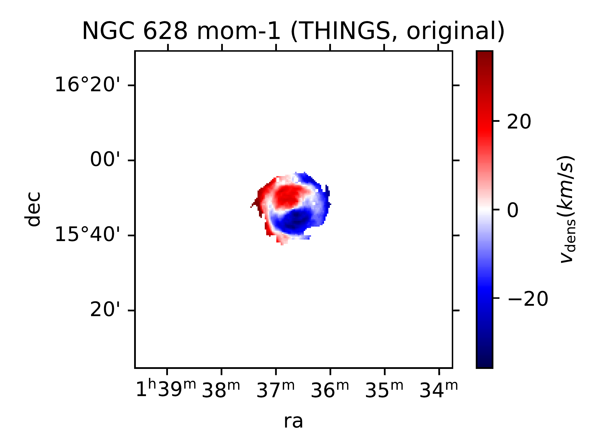
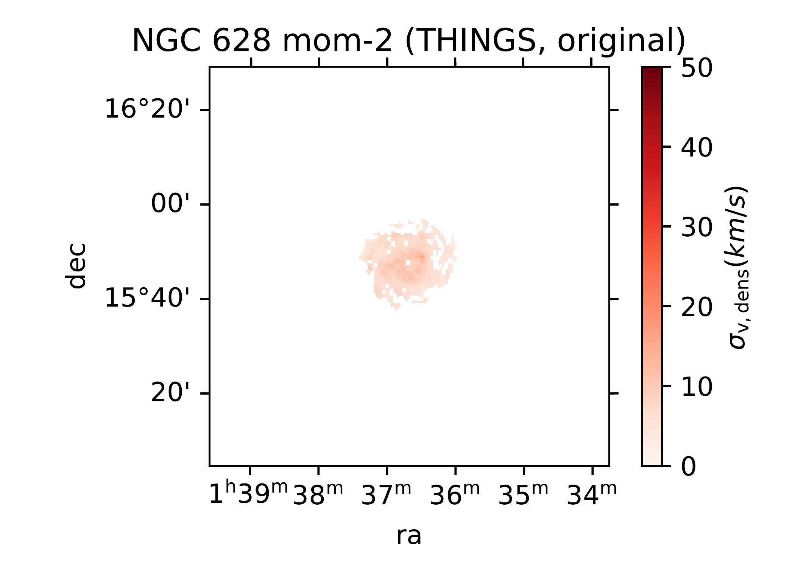
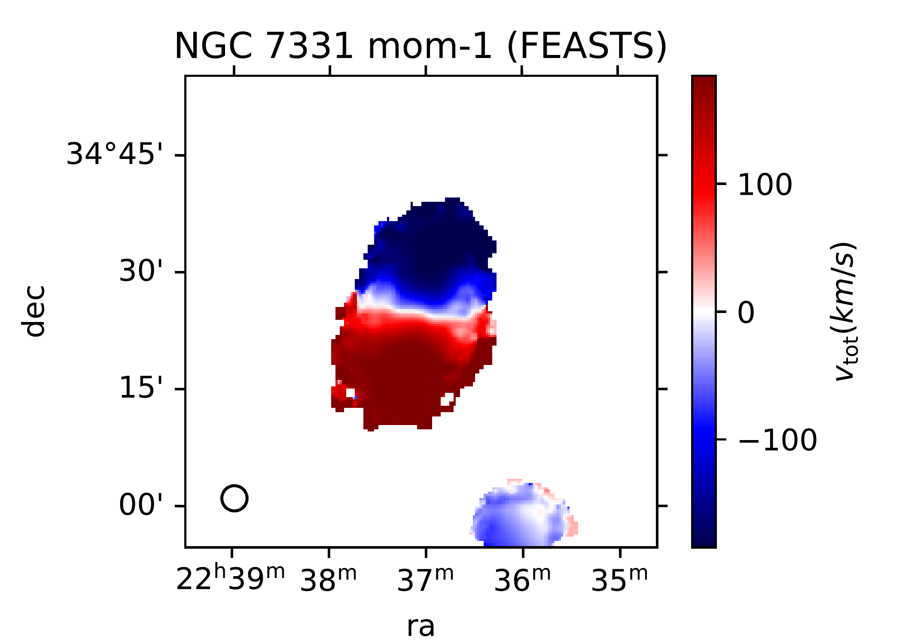
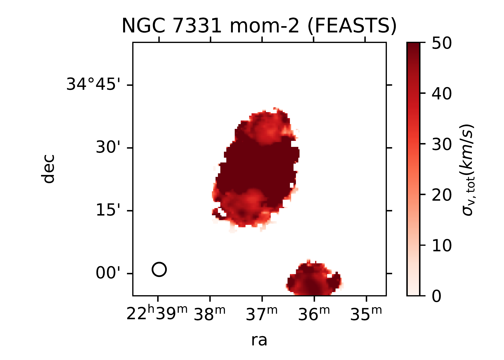
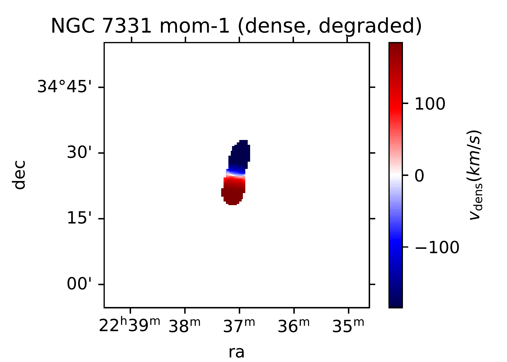
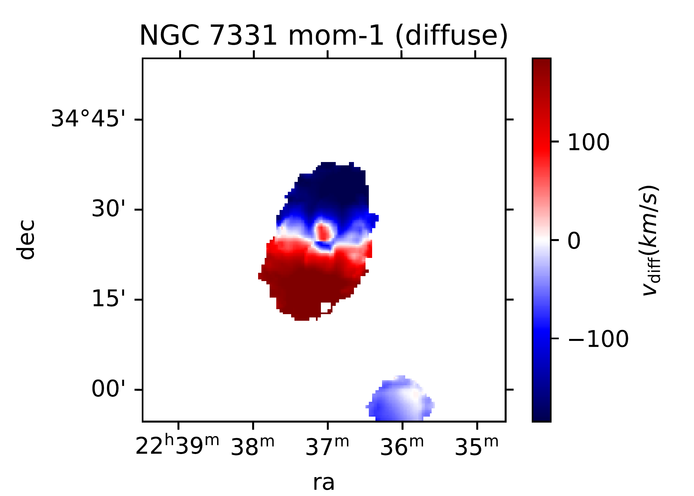

$\newcommand{\ensuremath}{}$
$\newcommand{\xspace}{}$
$\newcommand{\object}[1]{\texttt{#1}}$
$\newcommand{\farcs}{{.}''}$
$\newcommand{\farcm}{{.}'}$
$\newcommand{\arcsec}{''}$
$\newcommand{\arcmin}{'}$
$\newcommand{\ion}[2]{#1#2}$
$\newcommand{\textsc}[1]{\textrm{#1}}$
$\newcommand{\hl}[1]{\textrm{#1}}$
$\newcommand{\footnote}[1]{}$
$\newcommand{\url}[1]{\href{#1}{#1}}$
$\newcommand{\dodoi}[1]{doi:~\href{http://doi.org/#1}{\nolinkurl{#1}}}$
$\newcommand{\doeprint}[1]{\href{http://ascl.net/#1}{\nolinkurl{http://ascl.net/#1}}}$
$\newcommand{\doarXiv}[1]{\href{https://arxiv.org/abs/#1}{\nolinkurl{https://arxiv.org/abs/#1}}}$
$\newcommand{\hi}{{\rm H}{\textsc i}}$
$\newcommand{\angstrom}{\text{\normalfontÅ}}$
$\newcommand{◦ee}{\ensuremath{\text{\textdegree}}}$
$\newcommand{\jyb}{\rm{Jy~beam^{-1} }}$
$\newcommand{\jykms}{\rm{Jy~km~s^{-1} }}$
$\newcommand{\jybkms}{\rm{Jy~beam^{-1}~km~s^{-1} }}$
$\newcommand{\mjybi}{\rm{mJy~beam_{i}^{-1} }}$
$\newcommand{\mjyb}{\rm{mJy~beam^{-1} }}$
$\newcommand{\mjybs}{\rm{mJy~beam_{s}^{-1} }}$
$\newcommand{\jybs}{\rm{Jy~beam_{s}^{-1} }}$
$\newcommand{\mjybkms}{\rm{mJy~beam^{-1}~km~s^{-1} }}$
$\newcommand{\kms}{\rm{km~s^{-1} }}$
$\newcommand{\cmsq}{\rm{ cm^{-2} } }$
$\newcommand{\NHI}{N_{\rm HI}}$
$\newcommand{\Msun}{\rm{M_{\odot}}}$
$\newcommand\natexlab{#1}$

#  FEASTS Combined with Interferometry (I): Overall Properties of Diffuse $\hi$ and Implications for Gas Accretion in Nearby Galaxies

<mark>Appeared on: 2024-04-16</mark> -  _45 pages, 23 figures. In press at ApJ. Data will be released at the FEASTS site upon publication_

J. W. (王菁), et al. -- incl., <mark>F. Walter</mark>

**Abstract:** We present a statistical study of the properties of diffuse $\hi$ in ten nearby galaxies, comparing the $\hi$ detected by the single-dish telescope FAST (FEASTS program) and the interferometer VLA (THINGS program), respectively.The THINGS' observation missed $\hi$ with a median of 23 \% due to the short-spacing problem of interferometry and limited sensitivity.We extract the diffuse $\hi$ by subtracting the dense $\hi$ , which is obtained from the THINGS data with a uniform flux-density threshold, from the total $\hi$ detected by FAST.Among the sample, the median diffuse- $\hi$ fraction is 34 \% , and more diffuse $\hi$ is found in galaxies exhibiting more prominent tidal-interaction signatures.The diffuse $\hi$ we detected seems to be distributed in disk-like layers within a typical thickness of $1 \text{kpc}$ , different from the more halo-like diffuse $\hi$ detected around NGC 4631 in a previous study.Most of the diffuse $\hi$ is cospatial with the dense $\hi$ and has a typical column density of $10^{17.7}$ -- $10^{20.1} \text{cm}^{-2}$ .The diffuse and dense $\hi$ exhibits a similar rotational motion, but the former lags by a median of 25 \% in at least the inner disks, and its velocity dispersions are typically twice as high.Based on a simplified estimation of circum-galactic medium properties and assuming pressure equilibrium, the volume density of diffuse $\hi$ appears to be constant within each individual galaxy, implying its role as a cooling interface.Comparing with existing models, these results are consistent with a possible link between tidal interactions, the formation of diffuse $\hi$ , and gas accretion.

**Figure 15. -** The moment images of the galaxy NGC 628. The sky region displayed is the full region of the FEASTS data.
** Row 1:** moment 0-2 images of FEASTS data, representing the total $\hi$ at the FAST resolution. The circle in the bottom left of the shows the size of the FAST beam.)
** Row 2:** moment 0-2 images of THINGS data, representing the dense $\hi$ at the VLA resolution. We do not show the VLA synthesis beam as it is too small compared to the field of view.
** Row 3:** moment 0-2 images of dense $\hi$ at the FAST resolution.
** Row 4:** moment 0-2 images of the total $\hi$ minus the dense $\hi$, representing the diffuse $\hi$ at the FAST resolution.
** Row 5:** the difference in $\hi$ moment-1 images between the dense $\hi$ and diffuse $hi$ at the FAST resolution (the former minus the latter).   (*fig:mom_n628*)

**Figure 24. -** Same as Figure \ref{fig:mom_n628}, but for the galaxy NGC 7331.  (*fig:mom_n7331*)

**Figure 10. -** Radial profiles of diffuse $\hi$ properties.
The profiles are color coded by galaxy names as denoted in each panel, and the radius are normalized by the optical radius $R_{25}$. All profiles start from radius equal to beam FWHM of FAST.
All measurements are made at the same resolution of FEASTS  (9.1$\pm$2.5 kpc).
** a:** the column density profile.
The column densities are not corrected for projection because the inclinations in outer disks where diffuse $\hi$ dominates the total $\hi$ are highly uncertain.
The dashed horizontal line shows the rough column density threshold of selecting the dense $\hi$.
** b:** the profile of diffuse $\hi$ column densities over the total $\hi$ column densities.
** c:** the profile of projection corrected radial velocity difference between the dense and diffuse $\hi$(former minus latter) measured along major axis of galaxies (see Section \ref{sec:derive_prof}).
The projection-corrected radial velocities along the major axis approximate rotational velocities, but we warn of their uncertainties.
The solid and dashed curves are for the receding and approaching side of the disks respectively.
The dotted line marks the position of y$=$0.
** d:** similar as in Panel c, but the radial velocity difference is normalized by the radial velocity of the dense $\hi$ along the major axis.
Values between zero and unity indicate lagged rotational$\slash$orbital velocity (see Section \ref{sec:derive_prof}).
** e:** the profile of velocity dispersion. The solid and dashed lines are for the diffuse and dense $\hi$ respectively.
** f:** the profile of velocity dispersion over the projection corrected radial velocity along major axis for the diffuse $\hi$.
 (*fig:prof*)

