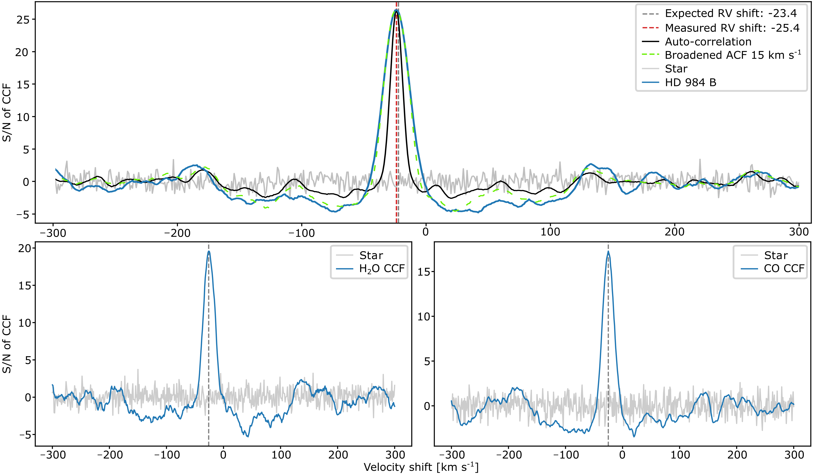
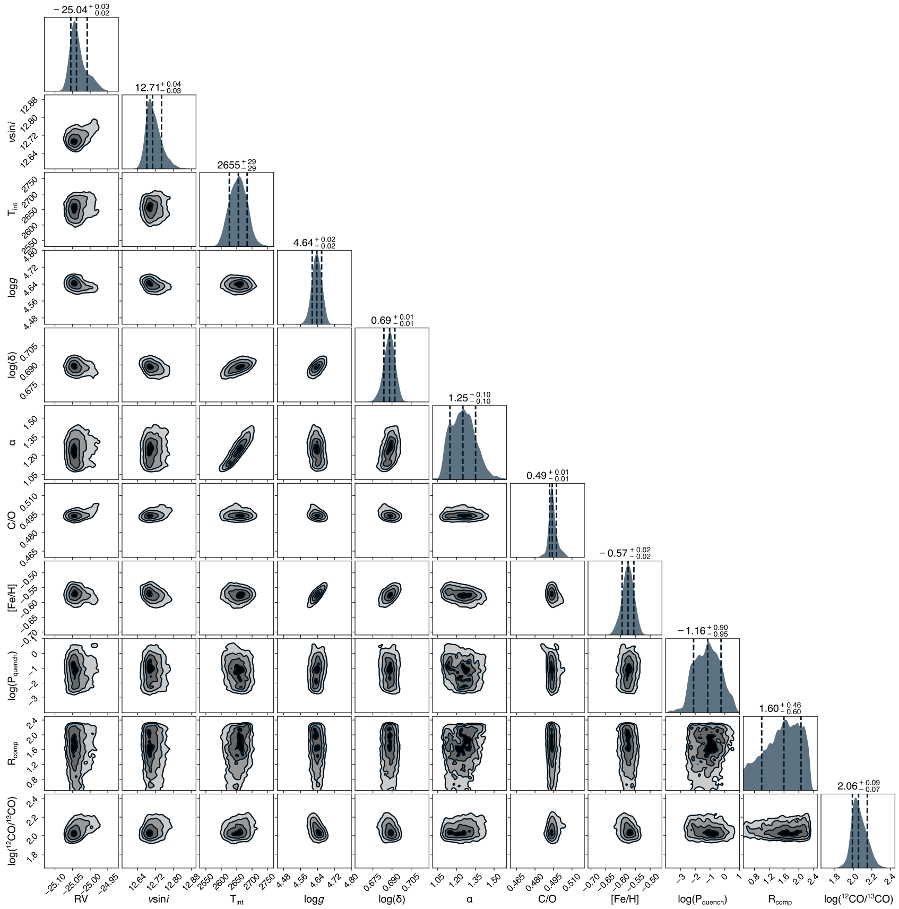

$\newcommand{\ensuremath}{}$
$\newcommand{\xspace}{}$
$\newcommand{\object}[1]{\texttt{#1}}$
$\newcommand{\farcs}{{.}''}$
$\newcommand{\farcm}{{.}'}$
$\newcommand{\arcsec}{''}$
$\newcommand{\arcmin}{'}$
$\newcommand{\ion}[2]{#1#2}$
$\newcommand{\textsc}[1]{\textrm{#1}}$
$\newcommand{\hl}[1]{\textrm{#1}}$
$\newcommand{\footnote}[1]{}$
$\newcommand{\Nstar}{HD~984}$
$\newcommand{\NTstar}{HIP~115119}$
$\newcommand{\NMstar}{HIP~95771}$
$\newcommand{\Ncomp}{HD~984~B}$
$\newcommand{\as}[1]{\textcolor{blue}{\bf #1}}$
$\newcommand{\pRT}{\texttt{petitRADTRANS}}$
$\newcommand{\rev}[1]{\textcolor{magenta}{\textbf{#1}}\xspace}$

# Fresh view of the hot brown dwarf $\Ncomp$ through high-resolution spectroscopy

<mark>Appeared on: 2024-04-18</mark> -  _14 pages, 8 figures_

J. C. Costes, et al. -- incl., <mark>P. Mollière</mark>

**Abstract:** High-resolution spectroscopy has the potential to drive a better understanding of the atmospheric composition, physics, and dynamics of young exoplanets and brown dwarfs, bringing clear insights into the formation channel of individual objects. Using the Keck Planet Imager and Characterizer (KPIC; $\mathrm{R \approx 35,000}$ ), we aim to characterize a young brown dwarf $\Ncomp$ . By measuring its C/O and $\mathrm{^{12}CO/^{13}CO}$ ratios, we expect to gain new knowledge about its origin by confirming the difference in the formation pathways between brown dwarfs and super-Jupiters. We analysed the KPIC high-resolution spectrum (2.29–2.49 $\mu$ m) of $\Ncomp$ using an atmospheric retrieval framework based on nested sampling and $\pRT$ , using both clear and cloudy models. Using our best-fit model, we find $\rm{C/O}=0.50 \pm 0.01$ (0.01 is the statistical error) for $\Ncomp$ which agrees with that of its host star within 1 $\sigma$ ( $0.40 \pm 0.20$ ). We also retrieve an isotopolog $\mathrm{^{12}CO/^{13}CO}$ ratio of $98^{+20}_{-25}$ in its atmosphere, which is similar to that of the Sun. In addition, $\Ncomp$ has a substellar metallicity with $[$ Fe/H $] = -0.62^{+0.02}_{-0.02}$ . Finally, we find that most of the retrieved parameters are independent of our choice of retrieval model. From our measured C/O and $\mathrm{^{12}CO/^{13}CO}$ , the favored formation mechanism of $\Ncomp$ seems to be via gravitational collapse or disk instability and not core accretion, which is a favored formation mechanism for giant exoplanets with $m<13 \mathrm{M_{Jup}}$ and semimajor axis between 10 and 100 au. However, with only a few brown dwarfs with a measured $\mathrm{^{12}CO/^{13}CO}$ ratio, similar analyses using high-resolution spectroscopy will become essential in order to determine planet formation processes more precisely.

**Figure 4. -**  CCFs between the KPIC data (using the three orders from 2.29 to 2.49 $\mu$m) and different models. Top panel: CCFs between the KPIC data and a BT-Settl model (see Section \ref{Preliminary_Analysis}). The CCF for $\Ncomp$ is plotted in blue, and for comparison, we add the CCF of the stellar data in gray. The autocorrelation of the planetary model is also shown in black. The standard deviation of the wings of the CCF were used to estimate its noise and to normalize the CCF. The dashed vertical gray and red lines show the expected and measured RV of the companion ($-23.4 \mathrm{km s^{-1}}$ and $-25.8 \mathrm{km s^{-1}}$, respectively). Bottom panels: CCFs showing the $H_2$O and CO detection from the same KPIC data after using single-molecule templates. (*fig:CCF*)

**Figure 7. -**  The $\mathrm{P-T}$ profile from our best-fit retrieval (model $\mathrm{MgSiO_{3} + Fe}$). The best-fit profile is shown in black, and 200 random draws from the posterior are shown in blue. The condensation curves for different cloud species ($\mathrm{MgSiO_{3}}$, Fe and $\mathrm{Al_{2}O_{3}}$) are also plotted. In addition, we show multiple Sonora $\mathrm{P-T}$ profiles as dashed lines \citep{Marley2021} with similar properties as $\Ncomp$. Finally, we plot the emission contribution function (in wavelength, top axis) as contours, which quantifies the relative importance of the emission in a given pressure layer to the total at a given wavelength \citep{Molliere2019}. (*fig:PT_profile*)

**Figure 3. -**  Extended corner plot showing the posterior distribution for our clear model retrieval for $\Ncomp$(see Section \ref{clear model}). The titles at the top of each histogram show the median and 1$\sigma$ error. (*fig:Corner_2*)

