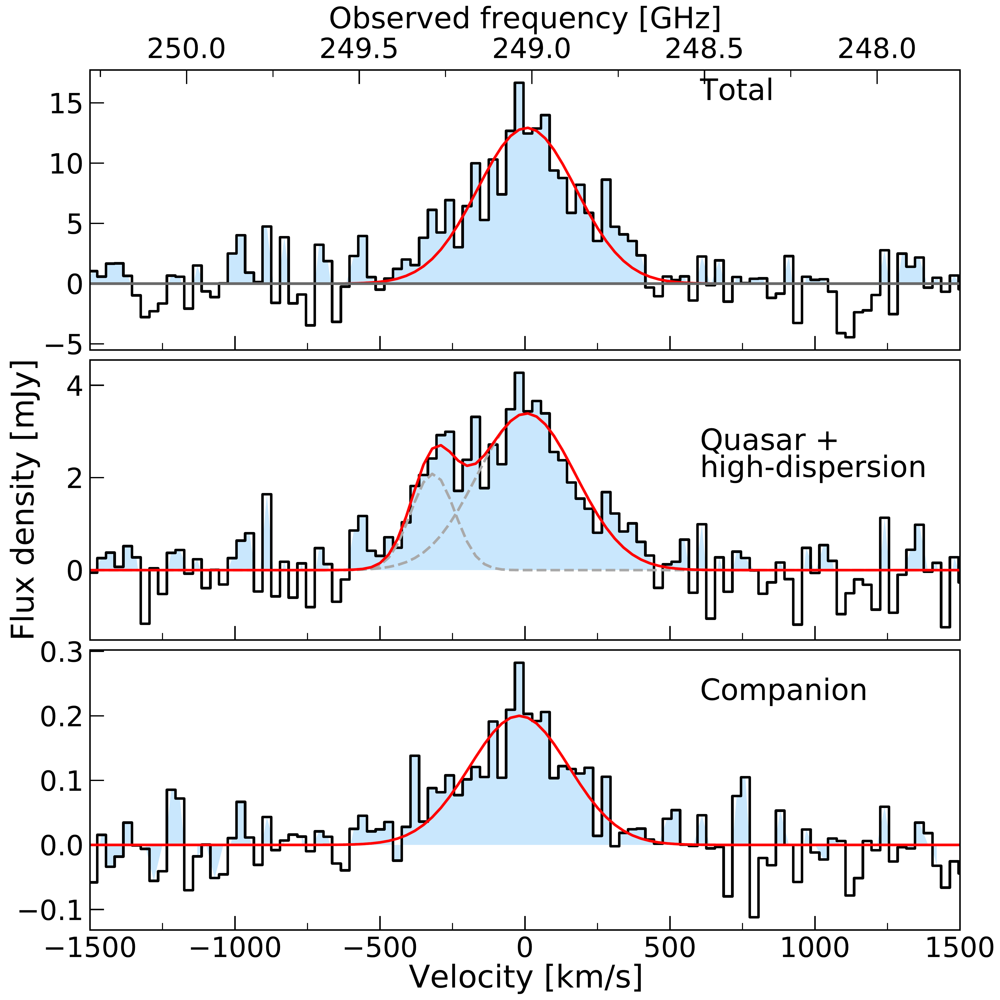
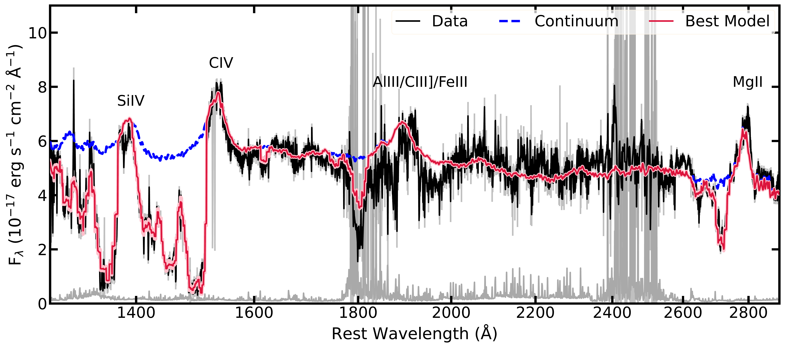
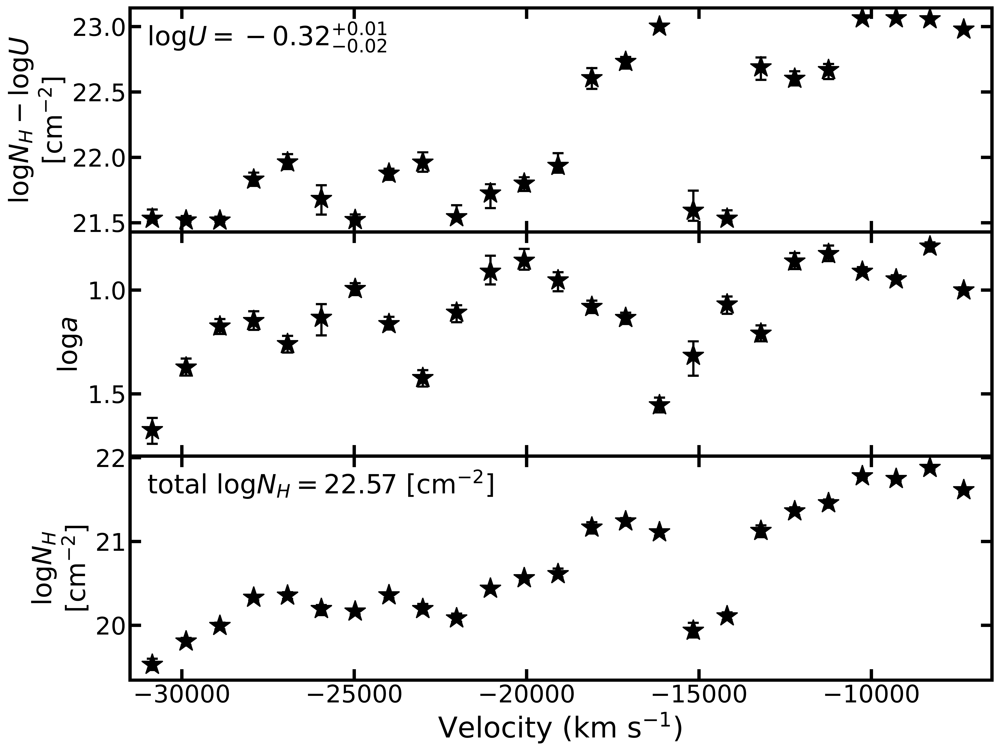
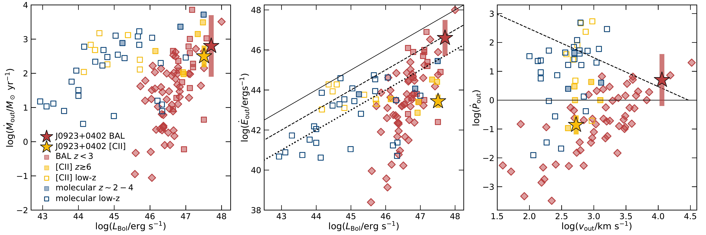

$\newcommand{\ensuremath}{}$
$\newcommand{\xspace}{}$
$\newcommand{\object}[1]{\texttt{#1}}$
$\newcommand{\farcs}{{.}''}$
$\newcommand{\farcm}{{.}'}$
$\newcommand{\arcsec}{''}$
$\newcommand{\arcmin}{'}$
$\newcommand{\ion}[2]{#1#2}$
$\newcommand{\textsc}[1]{\textrm{#1}}$
$\newcommand{\hl}[1]{\textrm{#1}}$
$\newcommand{\footnote}[1]{}$
$\newcommand{\vdag}{(v)^\dagger}$
$\newcommand$
$\newcommand$
$\newcommand{\lcii}{L_{\rm[CII]}}$
$\newcommand{\lir}{L_{\rm IR}}$
$\newcommand{\zn}{J0923+0402}$
$\newcommand{\kms}{km s^{-1}}$
$\newcommand{\lbol}{L_{\rm Bol}}$

# Multi-phase black-hole feedback and a bright [CII] halo in a Lo-BAL quasar at $\mathbf{z\sim6.6}$

<mark>Appeared on: 2024-04-22</mark> -  _Submitted to ApJ_

M. Bischetti, et al. -- incl., <mark>E. Bañados</mark>, <mark>F. Walter</mark>

**Abstract:** Although the mass growth of supermassive black holes during the Epoch of Reionisation is expected to play a role in shaping the concurrent growth of their host-galaxies, observational evidence of feedback at z $\gtrsim$ 6 is still sparse. We perform the first multi-scale and multi-phase characterisation of black-hole driven outflows in the $z\sim6.6$ quasar J0923+0402 and assess how these winds impact the cold gas reservoir. We employ the SimBAL spectral synthesis to fit broad absorption line (BAL) features and find a powerful ionized outflow on $\lesssim210$ pc scale, with a kinetic power $\sim2-100$ \% of the quasar luminosity. ALMA observations of [ CII ] emission allow us to study the morphology and kinematics of the cold gas. We detect high-velocity [ CII ] emission, likely associated with a cold neutral outflow at $\sim0.5-2$ kpc scale in the host-galaxy, and a bright extended [ CII ] halo with a size of $\sim15$ kpc. For the first time at such an early epoch, we accurately constrain the outflow energetics in both the ionized and the atomic neutral gas phases. We find such energetics to be consistent with expectations for an efficient feedback mechanism, and both ejective and preventative feedback modes are likely at play. The scales and energetics of the ionized and atomic outflows suggest that they might be associated with different quasar accretion episodes. The results of this work indicate that strong black hole feedback is occurring in quasars at $z\gtrsim6$ and is likely responsible for shaping the properties of the cold gas reservoir up to circum-galactic scales.

**Figure 5. -** _ Left:_ Map of the [CII] emission in $\zn$. Solid contours correspond to [3,4,6,8,10,12,13]$\sigma$ significance, where $\sigma=0.017$ Jy beam$^{-1}$\kms. The same levels are shown for the continuum emission by the dashed contours, with $\sigma=5.9\times10^{-6}$ Jy beam$^{-1}$. The black cross indicates the quasar optical position, as measured from NIRCam F200W data, and the white plus sign corresponds to the peak of the 242-257 GHz continuum emission probed by ALMA. _Middle:_[CII] spectrum corresponding to the total emission detected at $\gtrsim3\sigma$(top panel). The best-fit Gaussian profile is shown by the red curve. Middle panel displays the [CII] spectrum extracted from the region with velocity dispersion higher than 230 $\kms$, including the quasar location. To model the line profile, we added a second blueshifted Gaussian component with $v\simeq-300$\kms to the scaled best-fit model of the top panel. Bottom panel shows the [CII] spectrum extracted from one beam aperture centred on the secondary continuum peak. _ Right:_ Velocity and velocity dispersion maps corresponding to the [CII] emission at $>3\sigma$. The black-dashed polygon highlights the triangle-shaped region with high-velocity dispersion (Sect. \ref{subsec:alma}). (*fig:cii-integrated*)

**Figure 4. -** _Left:_ X-Shooter spectrum of $\zn$(black) and best-fitting _SimBAL_ model (red).
    The dashed blue curve represents the unabsorbed quasar emission model by \citep{Bischetti23}.
    The noise spectrum and the spectral regions excluded from the fit are plotted in grey.
    Labels indicate the major UV emission lines. _Right:_ BAL outflow physical parameters as a function of velocity with error bars representing 95\% confidence regions.
    The top two panels show the fit parameters ($\log U$, $\log N_H-\log U$, $\log a$) used in _SimBAL_ modeling.
    The bottom panel shows the distribution of hydrogen column density ($\log N_H$) corrected for the covering fraction (Appendix \ref{App:simbal}).
     (*fig:simbal_bestfit*)

**Figure 6. -** _ Left:_ Mass outflow rate as a function of bolometric luminosity for the [CII] and BAL outflow detected in $\zn$(stars). The shaded bars show the range of possible values according to our analysis. We compare our results with [CII] outflows from \cite{Bischetti19, Izumi21a, Izumi21, Tripodi22} and BAL outflows from \cite{Choi20,Choi22}(diamonds) and \cite{Miller20}(squares). We also include the compilation of black-hole driven molecular outflows from \cite{Bischetti19pds} and references therein, and recent measurements by \cite{RamosAlmeida22, Zanchettin21, Zanchettin23}.
    The estimates for the comparison BAL outflows were also calculated assuming a thin-shell scenario.
    The bolometric luminosity for the BAL outflow of $\zn$ is arbitrarily shifted for plotting. _ Middle:_ Outflow kinetic power as a function of $L_{\rm Bol}$. The solid, dashed and dotted lines correspond to $L_{\rm Bol}$, 0.1$L_{\rm Bol}$, and 0.01$L_{\rm Bol}$, respectively. _ Right:_ Outflow momentum flux as a function of the outflow velocity. The solid(dashed) line indicates the expected momentum boost for a black-hole driven wind arising with nuclear velocity 0.1$c$ and propagating with a momentum(energy) conserving expansion \citep{Zubovas&King12}.  (*fig:correlations*)

