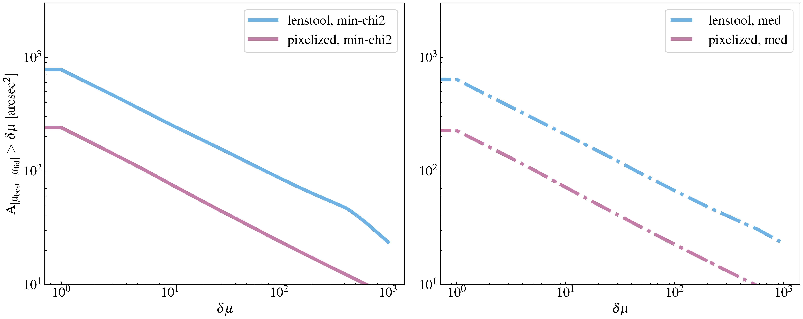

$\newcommand{\ensuremath}{}$
$\newcommand{\xspace}{}$
$\newcommand{\object}[1]{\texttt{#1}}$
$\newcommand{\farcs}{{.}''}$
$\newcommand{\farcm}{{.}'}$
$\newcommand{\arcsec}{''}$
$\newcommand{\arcmin}{'}$
$\newcommand{\ion}[2]{#1#2}$
$\newcommand{\textsc}[1]{\textrm{#1}}$
$\newcommand{\hl}[1]{\textrm{#1}}$
$\newcommand{\footnote}[1]{}$
$\newcommand{\thebibliography}{\DeclareRobustCommand{\VAN}[3]{##3}\VANthebibliography}$

# CURLING - $\uppercase$$\expandafter{\romannumeral1}$. The Influence of Point-like Image Approximation on the Outcomes of Cluster Strong Lens Modeling

<mark>Appeared on: 2024-05-07</mark> -  _12 pages, 8 figures_

Y. Xie, et al. -- incl., <mark>J. Li</mark>

**Abstract:** Cluster-scale strong lensing is a powerful tool for exploring the properties of dark matter and constraining cosmological models. However, due to the complex parameter space, pixelized strong lens modeling in galaxy clusters is computationally expensive, leading to the point-source approximation of strongly lensed extended images, potentially introducing systematic biases. Herein, as the first paper of the ClUsteR strong Lens modelIng for the Next-Generation observations (CURLING) program, we use lensing ray-tracing simulations to quantify the biases and uncertainties arising from the point-like image approximation for JWST-like observations. Our results indicate that the approximation works well for reconstructing the total cluster mass distribution, but can bias the magnification measurements near critical curves and the constraints on the cosmological parameters, the total matter density of the Universe $\Omega_{\rm m}$ , and dark energy equation of state parameter $w$ . To mitigate the biases, we propose incorporating the extended surface brightness distribution of lensed sources into the modeling. This approach reduces the bias in magnification from 46.2 per cent to 0.09 per cent for $\mu \sim 1000$ . Furthermore, the median values of cosmological parameters align more closely with the fiducial model. In addition to the improved accuracy, we also demonstrate that the constraining power can be substantially enhanced. In conclusion, it is necessary to model cluster-scale strong lenses with pixelized multiple images, especially for estimating the intrinsic luminosity of highly magnified sources and accurate cosmography in the era of high-precision observations.

**Figure 5. -** Log-scale difference between the recovered and fiducial magnification maps at $z_{\rm s} = 10$ with Lenstool(left panel) and pixelated modeling (right panel), with critical curves overlaid as black dots. Note: Regions with little difference ($<10^{-7}$) are plotted as white areas since they become Not-a-Number (NaN) in log scale. (*fig5*)

**Figure 6. -** Total area as a function of the difference between the recovered and fiducial magnification maps. Left: comparison between Lenstool(blue) and pixelated modeling (pink) with the best-fit result defined as model with minimum $\chi^2$; right: same with left but with the best-fit result defined as medians of the parameters.  (*fig6*)

**Figure 3. -** Circularly averaged mass profiles of the cluster recovered with blue: Lenstool and red: pixelated modeling. Shaded regions are obtained from the randomly selected 2000 realizations in the MCMC outputs. The input mass profile is indicated as the black line. (*fig4*)

