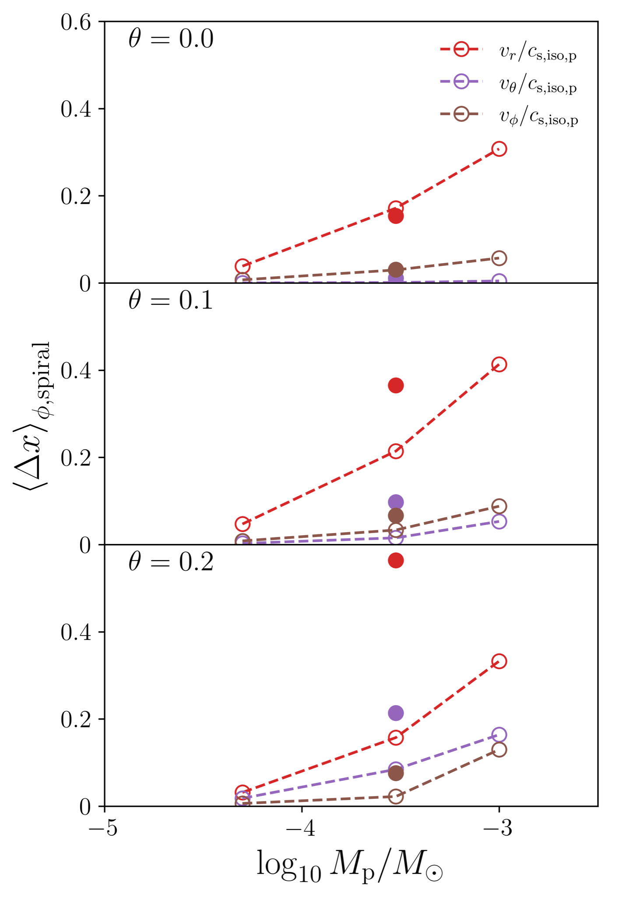
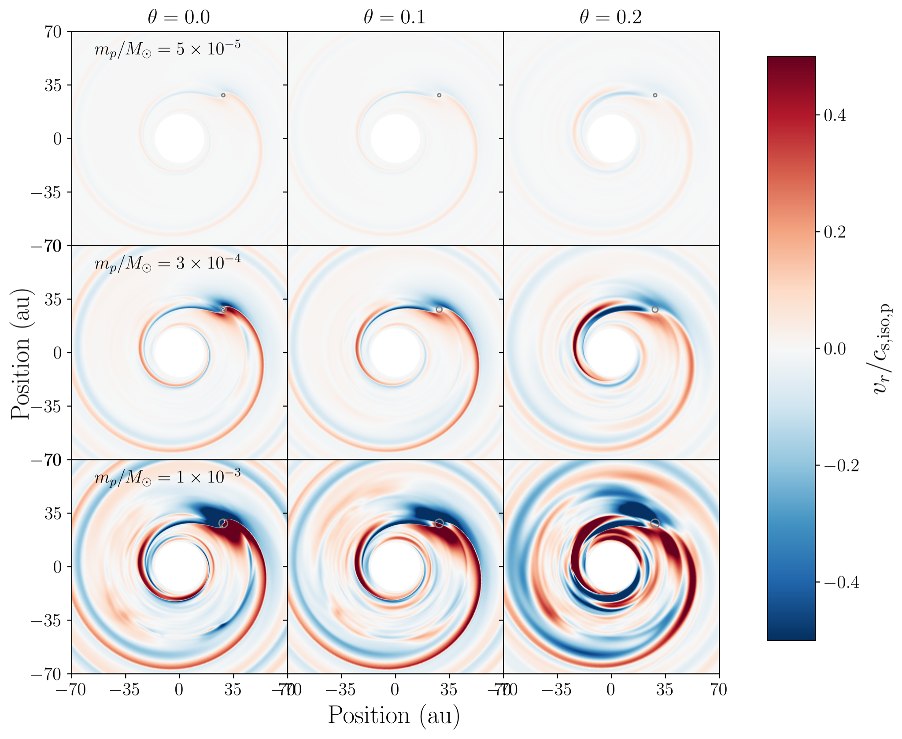

$\newcommand{\ensuremath}{}$
$\newcommand{\xspace}{}$
$\newcommand{\object}[1]{\texttt{#1}}$
$\newcommand{\farcs}{{.}''}$
$\newcommand{\farcm}{{.}'}$
$\newcommand{\arcsec}{''}$
$\newcommand{\arcmin}{'}$
$\newcommand{\ion}[2]{#1#2}$
$\newcommand{\textsc}[1]{\textrm{#1}}$
$\newcommand{\hl}[1]{\textrm{#1}}$
$\newcommand{\footnote}[1]{}$
$\newcommand{\vdag}{(v)^\dagger}$
$\newcommand$
$\newcommand$
$\newcommand{\dmnote}[1]{{\bf \color{blue}[D.M.: #1]}}$
$\newcommand{\dmfnote}[1]{{\bf \color{orange}[D.M.F.: #1]}}$
$\newcommand{\hknote}[1]{{\bf \color{green}[H.K.: #1]}}$
$\newcommand{\vdag}{(v)^\dagger}$
$\newcommand$
$\newcommand$
$\newcommand{\dmnote}[1]{{\bf \color{blue}[D.M.: #1]}}$
$\newcommand{\dmfnote}[1]{{\bf \color{orange}[D.M.F.: #1]}}$
$\newcommand{\hknote}[1]{{\bf \color{green}[H.K.: #1]}}$

# Three-temperature radiation hydrodynamics with PLUTO

<mark>Appeared on: 2024-05-07</mark> -  _Accepted to Astronomy and Astrophysics; 22 pages, 19 figures incl. Appendix. Comments and questions welcome_

<mark>D. Muley</mark>, J. D. M. Fuksman, <mark>H. Klahr</mark>

**Abstract:** In circumstellar disks around young stars, the gravitational influence of nascent planets produces telltale patterns in density, temperature, and kinematics. To better understand these signatures, we first performed 3D hydrodynamical simulations of a 0.012 $M_{\odot}$ disk, with a Saturn-mass planet orbiting circularly in-plane at 40 au. We tested four different disk thermodynamic prescriptions (in increasing order of complexity, local isothermality, $\beta$ -cooling, two-temperature radiation hydrodynamics, and three-temperature radiation hydrodynamics), finding that $\beta$ -cooling offers a reasonable approximation for the three-temperature approach when the planet is not massive or luminous enough to substantially alter the background temperature and density structure. Thereafter, using the three-temperature scheme, we relaxed this assumption, simulating a range of different planet masses (Neptune-mass, Saturn-mass, Jupiter-mass) and accretion luminosities (0, $10^{-3} L_{\odot}$ ) in the same disk. Our investigation revealed that signatures of disk-planet interaction strengthen with increasing planet mass, with circumplanetary flows becoming prominent in the high-planet-mass regime. Accretion luminosity, which adds pressure support around the planet, was found to weaken the midplane Doppler-flip, potentially visible in optically thin tracers like C $^{18}$ O, while strengthening the spiral signature, particularly in upper disk layers sensitive to thicker lines, like those of $^{12}$ CO.

**Figure 17. -** Measurement of the azimuthal perturbation in each normalized quantity $x$, averaged over an azimuthal range of $\phi_{\rm peak} \pm 2 h_p$ according to Equation \ref{eq:spiral_avg}. Densities and temperatures are plotted in the left panel while velocities are in the right. Open circles indicate non-accreting planets while closed circles indicate those with accretion luminosity (see Section \ref{sec:acclum_analysis} for discussion). At $z/r \approx \theta = 0.2$, where dust and gas are not well-coupled, the plotted $T_{\rm dust}$ amplitude reflects the radial "pseudo-arm" (see discussion in Section \ref{sec:equilibrium_temp}) rather than the Lindblad spiral. (*fig:spiral_amplitude_quantitative*)

**Figure 18. -** Radial velocities $v_r$ from 3T, zero-accretion-luminosity simulations with Neptune-mass _(top row)_, Saturn-mass _(middle row)_, and Jupiter-mass _(bottom row)_ planets, at various altitudes in the disk _(left, middle, right columns)_. Grey circles indicate the planetary Hill radius. All $v_r$ values are expressed as a function of initial isothermal sound speed at the location of the planet, $c_{\rm iso, p} = \sqrt{p_{p,0}/\rho_{p, 0}}$.  (*fig:rad_vel_perturbation*)

**Figure 29. -** Measurement of the azimuthal perturbation in each normalized quantity $x$, averaged over an azimuthal range of $\phi_{\rm peak} \pm 2 h_p$ according to Equation \ref{eq:spiral_avg}. Densities and temperatures are plotted in the left panel while velocities are in the right. Open circles indicate non-accreting planets while closed circles indicate those with accretion luminosity (see Section \ref{sec:acclum_analysis} for discussion). At $z/r \approx \theta = 0.2$, where dust and gas are not well-coupled, the plotted $T_{\rm dust}$ amplitude reflects the radial "pseudo-arm" (see discussion in Section \ref{sec:equilibrium_temp}) rather than the Lindblad spiral. (*fig:spiral_amplitude_quantitative*)

