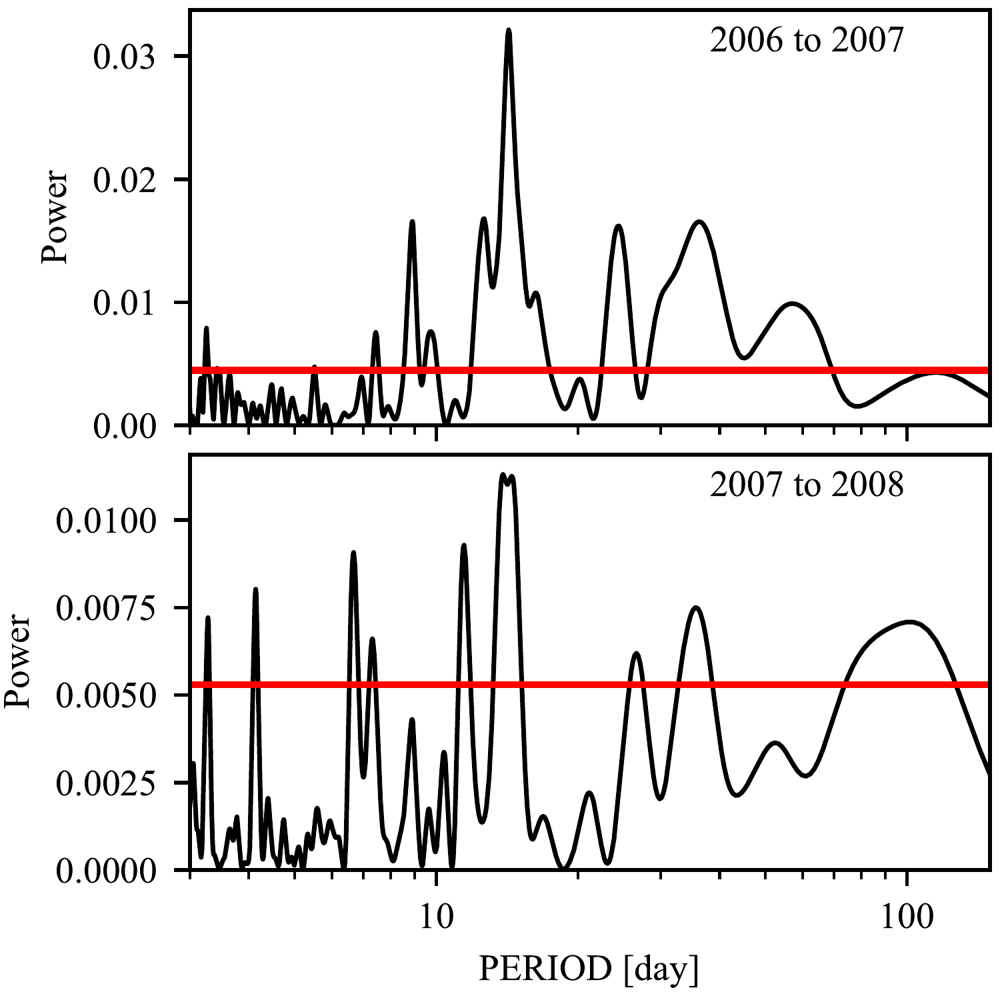

$\newcommand{\ensuremath}{}$
$\newcommand{\xspace}{}$
$\newcommand{\object}[1]{\texttt{#1}}$
$\newcommand{\farcs}{{.}''}$
$\newcommand{\farcm}{{.}'}$
$\newcommand{\arcsec}{''}$
$\newcommand{\arcmin}{'}$
$\newcommand{\ion}[2]{#1#2}$
$\newcommand{\textsc}[1]{\textrm{#1}}$
$\newcommand{\hl}[1]{\textrm{#1}}$
$\newcommand{\footnote}[1]{}$
$\newcommand{\ms}{ ms^{-1}}$
$\newcommand{\mjup}{ M_{\rm J}}$
$\newcommand{\rjup}{ R_{\rm J}}$
$\newcommand{\msun}{ M_{\odot}}$
$\newcommand{\kepler}{{\it Kepler}}$
$\newcommand{\corot}{{\it CoRoT}}$
$\newcommand{\tess}{{\it TESS}}$
$\newcommand{\plato}{{\it PLATO}}$
$\newcommand{\gaia}{{\it Gaia}}$
$\newcommand{\jwst}{{\it JWST}}$
$\newcommand{\ngts}{{NGTS}}$
$\newcommand{\wasp}{{WASP}}$
$\newcommand{\coralie}{{CORALIE}}$
$\newcommand{\harps}{{HARPS}}$
$\newcommand{\feros}{{FEROS}}$
$\newcommand{\chiron}{{CHIRON}}$
$\newcommand{\pfs}{{PFS}}$
$\newcommand{\LSO}{La Silla Observatory}$
$\newcommand{\PAR}{Paranal Observatory}$
$\newcommand{\ktwo}{{\it K2}}$
$\newcommand{\teff}{{T_{\rm eff}}}$
$\newcommand{\logg}{{\log g}}$
$\newcommand{\feh}{[Fe/H]}$
$\newcommand{\vsini}{V\sin i}$
$\newcommand{\systemt}{{\rm TOI-2447}}$
$\newcommand{\systemtic}{{\rm TIC-1167538}}$
$\newcommand{\systemtb}{{\rm TOI-2447 b}}$
$\newcommand{\systemc}{{\rm NGTS-29 c}}$
$\newcommand{\systemn}{{\rm NGTS-29}}$
$\newcommand{\systemnb}{{\rm NGTS-29 b}}$
$\newcommand{\system}{{\rm TOI-2447}}$
$\newcommand{\systemb}{{\rm TOI-2447 b}}$
$\newcommand{\thebibliography}{\DeclareRobustCommand{\VAN}[3]{##3}\VANthebibliography}$

# TOI-2447 b $\slash$ NGTS-29 b: a 69-day Saturn around a Solar analogue

<mark>Appeared on: 2024-05-14</mark> -  _16 pages, 12 figures. Accepted for publication in MNRAS_

S. Gill, et al. -- incl., <mark>J. Eberhardt</mark>, <mark>T. Henning</mark>, <mark>T. Trifonov</mark>

**Abstract:** Discovering transiting exoplanets with relatively long orbital periods ( $>$ 10 days) is crucialtofacilitate the study of cool exoplanet atmospheres ( $T_{\rm eq} < 700 K$ ) and to understand exoplanet formation and inward migration further out than typical transiting exoplanets.  In order to discover these longer period transiting exoplanets, long-term photometric and radial velocity campaigns are required. We report the discovery of $\systemb$ ( $=$ $\systemnb$ ), a Saturn-mass transiting exoplanet orbiting a bright (T=10.0) Solar-type star ( $\teff$ =5730 K). $\systemb$ was identified as a transiting exoplanet candidate from a single transit event of 1.3 \% depth and 7.29 h duration in $\tess$ Sector 31 and a prior transit event from 2017 in NGTS data. Four further transit events were observed with $\ngts$ photometry which revealed an orbital period of P=69.34 days.  The transit events establish a radius for $\systemb$ of $0.865 \pm 0.010 \rm R_{\rm J}$ , while radial velocity measurements give a mass of $0.386 \pm 0.025 \rm M_{\rm J}$ .  The equilibrium temperature of the planet is $414$ K, making it much cooler than the majority of TESS planet discoveries. We also detect a transit signal in $\ngts$ data not caused by $\systemb$ , along with transit timing variations and evidence for a $\sim$ 150 day signal in radial velocity measurements. It is likely that the system hosts additional planets, but further photometry and radial velocity campaigns will be needed to determine their parameters with confidence. $\systemtb$ $\slash$ $\systemnb$ joins a small but growing population of cool giants that will provide crucial insights into giant planet composition and formation mechanisms.

**Figure 4. -** Lomb–Scargle power spectrum (black) of photometric observations for each season of $\wasp$ data of $\system$. We also plot the power-spectrum level (red) corresponding to a 1\% false-alarm probability for the highest peak in each season of data. (*fig:WASP_LS*)

**Figure 7. -** Lomb–Scargle power spectrum (black) of photometric observations for each season of $\wasp$ data of $\system$. We also plot the power-spectrum level (red) corresponding to a 1\% false-alarm probability for the highest peak in each season of data. (*fig:WASP_LS*)

**Figure 2. -** $\tess$ SPOC 2-minute lightcurves plotted in raw cadence (grey points) and binned to 10 minutes (black points) for $\systemt$ic$\slash$\systemt$\slash$\systemn from Sector 5 (top panel), Sector 31 (second panel) and Sector 32 (third panel).  The single transit event is marked in red in Sector 31.  A zoom-in of the normalised single-transit event in Sector 31 is shown in the lower panel, along with our best fitting transit model (orange line).  A possible spot crossing event can be seen during the transit (red box). (*fig:tess_lc*)

