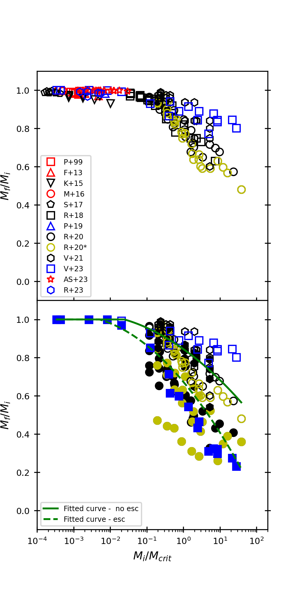

$\newcommand{\ensuremath}{}$
$\newcommand{\xspace}{}$
$\newcommand{\object}[1]{\texttt{#1}}$
$\newcommand{\farcs}{{.}''}$
$\newcommand{\farcm}{{.}'}$
$\newcommand{\arcsec}{''}$
$\newcommand{\arcmin}{'}$
$\newcommand{\ion}[2]{#1#2}$
$\newcommand{\textsc}[1]{\textrm{#1}}$
$\newcommand{\hl}[1]{\textrm{#1}}$
$\newcommand{\footnote}[1]{}$

# The efficiency of black hole formation via collisions\ in stellar systems:

<mark>Appeared on: 2024-05-21</mark> -  _15 pages, 5 figures_

M. Vergara, et al. -- incl., <mark>N. Hoyer</mark>, <mark>N. Neumayer</mark>

**Abstract:** This paper explores the theoretical relation between star clusters and black holes within, focusing on the potential role of Nuclear Star Clusters ( NSCs ), Globular Clusters ( GCs ), and Ultra Compact Dwarf Galaxies ( UCDs ) as environments that lead to black hole formation through stellar collisions. The study aims to identify optimal conditions for stellar collisions in different stellar systems leading to the formation of very massive stars that subsequently collapse into black holes. Data from numerical simulations and observations of diverse stellar systems are analyzed, encompassing various initial conditions, initial mass functions, and stellar evolution scenarios. We compute a critical mass, determined by the interplay of collision time, system age, and initial properties of the star cluster. The efficiency of black hole formation ( $\epsilon_{\mathrm{BH}}$ ) is defined as the ratio of initial stellar mass divided by critical mass. The study finds out that stellar systems with a ratio of initial stellar mass over critical mass above 1 exhibit high efficiencies of black hole formation, ranging from $30-100\%$ . While there is some scatter, potentially attributed to complex system histories and the presence of gas, the results highlight the potential for achieving high efficiencies through a purely collisional channel in black hole formation. In conclusion, this theoretical exploration elucidates the connection between star clusters and black hole formation. The study underscores the significance of UCDs , GCs , and NSCs as environments conducive to stellar collisions leading to black hole formation. The defined black hole formation efficiency ( $\epsilon_{\mathrm{BH}}$ ) is shown to be influenced by the ratio of initial stellar mass to critical mass.

**Figure 5. -** Left: The black hole formation efficiency $\epsilon_{\mathrm{BH}}$ computed by Eq. \ref{effbh} against the initial mass of the cluster $M_{\mathrm{i}}$ normalized by the critical mass $M_{\mathrm{crit}}$, calculated via Eq. \ref{eq3_mass_crit}. Different types of star clusters are represented by distinct colors: black symbols for $1^\text{st}$ star clusters (yellow symbols data from \citet{Reinoso2020}, represent models with external potential, calculated via Eq. \ref{eq3_mass_crit_ext}.), red symbols for GCs and blue symbols for NSCs. The final stellar mass is estimated neglecting mass loss via Eq. \ref{noloss}. Right: The black hole formation efficiency $\epsilon_{\mathrm{BH}}$ computed by Eq. \ref{effbh} against the current mass of the cluster $M_{\mathrm{i}}$ normalized by the critical mass $M_{crit}$ calculated from Eq. \ref{eq3_mass_crit}, including an approximate correction for mass loss. (*figure1*)

**Figure 3. -** Top: $M_{\mathrm{f}}/M_{\mathrm{i}}$ as a function of $M_{\mathrm{i}}/M_{\mathrm{crit}}$, assuming that $M_{\mathrm{i}}=M_{\mathrm{f}}+M_{\mathrm{BH}}$ for all simulations considered from Table 1. Bottom: $M_{\mathrm{f}}/M_{\mathrm{i}}$ as a function of $M_{\mathrm{i}}/M_{\mathrm{crit}}$ using the simulations of \citet{Reinoso2020, Vergara2021, Vergara2023}. We show both the result as it would appear considering the approximation used in Eq. \ref{simple} via the solid line, as well as the result when we employ the initial and final stellar masses as obtained from the simulation. In the second case the plot is qualitatively similar but with a steeper decrease due to the escapers. The figure also indicates our polynomial fits to the obtained relations. (*fig_MfMi_all_sims*)

**Figure 1. -** The black hole formation efficiency $\epsilon_{BH}$ computed via Eq. \ref{effbh} against the initial mass of the cluster normalized by the critical mass $M_{crit}$(estimated from the current properties of the cluster), for observational data. (*fig:figure2*)

