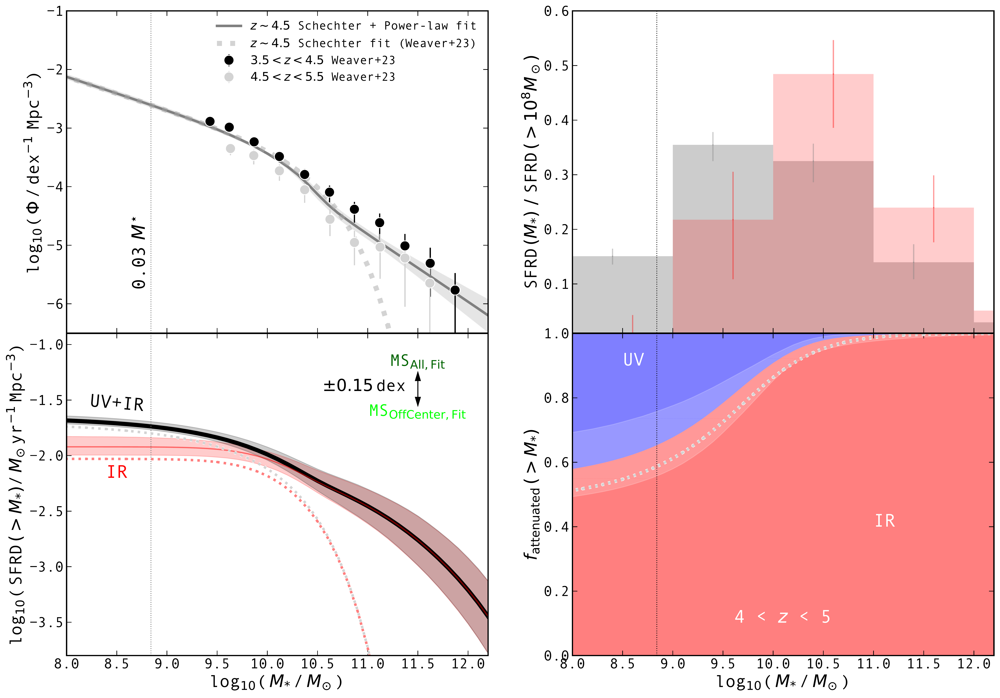
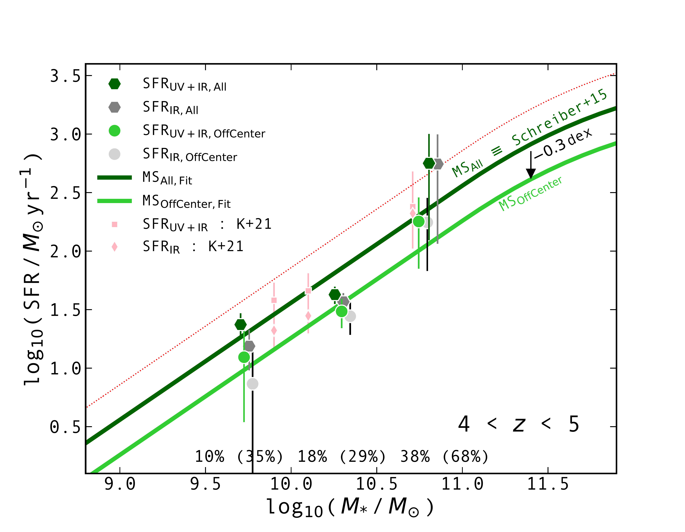

$\newcommand{\ensuremath}{}$
$\newcommand{\xspace}{}$
$\newcommand{\object}[1]{\texttt{#1}}$
$\newcommand{\farcs}{{.}''}$
$\newcommand{\farcm}{{.}'}$
$\newcommand{\arcsec}{''}$
$\newcommand{\arcmin}{'}$
$\newcommand{\ion}[2]{#1#2}$
$\newcommand{\textsc}[1]{\textrm{#1}}$
$\newcommand{\hl}[1]{\textrm{#1}}$
$\newcommand{\footnote}[1]{}$
$\newcommand{\acosmos}{A^3COSMOS }$
$\newcommand\natexlab{#1}$

# A$^3$COSMOS: Measuring the cosmic dust-attenuated star formation rate density at $4 < z < 5$

<mark>Appeared on: 2024-05-29</mark> -  _Accepted for publication in A&A; 14 pages and 8 figures_

B. Magnelli, et al. -- incl., <mark>E. Schinnerer</mark>

**Abstract:** In recent years, conflicting results have provided an uncertain view of the dust-attenuated star-forming properties of $z\gtrsim4$ galaxies. To solve this, we need to accurately measure the mean dust-attenuated properties of star-forming galaxies (SFGs) at $4<z<5$ and therefore constrain the cosmic dust-attenuated star formation rate density (SFRD) of the Universe 1.3 Giga-years after the Big Bang. We used the deepest optical-to-near-infrared data publicly available in the Cosmic Evolution Survey (COSMOS) field to build a mass-complete ( $>10^{9.5} M_{\odot}$ ) sample of SFGs at $4<z<5$ .   Then, we measured their mean dust-attenuated properties (i.e., infrared luminosity, $\langle L_{\rm IR}\rangle$ ; dust-attenuated star formation rate, $\langle{\rm SFR}_{\rm IR}\rangle$ ) by dividing our sample in three stellar mass ( $M_\ast$ ) bins (i.e., $10^{9.5} < M_\ast/M_\odot<10^{10}$ , $10^{10} < M_\ast/M_\odot<10^{10.5}$ , and $10^{10.5} < M_\ast/M_\odot<10^{11.5}$ ) and by stacking in the $uv$ domain all archival Atacama Large Millimeter/submillimeter Array (ALMA) band 6 and 7 observations available for these galaxies.   Then, we combined this information with their mean rest-frame ultraviolet (UV) emission measured from the COSMOS2020 catalog (i.e., UV luminosity, $\langle L_{\rm UV}\rangle$ ; UV spectral slope, $\langle \beta_{\rm UV}\rangle$ ; and unattenuated SFR, $\langle{\rm SFR}_{\rm UV}\rangle$ ), and constrained the IRX ( $\equiv L_{\rm IR}/L_{\rm UV}$ )-- $\beta_{\rm UV}$ , IRX-- $M_\ast$ , and SFR-- $M_\ast$ relations at $z\sim4.5$ .   Finally, using these relations and the stellar mass function of SFGs at $z\sim4.5$ , we inferred the unattenuated and dust-attenuated SFRD at this epoch. SFGs follow an IRX-- $\beta_{\rm UV}$ relation that is consistent with that observed in local starbursts.   Our measurements favors a steepening of the IRX-- $M_\ast$ relation at $z\sim4.5$ , compared to the redshift-independent IRX-- $M_\ast$ relation observed at $z\sim1-3$ .   Our galaxies lie on a linear SFR-- $M_\ast$ relation, whose normalization varies by 0.3 dex, when we exclude or include from our stacks the ALMA primary targets (i.e., sources within 3 $\arcsec$ from the ALMA phase center).   The cosmic SFRD $(>M_\ast)$ converges at $M_\ast\lesssim10^{9} M_\odot$ , with SFGs at $10^8<M_\ast/M_\odot<10^9$ contributing already less than 15 \% of the SFRD from all SFGs with $M_\ast>10^8 M_\odot$ .   The cosmic SFRD at $z\sim4.5$ is dominated by SFGs with a stellar mass of $10^{9.5-10.5} M_\odot$ .   Finally, the fraction of the cosmic SFRD that is attenuated by dust, ${\rm SFRD}_{\rm IR}(>M_\ast)/ {\rm SFRD}(>M_\ast)$ , is $90\pm4\%$ for $M_\ast = 10^{10} M_\odot$ , $68\pm10\%$ for $M_\ast=10^{8.9} M_\odot$ (i.e., $0.03\times M^\star$ ; $M^\star$ being the characteristic stellar mass of SFGs at this epoch) and this value converges to $60\pm10\%$ for $M_\ast=10^{8} M_\odot$ . A non-evolving IRX-- $\beta_{\rm UV}$ relation suggests that the grain properties (e.g., size distribution, composition) of dust in SFGs at $z\sim4.5$ are similar to those in local starbursts.   However, the mass and geometry of this dust result in lower attenuation in low-mass SFGs ( $\lesssim10^{10} M_\odot$ ) at $z\sim4.5$ than at $z\lesssim3$ .   Nevertheless, the fraction of the cosmic SFRD that is attenuated by dust remains significant ( $\sim68\pm10\%$ ) even at such an early cosmic epoch.

**Figure 5. -** Evolution with stellar mass of the cosmic SFRD at $4<z<5$.
      (_top left_) The fiducial SMF used in our calculations is represented by the gray line and shaded region.
      This is the combination of a Schechter and power-law function fit to the SMF of \citet[][gray and black circles]{Weaver.2023}.
      A Schechter function fit to these data points is shown by the gray dotted line.
      (_bottom left_) Cosmic SFRD (thick black line) and dust-attenuated SFRD (red line) above a given stellar mass, as inferred using the fiducial SMF.
      The dotted gray and red lines present the same quantities but using a simple Schechter SMF in our calculations.
      (_top right_) Fraction of the $M_\ast>10^{8} M_\odot$ SFRD (gray histogram) and dust-attenuated SFRD (red histogram) that is attributed to a given stellar mass bin.
      (_bottom right_) Fraction of the cosmic SFRD above a given stellar mass that is dust-attenuated (red region) and unattenuated (blue region).
      The dotted gray line present the same quantity but using a simple Schechter SMF in our calculations.
      In all panels, the vertical line represents the $0.03\times M^\star$ lower integration limits commonly used to infer the "total" cosmic SFRD \citep[e.g.,][]{Madau.2014}.
      All quantities in the bottom-left, top-right, and bottom-right panels were calculated using our fiducial SMF, IRX--$M_\ast$, MS relations.
      The propagation of the 1-$\sigma$ uncertainties on the SMF and the IRX--$M_\ast$ relation are represented by shaded regions.
      The uncertainties on the MS would move the black and red lines of the bottom-left panel up and down by 0.15 dex, but would have no effect on the other quantities displayed in this figure. (*fig:Frac. SFRD*)

**Figure 4. -** Dust attenution properties of SFGs at $z\sim4.5$.
      (_left_) IRX--$\beta_{\rm UV}$ relation derived at $4<z<5$ by stacking all SFGs with a $\acosmos$ coverage (dark-green hexagons) or by stacking all SFGs except the ALMA primary targets (lime-green circles).
      Hexagons and circles with faded colors correspond to our $\langle L_{\rm UV}^{\rm phot.}\rangle$ and $\langle\beta_{\rm UV}^{\rm phot.}\rangle$ estimates, i.e., inferred from a COSMOS2020 photometry as opposed to their best-fit SED (see Sect. \ref{subsec:LUV}).
      For each stellar mass bin, the fraction of galaxies for which we were able to make such photometric measurement (see text for details) is given in the bottom part of the panel.
      In parenthesis, we provide the same number but after excluding the ALMA primary targets.
      The gray shaded squares present measurements for UV-selected SFGs at $z\sim4-8$ from \citet{Bowler.2024}.
      The black solid, dash-dotted, dashed, and dotted lines show the IRX--$\beta_{\rm UV}$ relation observed in local starbursts by \citet{Meurer.1999} and by \citet{Calzetti.2000}, an updated version for local galaxies \citep{Overzier.2011}, and an SMC-like dust attenuation relation, respectively.
      The orange dash-dot-dotted line shows the relation observed in a UV-selected sample of SFGs at $z\sim4.5$\citep{Fudamoto.2020}.
      (_right_) IRX--$M_{\ast}$ relation at $4<z<5$.
      Symbols are the same as in the left panel.
      Dark-green and lime-green solid lines are linear fits to these data points, while the associated shaded regions show the 1$\sigma$ uncertainties on these fits (i.e., the 16th to 84th ranges).
      The pink dotted line shows the redshift-independent IRX--$M_{\ast}$ relation derived by \citet{Pannella.2015} for $z\lesssim4$ SFGs.
      The black dash-dotted line shows the IRX--$M_{\ast}$ relation at $z\sim4$ inferred by \citet{Koprowski.2018}.
      The blue dashed line shows the IRX--$M_{\ast}$ relation at $z\sim3$ and $z\sim4.5$ found in \citet{Fudamoto.2019,Fudamoto.2020}.
       (*fig:IRX*)

**Figure 1. -** SFR--$M_{\ast}$ relation at $4<z<5$.
      Dark-gray hexagons show the dust-attenuated SFRs (i.e., SFR$_{\rm IR}$) inferred by stacking all SFGs with a $\acosmos$ coverage, while dark-green hexagons show their total SFRs, i.e., adding the contribution of their unattenuated SFRs measured in the UV (i.e., SFR$_{\rm UV}$; symbols are slightly offset along the stellar mass axis for clarity).
      Light-gray and lime-green circles display the same quantities but for our stacking analysis which excludes the ALMA primary targets (symbols are slightly offset along the stellar mass axis for clarity).
      The dark-green solid and red dotted lines represent the MS and its $\pm0.3 $dex dispersion from \citet{Schreiber.2015}, whose normalization happens to be perfectly consistent with our dark-green hexagons, i.e., MS$_{\rm All,  Fit}\equiv{\rm MS}_{\rm S15}$.
      The lime-green line is obtained by renormalizing the MS of \citet{Schreiber.2015} to fit our lime-green circles, i.e., MS$_{\rm Offcenter, Fit}\equiv{\rm MS}_{\rm S15}-0.3 $dex.
      For each stellar mass bin, we give the fraction of ALMA primary targets and in parenthesis their weights in our stacks.
      Finally, pink squares and diamonds show the total and dust-attenuated SFRs found in \citet{Khusanova.2021} by stacking in three stellar mass bins, ALMA observations of all (detected and undetected) $z\sim4.5$ SFGs from the ALMA ALPINE survey.
       (*fig:MS*)

