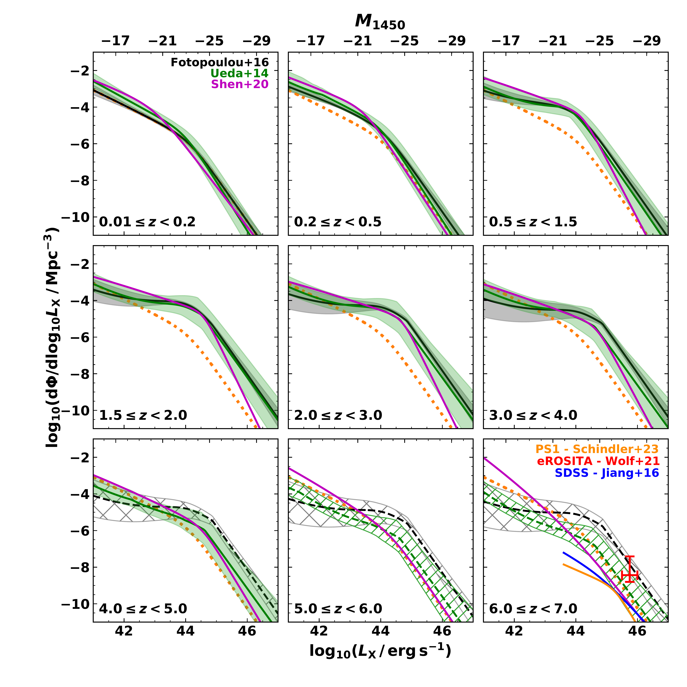

$\newcommand{\ensuremath}{}$
$\newcommand{\xspace}{}$
$\newcommand{\object}[1]{\texttt{#1}}$
$\newcommand{\farcs}{{.}''}$
$\newcommand{\farcm}{{.}'}$
$\newcommand{\arcsec}{''}$
$\newcommand{\arcmin}{'}$
$\newcommand{\ion}[2]{#1#2}$
$\newcommand{\textsc}[1]{\textrm{#1}}$
$\newcommand{\hl}[1]{\textrm{#1}}$
$\newcommand{\footnote}[1]{}$
$\newcommand{\head}[2]{\multicolumn{1}{>{\centering\arraybackslash}p{#1}}{#2}}$
$\newcommand{\ebv}{{E(B-V)}}$
$\newcommand{\qsfit}{{\tt QSFIT}}$
$\newcommand{\red}{\textcolor{red}}$
$\newcommand{\green}{\textcolor{orange}}$
$\newcommand{\purp}{\textcolor{cyan}}$
$\newcommand{\orcid}[1]$
$\newcommand{\NUMDetectableIeEWS}{3.1 \times 10^{7} }$
$\newcommand{\NUMDetectableYeEWS}{2.2 \times 10^{7} }$
$\newcommand{\NUMDetectableJeEWS}{3.0 \times 10^{7} }$
$\newcommand{\NUMDetectableHeEWS}{3.5 \times 10^{7} }$
$\newcommand{\NUMDetectableOneFiltEWS}{4.0 \times 10^{7} }$
$\newcommand{\NUMDetectableAllFiltEWS}{2.1 \times 10^{7} }$
$\newcommand{\SDDetectableIeEWS}{2.2 \times 10^{3} }$
$\newcommand{\SDDetectableYeEWS}{1.5 \times 10^{3} }$
$\newcommand{\SDDetectableJeEWS}{2.1 \times 10^{3} }$
$\newcommand{\SDDetectableHeEWS}{2.4 \times 10^{3} }$
$\newcommand{\SDDetectableOneFiltEWS}{2.8 \times 10^{3} }$
$\newcommand{\SDDetectableAllFiltEWS}{1.4 \times 10^{3} }$
$\newcommand{\NUMDetectableIeEDS}{1.9 \times 10^{5} }$
$\newcommand{\NUMDetectableYeEDS}{1.6 \times 10^{5} }$
$\newcommand{\NUMDetectableJeEDS}{2.0 \times 10^{5} }$
$\newcommand{\NUMDetectableHeEDS}{2.3 \times 10^{5} }$
$\newcommand{\NUMDetectableOneFiltEDS}{2.4 \times 10^{5} }$
$\newcommand{\NUMDetectableAllFiltEDS}{1.6 \times 10^{5} }$
$\newcommand{\SDDetectableIeEDS}{3.8 \times 10^{3} }$
$\newcommand{\SDDetectableYeEDS}{3.2 \times 10^{3} }$
$\newcommand{\SDDetectableJeEDS}{4.0 \times 10^{3} }$
$\newcommand{\SDDetectableHeEDS}{4.5 \times 10^{3} }$
$\newcommand{\SDDetectableOneFiltEDS}{4.7 \times 10^{3} }$
$\newcommand{\SDDetectableAllFiltEDS}{3.1 \times 10^{3} }$
$\newcommand{\NUMSelectedEuclidOnlyTypeOneEWS}{4.8 \times 10^{6} }$
$\newcommand{\SDSelectedEuclidOnlyTypeOneEWS}{331 }$
$\newcommand{\CSelectedEuclidOnlyTypeOneEWS}{0.23}$
$\newcommand{\CTypeOneSelectedEuclidOnlyTypeOneEWS}{0.52}$
$\newcommand{\NUMSelectedEuclidLSSTTypeOneEWS}{5.7 \times 10^{6} }$
$\newcommand{\SDSelectedEuclidLSSTTypeOneEWS}{393 }$
$\newcommand{\CSelectedEuclidLSSTTypeOneEWS}{0.45}$
$\newcommand{\CTypeOneSelectedEuclidLSSTTypeOneEWS}{0.75}$
$\newcommand{\NUMSelectedEuclidLSSTAllEWS}{6.0 \times 10^{6} }$
$\newcommand{\SDSelectedEuclidLSSTAllEWS}{413 }$
$\newcommand{\CSelectedEuclidLSSTAllEWS}{0.51}$
$\newcommand{\CTypeOneSelectedEuclidLSSTAllEWS}{0.65}$
$\newcommand{\CTypeTwoSelectedEuclidLSSTAllEWS}{0.33}$
$\newcommand{\NUMSelectedEuclidOnlyTypeOneEDS}{1.7 \times 10^{4} }$
$\newcommand{\SDSelectedEuclidOnlyTypeOneEDS}{346 }$
$\newcommand{\CSelectedEuclidOnlyTypeOneEDS}{0.11}$
$\newcommand{\CTypeOneSelectedEuclidOnlyTypeOneEDS}{0.40}$
$\newcommand{\NUMSelectedEuclidLSSTTypeOneEDS}{2.0 \times 10^{4} }$
$\newcommand{\SDSelectedEuclidLSSTTypeOneEDS}{392 }$
$\newcommand{\CSelectedEuclidLSSTTypeOneEDS}{0.45}$
$\newcommand{\CTypeOneSelectedEuclidLSSTTypeOneEDS}{0.76}$
$\newcommand{\NUMSelectedEuclidLSSTAllEDS}{2.9 \times 10^{4} }$
$\newcommand{\SDSelectedEuclidLSSTAllEDS}{579 }$
$\newcommand{\CSelectedEuclidLSSTAllEDS}{0.32}$
$\newcommand{\CTypeOneSelectedEuclidLSSTAllEDS}{0.51}$
$\newcommand{\CTypeTwoSelectedEuclidLSSTAllEDS}{0.18}$

# $\Euclid$ preparation

<mark>Appeared on: 2024-05-29</mark> -  _36 pages, 21 figures, submitted to A&A_

E. Collaboration, et al. -- incl., <mark>E. Bañados</mark>, <mark>K. Jahnke</mark>

**Abstract:** We forecast the expected population of active galactic nuclei (AGN) observable in the Euclid Wide Survey (EWS) and Euclid Deep Survey (EDS). Starting from an X-ray luminosity function (XLF) we generate volume-limited samples of the AGN expected in the $\Euclid$ survey footprints. Each AGN is assigned an SED appropriate for its X-ray luminosity and redshift, with perturbations sampled from empirical distributions. The photometric detectability of each AGN is assessed via mock observation of the assigned SED.We estimate 40 million AGN will be detectable in at least one $\Euclid$ band in the EWS and 0.24 million in the EDS, corresponding to surface densities of $\SDDetectableOneFiltEWS$ deg $^{-2}$ and $\SDDetectableOneFiltEDS$ deg $^{-2}$ .Employing $\Euclid$ -only colour selection criteria on our simulated data we select a sample of $\NUMSelectedEuclidOnlyTypeOneEWS$ ( $\SDSelectedEuclidOnlyTypeOneEWS$ deg $^{-2}$ ) AGN in the EWS and $\NUMSelectedEuclidOnlyTypeOneEDS$ ( $\SDSelectedEuclidOnlyTypeOneEDS$ deg $^{-2}$ ) in the EDS, amounting to 10 \% and 8 \% of the AGN detectable in the EWS and EDS.Including ancillary Rubin/LSST bands improves the completeness and purity of AGN selection. These data roughly double the total number of selected AGN to comprise 21 \% and 15 \% of the $\Euclid$ detectable AGN in the EWS and EDS.The total expected sample of colour-selected AGN contains 6.0 $\times$ 10 $^{6}$ (74 \% ) unobscured AGN and 2.1 $\times$ 10 $^{6}$ (26 \% ) obscured AGN, covering $0.02 \leq z \lesssim 5.2$ and $43 \leq \log_{10} (L_{\rm bol} / {\rm erg}  {\rm s}^{-1}) \leq 47$ .With this simple colour selection, expected surface densities are already comparable to the yield of modern X-ray and mid-infrared surveys of similar area.The relative uncertainty on our expectation for $\Euclid$ detectable AGN is 6.7 \% for the EWS and 12.5 \% for the EDS, driven by the uncertainty of the XLF.

**Figure 9. -** Redshift distributions (top), redshift-dependent completeness (middle), and $L_{\rm bol}$-$z$ planes (bottom) for the selected AGN in the EWS (left) and EDS (right). AGN selected with \Euclid-only photometric criteria (blue) and the total selected sample defined as the union ($\cup$) of all \Euclid and ancillary $ugrz$ photometric criteria discussed in Sect. \ref{sec:euclidselection} are plotted for each panel. In all plots redshift is binned with width $\delta z = 0.5$. In the $L_{\rm bol}$-$z$ plane points represent the median, vertical lines represent $1\sigma$ standard deviation and horizontal lines represent the width of the redshift bin. (*fig:selectioninfo*)

**Figure 15. -** Comparison of different AGN LFs homogenised to the 2--10 keV X-ray band. Corresponding absolute UV magnitudes at 1450 Å , $M_{1450}$, are displayed on the upper axes. In each panel the LFs are realised for the central redshift value. The hard X-ray LF of \citet{fotopoulou2016xlf} employed in this work is shown in black. The grey shaded regions depict the 1$\sigma$ uncertainty. For reference, we plot the \citet{fotopoulou2016xlf} XLF evaluated at $z=0.1$ as orange dotted lines in each panel. The hard XLF of \citet{ueda2014} is shown in green, with the green shaded regions corresponding to the 1$\sigma$ uncertainty generated with sampling from the published parameter uncertainties. The magenta lines portray the bolometric quasar LF of \citet{shen2020}, converted to the X-ray domain. In the final panel the \citet{jiang2016}$z>6$ SDSS quasar LF is represented by the blue curve. The solid orange curve gives the \citet{schindler2023}$z\sim6$ quasar LF derived from Pan-STARRS1 and SHELLQs observations. The red uncertainty interval represents eROSITA high-redshift constraints on the XLF \citep{wolf2021}. In all cases dashed curves and hatched uncertainty intervals indicate extrapolation. (*fig:lf_comparison*)

**Figure 6. -** All SEDs (unobscured and obscured) assigned to AGN in this work, normalised at 1 \micron. The redshift evolution of the effective wavelength for each \Euclid filter over the redshift range probed in this work are depicted below as black lines. The seven SED classes in this figure are: Unobscured AGN (`Unobsc.'; blue), Passive (`PASS'; pink), Star-forming (`SFG'; brown), Starburst (`SB'; purple), High-luminosity obscured AGN (`QSO2'; orange), Seyfert 2 (`SEY2'; green), and Starburst-AGN composite (`SB-AGN'; red). (*fig:filter_sed_zevo*)

