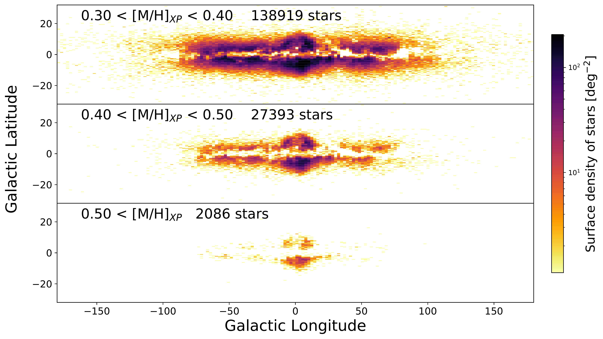
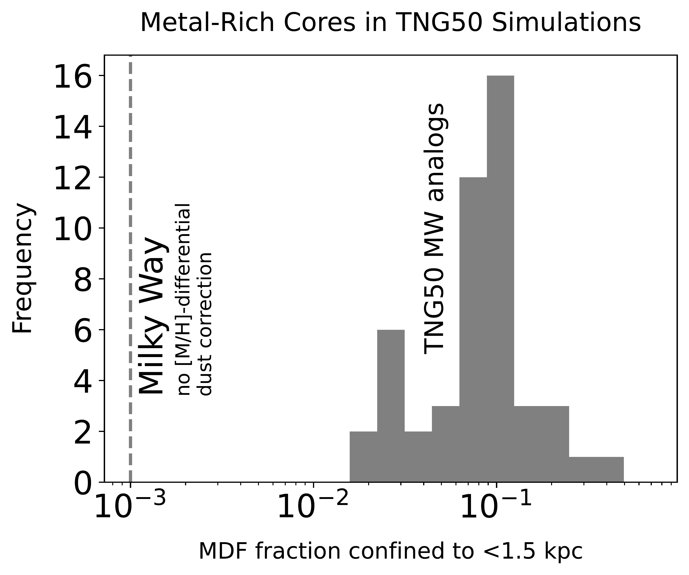

$\newcommand{\ensuremath}{}$
$\newcommand{\xspace}{}$
$\newcommand{\object}[1]{\texttt{#1}}$
$\newcommand{\farcs}{{.}''}$
$\newcommand{\farcm}{{.}'}$
$\newcommand{\arcsec}{''}$
$\newcommand{\arcmin}{'}$
$\newcommand{\ion}[2]{#1#2}$
$\newcommand{\textsc}[1]{\textrm{#1}}$
$\newcommand{\hl}[1]{\textrm{#1}}$
$\newcommand{\footnote}[1]{}$
$\newcommand{\vdag}{(v)^\dagger}$
$\newcommand$
$\newcommand$
$\newcommand{\MH}{\ensuremath{{[\mathrm{M}/\mathrm{H}]}}}$
$\newcommand{\apc}[1]{ #1}$
$\newcommand{\thing}{knot~}$
$\newcommand{\thingns}{knot}$
$\newcommand{\things}{knots~}$
$\newcommand{\Thing}{Knot~}$
$\newcommand{\Thingns}{Knot}$
$\newcommand{\MHXP}{\ensuremath{\mathrm{[M/H]}_{\mathrm{XP}}}}$

# The Extremely Metal Rich $\Thing$ of Stars at the Heart of the Galaxy

<mark>Appeared on: 2024-06-05</mark> -  _11 pages, 7 figures, submitted to ApJ_

<mark>H.-W. Rix</mark>, et al. -- incl., <mark>A. Pillepich</mark>, <mark>J. Lian</mark>

**Abstract:** $\noindent$ We show with Gaia XP spectroscopy that extremely metal-rich stars in the Milky Way (EMR; $\mathrm{[M/H]}_{\mathrm{XP}} \gtrsim 0.5$ ) -- but only those -- are largely confined to a tight "knot” at the center of the Galaxy.This EMR knot is round in projection, has a fairly abrupt edge near $\sim 1.5$ kpc, and is a dynamically hot system.This central knot also contains very metal-rich (VMR; $+0.2\le \mathrm{[M/H]}_{\mathrm{XP}} \le +0.4$ ) stars.However, in contrast to EMR stars, the bulk of VMR stars form an extended, highly flattened distribution in the inner Galaxy ( $R_{\mathrm{GC}}\lesssim 5$ kpc).We draw on TNG50 simulations of Milky Way analogs for context and find that compact, metal-rich knots confined to $\lesssim 1.5$ kpc are a universal feature.In typical simulated analogs, the top 5-10 \% most metal-rich stars are confined to a central knot; however, in our Milky Way data this fraction is only 0.1 \% .Dust-penetrating wide-area near-infrared spectroscopy, such as SDSS-V, will be needed for a rigorous estimate of the fraction of stars in the Galactic EMR knot.Why in our Milky Way only EMR giants are confined to such a central knot remains to be explained.Remarkably, the central few kiloparsecs of the Milky Way harbor both the highest concentration of metal-poor stars (the `poor old heart') and almost all EMR stars.This highlights the stellar population diversity at the bottom of galactic potential wells.

**Figure 6. -** 
   On-sky density distribution of very (and extremely) metal-rich giant stars, with $\MHXP\ge +0.3$ from Gaia DR3 XP spectra, in three different $\MH$XP  bins.
   The top panel (containing $\sim 85\%$ of all these stars) shows a flattened, disk-like distribution, concentrated towards the inner Galaxy. This central concentration increases toward higher metallicity (middle panel).
  The bottom panel, showing the distribution of extremely metal-rich (EMR) stars with $\MHXP \gtrsim 0.5$, shows a striking change in morphology compared to the bin with $0.3<$\MH$XP < 0.4$: the distribution is dominated by a central *$\thing$* with a sharp cut-off at $R_{\mathrm{GC}} \sim 1.5$ kpc. The relative prominence of this *$\thing$* increases by an order of magnitude from the previous bin (see also Fig. \ref{fig:EMRprofile}). Note that in all three panels, the imprint of dust extinction is apparent at the lowest latitudes; and the bar may contribute to the slight $\pm l$ asymmetry. Foreground stars closer than 4 kpc from the Sun have been removed (see sample selection criteria at the end of Section \ref{sec:sample} (*fig:metal_rich_on_sky*)

**Figure 8. -** Radial extent of different mono-abundance stellar populations for Milky Way analogs from the TNG50 simulation \citep{Pillepich2023}. The left panel shows the radius $R_{\mathrm{GC}}$ that encloses 68\% of a mono-abundance population as a function of $\MH$ for a handful of example galaxies. This left panel shows that for (at least these) simulated galaxies the most metal-rich stars are very centrally concentrated, forming a $\thing$ of $\lesssim 1$ kpc. This is in qualitative agreement with our analysis of the Milky Way (see Fig. \ref{fig:D68percentile_MH}). However, in these simulated galaxies the central confinement encompasses stars within $\Delta$\MH$ = 0.4$ of the maximal metallicity, whereas in our Galaxy the stars in the $\thing$ are within 0.1 dex of the maximal metallicity.  To eliminate issues revolving around metallicity systematics, we also consider which fraction of the stars' MFD is part of this central $\thing$ns .
    The right panel shows, for a much larger set of TNG50 Milky Way analogs, the (most metal rich) fraction of the MDF that is confined to within  $R_{\mathrm{GC}}= 1.5$ kpc: typically between 5\% and 15\% of all stars within 20 kpc. By comparison, the *face value* fraction of stars in the Milky Way's $\thing$(i.e. in the Gaia XP sample as defined in Section \ref{sec:metal-rich-distribution}) is dramatically lower, only 0.1\%(Fig. \ref{fig:D68percentile_MH}). However, this observed fraction constitutes a lower limit, as the most centrally concentrated populations in the Milky Way are inevitably most extincted, and hence most underrepresented in the Gaia XP sample. (*fig:sims_extent*)

**Figure 1. -** 
   The longitudinal number density profile of the very metal-rich stars towards the center of the Milky Way. These are the same stars as shown in Fig. \ref{fig:metal_rich_on_sky}, but integrated over Galactic latitude (excluding $\pm 3^\circ$ because of the severe dust extinction). The dashed line just illustrates a Gaussian of $\sigma=10^\circ$ centered on $|l|=0$ in order to illustrate the level of asymmetry induced by dust extinction. While for the least metal-rich bin ($0.3<$\MH$XP<0.4$) the density peak of the central $\thing$ is only $\sim 3\times$ above the surrounding (in projection) disk-like distribution, this contrast has grown to $100\times$ in the EMR bin ($\MHXP > 0.5$): EMR stars are basically only found in the $\lesssim 1$ kpc $\thing$ns. (*fig:EMRprofile*)

