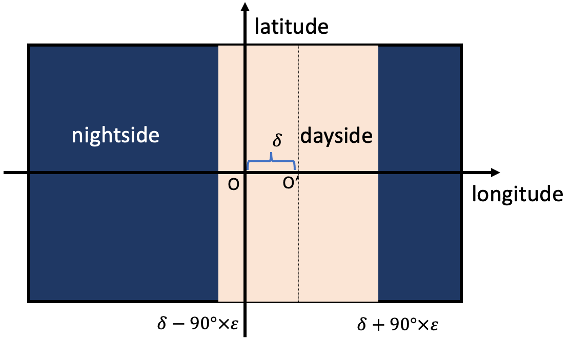
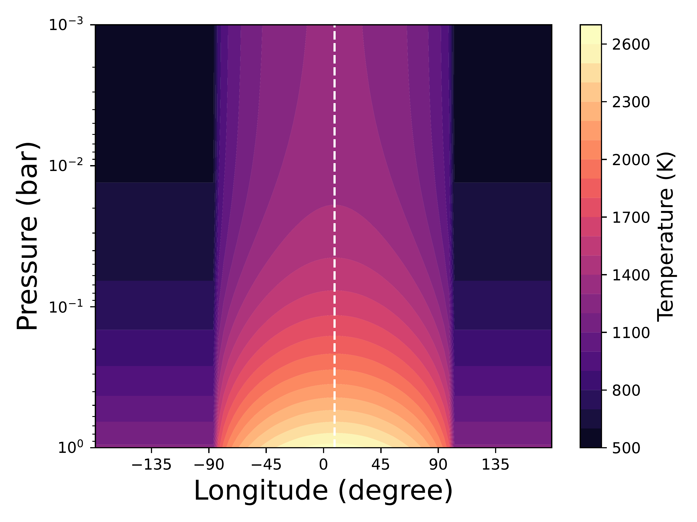

$\newcommand{\ensuremath}{}$
$\newcommand{\xspace}{}$
$\newcommand{\object}[1]{\texttt{#1}}$
$\newcommand{\farcs}{{.}''}$
$\newcommand{\farcm}{{.}'}$
$\newcommand{\arcsec}{''}$
$\newcommand{\arcmin}{'}$
$\newcommand{\ion}[2]{#1#2}$
$\newcommand{\textsc}[1]{\textrm{#1}}$
$\newcommand{\hl}[1]{\textrm{#1}}$
$\newcommand{\footnote}[1]{}$
$\newcommand{\f}{\frac}$
$\newcommand{\tx}{\text}$
$\newcommand{\Li}{\mathcal{L}}$
$\newcommand{\arraystretch}{1.3}$

# Simultaneous retrieval of orbital phase resolved _JWST_/MIRI emission spectra of the hot Jupiter WASP-43b: evidence of water, ammonia and carbon monoxide

<mark>Appeared on: 2024-06-06</mark> -  _17 pages, 14 figures, accepted for publication in MNRAS. Comments welcome!_

J. Yang, et al. -- incl., <mark>L. Kreidberg</mark>

**Abstract:** Spectroscopic phase curves of hot Jupiters measure their emission spectra at multiple orbital phases, thus enabling detailed characterisation of their atmospheres.Precise constraints on the atmospheric composition of these exoplanets offer insights into their formation and evolution.We analyse four phase-resolved emission spectra of the hot Jupiter WASP-43b, generated from a phase curve observed with the MIRI/LRS onboard the _JWST_ , to retrieve its atmospheric properties.Using a parametric 2D temperature model and assuming a chemically homogeneous atmosphere within the observed pressure region, we simultaneously fit the four spectra to constrain the abundances of atmospheric constituents, thereby yielding more precise constraints than previous work that analysed each spectrum independently.Our analysis reveals statistically significant evidence of $NH_3$ (4 $\sigma$ ) in a hot Jupiter's emission spectra for the first time, along with evidence of $H_2$ O (6.5 $\sigma$ ), CO (3.1 $\sigma$ ), and a non-detection of $CH_4$ .With our abundance constraints, we tentatively estimate the metallicity of WASP-43b at 0.6 $-$ 6.5 $\times$ solar and its C/O ratio at 0.6 $-$ 0.9.Our findings offer vital insights into the atmospheric conditions and formation history of WASP-43b by simultaneously constraining the abundances of carbon, oxygen, and nitrogen-bearing species.

**Figure 11. -** a) - d): Best-fit model spectra at the four orbital phases calculated from the maximum a posteriori parameters.
We plot the 1$\sigma$ and 2$\sigma$ central credible intervals with dark and light purple shading, respectively.
The data in the grey shaded region (10.5-12 $\micron$) are affected by the `shadowed region' systematics and are not included in our retrievals (see \ref{sec:shadow_effect}).
Interestingly, our best-fit model, when extended to 12 $\micron$, is consistent with the current reduction of the `shadowed region' data for all phases except at phase $0.75$(see \ref{sec:spectral_fit} for why we think phase $0.75$ is worst affected by the `shadowed region effect').
Since $NH_3$ has strong spectral features in the `shadowed region', a reliable reduction of the `shadowed region effect' in the future can refine the abundance constraints on $NH_3$.
Note the absorption feature at the 8.75 $\micron$ bin at phase $0.5$, which our model cannot explain.
e) - f): Cross sections of the spectrally active molecules included in our retrievals, computed at a spectral resolution of R$=1000$ at 1 bar pressure and 1500 K temperature.
f) is identical to e) except for the omission of legend for ease of reference.
The spectral features between $\sim$5 and $\sim$8 $\micron$ are indicative of $H_2$O molecules, whereas the absence of spectral features between $\sim$7 and $\sim$9 $\micron$ allows us to rule out $CH_4$ at high abundance.
While $NH_3$ has strong opacities throughout the MIRI/LRS bandpass, its retrieved abundance is about two orders of magnitude lower than $H_2$O.
This means that the spectral features of $H_2$O would dominate over those of $NH_3$ in the wavelength regions where $H_2$O has higher or similar opacity compared to $NH_3$.
The notable exception is the wavelength region greater than $\sim$8 $\micron$, where the $H_2$O opacity is generally much lower than the $NH_3$ opacity.
The constraints on CO are driven by the 5.25 $\micron$  bin; the absence of CO would increase the planetary flux at the 5.25 $\micron$  bin relative to the 5.75 $\micron$ bin.
The constraints on $CO_2$ are driven by the data in 9-10.5 $\micron$ region. (*fig:spectral_fit*)

**Figure 1. -** Schematics of our parametric 2D temperature model as defined by equation (\ref{eq:Tmap}).
The model divides the atmosphere into a dayside region and a nightside region, each modelled with a representative TP profile.
The dayside central longitude and the dayside width are allowed to vary.
`O' marks the substellar point and `O$^{'}$' marks the centre of the dayside region.
While temperature is constant with longitude on isobars in the nightside region, we can parameterise the variation of temperature with longitude on the dayside.
Note that the temperature is constant with latitude and only varies with pressure and longitude (we interpret the retrieved thermal structure as a latitudinal average, see \ref{sec:model}).
 (*fig:model*)

**Figure 6. -** Best-fit 2D thermal structure calculated from the maximum a posteriori parameters.
The white vertical dashed line marks the position of the hot spot offset.
 (*fig:tp_2D*)

