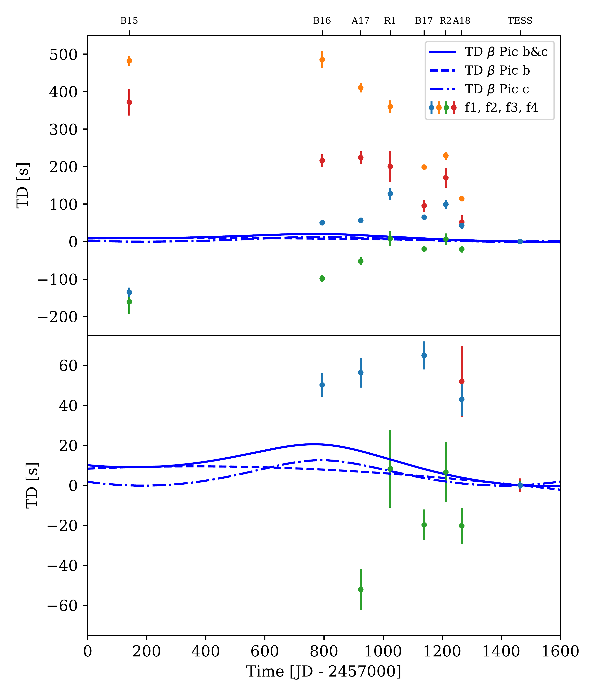
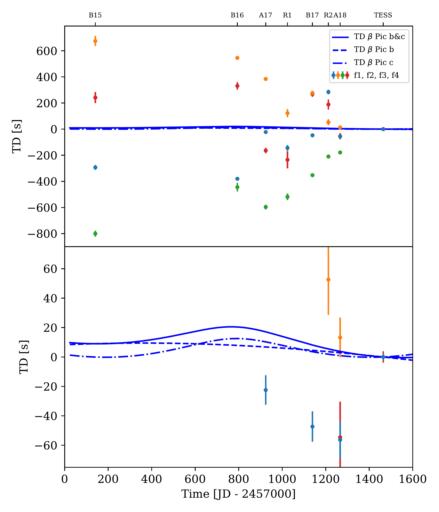

$\newcommand{\ensuremath}{}$
$\newcommand{\xspace}{}$
$\newcommand{\object}[1]{\texttt{#1}}$
$\newcommand{\farcs}{{.}''}$
$\newcommand{\farcm}{{.}'}$
$\newcommand{\arcsec}{''}$
$\newcommand{\arcmin}{'}$
$\newcommand{\ion}[2]{#1#2}$
$\newcommand{\textsc}[1]{\textrm{#1}}$
$\newcommand{\hl}[1]{\textrm{#1}}$
$\newcommand{\footnote}[1]{}$
$\newcommand{\arraystretch}{1.35}$
$\newcommand{\arraystretch}{1.35}$
$\newcommand{\arraystretch}{1.35}$
$\newcommand{\arraystretch}{1.35}$
$\newcommand{\bpic}{\beta Pictoris}$
$\newcommand{\bpicb}{\beta Pictoris b}$
$\newcommand{\bpicc}{\beta Pictoris c}$
$\newcommand{\dsct}{\delta~Scuti }$
$\newcommand{\gdor}{\gamma~Doradus }$
$\newcommand{\Msun}{M_{\odot}}$
$\newcommand{\MJ}{M_{J}}$
$\newcommand{\RJ}{R_{J}}$
$\newcommand{\Lsun}{L_{\odot}}$
$\newcommand{\Rsun}{R_{\odot}}$
$\newcommand{\Msun}{M_{\odot}}$
$\newcommand{\Teff}{\ensuremath{T_{\mathrm{eff}}}}$
$\newcommand{\cd}{ d^{\rm -1}}$
$\newcommand{\logg}{\ensuremath{\log g}}$
$\newcommand{\kms}{\mathrm{km s}^{-1}}$

# The $\beta$ Pictoris b Hill sphere transit campaign

<mark>Appeared on: 2024-06-10</mark> -  _16 pages, 16 figures, 4 tables, accepted for publication in A&A_

<mark>S. Zieba</mark>, et al.

**Abstract:** The $\bpic$ system is the closest known stellar system with directly detected gas giant planets, an edge-on circumstellar disc, and evidence of falling sublimating bodies and transiting exocomets.   The inner planet, $\bpicc$ , has also been indirectly detected with radial velocity (RV) measurements.   The star is a known $\dsct$ pulsator, and the long-term stability of these pulsations opens up the possibility of indirectly detecting the gas giant planets through time delays of the pulsations due to a varying light travel time.    We search for phase shifts in the $\dsct$ pulsations consistent with the known planets $\bpicb$ and c and carry out an analysis of the stellar pulsations of $\beta$ Pictoris over a multi-year timescale.   We used photometric data collected by the BRITE-Constellation, bRing, ASTEP, and TESS to derive a list of the strongest and most significant $\dsct$ pulsations.   We carried out an analysis with the open-source python package \texttt{maelstrom} to study the stability of the pulsation modes of $\beta$ Pictoris in order to determine the long-term trends in the observed pulsations.   We did not detect the expected signal for $\bpicb$ or $\bpicc$ .   The expected time delay is 6 seconds for $\bpicc$ and 24 seconds for $\bpicb$ .    With simulations, we determined that the photometric noise in all the combined data sets cannot reach the sensitivity needed to detect the expected timing drifts.    An analysis of the pulsational modes of $\beta$ Pictoris using \texttt{maelstrom} showed that the modes themselves drift on the timescale of a year, fundamentally limiting our ability to detect exoplanets around $\beta$ Pictoris via pulsation timing.

**Figure 11. -** Time delay plot calculated from the phases of four different frequencies for all available observations by BRITE, bRing, ASTEP and TESS. Each color represents a frequency (f1, f2, f3, and f4) listed in Table \ref{tab:freqs}.
The blue lines indicate time delay predictions for $\bpic$b(dashed line), c (dashed, dotted line), and both planets (solid line).
The lower panel is a zoom-in of the upper panel.
The uncertainties in the time delays were derived from the covariance matrices given by the least-squares procedure, which was used in order to calculate the phases of the respective frequencies.
The ticks at the top of the plot denote the various observatories: B15, B16, and B17 for the BRITE observations in the years 2015, 2016, and 2017, respectively; A17 and A18 for the ASTEP observations in 2017 and 2018; and R1 and R2 for the first and second part of the bRing data. (*fig:finall*)

**Figure 12. -** Time delay plot for the simulated data set showing a high similarity to the time delays of the real data set presented in Figure \ref{fig:final2}.
The colored points represent the simulated time delays for the four strongest pulsational frequencies.
The blue lines indicate time delay predictions for $\bpic$b(dashed line), c (dashed-dotted line), and both planets (solid line).
The lower panel is a zoom-in of the upper panel.
A description of the ticks at the top of the plot can be found in the caption of Figure \ref{fig:finall}. (*fig:final2*)

**Figure 3. -** Simulation of a companion in a circular (\(e = 0\); left column) and eccentric (\(e = 0.9\); right column) orbit as if observed by the Kepler Space Telescope.
The following parameters were used: \(P = 1\) year, $\varpi = 0$, \(M_\text{pulsating} = 1.8 \)$\Msun$ , and \(M_\text{companion} = 0.1 \)$\Msun$.
This led to a semi-amplitude of around 34 seconds in the circular case (using Equation \ref{eq:TD_period}) and around 15 seconds in the eccentric case (using Equation \ref{eq:TD_eccentric}). _Upper panel:_ Simulated time delay plot.
_Lower panel:_ Fourier transformation of the time delays.
One can clearly see the relative increase of the first harmonic at two cycles/year for the eccentric case. (*fig:TDsim*)

