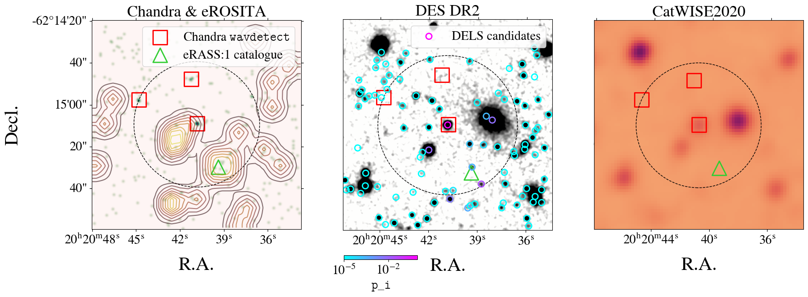
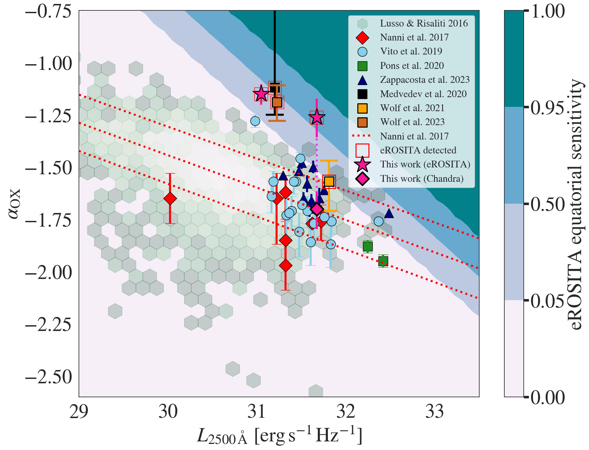

$\newcommand{\ensuremath}{}$
$\newcommand{\xspace}{}$
$\newcommand{\object}[1]{\texttt{#1}}$
$\newcommand{\farcs}{{.}''}$
$\newcommand{\farcm}{{.}'}$
$\newcommand{\arcsec}{''}$
$\newcommand{\arcmin}{'}$
$\newcommand{\ion}[2]{#1#2}$
$\newcommand{\textsc}[1]{\textrm{#1}}$
$\newcommand{\hl}[1]{\textrm{#1}}$
$\newcommand{\footnote}[1]{}$
$\newcommand{\mockalph}[1]$

# The SRG/eROSITA All-Sky Survey: \  X-ray beacons at late cosmic dawn

<mark>Appeared on: 2024-06-10</mark> -  _Submitted to A&A, June 7, 2024_

J. Wolf, et al. -- incl., <mark>S. Belladitta</mark>

**Abstract:** The Spectrum Roentgen Gamma (SRG)/eROSITA All-Sky Survey (eRASS) is expected to contain $\sim100$ quasars that emitted their light when the universe was less than a billion years old, i.e. at $z>5.6$ . By selection, these quasars populate the bright end of the AGN X-ray luminosity function and their count offers a powerful demographic diagnostic of the parent super-massive black hole population. Of the $\gtrapprox 400$ quasars that have been discovered at $z>5.6$ to date, less than 15 \% have been X-ray detected. We present a pilot survey to uncover the elusive X-ray luminous end of the distant quasar population. We have designed a quasar selection pipeline based on optical, infrared and X-ray imaging data from DES DR2, VHS DR5, CatWISE2020 and the eRASS (up to eRASS:4).   The core selection method relies on SED template fitting. We performed optical follow-up spectroscopy with the Magellan/LDSS3 instrument for the redshift confirmation of a subset of candidates. We have further obtained a deeper X-ray image of one of our candidates with Chandra ACIS-S. We report the discovery of five new quasars in the redshift range $5.6 < z < 6.1$ . Two of these quasars are detected in eRASS and are by selection X-ray ultra-luminous. These quasars are also detected at radio frequencies. The first one is a broad absorption line quasar which shows significant, order-of-magnitude X-ray dimming over 3.5 years, i.e. about 6 months in the quasar rest frame. The second radio-detected quasar is a jetted source with compact morphology. We show that a blazar configuration is likely for this source, making it the second most distant blazar known to date. With our pilot study, we demonstrate the power of eROSITA as a discovery machine for luminous quasars in the epoch of reionization. The X-ray emission of the two eROSITA detected quasars are likely to be driven by different high-energetic emission mechanisms a diversity which will be further explored in a future systematic full-hemisphere survey.

**Figure 5. -** _Upper panel_: The cumulative distribution of expected random (unrelated) X-ray detections from forced photometry using a circular aperture of radius 30" around 1604 optical quasar candidate positions with. The black curve is the estimate obtained from Eq. 2. for a single eRASS survey. The black dashed curve shows an empirical estimate of the same number based on a random sample of positions in the surveyed field. The brown curve shows the number of expected contaminants obtained from a random sample in eRASS:4. Blue vertical lines indicate the $P_B$ values of the best detection of quasars discovered in this work in any eRASS and in eRASS:4 (if available). _Lower panel_: Fraction of background sources $f_{\rm bkg}$ expected to be detected in eRASS1 from a simulation by  [Seppi, Comparat and Bulbul (2022)](). (*fig:spurious*)

**Figure 12. -** All images are centered on the optical position of the new quasar J202040-621509 and have sizes 100' x100". _Left panel_: Broadband (0.5-7 keV) Chandra image. Chandra sources detected with 30" (black, dashed circle) of the quasar coordinates with \texttt{wavdetect} are marked in red. The centroid of 1eRASS J202039.8-621525 catalogue detection is marked by a green triangle. The contours were obtained from the smoothed eRASS:4 0.5 - 7 keV image. _Central panel:_ DES DR2 z-band image.Circular colored markers denote counterpart candidates for 1eRASS J202039.8-621525 from the DESI Legacy Survey catalogue. They are colour-coded according to their relative probability \texttt{p\_i} of being the best counterpart. The DESI Legacy Survey source with the highest \texttt{p\_i} is spatially co-incident with the quasar coordinates. _Right panel:_  CatWISE 2020 W1 image. Among the Chandra and eROSITA X-ray detections, only the quasar is clearly detected.  (*fig:bbchandra*)

**Figure 11. -** _Left panel_: X-ray luminosity redshift distribution of X-ray luminous quasars from literature \citep[][respectively as red diamonds, blue circles and green, yellow and brown squares]{nanni17,vito19,pons20,wolf21,wolf22} and the two newly discovered quasars (displayed as pink stars). The colour gradient shows the sensitivity to a fiducial absorbed power-law with Galactic absorption of the final cumulative eRASS in the equatorial region (in fractional of sensitive area). The quasars discovered in this work lie at the luminous end of the quasar population in the early universe. We show the luminosity derived from the Chandra follow-up observation of J202040-621509. Between the eRASS1 and the Chandra observation, its luminosity has decreased by an order of magnitude. _Right panel_:  $\alpha_{OX}$-L2500 distribution of the same sample of sources. The 1$\sigma$ confidence interval of relation derived by [Nanni, et. al (2017)]() is shown by red dotted line.  The hexagonal pattern shows a lower redshift AGN sample by [ and Lusso (2016)](). The three quasars X-ray detected, newly discovered, are over-luminous in the X-ray wavebands. Following its dimming observed in the recent Chandra observation, J202040-621509 is perfectly consistent $\alpha_{OX}$-L2500 relation.  (*fig:lxaox*)

