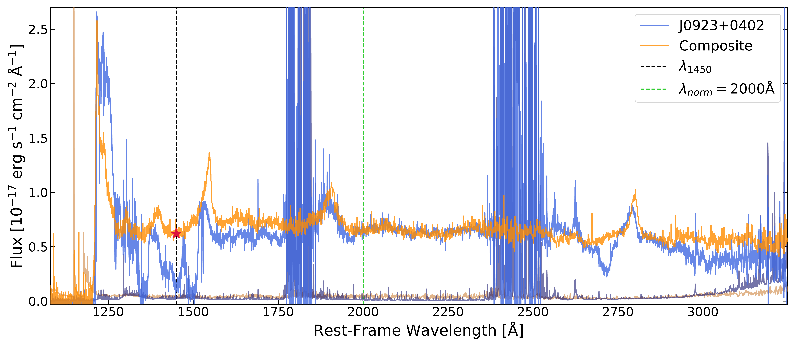

$\newcommand{\ensuremath}{}$
$\newcommand{\xspace}{}$
$\newcommand{\object}[1]{\texttt{#1}}$
$\newcommand{\farcs}{{.}''}$
$\newcommand{\farcm}{{.}'}$
$\newcommand{\arcsec}{''}$
$\newcommand{\arcmin}{'}$
$\newcommand{\ion}[2]{#1#2}$
$\newcommand{\textsc}[1]{\textrm{#1}}$
$\newcommand{\hl}[1]{\textrm{#1}}$
$\newcommand{\footnote}[1]{}$
$\newcommand{\angstrom}{\textup{Å}}$
$\newcommand{\thebibliography}{\DeclareRobustCommand{\VAN}[3]{##3}\VANthebibliography}$

# Optical and near-infrared spectroscopy of quasars at $z>6.5$: public data release and composite spectrum

<mark>Appeared on: 2024-06-13</mark> -  _18 pages, 10 figures, submitted to MNRAS_

S. Onorato, et al. -- incl., <mark>E. Bañados</mark>, <mark>S. Belladitta</mark>, <mark>F. Walter</mark>

**Abstract:** We present optical and near-infrared (NIR) spectroscopic observations for a sample of $45$ quasars at $6.50 < z \leq 7.64$ with absolute magnitudes at $1450$ ${\angstrom}$ in the range $-28.82 \leq M_{1450} \leq -24.13$ and their composite spectrum. The median redshift and $M_{1450}$ of the quasars in the sample are $z_{\rm{median}}=6.71$ and $M_{1450,\rm{median}} \simeq -26.1$ , respectively.The NIR spectra are taken with echelle spectrographs, complemented with additional data from optical long slit instruments, and then reduced consistently using the open-source Python-based spectroscopic data reduction pipeline \texttt{PypeIt} . The median value of the mean signal-to-noise ratios of the spectra in J, H, and K band (median $\langle \rm{SNR}_{\lambda} \rangle$ ) is: median $\langle \rm{SNR}_{J} \rangle=9.7$ , median $\langle \rm{SNR}_{H} \rangle=10.3$ , and median $\langle \rm{SNR}_{K} \rangle=11.7$ ; demonstrating the good data quality.This work presents the largest medium/moderate-resolution sample of quasars at $z>6.5$ from ground-based instruments. Its homogeneity and reproducibility make it ideally suited for several scientific goals, i.e., the study of the quasar proximity zones and damping wings, the Ly $\alpha$ forest, the intergalactic medium's metal content, as well as other properties such as the distribution of SMBH masses and Eddington ratios. Our composite spectrum is compared to others at both high and low- $z$ from the literature, showing differences in the strengths of many emission lines, probably due to differences in luminosity among the samples, but a consistent continuum slope, which proves that the same spectral features are preserved in quasars at different redshift ranges.

**Figure 9. -** _Bottom panel_: Composite spectrum of the $33$ non-BAL quasars in the sample (black) with its noise vector (grey), compared with several other composites from the literature (colored curves). All the composites are normalized to the continuum flux at 1450 {$\angstrom$}. The grey band for $\lambda<1225${$\angstrom$} highlights the mask-free region, where none of the masks described in the main text is applied. The main emission lines are shown as dashed blue lines. The inset panel shows a zoom-in of the region [1175, 1580]{$\angstrom$}, where the composites differ more. _Middle panel_: Number of spectra that are contributing to the composite at each wavelength for this work and the only two available from the literature (same colors as in the bottom panel). _Top panel_: Mean redshift that contributes to the composite at each wavelength for this work. (*fig:composite*)

**Figure 1. -** _Panel (a)_: Distribution of J-band photometry used to scale the spectra as a function of $z$ for all the $45$ quasars in this sample. The legend is unique and split between the two plots, showing the sources color-coded with decreasing $z$. The full symbol marks the quasars for which J-band photometry is available, while the open symbol marks those for which it is not (we report Y-band photometry for J1243$+$0100 and J0923$+$0753, and $\rm{K_{p}}$-band photometry for J1058$+$2930). The error bars show the uncertainties on both $z$ and the photometric measurements. _Panel (b)_: Distribution of $M_{1450}$ as a function of $z$ for all the $45$ quasars in this sample. The error bars show the uncertainties on $z$. The circle marks the $M_{1450}$ computed from the spectrum scaled with J, Y, or $\rm{K_{p}}$-band photometry. The star marks the quasars for what $M_{1450}$ from spectroscopy is not reliable because of the low SNR of the spectrum or appearance of BAL features. In the case of J1243$+$0100, $M_{1450}$ is from the discovery paper ( ([ and Matsuoka 2019](https://ui.adsabs.harvard.edu/abs/2019ApJ...872L...2M)) ); while for J0910$-$0414 and J0923$+$0402, we follow the method described in Appendix \ref{app:bal}. _Panel (c)_: Histogram of the redshift distribution of the sample, with bins of size 0.05. The dashed red line represents the median redshift ($z_{\rm{median}}=6.71$). _Panel (d)_: Histogram of the $M_{1450}$ distribution of the sample, with bins of size 0.2. The dashed red line represents the median $M_{1450}$($M_{1450,\rm{median}} \simeq -26.1$). (*fig:M1450*)

**Figure 4. -** _Top_: Match between the spectrum of J0910$-$0414 and the composite spectrum obtained from the sample excluding the BALs already corrected to get a better estimate of the $M_{1450}$. The spectrum of the BAL quasar is shown in blue, while the composite is in orange, with their noise vectors reported at the bottom of the plot. The back dashed line falls at $\lambda=1450${$\angstrom$} and the green dashed line is the normalization wavelength at $2000${$\angstrom$}. The magenta star is the "new" continuum level assumed for the BAL quasar at $1450${$\angstrom$}. _Bottom_: Same, but for J0923$+$0402. (*fig:matchbal*)

