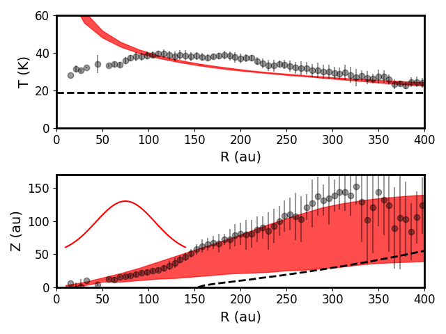
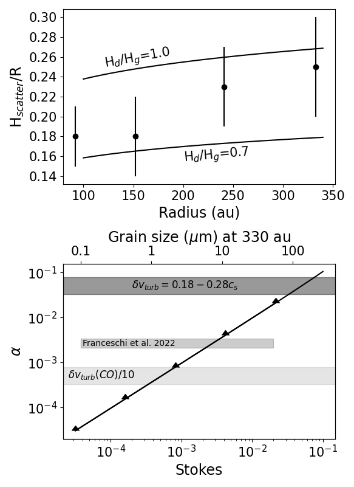

$\newcommand{\ensuremath}{}$
$\newcommand{\xspace}{}$
$\newcommand{\object}[1]{\texttt{#1}}$
$\newcommand{\farcs}{{.}''}$
$\newcommand{\farcm}{{.}'}$
$\newcommand{\arcsec}{''}$
$\newcommand{\arcmin}{'}$
$\newcommand{\ion}[2]{#1#2}$
$\newcommand{\textsc}[1]{\textrm{#1}}$
$\newcommand{\hl}[1]{\textrm{#1}}$
$\newcommand{\footnote}[1]{}$
$\newcommand{\thebibliography}{\DeclareRobustCommand{\VAN}[3]{##3}\VANthebibliography}$

# Evidence for Non-zero Turbulence in the Protoplanetary disc around IM Lup

<mark>Appeared on: 2024-06-13</mark> -  _Accepted by MNRAS, 17 pages, 12 figures_

K. Flaherty, et al. -- incl., <mark>A. Kospal</mark>

**Abstract:** The amount of turbulence in protoplanetary discs around young stars is critical for determining the efficiency, timeline, and outcomes of planet formation. It is also difficult to measure. Observations are still limited, but direct measurements of the non-thermal, turbulent gas motion are possible with the Atacama Large Millimeter/submillimeter Array (ALMA). Using CO(2--1)/ $^{13}$ CO(2--1)/C $^{18}$ O(2--1) ALMA observations of the disc around IM Lup at $\sim0\farcs4$ ( $\sim$ 60 au) resolution we find evidence of significant turbulence, at the level of $\delta v_{\rm turb}=(0.18-0.30)$ $c_s$ . This result is robust against systematic uncertainties (e.g., amplitude flux calibration, midplane gas temperature, disc self-gravity). We find that gravito-turbulence as the source of the gas motion is unlikely based on the lack of an imprint on the rotation curve from a massive disc, while magneto-rotational instabilities and hydrodynamic instabilities are still possible, depending on the unknown magnetic field strength and the cooling timescale in the outer disc.

**Figure 2. -** Temperature (top panel) and height of the emitting region (bottom panel) vs radius for our fiducial model (red band) and as derived directly from the data by [ and Law (2021)](https://ui.adsabs.harvard.edu/abs/2021ApJS..257....4L)(points). In the top panel the dashed line indicates a CO freeze-out temperature of 19 K, while in the bottom panel the dashed line indicates the location of the CO condensation front in our fiducial model. The extended emitting height for CO(2--1) comes from the fact that we see both the near and far side of the disc; the top of this region is seen on the near side of the disc, while the bottom is seen on the far side of the disc. The red Gaussian indicates the beam size in the data we analyze.  (*figure:Temp_Z_fiducial*)

**Figure 1. -** CO(2--1) spectra of the disc around IM Lup (black line) and the median of the PDFs from the fiducial model (red dashed line). The region that is subject to absorption by the molecular cloud, and is excluded from the MCMC process, is marked with a grey band. Despite the limited spectral range, we are able to place strong constraints on the non-thermal linewidth ($\delta v_{\rm turb}$=0.237$^{+0.017}_{-0.012}$$c_s$), with a significantly better fit to the data than with zero turbulence (green dotted line).  (*figure:spec*)

**Figure 4. -** (Top): Height of the scattered light surface, normalized to the radius, for the dust rings identified in the scattered light image from [ and Avenhaus (2018)](https://ui.adsabs.harvard.edu/abs/2018ApJ...863...44A)(black dots), along with models with different dust scale heights. Ratios of dust to gas scale height between 0.7 and 1.0 match the height of the scattered light rings.
(Bottom): Constraints on $\alpha$ based on the dust scale height, as a function of the Stokes number. The dark grey band is the constraint on turbulence from the CO observations with CO depletion. The constraint on $\alpha$ from the dust scale height (solid line with arrows) is a lower limit given the asymptotic behavior of $\alpha$ as $H_d$/$H_g$ approaches 1, and is consistent with the results from [Franceschi, et. al (2022)](https://ui.adsabs.harvard.edu/abs/2022arXiv221201291F), who simultaneously constrain $\alpha$ and the maximum grain size. These constraints on the dust settling are also consistent with a decrease in the turbulence between the surface layers probed by CO, and the midplane probed by dust settling.  (*figure:HR_alpha*)

