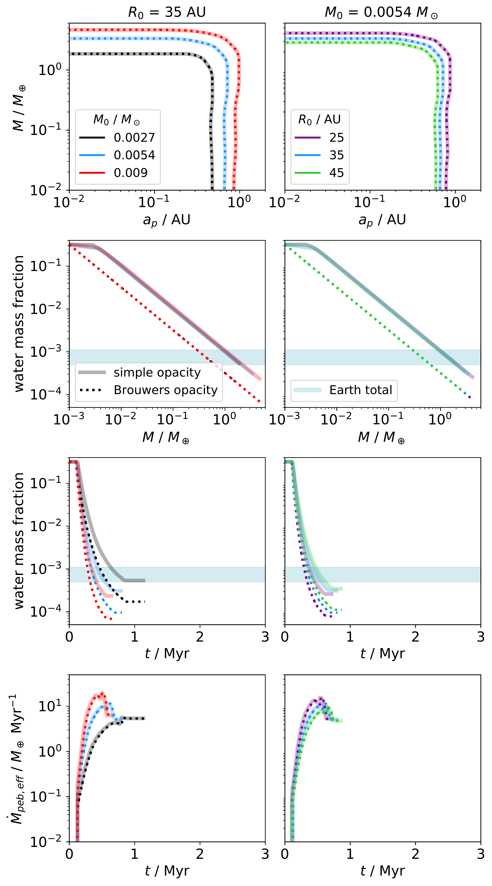
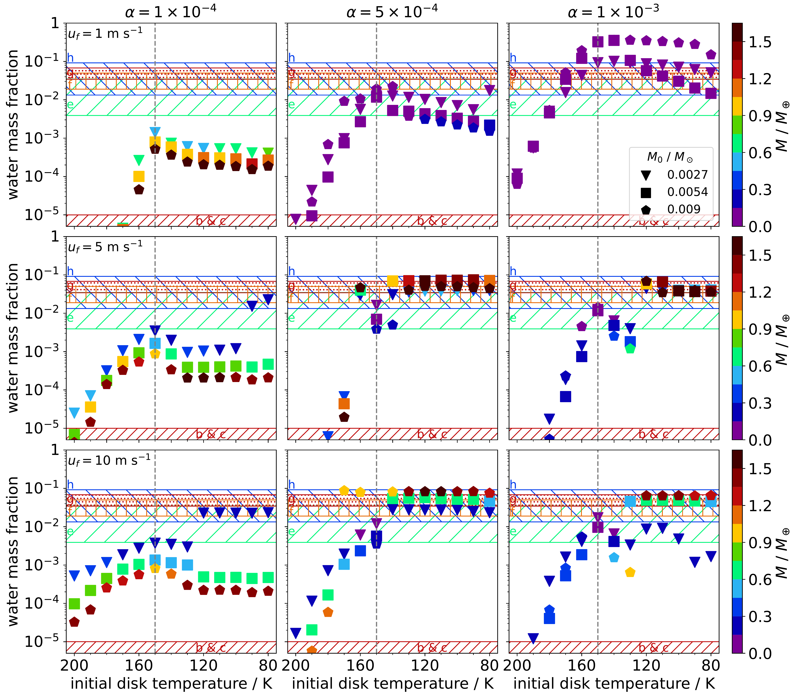

$\newcommand{\ensuremath}{}$
$\newcommand{\xspace}{}$
$\newcommand{\object}[1]{\texttt{#1}}$
$\newcommand{\farcs}{{.}''}$
$\newcommand{\farcm}{{.}'}$
$\newcommand{\arcsec}{''}$
$\newcommand{\arcmin}{'}$
$\newcommand{\ion}[2]{#1#2}$
$\newcommand{\textsc}[1]{\textrm{#1}}$
$\newcommand{\hl}[1]{\textrm{#1}}$
$\newcommand{\footnote}[1]{}$

# A formation pathway for terrestrial planets with moderate water content involving atmospheric-volatile recycling

<mark>Appeared on: 2024-06-14</mark> -  _Accepted by A&A, 19 pages, 8 figures_

<mark>J. Müller</mark>, B. Bitsch, A. D. Schneider

**Abstract:** Of the many recently discovered terrestrial exoplanets, some are expected to harbor moderate water mass fractions of a few percent. The formation pathways that can produce planets with these water mass fractions are not fully understood.Here, we use the code \texttt{chemcomp} , which consists of a semi-analytical 1D protoplanetary disk model harboring a migrating and accreting planet, to model the growth and composition of planets with moderate water mass fractions by pebble accretion in a protoplanetary disk around a TRAPPIST-1 analog star. This star is accompanied by seven terrestrial planets, of which the outer four planets likely contain water mass fractions of between 1 \% and 10 \% .We adopt a published model that considers the evaporation of pebbles in the planetary envelope, from where recycling flows can transport the volatile vapor back into the disk.We find that with this model, the planetary water content depends on the influx rate of pebbles onto the planet. A decreasing pebble influx with time reduces the envelope temperature and consequently allows the formation of planets with moderate water mass fractions as inferred for the outer TRAPPIST-1 planets for a number of different simulation configurations.This is further evidence that the recycling of vapor is an important component of planet formation needed to explain the vast and diverse population of exoplanets.

**Figure 2. -** Comparison of planets using the simple envelope opacity model of [Johansen, Ronnet and Bizzarro (2021)]() with $\kappa_{\rm env,0}= 0.1$ cm$^2$ g$^{-1}$(see Eq. \ref{eq: envelope opacity johansen}; transparent lines) and the Brouwers opacity model by [Brouwers, et. al (2021)]() with $v_{\rm lim} = 30.0$ m s$^{-1}$ and $F = 0.0$(see Eq. \ref{eq: envelope opacity brouwers}; dotted lines) for different initial disk masses _ (left)_ and different initial disk radii _ (right)_. The pebbles in the disk follow the motion of the gas and behave similarly as in [Johansen, Ronnet and Bizzarro (2021)](). The planets start at a disk temperature of 100 K and migrate toward the inner edge of the disk within 1.5 Myr, causing the simulation to end. The growth of the planet initiates at $t_0 = 0.1$ Myr. The maximum disk lifetime is set to 5 Myr, but for the sake of clarity we only show the first 3 Myr in the bottom two rows.
    The light-blue region corresponds to the estimated total water mass fraction of the Earth, consisting of contributions from the hydrosphere, the exosphere including the crust, and the mantle \citep[e.g., ][]{marty2012, dangelo+2019}. _First row:_ Growth tracks. Due to the viscous heating of the protoplanetary disk, the initial position of the planet changes for different initial disk masses and radii, as we want to keep it in the same relative position exterior to the water-evaporation line. _Second row:_ Planetary water mass fraction as a function of planetary mass. For the sake of clarity, only the first 3 Myr are shown in this and the following row. _Third row:_ Planetary water mass fraction as a function of time. _Last row:_ Effective pebble accretion rates onto the planet as a function of time. (*fig: johopac*)

**Figure 7. -** Final planetary water mass fraction versus initial local disk temperature at the position of the planet as a proxy for the distance from the star.
    Planets that are not shown in the plot have lower water mass fractions than 10$^{-5}$.
    _The columns_ correspond to different values of the $\alpha$-viscosity, _the rows_ show different solid fragmentation velocity values. Each marker corresponds to one planet starting at a specific disk temperature. The color of the markers indicates the final mass of the planet (see color-bars on the right). The shape of the markers specifies the initial mass of the disk in which the planet grows (see legend).
    The hatched regions in the background correspond to the 1$\sigma$-regions of the water mass fractions of the TRAPPIST-1 planets estimated by [Raymond, Izidoro and Bolmont (2022)]() using their model ii and are color-coded according to the observed masses of the TRAPPIST-1 planets using the same color-bar.
    The vertical lines indicate the location of the water-evaporation front. We use our full model, which consists of both the Brouwers opacity model ($v_{\rm lim} = 30.0$ m s$^{-1}$, $F = 0.0$) and the Birnstiel pebble drift, while applying the planetary envelope model described above. In addition, we account for the planetary migration and the evaporation of pebbles in the disk as they drift inwards. (*fig: ENVTOT evap*)

**Figure 3. -** Comparison of planets growing in a disk with gas-sensitive pebbles (similar to [Johansen, Ronnet and Bizzarro (2021)](); transparent lines) and a disk in which the pebbles follow the Birnstiel pebble drift (dashed lines) for different initial disk masses. The transparent lines are the same as the transparent lines shown in Fig. \ref{fig: johopac}. For these two sets of simulations (transparent and dashed lines), we use the simple envelope opacity model with $\kappa_{\rm env,0}= 0.1$ cm$^2$ g$^{-1}$(see Eq. \ref{eq: envelope opacity johansen}).
    In addition, we show simulations using our full model as solid lines.
    In our full model, the planets grow in a disk with with pebbles drifting according to the Birnstiel pebble drift model while considering the Brouwers opacity model with $v_{\rm lim} = 30.0$ m s$^{-1}$ and $F = 0.0$(see Eq. \ref{eq: envelope opacity brouwers}). The layout of the plot and the other simulation parameters are similar to Fig. \ref{fig: johopac}. (*fig: johdrift*)

