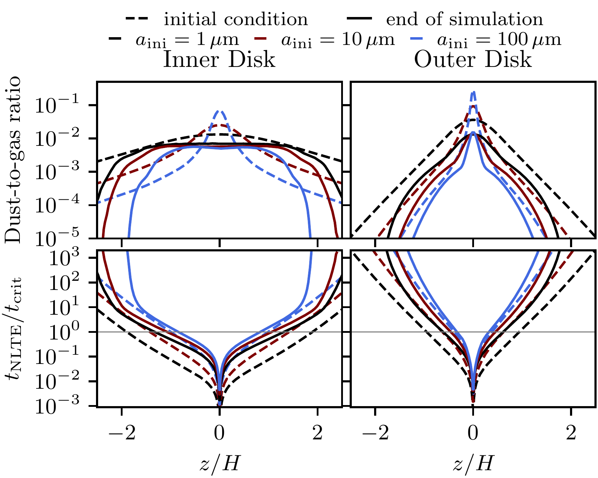
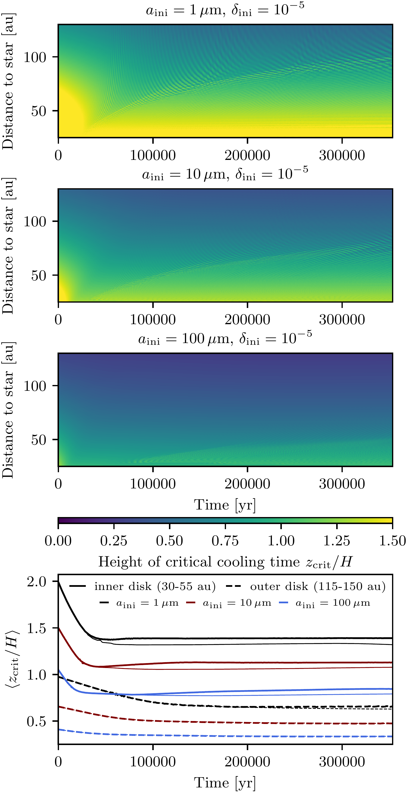
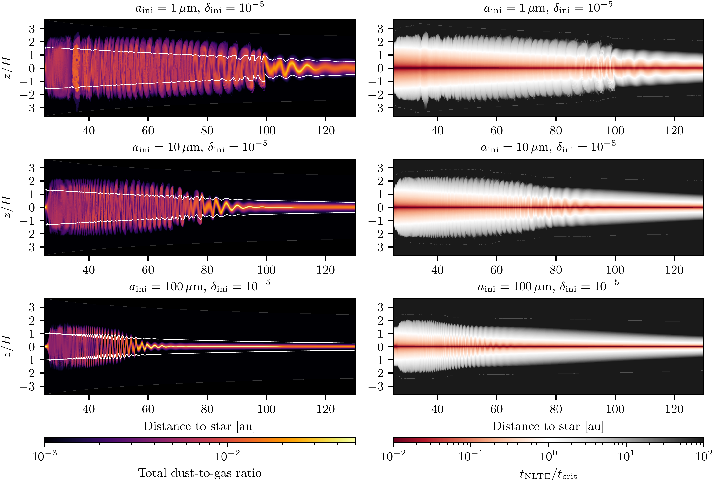

$\newcommand{\ensuremath}{}$
$\newcommand{\xspace}{}$
$\newcommand{\object}[1]{\texttt{#1}}$
$\newcommand{\farcs}{{.}''}$
$\newcommand{\farcm}{{.}'}$
$\newcommand{\arcsec}{''}$
$\newcommand{\arcmin}{'}$
$\newcommand{\ion}[2]{#1#2}$
$\newcommand{\textsc}[1]{\textrm{#1}}$
$\newcommand{\hl}[1]{\textrm{#1}}$
$\newcommand{\footnote}[1]{}$
$\newcommand{\rhog}{\rho_{\mathrm{g}}}$
$\newcommand{\rhod}{\rho_{\mathrm{d}}}$
$\newcommand{\vg}{\vec{v}_{\mathrm{g}}}$
$\newcommand{\vd}{\vec{v}_{\mathrm{d}}}$
$\newcommand{\amax}{a_{\mathrm{max}}}$
$\newcommand{\amin}{a_{\mathrm{min}}}$
$\newcommand{\aint}{a_{\mathrm{int}}}$
$\newcommand{\adr}{a_{\mathrm{dr}}}$
$\newcommand{\vdr}{v_{\mathrm{dr}}}$
$\newcommand{\tfr}{t_\mathrm{fric}}$
$\newcommand{\St}{\mathrm{St}}$
$\newcommand{\Rey}{\mathrm{Re}}$
$\newcommand{\OmK}{\Omega_\text{K}}$
$\newcommand{\der}[2]{\frac{\partial{#1}}{\partial{#2}}}$
$\newcommand{\hd}{h_{\mathrm{d}}}$
$\newcommand{\Mp}{m_{\mathrm{p}}}$
$\newcommand{\Sd}{\Sigma_{\mathrm{d}}}$
$\newcommand{\dpy}{\texttt{DustPy}}$
$\newcommand{\pluto}{\texttt{PLUTO}}$
$\newcommand{\tpop}{\texttt{2pop}}$
$\newcommand{\rev}[1]{{#1}}$
$\newcommand{\revII}[1]{{#1}}$
$\newcommand{\reportI}[1]{{#1}}$
$\newcommand{\corrected}[1]{{#1}}$

# $\revII{Vertical shear instability with dust evolution and \ consistent cooling times}$

<mark>Appeared on: 2024-06-18</mark> -  _6 pages, 3 figures, accepted for publication as a Letter to the Editor in Astronomy and Astrophysics_

<mark>T. Pfeil</mark>, T. Birnstiel, <mark>H. Klahr</mark>

**Abstract:** Gas in protoplanetary disks mostly cools via thermal accommodation with dust particles. Thermal relaxation is thus highly sensitive to the local dust size distributions and the spatial distribution of the grains. $\revII{So far, the interplay between thermal relaxation and gas turbulence has not been dynamically modeled in hydrodynamic simulations of protoplanetary disks with dust.}$ $\revII{We aim to study the effects of the vertical shear instability (VSI) on the thermal relaxation times, and vice versa. We are particularly interested in the influence of the initial dust grain size on the VSI and whether the emerging turbulence is sustained over long timescales.}$ We ran three axisymmetric hydrodynamic simulations of a protoplanetary disk including four dust fluids that initially resemble MRN size distributions of different initial grain sizes. From the local dust densities, we calculated the thermal accommodation timescale of dust and gas and used the result as the thermal relaxation time of the gas in our simulation. We included the effect of dust growth by applying the monodisperse dust growth rate and the typical growth limits. We find that the emergence of the VSI is strongly dependent on the initial dust grain size. Coagulation also counteracts the emergence of hydrodynamic turbulence in our simulations, as shown by others before. Starting a simulation with larger grains ( $\SI{100}{\micro \meter}$ ) generally leads to a less turbulent outcome. While the inner disk regions (within $\sim \SI{70}{au}$ ) develop turbulence in all three simulations, we find that the simulations with larger particles do not develop VSI in the outer disk. $\revII{Our simulations with dynamically calculated thermal accommodation times based on the drifting and settling dust distribution}$ show that the VSI, once developed in a disk, can be sustained over long timescales, even if grain growth is occurring. The VSI corrugates the dust layer and even diffuses the smaller grains into the upper atmosphere, where they can cool the gas. Whether the instability can emerge $\revII{for a specific stratification}$ depends on the initial dust grain sizes and the initial dust scale height. If the grains are initially $\gtrsim \SI{100}{\micro \meter}$ and if the level of turbulence is initially assumed to be low, we find $\reportI{no VSI turbulence}$ in the outer disk regions.

**Figure 1. -** Averaged dust-to-gas ratios and thermal relaxation times in the inner and outer disk.Dust-to-gas ratios and thermal relaxation times radially averaged over the \SIrange{30}{55}{au} inner region and the \SIrange{115}{150}{au} outer region of our simulations. As the VSI develops, it keeps the dust particle at high altitudes and thus retains the necessary cooling times in the inner disk. The outer regions, however, are mostly sedimenting, as the VSI is not active there, except for the case with the smallest initial particle size. (*fig:InnerDisk*)

**Figure 2. -** Evolution of the critical VSI height.Evolution of the vertical extend of the VSI susceptible region as a function of time and radius. In the inner disk, VSI quickly develops and stabilizes the settling dust layer in less than \SI{50000}{yr}. In the outer disk, VSI has not yet developed in our simulations. The thin lines show comparison simulations in which the VSI is artificially suppressed. (*fig:zCrit*)

**Figure 3. -** Dust-to-gas ratios and thermal relaxation times.Snapshots after $\sim$\SI{350000}{yr} of our protoplanetary disk simulations with thermal accommodation times $\rev$II{calculated from the dust distribution for three different initial particle sizes}. Simulations initialized with larger particles and thus more settled dust layers are mostly not VSI active in the outer disk regions. If the VSI, however, can develop in the first place, it can stabilize the dust layer and sustain itself, even if grain growth is considered. (*fig:DtG_tNLTE*)

